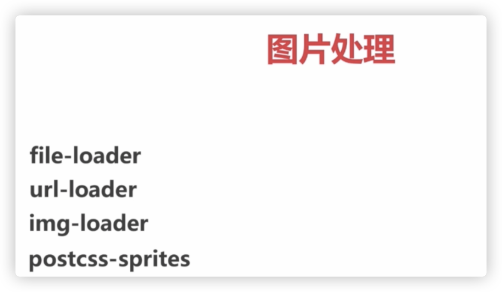

## K、图片处理

  

  

file-loader来处理图片：

```
publicPath: './dist/',
...
{
    test: /\.png|jpg|jpeg|gif$/,
    use: [
        {
          loader: 'file-loader',
          options: {
          name: '[name].[hash:5].[ext]',
          outputPath: 'images',
          publicPath: './dist/images' // publicPath是在有服务器到时候才生效（dev-server, nginx...）
        }
     }
   ]
}
```

  

因为url-loader是在file-loader基础上进行的封装，所以使用api和file-loader很像，多了一个常用的limit，用来转base64:

```
{
        test: /.(png|jpg|jpeg|gif)$/,
        use: [
          {
            loader: 'url-loader',
            options: {
              limit: 4000,
              name: '[name].[hash:5].[ext]',
              outputPath: 'images',
              publicPath: './dist/images'
            }
          }
        ]
      }
```

  
// 图片转base64优劣：

[https://segmentfault.com/a/1190000017745449](https://segmentfault.com/a/1190000017745449)  

总结： 

1、多大图片转base64没有明确说明，看业务情况

2、如果图片切换频繁，为了缓存，尽量不转base64

3、base64转后加重js内容，可能太多太大影响js加载速度

  

压缩图片质量：

！！！ 一下配置并没有生效。。。还没找到原因（使用的插件都是webpack3时代的版本）

```
{
        test: /.(png|jpg|jpeg|gif)$/,
        use: [
          {
            loader: 'url-loader',
            options: {
              limit: 1024,
              name: '[name].[hash:5].[ext]',
              outputPath: 'images',
              publicPath: './dist/images'
            }
          },
          {
            loader: 'img-loader',
            options: {
              plugins: [
                require('imagemin-pngquant')({
                  quality: [0.2, 0.5]
                })
              ]
            }
          }
        ]
      }
```

  

同样没有生效的配置是通过postcss-sprites来做雪碧图：

```
{
        test: /.less$/,
        use: [
          {
            loader: 'style-loader'
          },
          {
            loader: 'css-loader'
          },
          {
            loader: 'postcss-loader',
            options: {
              ident: 'postcss',
              plugins: [
                require('postcss-sprites')({
                  spritePath: 'dist/images'
                })
              ]
            }
          }, 
          {
            loader: 'less-loader'
          }
        ]
      }
```

  
有关处理雪碧图文章：

[https://juejin.im/post/6844903501890322440](https://juejin.im/post/6844903501890322440)  

[https://juejin.im/post/6844903925473099784](https://juejin.im/post/6844903925473099784)  

[http://www.yvonne.party/2019/07/07/webpack-sprites/](http://www.yvonne.party/2019/07/07/webpack-sprites/)  

[https://segmentfault.com/a/1190000004592944](https://segmentfault.com/a/1190000004592944)