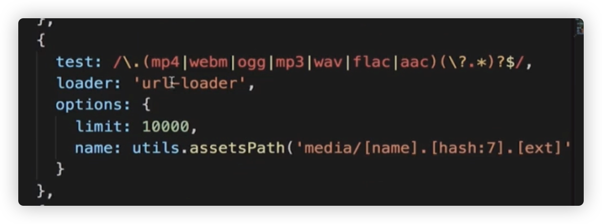

## L、字体图标

file-loader 或者 url-loader

```
{
        test: /\.(eot|woff2|ttf|svg)$/,
        use: [
          {
            loader: 'url-loader',
            options: {
              limit: 1024,
              name: '[name].[hash:5].[ext]',
              outputPath: 'images',
              publicPath: './dist/images'
            }
          }
        ]
      }
```

  

视频音频：  
