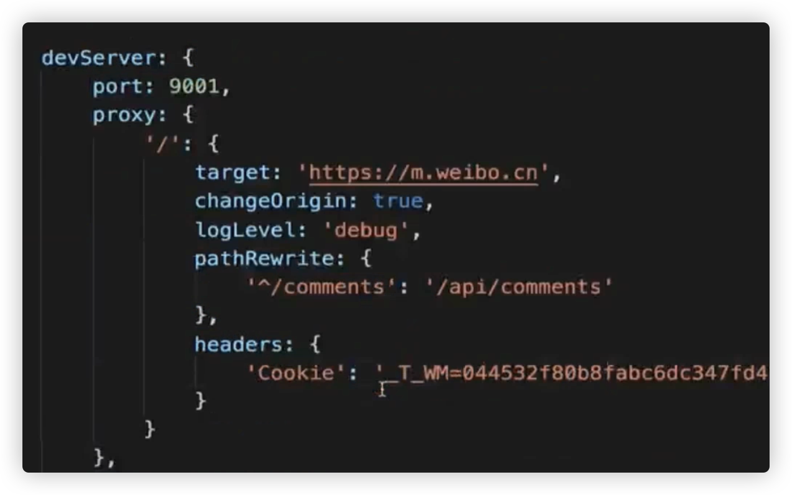
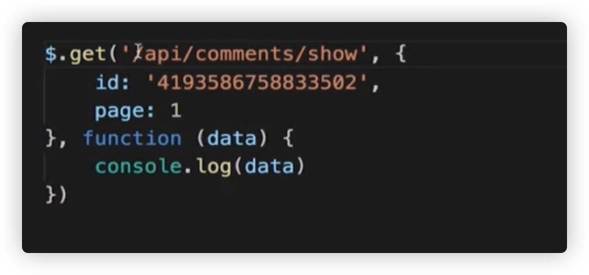
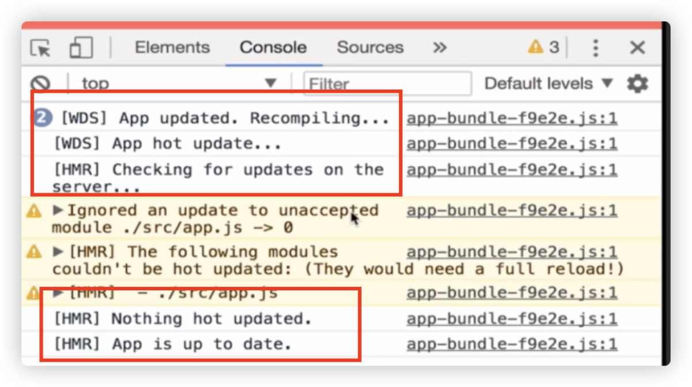

## P、本地开发环境

方案1: webpack watch

方案2: webpack-dev-server

方案3: express + webpack-dev-middleware

  

小插曲：自动删除dist：

```
{
  const autoClean = require('clean-webpack-plugin')
  ...
  plugins: [    new autoClean()]
}
```

  
  

  

## 方案1: 

webpack -watch 或者 webpack -w

本地改动，随时生效，但是不能用浏览器查看，因为没有端口，只能在dist目录中查看，当然也可以直接在dist目录启动一个服务来访问这个静态资源，比如http-server

  

## 方案2:

webpack-dev-server  

功能：

live reloading

路径重定向

https

浏览器现实编译错误

接口代理

模块热更新

详细的配置教程并没有在npm或者github，而是在webpack官网：

[https://webpack.js.org/configuration/dev-server/#devserverhttps](https://webpack.js.org/configuration/dev-server/#devserverhttps)  

  

参数了解：

lazy：在多页页面应用中，这个参数很重要，只会被访问的页面被打包，其他页面不会被打包

inline： 就是启动webpack-dev-server的状态是显示到页面顶部，还是console里面

  

demo：

  

## historyApiFallback

  

```
module.exports = {
  devServer: {
     historyApiFallback: {      rewrites: [        {          from: /^\/([a-zA-Z0-9]+\/?([a-zA-Z0-9]+)/,          to: function(context) {            return '/' + context.match[1] + context.match[2] + '.html'          }        }      ]     },    port: 9000  },
}
```

在package.json中添加脚本：

```
"scripts": {
    "server": "webpack-dev-server --open",
    "test": "echo \"Error: no test specified\" && exit 1"
  },
```

匹配的结果：

localhost:9000/new/a → [localhost:9000/new/a](localhost:9000/new/a).html

localhost:9000/new/b → [localhost:9000/new/](localhost:9000/new/a)b.html  

localhost:9000/new→ [localhost:9000/new](localhost:9000/new/a).html  

  

## proxy

它的使用参数其实和http-proxy-middleware是一样的

  

  

## Module Hot Reloading

devServer.hot

webpack.HotModuleReplacementPlugin

webpack.NamedModulesPlugin 

  

webpack.NamedModulesPlugin 这个模块就是在console中可以产生打包（重建）过程提示信息  

  

  

## 注意点：

如果我们的css文件通过extract-text-webpack-plugin单独提取成了link标签，这个时候即使配置了上面的热更新，页面也不会更新，所以在开发阶段，我们并不会使用extract-text-webpack-plugin来单独提取样式

  

ps：其实也可以做到js改动页面不刷新热更新，但是配置有点麻烦这里先不做了，在三大框架中，这种js改动已经通过框架实现，可以简单的配置就可以使用了。