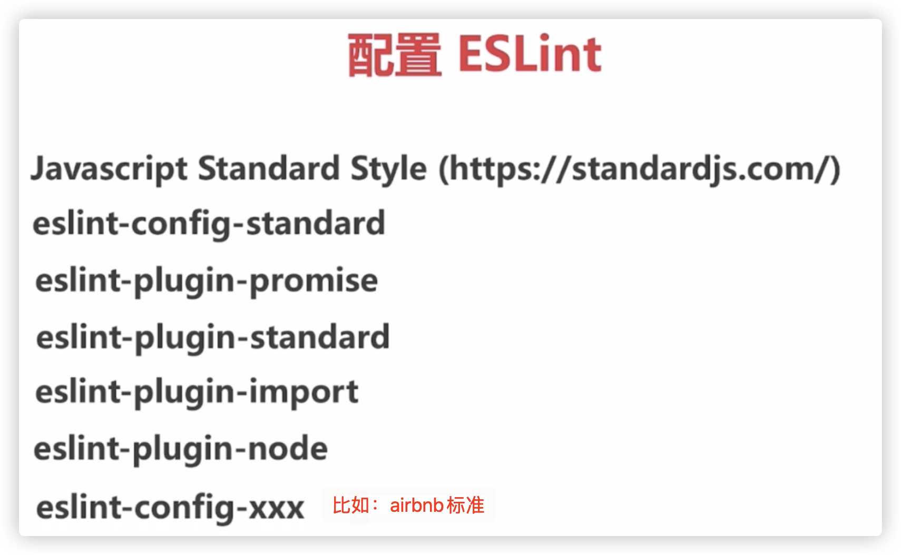
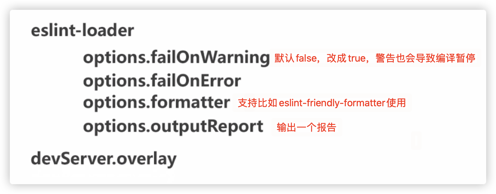
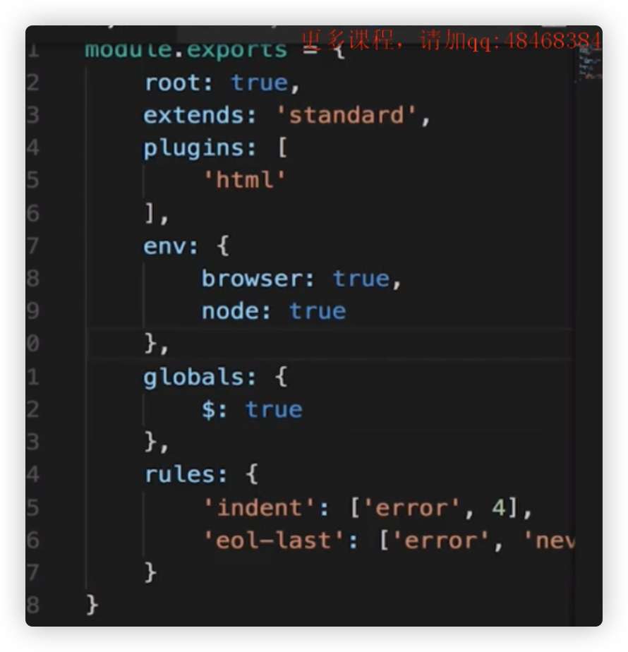

## R、ESlint

## 基础插件（都要装）

：

eslint

eslint-loader

eslint-plugin-html（这是用来检查html中的scipt标签里面的js）

eslint-friendly-formatter（第三方）

  

书写地方：

1、webpack 的config 

2、.eslintrc.\*

3、package.json中的eslintConfig

  

## 扩展插件（都要装）

  

  

  

overlay可以在浏览器中看到错误的提示

  

demo：

第一步：

  

第二步：建立规则：

配置.eslintrc.js文件：

  

第三步：

关于地方库的依赖，如果eslint对齐进行了校验，我们需要在test js的时候，include当前src文件夹，exlcude当前的libs文件夹