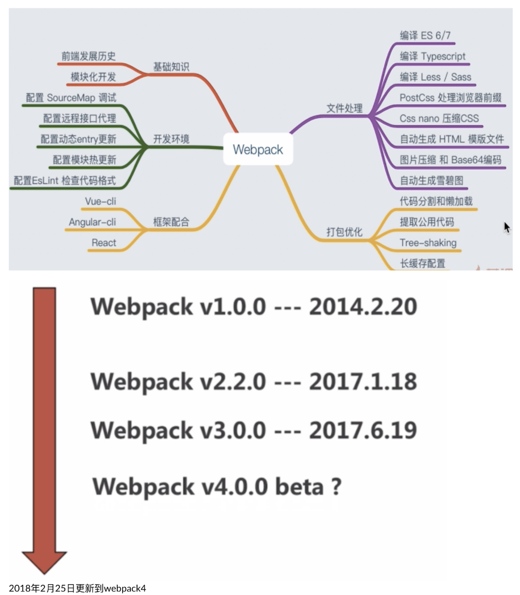
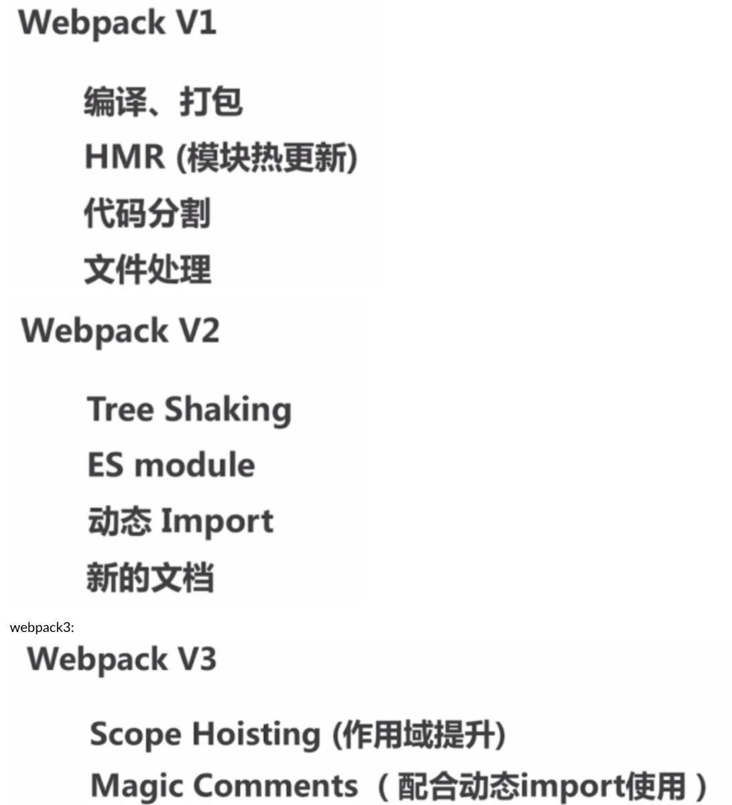

## 01、webpack的诞生

作者： Tobias Koppers，当时在使用GWT（将java编译成js的工具）时候，有一个特别好用的功能，就是代码分割，但是当时的构建工具都没有代码分割的功能，so，他给这些构建工具pull request，但是没有被采纳意见，所以后来他就自己写了webpack，再后来Instagram团队发现了这个webpack，然后就对其进行了包养。以后就变成了这个团队在进行维护。

### webpack需要解决的问题：

#### 各种框架：

  

  

  

  

  

  

作用域的提升的理解：因为每一个文件都是一个单独的作用域（闭包实现），但是闭包越多，浏览器运行速度越慢，在以后的打包过程中，会尽可能的将这些单独的闭包提升到一个闭包中（提升作用域），这样就可以让打包好的文件在浏览器中的运行速度变快。这里需要注意：这里的作用域的提升，目的是让打包后的文件，在浏览器上的运行速度提升，而不是说提升打包速度。