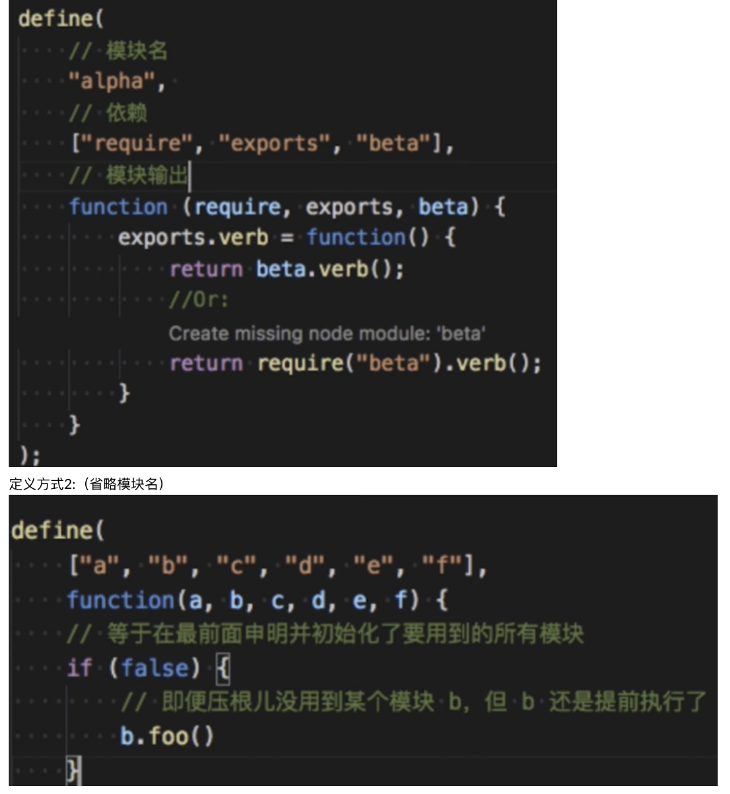
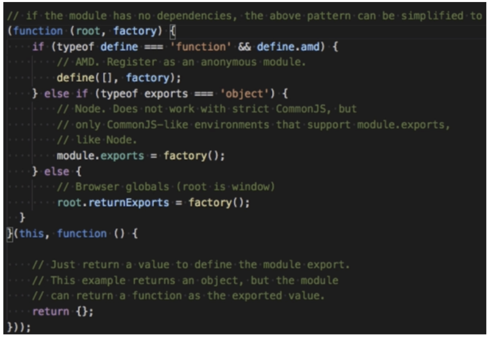
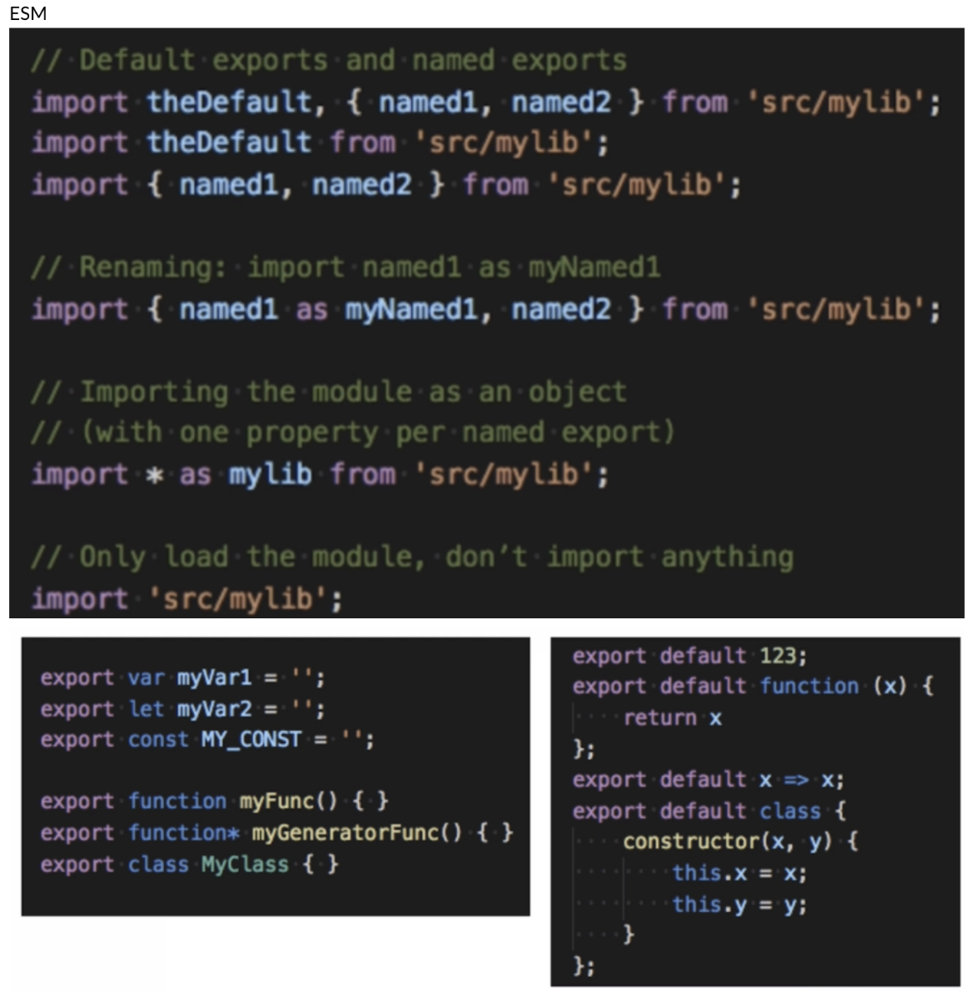

## 02、JS模块化

#### 命名空间

#### COMMONJS

#### AMD/CMD/UMD

#### ES6 module （ESM）

## webpack支持： AMD/CommonJS/ESM

- 命名空间  
    var NameSpace = {}  
    NameSpace.type = NameSpace.type || {}  
    NameSpace.type.method = function() {}

- CommonJS  
    一个文件一个模块  
    通过module.exports暴露模块接口

- AMD  
    使用define来定义模块  
    使用require来加载模块  
    代表库： RequireJS  
    特点：所有依赖前置  
    定义方式1:

  

\-CMD  
一个文件一个模块  
使用define来定义一个模块  
使用reuqire来加载一个模块  
代表库：SeaJS  
特点： 尽可能的懒加载（代码执行到需要这个依赖才会执行依赖的代码）  
备注： 其实CMD规范就是SeaJS库的产物  
定义方式：  

- UMD  
    Universal Module Definition（通用解决方案）  
    执行逻辑：  
    判断是否支持AMD  
    判断是否支持CommonJS  
    如果没有就使用全局变量  
    定义方式：

  

