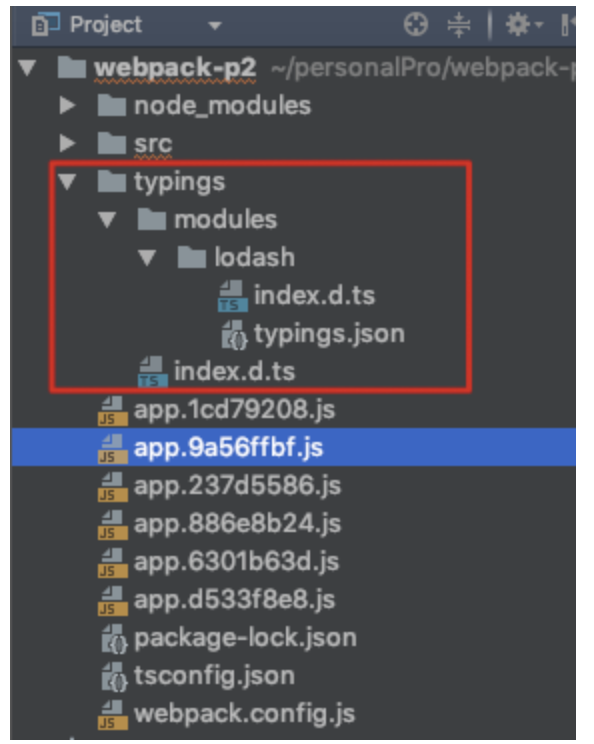

## 05、typescript的配置

webpack已经更新到4版本，但是练习环境还是3.10.0版本，这个时候安装高版本的编译插件，会导致报错，所以这里指定了版本号：  
环境：  
webpack3.10.0

### 第一步：安装对应到低版本的编译工具：

```
1
npm i typescript@2.6.2 ts-loader@3.2.0 awesome-typescript-loader@3.4.1

```

### 第二步： webapck.config.js文件：

```
123456789101112131415161718
module.exports = {
  entry: {
    app: './src/app.ts'
  },
  output: {
    filename: '[name].[hash:8].js'
  },
  module: {
    rules: [
      {
        test: /\.tsx?$/,
        use: {
          loader: 'ts-loader'
        }
      }
    ]
  }
}

```

### 第三步： 新建tsconfig.json文件：

```
12345678910111213
{
"compilerOptions": {
  "module": "commonjs",
  "target": "es5",
  "allowJs": true
},
"include": [
  "./src/*"
],
"exclude": [
  "./node_modules"
]
}

```

对.src/app.ts编写一些ts语法的脚本：

```
123456789101112131415
const a = 45

interface Cat {
  name: String,
  gender: String
}

function touchCat(cat: Cat) {
  console.log('miao~', cat.name)
}

touchCat({
  name: 'tom',
  gender: 'male'
})

```

### 运行： webpack：

```
12345678910111213141516
Eat-you-you-you:webpack-p2 longwang$ webpack
Hash: 9a56ffbfc22fabf13769
Version: webpack 3.10.0
Time: 1393ms
          Asset    Size  Chunks             Chunk Names
app.9a56ffbf.js  2.6 kB       0  [emitted]  app
   [0] ./src/app.ts 126 bytes {0} [built]
Eat-you-you-you:webpack-p2 longwang$
Eat-you-you-you:webpack-p2 longwang$ webpack
Hash: 9a56ffbfc22fabf13769
Version: webpack 3.10.0
Time: 1393ms
          Asset    Size  Chunks             Chunk Names
app.9a56ffbf.js  2.6 kB       0  [emitted]  app
   [0] ./src/app.ts 126 bytes {0} [built]
Eat-you-you-you:webpack-p2 longwang$

```

- tips： 如果我们在编辑ts语法的时候，如果语法有错误，编译成js的过程中会有相应的错误提示：  
    比如：  
    我们写的内容：

```
123456789101112131415
const a = 45

interface Cat {
    name: String,
    gender: String
}

function touchCat(cat: Cat) {
    console.log('miao~', cat.name)
}

// 这里没有按照Cat类应该传参的个数进行传递，这个时候ts就算语法错误类。
touchCat({
    name: 'tom'
})

```

执行webpack，报错如下：

```
123456789101112
Eat-you-you-you:webpack-p2 longwang$ webpack
Hash: 237d55866bd150890aba
Version: webpack 3.10.0
Time: 1430ms
          Asset     Size  Chunks             Chunk Names
app.237d5586.js  2.58 kB       0  [emitted]  app
   [0] ./src/app.ts 106 bytes {0} [built] [1 error]

ERROR in ./src/app.ts
[tsl] ERROR in /Users/longwang/personalPro/webpack-p2/src/app.ts(12,10)
      TS2345: Argument of type '{ name: string; }' is not assignable to parameter of type 'Cat'.
  Property 'gender' is missing in type '{ name: string; }'.

```

我们在上面的编写过程中，ts的编译报错会给出提示，那么如果我们想其他的框架在使用ts的编译环境中（ts环境使用js）也能够出现相应的提示，那么我们比如使用了lodash，但是传参错误，如果不安装@types/lodash，就没有编译提示，同样的使用vue框架，最好也要安装上@types/vue。

这里演示安装的@tpye/lodash版本是：@type/[lodash@4.14.91](mailto:lodash@4.14.91)

```
123456789101112131415161718192021222324252627282930313233343536
// 我们在app.ts中引入lodash，并传递错误参数：
import * as _ from 'lodash'
const a = 45

_.chunk(3) // 正确应该是_.chunk([1,2,3],3) 将数组切成3段

interface Cat {
    name: String,
    gender: String
}

function touchCat(cat: Cat) {
    console.log('miao~', cat.name)
}

touchCat({
    name: 'tom',
    gender: 'ha'
})

// 这个时候编译会出现如下提示：

Eat-you-you-you:webpack-p2 longwang$ webpack
Hash: 6301b63d2f54a363ce12
Version: webpack 3.10.0
Time: 1986ms
          Asset    Size  Chunks                    Chunk Names
app.6301b63d.js  545 kB       0  [emitted]  [big]  app
   [0] ./src/app.ts 240 bytes {0} [built] [1 error]
   [2] (webpack)/buildin/global.js 509 bytes {0} [built]
   [3] (webpack)/buildin/module.js 517 bytes {0} [built]
    + 1 hidden module

ERROR in ./src/app.ts
[tsl] ERROR in /Users/longwang/personalPro/webpack-p2/src/app.ts(4,9)
      TS2345: Argument of type '3' is not assignable to parameter of type 'ArrayLike<{}>'.

```

如果觉得这样安装很麻烦，可以先【全局】安装一个typings,再通过typings install lodash --save 这样的方式来安装，自带编译校验，最后编译过程报错和上面的报错信息一样，这里通过typings来安装，比如lodash，使用来lodash的工具函数，会有对应的IDE提示，非常友好。  
这个时候在工程中会多一个typings的目录：  
  
刚才安装的lodash库都会放到这里，而不是在node\_module下面。

配置到这里我们已经可以使用typings+它安装到lodash来进行编写和编译报错提示了，其实再早些的版本中，如果不配置tsconfig.json中的typeRoot，光依靠上面的配置，报错信息是不会提示出来的，但是现在可以不配置如下信息了，下面的内容选配：typeRoots可以不配置

```
1234567891011121314151617
{
  "compilerOptions": {
    "module": "commonjs",
    "target": "es5",
    "typeRoots": [
      "./node_modules/@types",
      "./typings/modules"
    ],
    "allowJs": true
  },
  "include": [
    "./src/*"
  ],
  "exclude": [
    "./node_modules"
  ]
}
```