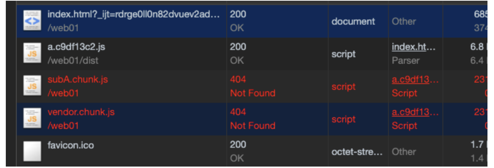

## 07、代码分割+懒加载

对于webpack，代码分割和懒加载其实是一回事，代码分割后就具有懒加载的功能，并且这些功能并不是通过配置来实现，而是在书写代码的过程中实现。

实现这种编写的方式，两种：

- webpack内置方法
    
- ES 2015 Loader spec（进入stage3状态），webpack根据这个规范，编写了新的接口：动态import和system import（逐渐废弃）
    

webpack内置方法：

- require.ensure（用于代码的懒加载）  
    注意：这个方法强依赖promise，如果有兼容性问题，需要promise-polyfill，他的参数如下：  
    \[\].dependencies  
    callback  
    errorCallback  
    chunkName
- require.include（用于代码的分割）  
    其实require.ensure可以产生和他一样的用法，但是官方的意思是这个include方法，可以用在这样的场景，比如06文档里面，subA和subB页面都引用了base页面，如果都是通过include来引用的，那么加载了subA页面，base就会被引入，subB页面加载的时候就不会重复获取base了。

ES 2015 Loader spec：

- 本来是用来替换webpack内置方法，结果后来system import() 都不在建议使用，建议使用import()代替他们。这个动态import()能够执行回调，是因为它返回的是一个promise结构，所以他的用法是import().then()来执行回调。 （这个改变是从webpack1 -> webpack2的时候就有了使用建议）  
    import() 又被称为 动态import / magic import  
    格式：  
    import(  
    /_webpackChunkName: async-chunk-name_/  
    /_webpackMode: lazy_/  
    modulename  
    )  
    好处：  
    1、分离业务代码和第三方依赖  
    2、分离业务代码/第三方依赖/业务代码中的公共代码  
    3、分离首次加载和访问后加载的代码

### 练习

#### webpack内置方法

文件夹目录：  
src  
a.js  
b.js  
base.js  
subA.js  
subB.js  
文件关系：  
a引用了subA.js和subB.js，subA和subB引用了base.js,  
b引用了subA.js和subB.js，subA和subB引用了base.js，  
subA和subB页面都引用了lodash  
这个时候webpack.config.js配置如下：(这里的配置和b.js没关系)

```
1234567891011121314151617181920212223242526
const webpack = require('webpack')
const path = require('path')
module.exports = {
  entry: {
    'a': './src/a.js'
  },
  output: {
    path: path.resolve(__dirname, './dist'),
    filename: '[name].[hash:8].js',
    chunkFilename: '[name].chunk.js'
  }
}
打包结果：
可以看到打出来一个非常大的一个包：
Eat-you-you-you:web01 longwang$ webpack
Hash: c25f27979c02e66a53fb
Version: webpack 3.10.0
Time: 429ms
        Asset    Size  Chunks                    Chunk Names
a.c25f2797.js  546 kB       0  [emitted]  [big]  a

这里打成一个包，并且lodash的引入方式是：
import './base'
import * as _ from 'lodash'
_.chunk([1,1,2,3,3], 3)
export default 'subA'

```

如果我们想把lodash单独打包出来，这里并不是更改webpack配置，而是改变一下页面里面lodash的引入方式：

```
1234567891011121314151617181920
引入lodash方式：
import './base'
require.ensure(['lodash'],function () {
  const _ = require('lodash')
  _.chunk([1,1,2,3,3], 3)
}, 'vendor')
export default 'subA'
结果：
Eat-you-you-you:web01 longwang$ webpack
Hash: cf10817da5982a0390e1
Version: webpack 3.10.0
Time: 422ms
          Asset     Size  Chunks                    Chunk Names
vendor.chunk.js   542 kB       0  [emitted]  [big]  vendor
  a.cf10817d.js  7.18 kB       1  [emitted]         a
   [1] ./src/a.js 549 bytes {1} [built]
   [2] ./src/subA.js 146 bytes {1} [built]
   [3] ./src/base.js 24 bytes {1} [built]
   [4] (webpack)/buildin/global.js 509 bytes {0} [built]
   [5] (webpack)/buildin/module.js 517 bytes {0} [built]

```

接下来我们预期的想法是把subA和subB在a页面引用的时候是异步引入，通过webpack内置方法书写如下:

```
123456789101112131415161718192021222324252627282930313233
const page = ''
if (page === 'A') {
  reuqire.ensure(['./subA'],function () {
    const subA = require('./subA')
  }, 'subA')
} else if (page === 'B') {
  require.ensure(['./subB'],function () {
    const subB = require('./subB')
  }, 'subB')
}

require.ensure([], function () {
  const _ = require('lodash')
  _.join([23,23,4,234,23,4],3)
},'vendor')

console.log("I am page a")
打包结果：
Eat-you-you-you:web01 longwang$ webpack
Hash: c9df13c2a7c4d54c6a44
Version: webpack 3.10.0
Time: 427ms
          Asset       Size  Chunks                    Chunk Names
vendor.chunk.js     542 kB       0  [emitted]  [big]  vendor
  subB.chunk.js  780 bytes       1  [emitted]         subB
  subA.chunk.js  780 bytes       2  [emitted]         subA
  a.c9df13c2.js     6.6 kB       3  [emitted]         a
   [0] ./src/subA.js 147 bytes {2} [built]
   [1] ./src/subB.js 147 bytes {1} [built]
   [2] ./src/a.js 499 bytes {3} [built]
   [4] ./src/base.js 24 bytes {1} {2} [built]
   [5] (webpack)/buildin/global.js 509 bytes {0} [built]
   [6] (webpack)/buildin/module.js 517 bytes {0} [built]

```

### 注意点：

1、这里的subA和subB页面同时引用了base模块，如果想将公共模块抽离出来只打包一份，我们之前说过CommonsChunkPlugin只适合于多entry的情况，这个时候我们可以在a页面中通过include的方式来引入，这样就不会出现重复加载。  
2、如果这里打成了n个依赖包，这个时候入口是a.xx.js,但是其他的js资源可能就benign正常执行:  
  
这个时候需要在webpack.config.js中配置output的publicPath：’./dist/’,重新打包就好了。如果做线上缓存，这里放CDN地址。  
3、注意：如果我们在a页面，和对应的subA和subB页面都引用了lodash，这个是时候只会打包a页面定义/引入的lodash，不会打包两个子页面的lodash。  
3、下面两种写法一样：

```
1234
require.ensure([], function () {
  const _ = require('lodash')
  _.join([23,23,4,234,23,4],3)
},'vendor')

```

```
1234
require.ensure(['lodash'], function () {
  const _ = require('lodash')
  _.join([23,23,4,234,23,4],3)
},'vendor')

```

4、如果我们只是通过

```
1
require.ensure([], function () {},'vendor')

```

对模块/页面进行了引用而没有对其进行调用，这个页面/模块里面的内容是不会执行的。

#### ES 2015 Loader spec里面的动态import

不指定chunkName：

```
12345678910111213141516171819
const page = 'A'
if (page === 'A') {
  import('./subA').then(function (value) {
    console.log('引入pageA',value)
  })
} else if (page === 'B') {
  require.ensure(['./subB'],function () {
    const subB = require('./subB')
  }, 'subB')
}
require.ensure([], function () {
  const _ = require('lodash')
  _.join([23,23,4,234,23,4],3)
},'vendor')

console.log("I am page a")
注意点：
1、可以看出webpack内置方法和动态import是可以混着用的
2、动态import和ensure有一个区别点，ensure引入的内容，没有调用不执行，但是import的内容，一旦引入就会执行

```

指定chunkName：

```
12345
import(/* webpackChunkName: 'subA'*/'./subA').then(function (value) {
    console.log('引入pageA',value)
  })
注意点：
如果subA和subB的webpackChunkName一样，那么会把subA和subB打包到一个文件中去。
```