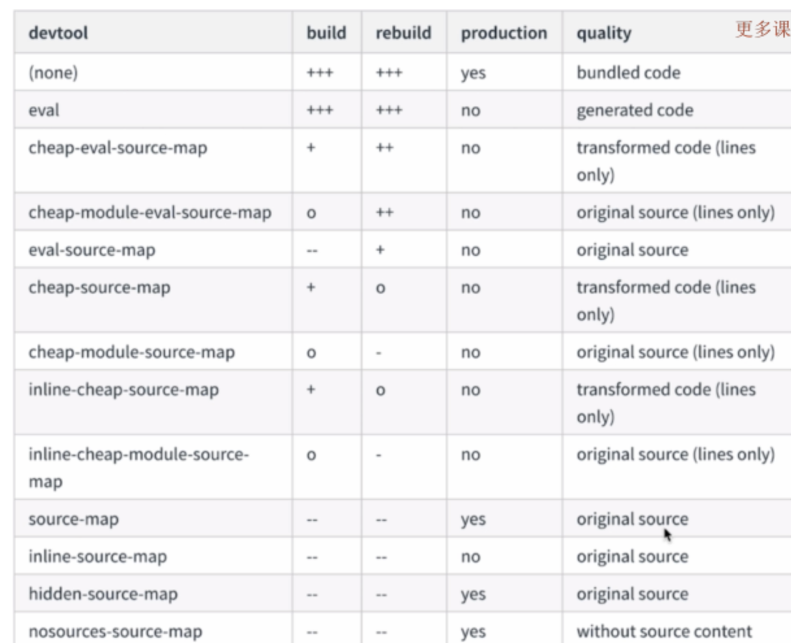
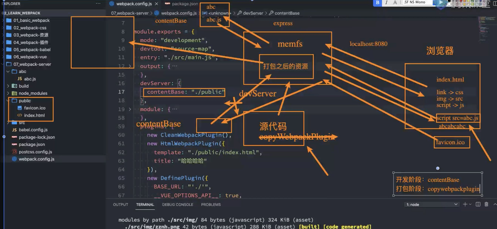
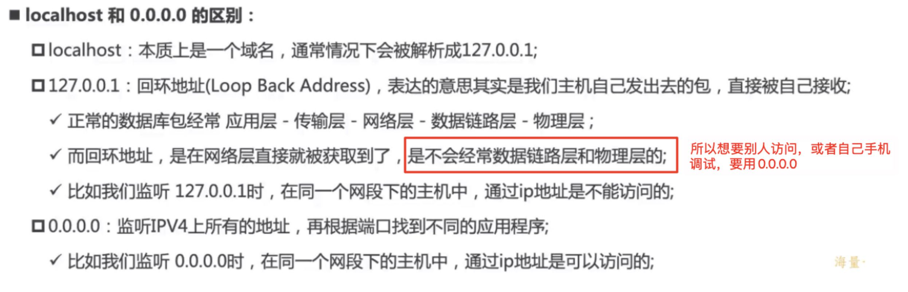

## 12、 搭建本地服务

- webpack watch mode
- webpack-dev-server
- express + webapck-dev-middleware (最灵活)

### 删除打包文件：

clean-webpack-plugin

配置：

```
1234567
引入：

const { CleanWebpackPlugin } = require('clean-webpack-plugin')

在plugins中配置:

new CleanWebpackPlugin()

```

这样就会把上次打包的dist包给删除了

### 1、webpack watch mode

如果我们要观察打包过程，在使用webpack进行打包的过程中，可以配置如下：

```
1
webpack -w --progress --display-reasons --color

```

这里的w会让打包状态一直处于监听状态，改动文件，会自动重新打包

### 2、[webpack-dev-server@2.9.7](mailto:webpack-dev-server@2.9.7)

配置项：  
proxy：集成第三方：http-proxy-middleware

作用：  
live reloading （刷新浏览器）  
路径重定向  
https  
浏览器中显示编译错误  
接口代理  
模块热更新 （不刷新页面更新）

安装后，需要在webpack.config.js中引入就可以使用：  
在本文件中配置：

```
123
devServer: {
  port: 9001
}

```

在package.json的script中配置：

```
1
"server": "webpack-dev-server --open"

```

就能够跑起来

#### （1） proxy使用：

```
12345678910111213
proxy: {
  '/api': {
    target: 'https://m.weibo.cn', // api开头的请求都通过https://m.weibo.cn来发出请求
    changeOrigin: true, // 默认false，开启代理需要设置成true
    logLevel: 'debug', // 控制台打印代理信息
    pathRewrite: {
      '^/api': '/api/v1/level' // 可以理解成重命名，‘/api/comments/show’请求就变成了‘/api/v1/level/comments/show’
    },
    headers: { // 模拟登陆信息，也能伪造成浏览器等等
      'Cookie': 'sddddd'
    }
  }
}

```

请求：

```
123456
$.get('/api/comments/show', {
  id: 3243,
  page: 1
}, function (res) {
  console.log(res)
})

```

#### （2） 热更新 Module Hot Reloading

保持应用的数据状态  
节省调试时间  
样式调试更快

1、devServer.hot  
2、webpack.HotModuleReplacementPlugin  
3、webpack.NamedModulesPlugin（已废弃）

开启热更新需要上面1和2的配置才能生效

```
123456789101112131415161718
devServer: {
  port: 9001,
  proxy: {
    '/api': {
      target: 'https://m.weibo.cn',
      changeOrigin: true,
      logLevel: 'debug',
      pathRewrite: {
        '^/comments': '/api/comments'
      },
      headers: {
        'Cookie': 'sddddd'
      }
    }
  },
  hot: true,
  historyApiFallback: true
},

```

然后在plugins中添加：

```
12
new webpack.HotModuleReplacementPlugin()
// new webpack.NamedModulesPlugin()

```

npm run server：  
更改css，这里需要注意，我们之前将css通过ExtractTextWebpaclPlugin.extract这个插件将css打包到了一个单独的css文件，这个时候热更新不会生效，需要将这个插件去掉。

这里还有一个和hot同级配置hotOnly: true,表示一旦内容有改动，只有触发热更新页面才会改动，而不是通过整个页面刷新来实现改动的代码。  
对于页面里面的改动，如果想改动js也热更新，需要在代码中如下实现，比如我们要改动componets/a里面内容，这个时候需要：

```
12345
if (module.hot) {
  module.hot.accept('./compoents/a', function () {
    console.log(1)
  })
}

```

其实这种改动在三大框架中不需要自己去实现，已经有相应的loader帮助我们完成。

#### （3）sourceMap调试

Devtool  
wepback.SourceMapDevtoolPlugin(作为了解)  
webpack.EvalSourceMapDevToolplugin（作为了解）

development: (以下配置运算时间不同)

- eval
- eval-source-map
- cheap-eval-source-map
- cheap-module-eval-source-map  
    Production:
- source-map
- hidden-source-map
- nosource-source-map

  

  



  

上面这些值不同，对应打包出来的内容也会有所不同，常见的配置是eval和source-map,完整点的提示信息剋=可以配置：cheap-module-source-map  
我们如果想在dev环境开启，可以在webpack.config.js中这么配置：

```
123
module.exports = {
  devtool: 'eval'
}

```

如果我们使用了各个loader，我们需要在各个loader中开启对应的sourcemap：  
css-loader.option.sourcemap  
less-loader.option.sourcemap  
sass-loader.option.sourcemap  
每一个用到的loader都要加上，如果loader中配置了singleton:true的话，需要去掉这个配置。

  

  

