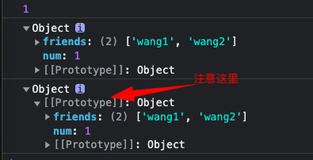
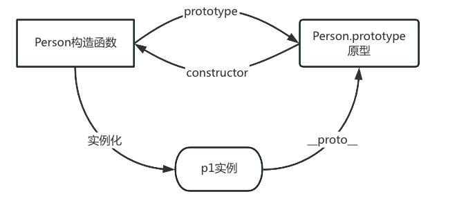
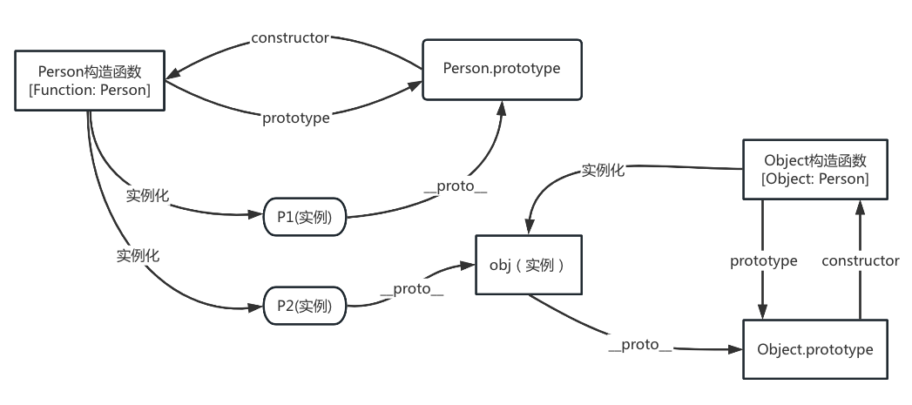
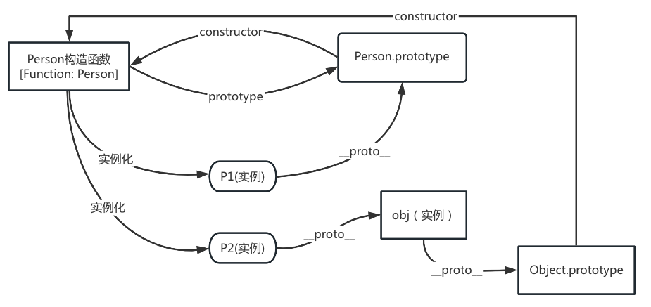

早期都是面向过程编程，功能一旦功能变得复杂/重复性多了后，代码就变得臃肿，重复，不简洁且不利于维护，后来就演变出了函数封装，提高代码复用性。但是随着函数封装越来越多，可能会重名（被覆盖的问题），也因为他们都是全局定义，所以存在全局污染多问题，所以就出现了面向对象编程。

# 面向对象三大特性

1、封装demo：结构性比较好

```js
var film = {
	name: '千与千寻',
	actor：'Mr.Li',
	showTime: '2000-2',
	type: 'Action',
	play: function(){
		console.log('play')
	}
}
```

2、继承：

具体继承方式后面细讲，这里提前讲下Object.create()

const a = Object.create(b)的作用：其实就是新建一个{}，然后把b作为{}的原型返回给a

demo：

```js
 const Person = {num: 1, friends: ['wang1']}
 const Stu = Object.create(Person)
 console.log(Stu.num)
 Stu.friends.push('wang2')
 console.log(Person)
 console.log(Stu)
```

在cmd中打印：

```shell
1
{ num: 1, friends: [ 'wang1', 'wang2' ] }
{}
```

在浏览器中打印：



Object.create是ES5的语法，但是如果它存在兼容问题，该怎么解决呢？

```js
if(!Object.create) {
  Object.create = function(obj) {
    // var o = new Object();
    // o.__proto__ = obj; // __proto__存在兼容性问题
    // return o;
    function F() {};
    F.prototype = obj;
    return new F();
  }
}
var s = {des: 'wang1'};
var ss = Object.create(s)
```

3、多态

同一个操作有不同的行为

```js
function Person (name,age,show){
  this.name = name
  this.age = age
  this.show = show
}
var p1 = new Person('wang1', 23, function() {
  console.log(this.name)
})
var p2 = new Person('wang2', 34, function(){
  console.log(this.age)
}) 

p1.show(); // wang1
p2.show(); // 34

```

# 面向对象创建方式

## 方式1：字面量方式

```js
var film = {
	name: '千与千寻',
	actor：'Mr.Li',
	showTime: '2000-2',
	type: 'Action',
	play: function(){
		console.log('play')
	}
}
```

### 缺点：

代码无法复用，比如有N个电影，就需要定义N个变量film1,film2,film3,film4……，重复代码也会很多。

## 方式2：内置构造函数

js自己就内置了一些构造函数，比如：Array,Object,String……，比如var s = new Object()，等价于var s = {}

```js
var film = new Object();
film.name = '千与千寻'
film.acton = 'Mr.Li'
film.showTime = '2000-2'
film.type = 'Action'
film.play = function(){
	console.log('play')
}
```

### 缺点：

代码无法复用，其实和上面的字面量一样，一旦电影多了，也要不断的写重复代码。

## 方式3：简单工厂函数

```js
function createPerson (name,age){
  var obj = new Object();
  obj.name = name;
  obj.age = age;
  return obj;
}
var p1 = createPerson('wang1', 21);
var p2 = createPerson('wang2', 25);
console.log(p1); // { name: 'wang1', age: 21 }
console.log(p2); // { name: 'wang2', age: 25 }
```

封装原则：把相同的封装进函数，不同的通过参数传递进去

### 优点：

代码复用性高

### 缺点：

创建出的对象分辨性不好，比如上面的createPerson函数，如果再来一个createDog函数，他们创建出来的p1，p2，d1 = createDog(...),这些对象没办法通过比如typeof进行区分（有的业务场景是需要判断我们的对象是由谁继承/实例出来的）

## 方式4：自定义构造函数

```js
function Person (name,age){
  this.name = name
  this.age = age
  this.show = function () {
    console.log('name:' + this.name)
  }
}
var p1 = new Person('wang1', 23)
var p2 = new Person('wang2', 34)

console.log(p1);// Person { name: 'wang1', age: 23, show: [Function (anonymous)] }
console.log(p2);// Person { name: 'wang2', age: 34, show: [Function (anonymous)] }
```

#### 特点：

- 构造函数内部默认会创建一个对象，并把这个对象赋值给this（注意这种语法特点，这里并不需要我们显式的写return this，语法自动完成，但是当我们比如强行写了一个return ‘123’，最终这个return ‘123’会被忽略，返回的还是this，但是如果return {a: '123'}，那么就会覆盖掉this，返回{a: '123'}）
- 赋值完成后，会把这个this返回

#### 优点：

代码复用性高，并且能够区分出来它是被谁创建出来的（通过instanceOf就能判断出来）

### 注意点：

当我们调用如上的Person构造函数的时候，如下调用：

```js
var p1 = Person('wang1', 23)
conosle.log(p1) // undefined
```

这个时候p1就是undefined了，因为没有通过new调用，那么Person只是被当作普通函数调用，就不会完成如上【特点】的操作，就不会把this返回出来

那么问题来了，我们就是想通过new Person()或者Person来调用，怎么实现呢？

```js
function Person (name,age,show){
  if (this instanceof Person) {
    this.name = name
    this.age = age
    this.show = show
  } else {
    return new Person(name, age, show)
  }
}
```

### 缺点：

```js
function Person (name,age,show){
  this.name = name
  this.age = age
  this.show = function() {
    console.log('name:'+ this.name)
  }
}
var p1 = new Person('wang1', 23);
var p2 = new Person('wang2', 34);
console.log(p1.show === p2.show); // false

```

虽然show方法被封装进了函数，函数体的实现功能一摸一样，但是每次new都会开辟新空间，新建一个show函数，就会导致内存空间浪费。

#### 解决办法1：

```js
const showFn = function() {
  console.log('name:'+ this.name)
}
function Person (name,age,show){
  this.name = name
  this.age = age
  this.show = showFn
}
var p1 = new Person('wang1', 23);
var p2 = new Person('wang2', 34);
console.log(p1.show === p2.show); // true

```

破坏了封装性，全局污染

#### 解决办法2：原型链

```js
function Person (name,age){
  this.name = name
  this.age = age
}
Person.prototype.show = function() {
  console.log('name:'+ this.name)
}
var p1 = new Person('wang1', 23);
var p2 = new Person('wang2', 34);
console.log(p1.show === p2.show); // true

```

# 实例+原型+构造函数关系：

```js
function Person (){}
var p1 = new Person();
```

三者的关系：



进一步分析关系：

定义了一个构造函数，js就会给这个构造函数自动创建一个原型，所以我们就可以给这个原型添加属性和方法：

```js
Person.prototype.name = '123';
Person.prototype.show = function() {
  console.log('name:'+ this.name)
}
```

同样，我们也可以把这个原型给覆盖掉：

```js
Person.prototype = {
  name: '123',
  show: function() {
    console.log('name:'+ this.name)
  }
}
```

但是两者有本质的区别，看下面这个demo：

```js
function Person (name,age){}
var p1 = new Person();
var obj = {
  name: '123'
}
Person.prototype = obj;
var p2 = new Person();
console.log(p1.constructor); // [Function: Person]
console.log(p2.constructor); // [Function: Object]

```

constructor是原型上的属性，实例身上没有，当我们调用p1.constructor就会去p1的原型上去找，p1的构造函数是Person，也就是上面打印的[Function: Person]，p2的构造函数虽然还是Person，正常这个Person肯定指向自动创建的Person.prototype,但是被认为修改成了obj，而obj.constructor默认不指向Person，而指向Object构造函数，也就是[Function: Object]，也就是我们常说的充分不必要条件。



如果我们给上面的obj改造下constructor：

```js
var obj = {
  name: '123',
  constructor: Person
}
```

那么上面的图就变成了：



这个时候再去打印p2.constructor就变成了[Function: Person]

几个常见的方法：

__proto\__: 这个属性有兼容性问题

hasOwnProperty：只能查询构造函数上的属性和方法，如果要判断原型上是否有，要用in

isPrototypeOf: 判断某个对象是否是另外一个对象的原型对象

# 继承：

## 1、原型式继承：

```js
function Person (){}
Person.prototype.name = 'wang1'
function Stu() {}
// 为了让Stu继承Person原型山的name属性：
Stu.prototype = Person.prototype
// 上面这一步会导致我们实例化Stu的时候，Stu的构造函数是指向Person的，所以我们要修正构造函数：
Stu.prototype.constructor = Stu
// 到这一步Stu完美继承了name属性，并且可以通过自己到构造函数进行实例化，但是，Person也是构造函数，不免我们也需要用Person来实例化：
var p1 = new Person();
// 但是很尴尬，Person这个构造函数真正在执行的函数体是Stu这个构造函数
console.log(p1.constructor) // [Function: Stu]
```

这种继承存在两点问题：

- Stu的实例只能用到Person原型上的属性/方法，Person实例上的属性/方法，他是不能继承的
- Stu.prototype.constructor = Stu看似修正了Stu的构造函数，但是Person和Stu的Stu.prototype是引用关系，只要构造函数指向一个，另外一个指向就是错的，这是一个无解的问题

所以这种设计模式，在使用的时候一定要考虑清楚业务场景，避免掉坑

## 2、原型链继承：

如同上面的Person和Stu的关系，我们可以通过如下写法来实现链式继承：

```js
Stu.prototype = new Person()
Stu.prototype.constructor = Stu
```

### 注意点：

第一步就是实现链式调用

第二步就是把这new Person()实例的constructor指向Stu（因为我们的Person也是一个构造函数，如果不修正，那么用Person去实例化的时候，就会存在Stu和Person共享Person上引用属性的问题）

这两步不能搞反了

### 案例：

好比我们想给Array扩展一个方法，可以这么写：

```js
Array.prototype.test = function(){}
```

但这样其实是污染了全局的Array，合适的做法，应该是自己创建一个构造函数或者class，然后将它的protoype指向new Array()

### 缺点：

比如这个例子：

```js
function Person(name) {
  this.name = name
  this.friends = ['wang']
}
Person.prototype.des = 'des';
function Stu(num) {
  this.num = num;
}
Stu.prototype = new Person();
Stu.prototype.constructor = Stu
var p1 = new Stu(1001);
var p2 = new Stu(1002);
p1.friends.push('lisi');
console.log(p2.friends) // [ 'wang', 'lisi' ]
```

- 无法传递参数给父构造函数
- 父构造函数上的引用属性存在共享问题

## 3、借用构造函数继承（寄生式继承）

目的是解决原型链继承中传参问题

```js
function Person(name) {
  console.log(this)
  this.name = name
}
Person.prototype.des = 'des';
function Stu(num, name) {
  this.num = num;
  Person.call(this, name)
  //Person(name)
}
var p1 = new Stu(1001, 'wang1');
var p2 = new Stu(1002, 'wang2');
console.log(p1);// Stu { num: 1001, name: 'wang1' }
console.log(p2);// Stu { num: 1002, name: 'wang2' }
```

call的作用就是【有】借给【没有】的人用，这种借其实是一种深拷贝

Person把自己的属性name借给了Stu，等于在Stu构造函数中添加了一个name属性（当然Person中的name还是一直存在的，这个就是后面解决数据共享问题的关键）

这里有一个注意点，我们为啥在Stu中调用Person，还需要【借】呢？不是说谁调用这个函数，函数内部就指向谁吗？也就是说Stu调用了Person，那么Person中的this就指向Stu啊，那也就是Person函数体一运行，this.name其实就应该是挂在了Stu上才对啊，这里使用第九行进行打印：发现第二行的this，打印如下：

```js
<ref *1> Object [global] {
  global: [Circular *1],
  clearInterval: [Function: clearInterval],
  clearTimeout: [Function: clearTimeout],
  setInterval: [Function: setInterval],
  setTimeout: [Function: setTimeout] {
    [Symbol(nodejs.util.promisify.custom)]: [Getter]
  },
  queueMicrotask: [Function: queueMicrotask],
  clearImmediate: [Function: clearImmediate],
  setImmediate: [Function: setImmediate] {
    [Symbol(nodejs.util.promisify.custom)]: [Getter]
  }
}
```

而我们用了call来借，就和使用bind绑定上下文一样，那么第二行打印的结果：

```js
Stu { num: 1001 }
```

明显第二种打印结果我们可以直观看出这个this就是Stu，上面第一种打印，其实就是Person它作为构造函数，里面的运行时其实并不像我们看到那么简单（直观），所以要用call来绑定上下文+借属性/方法

## 4、寄生组合继承

解决了以上所有继承形式存在的问题，数据共享的问题也是变相的得到了解决

```js
function Person(name) {
  this.name = name
  this.friends = ['wang1']
}
Person.prototype.des = 'des';
function Stu(num, name) {
  this.num = num;
  // 借用构造函数
  Person.call(this, name)
}
// 原型链继承，没用原型式继承是因为构造函数指向的问题是一个无解的问题
Stu.prototype = new Person(); 
// 修正构造函数，避免父构造函数实例化和子实例公用了父构造函数，从而有共享问题
Stu.prototype.constructor = Stu
var p1 = new Stu(1001, 'wang1');

```

### 理解的关键点（也是所有继承的结论）：

- 借用构造函数，就可以实现子上面深拷贝了一份夫构造函数上的属性和方法，但是不能解决子希望继承父的原型上的属性和方法
- 原型链继承解决了子可以继承父的原型上的属性和方法的问题，同时也继承了父的构造函数上的属性和方法，那么问题来了，岂不是和借用构造函数的使用冲突了？因为构造函数已经克隆了一份属性和方法到自己身上，而这里原型链继承又来了一份，其实不冲突，的确是两份，但是借用构造函数是放在了Stu的构造函数上，原型链继承是放在了Stu的原型上，当我们通过15行执行的时候，因为属性和方法是通过就近原则方法，所以在Stu的构造函数上就已经获得了对应的属性和方法，原型上的就不再被访问（被晾在那里了），也就是说第三行的数组friends，其实是被拷贝（深拷贝）到了Stu的构造函数上，所以不存在数据共享问题了
- 上面原型链+借用构造函数这么麻烦，为啥不用原型式+借用构造函数呢？原型式不就只继承原型而不公用构造函数吗？因为原型式继承的构造函数修正问题是一个无解的问题，具体可看上面的原型式继承
-
