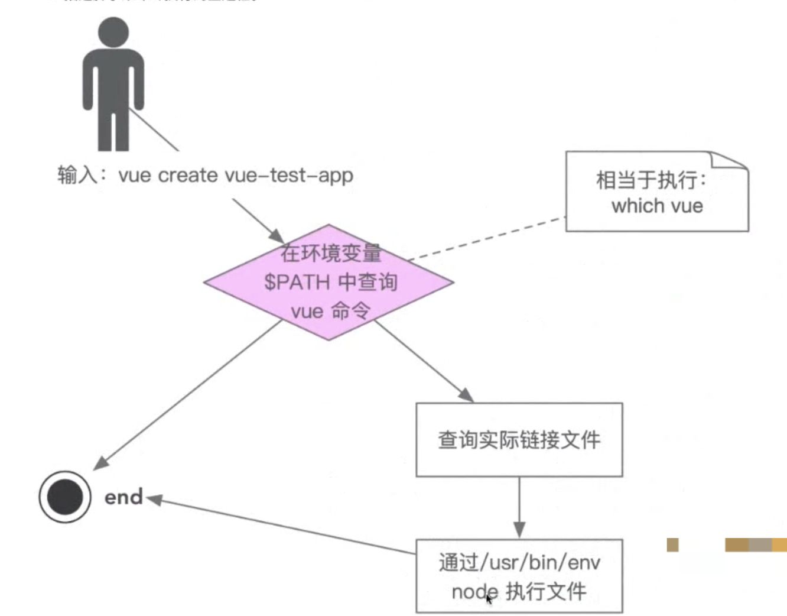

## 1、理解@vue/cli执行原理 

  

## 自己开发脚手架的价值：

  

  

  

  

  

  

  

  

  

## 1、为什么安装@vue/cli会后会添加vue命令？

安装@vue/cli会为我们添加全局环境变量vue

执行： which vue → /usr/local/bin/vue 进入/usr/local/bin，执行： LL

（1）查看vue执行的真实文件地址：通过软连接实现

  

（2）为什么在当前路径下可以用“vue”执行命令？

  

  

# 当我们执行vue create XX的时候，vue就是由package.json中的bin来决定的，执行它，就等同于执行：/usr/local/lib/node\_modules/@vue/cli/bin/vue.js

  

##   

## 如何调试一个本地包：

当我们把本地的一个包（比如执行完后打印1），进行了发布，然后全局安装到了本地，比如执行命令叫做aaa，那么这个aaa的软连接是指向/usr/loca/bin/node\_modules/aaa/bin/index.js的，这个时候执行aaa，打印：1，这个时候更改本地包，把打印内容改成12，然后执行sudo npm link，执行aaa，打印了12，但是看软连接，还是指向/usr/loca/bin/node\_modules/aaa/bin/index.js这个全局的包的，这个时候本地更改，执行aaa，会实时生效，方便本地开发，但是当我们执行sudo npm unlink，会让aaa的软连接失效，也就是全局安装的aaa包找不到执行的命令：aaa了，这个时候需要全局从新安装才会打印：1（如果打印12的版本发布后再重新安装，就会打印12）

  

如果是本地两个npm包，a和b，a想对b进行依赖，然后b并没有发布到npm，这个时候，可以先将b包进行npm link，然后再在a中对b进行依赖，然后npm i，就可以用b包啦

##   

## 2、全局安装@vue/cli时发生了什么？

上图我们已经看到全局执行变量截图里面，vue指向了/usr/local/lib/node\_modules/@vue/cli/bin/vue.js，而在上一级目录里面package.json里面有这样的执行命令：  

  

结论：会把依赖下载到/usr/local/lib/node\_modules里面，并配置软连接

  

## 3、执行vue命令时发生了什么？为什么vue指向一个js文件，我们却可以直接通过vue命令去执行它？

（1）which vue → /usr/local/bin/vue ，然后在这个目录的上级bin目录，找到vue的软连接

（2）vue再通过软连接去找到对应的/usr/local/lib/node\_modules/@vue/cli/bin/vue.js文件

  

(3) 这个时候其实就是输入vue，其实就是执行了vue.js，而vue.js这个文件为什么能够直接执行，其实就是因为文件内第一句话“#!/usr/bin/env node”，通过env环境变量去找到node执行当前文件，等价于 node vue.js

## 4、为什么说脚手架本质上是操作系统的客户端？它和我们的PC上安装的应用/软件有什么区别？

因为脚手架更多的是在系统上执行了可执行文件，他的依赖于node来进行执行（访问），我们编写的内容只是node的参数，而node就是操作系统的客户端，和web应用只是都用了js进行开发，比如：

```
node a.js
```

a.js只是node执行的参数

```
node -e "console.log('hha')"
```

同样能够答应hha，本质上都是node的参数，a.js虽然是文件，其实也是把内容读取都当成字符串传递给node进行解析

所以：

架手架的本质是客户端 → 因为node本省就是客户端

它和我们的PC上安装的应用/软件有什么区别？  

本质上是没有区别的，在windows上都是exe，node在windows上也是node.exe，在mac上都是可执行文件，区别无非就是应用或者软件会提供一个终端（GUI）进行交互

  

  

## 5、如何给当前的node脚手架命令创建别名？

软连接的方式

比如已经有了一个vue，在/usr/local/bin执行： ln -s ./vue ./vue2

就能够执行： vue2 xx

  

## 6、架手架可以干啥？

1、命令行交互

2、日志打印

3、命令行文字变色

4、网络通信：HTTP、Websocket

5、文字处理

……

  

## 7、初始化一个架手架（不包含依赖）

1、mkdir a

2、npm init

3、新建bin/index.js ： 第一行添加#!/usr/bin/env node 然后console.log(1)

4、在package.json中添加“bin”： {”wanglong”: “bin/index.js”}

5、发布npm，登录npm login ，npm publish (如果账号密码正确，本地登录不上，可以先尝试删除本地~/.npmrc文件)

6、下载这个npm包 npm i -g wanglong

7、查看这个包和比如vue全局包的路径是否一致 which wanglong

8、执行 ：wanglong   打印 ： 1

  

## 8、初始化一个架手架（包含依赖）

两个npm包，包名：wang\_t\_01 和 wang\_t\_02

步骤1、在本地初始化两个项目：wang\_t\_01 和 wang\_t\_02 


备注： 这里的文件index.js需要被赋予可执行文件，不然执行不了

  

疑问：npm包的文件不应该本地改权限吧，如果需要手动改，那发布后怎么执行(发布后就可以了执行了)

结果：发布后，下载下来会被系统制作成软连接，会把这个index.js文件自动变成可执行文件

```
 wanglong@bogon  ~/haoweilai/project/temp/npmbao/wang_t_01/lib  ls -al
total 8
drwxr-xr-x  3 wanglong  staff   96  5 18 10:24 .
drwxr-xr-x  4 wanglong  staff  128  5 18 10:24 ..
-rw-r--r--  1 wanglong  staff   41  5 18 10:41 index.js
 wanglong@bogon  ~/haoweilai/project/temp/npmbao/wang_t_01/lib  chmod 777 ./index.js
 wanglong@bogon  ~/haoweilai/project/temp/npmbao/wang_t_01/lib  ls -al
total 8
drwxr-xr-x  3 wanglong  staff   96  5 18 10:24 .
drwxr-xr-x  4 wanglong  staff  128  5 18 10:24 ..
-rwxrwxrwx  1 wanglong  staff   41  5 18 10:41 index.js
 ✘ wanglong@bogon  ~/haoweilai/project/temp/npmbao/wang_t_01/lib  ./index.js
wang_t_01
```

  

2、如果要发布npm包，可以按照【7】的执行顺序进行发布，npm i -g wang\_t\_01后在本地就会生成软连接：

```
lrwxr-xr-x  1 wanglong  admin    42B  5 18 11:30 wang_t_001 -> ../lib/node_modules/wang_t_01/lib/index.js
```

如果是本地发布，按照【7】的步骤制作好文件后，在本地当前目录执行： sudo npm link(移除就使用sudo npm unlink xx)，就在像从npm安装了wang\_t\_01一样，在本地的/usr/local/bin下面生成软连接：

  

就能直接运行，比如wang\_t\_02这个文件夹的package.json配置如下：

```
{
  "name": "wang_t_02",
  "version": "1.0.0",
  "description": "",
  "main": "index.js",
  "bin": {
    "wang_t_002": "lib/index.js"
  },
  "scripts": {
    "test": "echo \"Error: no test specified\" && exit 1"
  },
  "author": "",
  "license": "ISC"
}
```

就可以通过运行：wang\_t\_002 打印结果：'wang\_t\_02'

接下来如果wang\_t\_01想把wang\_t\_02当成依赖包进行安装，这里wang\_t\_02虽然没有发布但是通过npm link已经在本地做了软连接，所以可以通过npm link wang\_t\_02就能将这个包拉到wang\_t\_01的node\_modules下面：

  

  

如果想删除这个软链接，可以用

 sudo npm unlink -g wang\_t\_02 （unlink只有在当前包根目录下执行才能移除成功）

或者：

 sudo npm remove -g wang\_t\_02 （remove在任何目录下执行才能移除成功）  

  

注意：如果我们的文件夹名称是wang\_t\_02，那么建议我们在package.json里面配置bin的时候，也写成

```
"bin": {
    "wang_t_02": "lib/index.js"
  },
```

这样不容易搞晕调用到底是wang\_t\_02 还是wang\_t\_002

这里是wang\_t\_01调用wang\_t\_02，所以wang\_t\_02在package.json中不需要写上面的bin，只需要注意入口的配置要和更目录下对应的index.js对应：

  

  

## 总结：两个本地包，存在依赖关系的时候实现本地调试：

~作为lib包（比如包名：aaa），需要有package.json文件，指定好main入口，然后npm link，对方的包在package.json中手动对这个包进行dependences，然后执行npm link aaa，就可以在使用这个包了~

~  
~

~当一个包【A】依赖了另外一个本地包，以及一些线上包，这个时候比如第一个包又添加了另外一个本地依赖【B】："@xes-cli/log": "file:../../utils/log",这个时候第一个包之前通过npm link做成了本地全局执行命令，比如xes，这个时候新的依赖B想生效，建议操作步骤：~

~在A根目录删除node\_modules和package-lock.json,然后执行lerna bootsratp，然后 sudo npm link~

~  
~

~而我们创建一个具名的包，是在xes-cli的根目录下创建： lerna create @xes-cli/log (这里默认创建的路径是错误 的，会自动创建到第一个目录下，需要手动移动到自己想规划的目录)~

~  
~

~  
~

~  
~

最终最好用的办法：

当b依赖a：

lerna add a --scope=b  

  

  

[https://juejin.cn/post/6844903885312622606](https://juejin.cn/post/6844903885312622606)