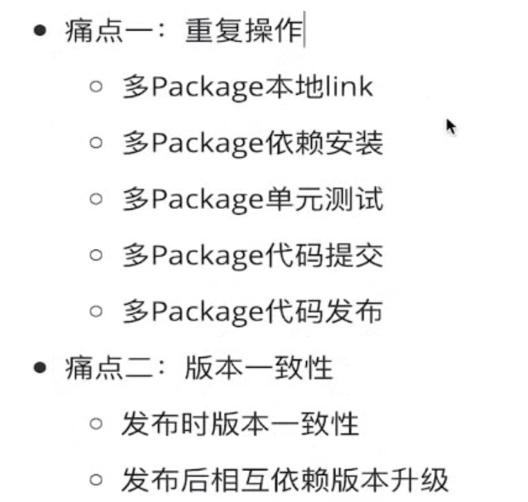
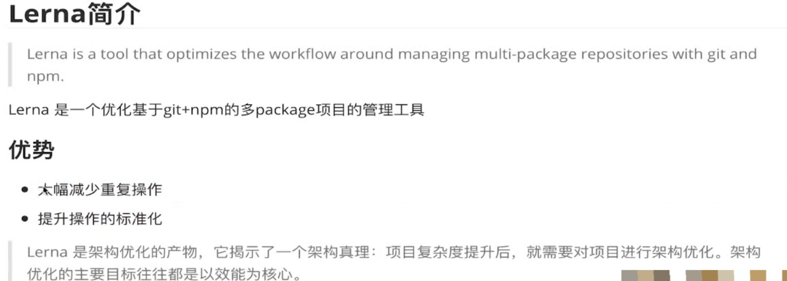
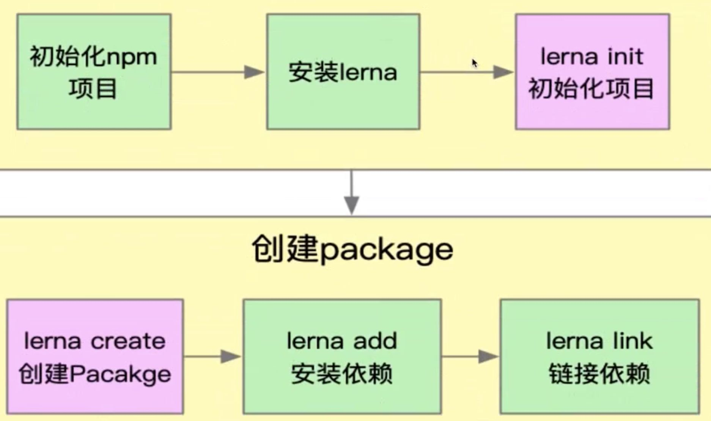
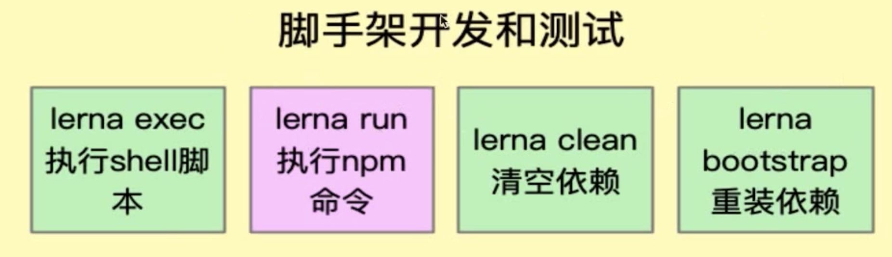
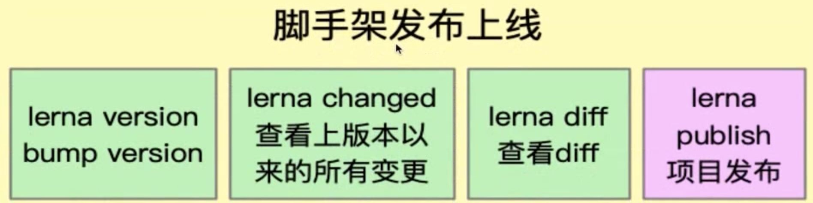

## 2、Lerna原理

  

are-we-there-yet // 事件进度管理工具，主要有newGroup、newItem、newStream三类

gauge // terminal里面的自定义京都条

events // node版本的事件订阅发布

set-blocking // 用来阻塞stdio和stderr，确保终端输出不被截断

console-control-strings // 跨平台美化的console

semver: 版本比对

**colors： 控制node打印console里面颜色、大小等的控制**

**npmlog: 个性化打印**

root-check 检查用户是否为root用户

user-home 跨平台检查用户主目录

path-exists： 检查路径是否存在

minimist: 解析参数

  

dotenv: 检查环境变量

url-join: 拼接url

  

  

解决问题：

  

  

  

  

第一步：

  

第二步：

  

第三步：

