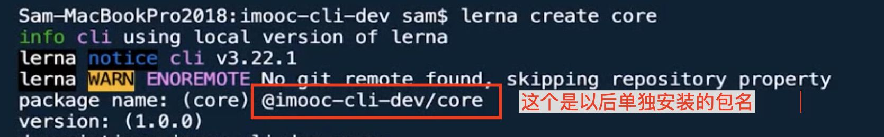
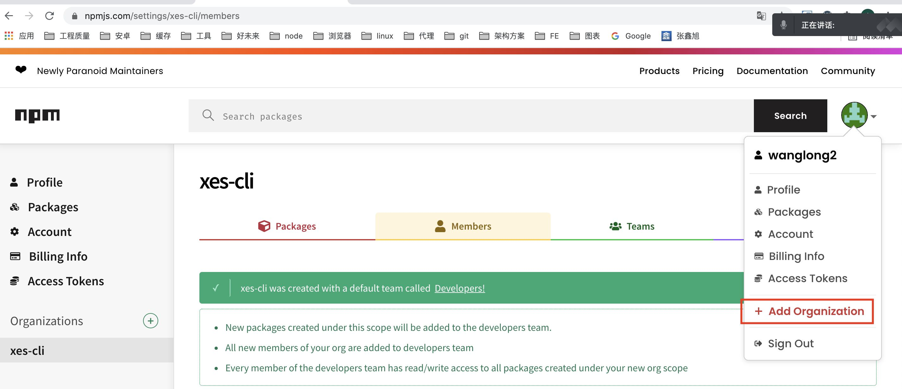
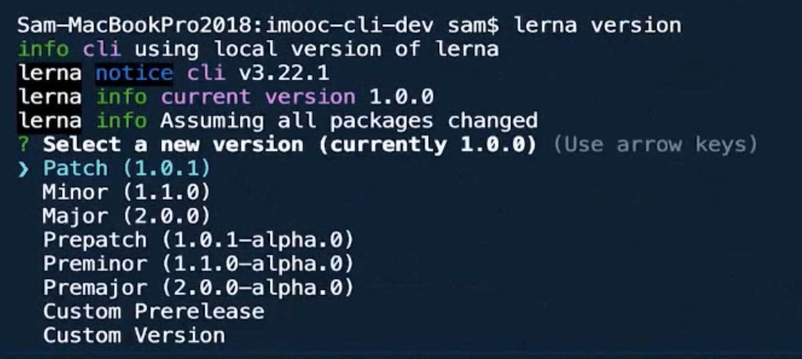
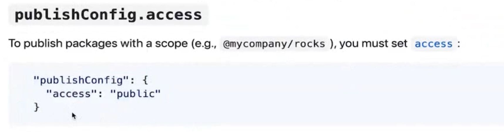

3、搭建并发布第一个脚手架

1、新建根目录 mkdir xes-cli

2、cd xes-cli , mkdir xes-client

3、cd xes-client , npm init -y， cnpm i -D lerna (教程里面3.22.1)，建议同时给全局安装lerna  , lerna -v

4、lerna init (它会同时新建.git)， 添加.gitignore

5、lerna create core

  

6、同理5，创建： lerna create utils

对于上面使用的@imooc-cli-dev，可以理解成命名空间，这个是需要“先到先得”的在npm上注册的，demo页面如下：

  

  

以上的core和utils是用来管理我们后面需要的依赖的

tips：以上包在生成的时候，因为是可以独立安装的，像core这样的包名肯定是能创建成功，但是发布不成功的，所以我们在生成package.json的name时候，包名一般指定为比如@wang-logs/core，属于某个命名空间下的包

  

常用命令：

```
lerna add <package>
```

比如：lerna add lodash就会将lodash添加到目前所有的packages里面，比如上面的@imooc-cli-dev/core以及@imooc-cli-dev/utils

如果我们只是给某个单独的package安装依赖：

lerna add lodash /packages/core/

  

```
lerna clean
```

删除所有packages里面的依赖(但是不会删除package.json里面的dependence和devdependence)，这个时候如果想重新安装所有依赖：

```
lerna bootstrap
```

比如我们的packages里面core依赖了utils，这个时候就可以通过：

```
lerna link
```

来建立他们的软连接，这里需要提前在core的package.json里面的dependence里面写上@imooc-cli-dev/utils: ‘^1.0.0’，然后在当前项目根目录下执行lerna link

  

执行脚本命令：

```
lerna exec -- xx(具体行为)
```

这个exec执行的是shell脚本

这个行为会对packages里面所有的包生效，比如执行：

```
lerna exec -- rm -rf node_modules 
```

会删除所有packages里面的node\_modules包，如果加上一个--scope就只会在某一个包上执行：

```
lerna exec -- --scope @imooc-cli-dev/core rm -rf node_modules
```

  

执行脚本命令：  

```
lerna run XX
```

这个和lerna exec雷同，但是执行的是npm脚本，比如每一个包里面的package.json里面的script里面都有“dev”: “xxx”的脚本，那么就可以通过：lerna  run  dev把所有npm脚本跑起来

  

```
lerna version
```

当我们本地的代码已经推送到远程仓库后，就可以使用这个工具来管理版本了，推送完后执行：lerna version，示例：

  

npm login

在根目录添加LICENSE.md

然后执行：

```
lerna publish
```

中途可能会因为命名空间的包是私有包，而导致报错：这个时候可以在根目录的package.json中添加：  

