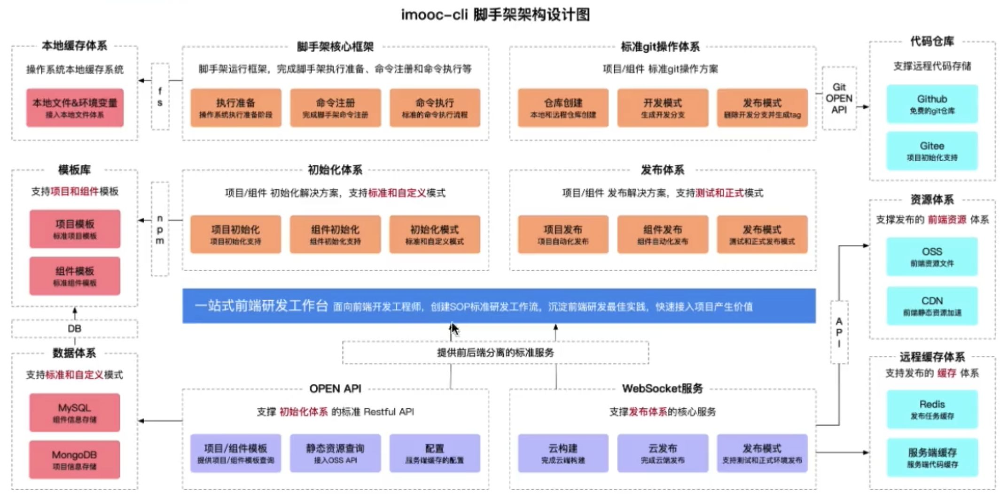
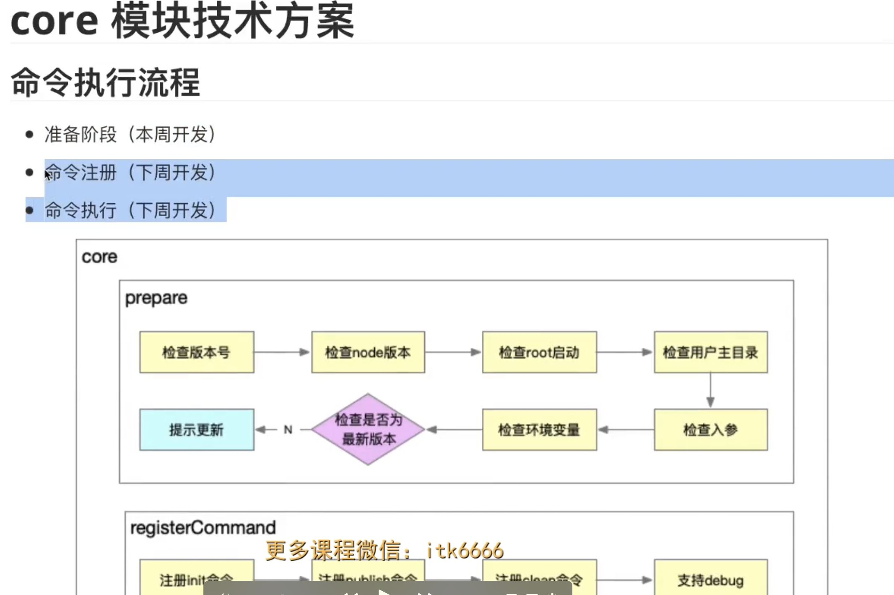
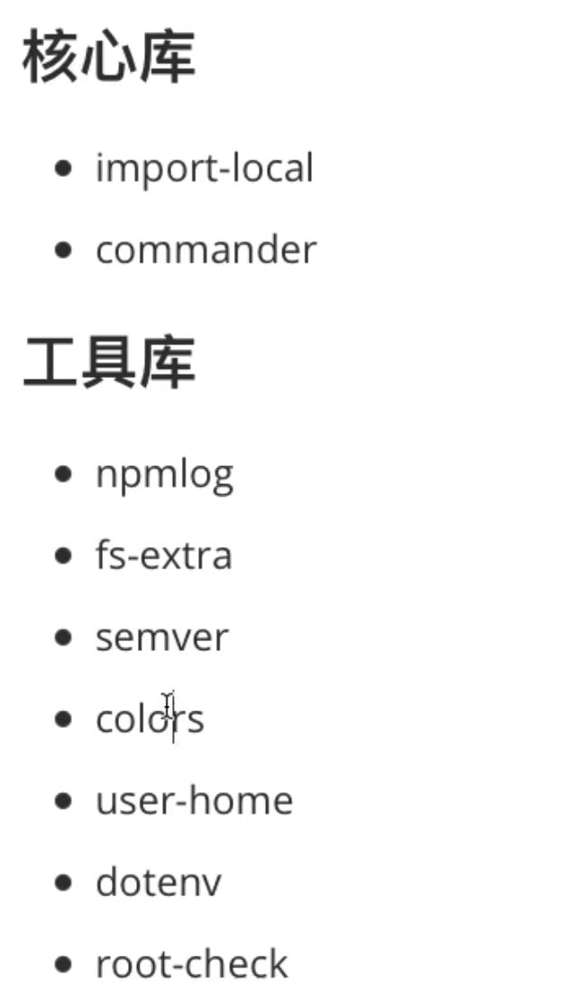
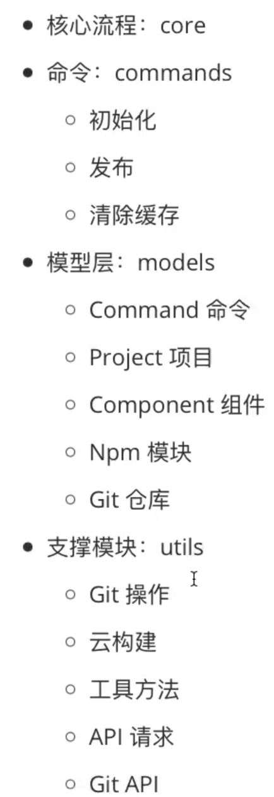
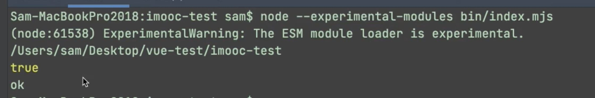
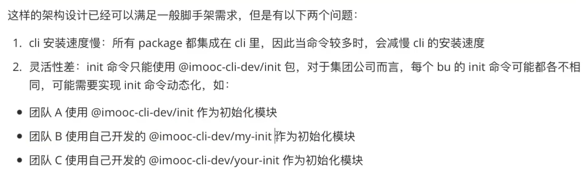
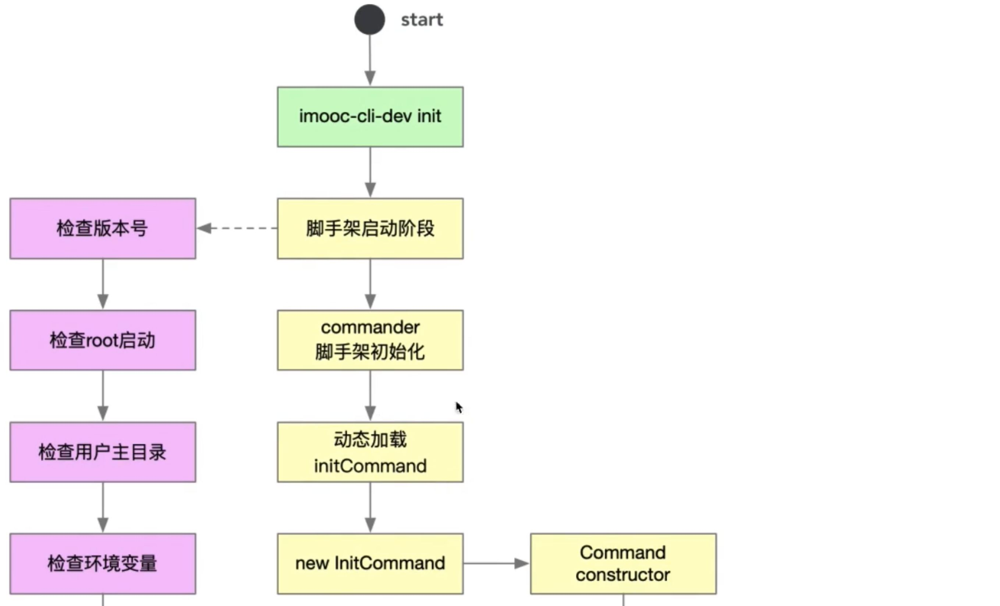
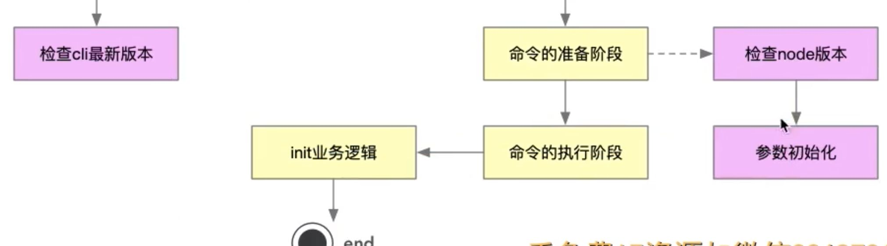
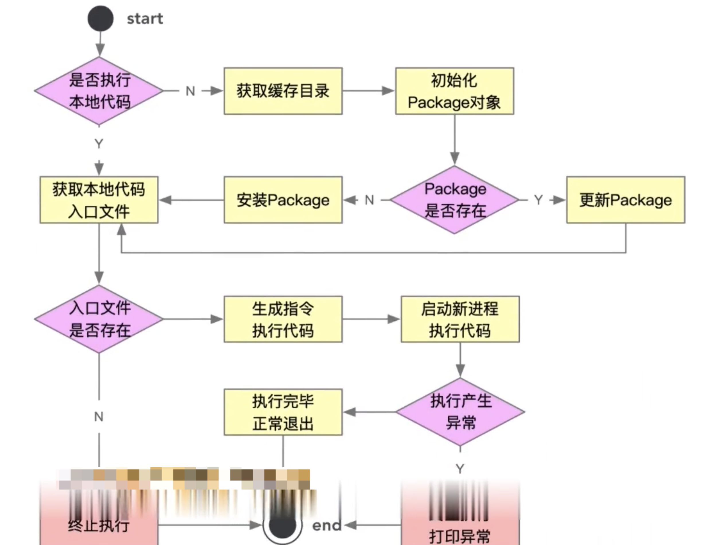

## 4、架手架核心框架开发流程梳理

脚手架架构设计稿

  

思路：

  

  

  

  

  

  

第一阶段： 开发准备阶段：

core模块：

1、检查版本号

2、检查node版本

3、检查root启动

4、检查用户主目录

5、检查入参

6、检查环境变量

7、检查是否为最新版本

  

  

  

备注：我们在core子模块下通过通过npm link做了软连接，如果通过lerna add xx 添加了依赖，之前的npm link会失效，需要重新执行npm link，如果是通过npm i xx来添加包，之前的npm link还能正常使用

[lerna\_practice-01.zip (593 kB)](./7de1e8ac-a3cd-4cea-a1c1-49f6baf24473.zip)   

  

  

第二阶段： 命令注册

  

1、commander学习

2、node支持es module 

（1）方案1：webpack方案

（2）方案2： node早期版，需要把js改成mjs文件后缀，在运行node时候，需要加上参数：

```
node --experimental-modules bin/index.mjs
```

  

  

（3）node的14版本以上直接支持了es module，但是所有的js文件必须是mjs为后缀，以mjs结尾的文件，在引入的时候，必须写全后缀名

  

这里安装了commands/init模块

  

  

  

调整后：

优化点有3点：

1、把init命令做成动态initCommand命令（动态加载），和当前的脚手架解耦了，所以当前架手架的加载速度会快很多

2、动态initCommand是通过缓存的形式进行储存，执行了哪个命令就下载并缓存哪个命令，不会一次性下载所有命令，如果命令更新，它也会自动更新

3、动态initCommand执行的时候，我们是通过node多进程进行，在执行initCommand的时候，是开了一个新进程进行初始化，而不会占用当前进程。

  

  

  

  

  

  

  

架手架命令动态加载功能架构设计流程：

  

  

是否执行本地代码的方式：就是用require来引用绝对路径的代码

[lerna\_practice2.zip (152 kB)](./b6157eeb-6351-462f-a854-1274fdb4f257.zip)   

  

  

## 重新开发了一个本地模块，重新安装本地依赖： 在项目根目录执行： lerna bootstrap ，然后再在core/cli目录执行： sudo npm link

[lerna\_practice.zip (155 kB)](./3dda1589-8c59-4b99-8216-fef31434b5f1.zip)