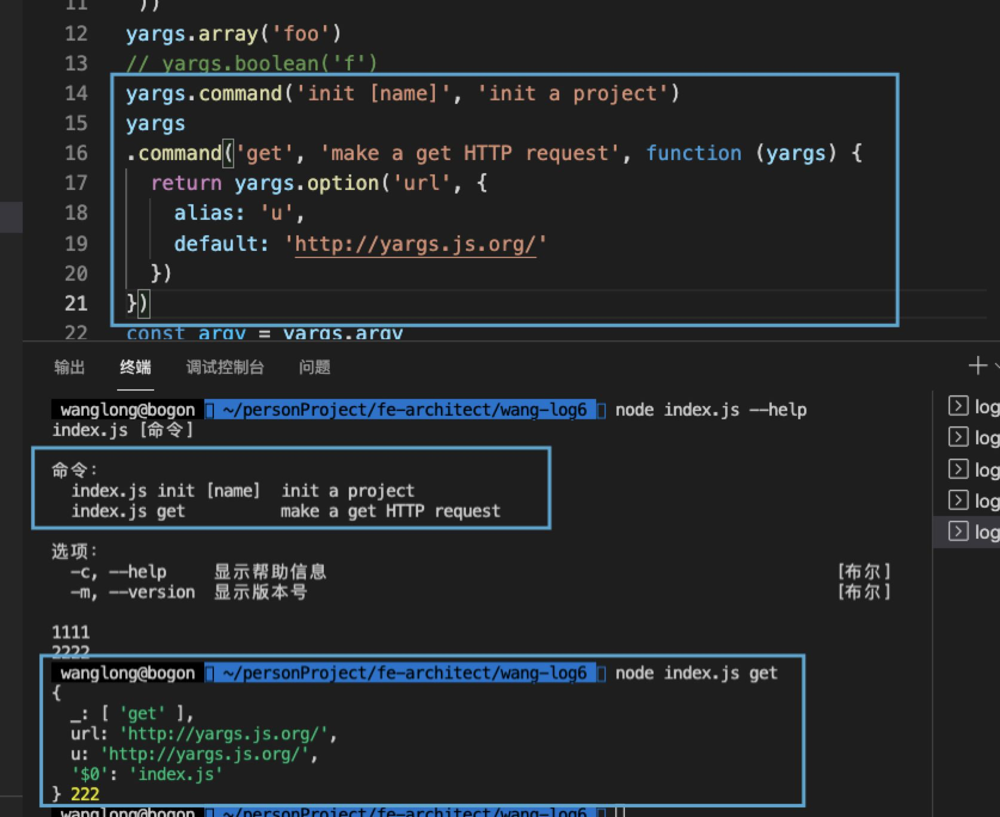

## 5、yargs用法

yargs基本用法是用来解析process.argv的

基本用法：

```
require('yargs').argv //不需要配置，yargs会自动全力解析process.argv
```

手动传参:

```
require('yargs')(['-x', '1', '-y', '2']).argv
//或者
require('yargs').parse(['-x', '1', '-y', '2']);
//以上是等价的。
//如果直接调用require('yargs').parse();会默认解析 process.argvss
```

获取arguments做为一个普通的对象  
Arguments之中没有对应的标识的 会展示到 argv.\_这个数组中  
脚本的名字或者node命令可以用 argv.$0取到，这个用法与$0在bash和per

```
//demo.js
console.log( require('yargs').argv );

//执行: node demo.js
//结果: { _: [], '$0': 'demo.js' }

//执行: node demo.js abc
//结果: { _: [ 'a', 'b', 'c' ], '$0': 'demo.js' }

//执行: node demo.js --name=hello
//结果: { _: [], name: 'hello', '$0': 'demo.js' }
```

  

.useage(string) 说明文案

  

.warp(yargs.terminalWidth())命令行占终端的宽度(这里是自适应)

.epilogue(string) 在提示结尾加上tips ，常常配合dedent包（去除缩进）使用：

```
yargs.eplilogue(dedent(`   123
3333
`))
结果：
123
3333
```

  

  

  

  

别名：**.alias(key, alias);**

  

```
const yargs = require('yargs');
//使用方法: 
yargs.alias('help', 'h');
yargs.alist('yargs', 'y'); 
//或者 
yargs.alias({
  help: 'h',
  yargs: 'y'
})
```

  

alias案例:

  

```
//demo.js
const yargs = require('yargs');
yargs.alias({
    'help': 'c', //这里是故意把help简写成c的，避免万一什么默认值之类的情况 
    'show': 's'
})
console.log( yargs.argv );

//执行: node demo.js -c

//结果: Options:
//  --help, -c  Show help                                                [boolean]
//  --version   Show version number                                      [boolean]

//执行: node demo.js -s=hello
//结果: { _: [], s: 'hello', show: 'hello', '$0': 'demo.js' }
```

  

.array(key)  
告知解析器把key做为一个数组.  
如果设置: .array('foo')  
参数：--foo foo bar这会被解析成: {foo: \['foo', 'bar'\] }  
如果被多次调用，会自动做合并处理  
参数：--foo foo --foo bar这会被解析成: {foo: \['foo', 'bar'\] }  
使用 -- 可以停止之后的参数加入到数组中  
参数：--foo foo bar -- val 这会被解析成: {foo: \['foo', 'bar'\]}

**.boolean(key)**  
把一个key定义为布尔类型，默认为true(这里官网上api写，设置boolean(key)这个方法之后key会默认为false，但是我亲测是默认true)，  
这里可以用 .default(key, undefined)；这个方法来修改默认值  
加--on-这个前缀也可以改为默认值是false

```
//执行: node demo.js -a
//结果: { _: [], a: true, '$0': 'demo.js' }
//执行: node demo.js --no-a
//结果: { _: [], a: false, '$0': 'demo.js' }
```

**.check(fn, \[global=true\])**  
//检查arguments中是否存在已知的情况  
//fn被调用的时候会有两个参数，第一个就是argv，第二个是个数组，代表参数的选项和别名  
//如果fn返回代表负的值或者抛出错误，就会显示错误和使用信息，并退出  
//global表明check是否能在一级命令和次级命令起作用

**.choices(key, choices);**  设置某个key的可选值

```
//demo.js
var argv = require('yargs')
  .alias('i', 'ingredient')
  .describe('i', 'choose your sandwich ingredients')
  .choices('i', ['peanut-butter', 'jelly', 'banana', 'pickles'])
  .help('help')
  .argv;
  console.log(argv);

  //执行: node demo.js -i jelly
  //结果：{ _: [], i: 'jelly', ingredient: 'jelly', '$0': 'demo.js' }
  //如果被调用多次，所有的值会被合并到一起
```

  

**.coerce(key, fn)**

这个方法是同步调用，用来转义命令行传入的值

_这个fn会接收一个参数，参数来源是命令行key对应的值  
并且必须要返回一个值或者抛出一个错误_

```
//demo.js
  var argv = require('yargs')
  .coerce('file', function (arg) {
    return require('fs').readFileSync(arg, 'utf8')
  })
  .argv

  //也可以用map的方法同时设置多个key的转义方法
  //demo.js
  var argv = require('yargs')
  .coerce({
    date: Date.parse,
    json: JSON.parse
  })
  .argv

//执行: node demo.js --json="{\"a\":\"b\"}"
//结果: { _: [], json: '{"a":"b"}', '$0': 'demo.js' }
//可以看到json的结果转化成了对象

//也可以对不同的key执行相同的转义
var path = require('path')
var argv = require('yargs')
  .coerce(['src', 'dest'], path.resolve)
  .argv
```

  

如果使用对象属性的方式来转义

```
// --user.name Batman --user.password 123
// gives us: {name: 'batman', password: '[SECRET]'}
var argv = require('yargs')
  .option('user')
  .coerce('user', opt => {
    opt.name = opt.name.toLowerCase()
    opt.password = '[SECRET]'
    return opt
  })
  .argv
```

  

**.command(cmd, desc, \[builder\], \[handler\])**  
**.command(cmd, desc, \[module\])**  
**.command(module)**

定义应用暴露出来的命令  
参数：cmd ，必须是一个字符串类型命令名称，或者是一个数组，数组的类型是字符串，代表是命令的名称或者命令的别名  
参数: desc，用来描述命令是作什么用的， 如果设置 desc 的值为 false，则会创建一个隐藏的指令  
可选参数: builder，这个是用来提示命令需要接收的参数

```
yargs
  .command('get', 'make a get HTTP request', {
    url: {
      alias: 'u',
      default: 'http://yargs.js.org/'
    }
  })
  .help()
  .argv

  可选参数：builder，也可以是一个方法，这个方法的参数是yargs的实例 
  yargs
  .command('get', 'make a get HTTP request', function (yargs) {
    return yargs.option('url', {
      alias: 'u',
      default: 'http://yargs.js.org/'
    })
  })
  .help()
  .argv

//  还可以传另一个处理函数，这个函数会被调用并且传入处理过的argv
yargs
  .command(
    'get',
    'make a get HTTP request',
    function (yargs) {
      return yargs.option('u', {
        alias: 'url',
        describe: 'the URL to make an HTTP request to'
      })
    },
    function (argv) {
      console.log(argv.url)
    }
  )
  .help()
  .argv
```

demo:

  

  

**.completion(\[cmd\], \[description\], \[fn\]);**

这个用于命令行被全  
cmd定义参与命令补全的命令。第一次使用会有提示，如果用的zsh，那么将提示中 .bashrc改成.zshrc，然后按照提示操作(切记将你的js文件设置(chmod u+x)为可执行文件，然后不规则操作)  
description 描述命令的使用方法  
fn 提供待补全的参数  
  
如果实现的时候没有携带参数，那么.completion()会让补全命令输出补全脚本

```
var argv = require('yargs')
  .completion('completion', function(current, argv) {
    // 'current' is the current command being completed.
    // 'argv' is the parsed arguments so far.
    // simply return an array of completions.
    return [
      'foo',
      'bar'
    ];
  })
  .argv;

  //还可以实现异步方法被全
  var argv = require('yargs')
  .completion('completion', function(current, argv, done) {
    setTimeout(function() {
      done([
        'apple',
        'banana'
      ]);
    }, 500);
  })
  .argv;

  //还可以返回一个promise对象进行补全
  var argv = require('yargs')
  .completion('completion', function(current, argv) {
    return new Promise(function (resolve, reject) {
      setTimeout(function () {
        resolve(['apple', 'banana'])
      }, 10)
    })
  })
  .argv;
```

  

**.config(\[key\], \[desction\], \[parseFn\])**  
这个方法传入key，相当于是一个 JSON 配置文件的路径。文件中的 JSON 属性被设置为对应的 key 和 value(挂在 argv 上)。文件使用 nodejs 的 require api 加载的，文件名最好为.js, .json。  
如果此方法没有携带任何参数，.config()将会使用--config选项传入 JSON 配置文件（此时只能传入以.json 结尾文件）  
description同其他方法，用于描述命令  
可选项 parseFn 可以用来定制转换器。转换函数必须是同步的，并且应当返回一个带有 key,value 键值对的对象或者一个 error。  
  
**.config(object)**  
还可以传一个明确的object, 同样的，它的键值对会转化为argv的键值对。  
var argv = require("yargs").config({ foo: 1, bar: 2 }).argv;

config和pkgConf可以提供extends关键词，用来表明配置应该从别处继承。  
extends参数可以是绝对路径也可以是相对路径

```
yargs.config({
  extends: "./configs/a.json",
  logLevel: "verbose"
}).argv;

```

//或者也可以提供一个模块（这对函数性很有用，就像babel-presets）  

```
yargs.pkgConf('nyc');

```

自定义的package.json  
{  
"nyc": {  
　　　　"extends": "nyc-babel-config"  
　　}  
}  
nyc-babel-config是一个包，这个包导出了configuration在index文件中

**.conflicts(x, y);**  
设置了x之后y就不能设置了。y可以是一个字符串，也可以是一组 key不与x共存的

**.count(key)**  
此命令用来对命令计数，并转化为命令的参数，例如：

```
#!/usr/bin/env node
var argv = require("yargs")
  .count("verbose")
  .alias("v", "verbose").argv;

VERBOSE_LEVEL = argv.verbose;

function WARN() {
  VERBOSE_LEVEL >= 0 && console.log.apply(console, arguments);
}
function INFO() {
  VERBOSE_LEVEL >= 1 && console.log.apply(console, arguments);
}
function DEBUG() {
  VERBOSE_LEVEL >= 2 && console.log.apply(console, arguments);
}

WARN("Showing only important stuff");
INFO("Showing semi-important stuff too");
DEBUG("Extra chatty mode");
```

  

**.demandOption(key, \[msg | boolean\]) .demandOption(key, msg)**  
此命令用来强制用户输入某些参数  
如果 key 是一个字符串，且 key 没有出现在命令行参数中，展示使用说明并退出。  
如果 key 是数组，限制每一个数组中的参数  
如果提供了 msg，而且没有相应参数，那么 msg 将会展示，替代原有的标准错误信息

  

```
require("yargs")
  .option("run", {
    alias: "r",
    describe: "run your program"
  })
  .option("path", {
    alias: "p",
    describe: "provide a path to file"
  })
  .option("spec", {
    alias: "s",
    describe: "program specifications"
  })
  .demandOption(
    ["run", "path"],
    "Please provide both run and path arguments to work with this tool"
  )
  .help().argv;

  //当第二个参数为布尔值的时候，布尔值决定了这个选项是不是必须的。当使用 options 方法的时候，这个选项很有用

require("yargs")
  .options({
    run: {
      alias: "r",
      describe: "run your program",
      demandOption: true
    },
    path: {
      alias: "p",
      describe: "provide a path to file",
      demandOption: true
    },
    spec: {
      alias: "s",
      describe: "program specifications"
    }
  })
  .help().argv;
```

  

**.demandCommand(\[min=1\], \[minMsg\]) .demandCommand(\[min=1\], \[max\], \[minMsg\], \[maxMsg\])**  
此命令用于限定用户在程序中使用的命令次数。如果命令没有传进来，使用 msg 提供标准的错误提示

  

```
require("yargs")
  .command({
    command: "configure <key> [value]",
    aliases: ["config", "cfg"],
    desc: "Set a config variable",
    builder: yargs => yargs.default("value", "true"),
    handler: argv => s
      console.log(`setting ${argv.key} to ${argv.value}`);
    }
  })
  // provide a minimum demand and a minimum demand message
  .demandCommand(1, "You need at least one command before moving on")
  .help().argv;
```

  

**.hide(key)**  
在使用信息中隐藏一个key, 除非用 --show-hidden

```
var yargs = require("yargs")(['--help'])
  .showHidden('show-hidden', 'Show hidden options')
  .argv
```

**.detectLocale(boolean)**  
yargs检测操作系统本地，默认是trues

**.env(\[prefix\])**  
定义环境变量的值，使用”\_“来表明嵌套的选项（nested\_\_foo => nested.foo）

程序参数定义优先的次序:

命令行参数  
env 参数  
配置文件或者 object  
默认选项

  

```
//fruity.js
var argv = require("yargs")
  .env("MY_PROGRAM")
  .option("f", {
    alias: "fruit-thing",
    default: "apple"
  }).argv;
console.log(argv);

$: node fruity.js
{ _: [],
  f: 'apple',
  'fruit-thing': 'apple',
  fruitThing: 'apple',
  '$0': 'fruity.js' }

  $ MY_PROGRAM_FRUIT_THING=banana node fruity.js
{ _: [],
  fruitThing: 'banana',
  f: 'banana',
  'fruit-thing': 'banana',
  '$0': 'fruity.js' }

  $ MY_PROGRAM_FRUIT_THING=banana node fruity.js -f cat
{ _: [],
  f: 'cat',
  'fruit-thing': 'cat',
  fruitThing: 'cat',
  '$0': 'fruity.js' }
```

  

**.epilog(str)**  
**.epilogue(str)**  
使用说明结尾处的文案

```
var argv = require('yargs')
  .epilogue('for more information, find our manual at http://example.com');
```

**.example(cmd, desc)**  
增加示例，第一个参数cmd中，$0代表命令行中的第一个参数。例子会随着帮助信息打印出来。

**.exitProcess(enable)**  
如果yargs由于调用 .version或者校验失败或者命令执行失败，调用exitProcess(false)，可以继续执行其它正常的指令。

**.exit(code, err)**  
主动退出程序，并且可以提示 上下文表示为什么我们要退出。

  

**.fail(fn)**  
发生错误的时候会调用  
msg是本来要打印的错误  
err本来要抛出的错误  
yargs是yargs的实例

  

```
var argv = require('yargs')
  .fail(function (msg, err, yargs) {
    if (err) throw err // preserve stack
    console.error('You broke it!')
    console.error(msg)
    console.error('You should be doing', yargs.help())
    process.exit(1)
  })
  .argv
```

比如我们输入的指令有错误的时候，可以定制输出的提示格式

  

  

**.getCompletion(args, done);**  
允许程序按步取得补全内容  
args：命令行需要被补全的数组  
done: 回调函数，函数会获取当前的补全内容

  

```
require('yargs')
  .option('foobar')
  .option('foobaz')
  .completion()
  .getCompletion(['./test.js', '--foo'], function (completions) {
    console.log(completions)
  })
  //如果输入 ./test.js --foo 输入TAB: --foobar 和 --foobaz
```

  

**.global(globals, \[global=true\])**  
此命令指点某个选项不会被重置当命令执行的时候

  

```
var argv = require('yargs')
  .option('a', {
    alias: 'all',
    default: true,
    global: false
  })
  .option('n', {
    alias: 'none',
    default: true,
    global: false
  })
  .command('foo', 'foo command', function (yargs) {
    return yargs.option('b', {
      alias: 'bar'
    })
  })
  .help('help')
  .global('a')
  .argv

  //如果foo执行 ， all这个参数会被保留，但是node会被删除
```

  

**.group(key(s), groupName)**  
把一个key或者一组keys放到一个 groupName下，当调用使用文档的时候会分组展示

  

```
var yargs = require('yargs')(['--help'])
  .help()
  .group('batman', 'Heroes:')
  .describe('batman', "world's greatest detective")
  .wrap(null)
  .argv

//结果:
//  Heroes:
//  --batman  world's greatest detective

//Options:
//  --help  Show help  [boolean]

```

  

**.help(\[option, \[description\]\])**  
设置帮助提示  
如果不传参数 ， .help(); 这里启用 --help这个选项

```
var yargs = require("yargs")(['--info'])
  .usage("$0 -operand1 number -operand2 number -operation [add|subtract]")
  .help('info')
  .argv
```

**.implies(x, y)**  
如果设置了x, 则y就必须设置

**.locale()**  
返回当前正在使用的yargs

**middleware(callbacks, \[applyBeforeValidation\])**  
定义中间件

**.nargs(key, count)**  
此方法表示，这后面的参数个数

```
var argv = require('yargs')
  .nargs('token', 1)
  .parse(['--token', '-my-token']);

  //{ _: [], token: '-my-token', '$0': 'node test' }
```

**.normalize(key)**  
据说是为了传入 path 的时候,便于调用 path.normalize()

**.number(key)**  
告诉 parser，一直将这个key当作数字转换

参数可以是数组

选项如果并没有值，默认为undefined

不能转化为数字，会被转换为NaN

小数，16 进制数，科学计数法都是合法的

```
var argv = require("yargs")
  .number("n")
  .number(["width", "height"]).argv;
```

  

**.option(key, \[opt\]) .options(key, \[opt\])**

```
为key配置各种选项的命令
var argv = require("yargs").option("f", {
  alias: "file",
  demandOption: true,
  default: "/etc/passwd",
  describe: "x marks the spot",
  type: "string"
}).argv;
//同
var argv = require("yargs")
  .alias("f", "file")
  .demandOption("f")
  .default("f", "/etc/passwd")
  .describe("f", "x marks the spot")
  .string("f").argv;
  //同
  var argv = require("yargs").options({
  f: {
    alias: "file",
    demandOption: true,
    default: "/etc/passwd",
    describe: "x marks the spot",
    type: "string"
  }
}).argv;
```

  

可用的 key 有以下这些

- alias
- array
- boolean
- choices
- coerce
- config
- configParser
- conflicts
- count
- default
- defaultDescription
- demandOption
- desc/describe/description
- global
- group
- hidden
- implies
- nargs
- normalize
- number
- requiresArg
- skipValidation
- string
- type: ‘array’,’boolean’,’count’,’number’,’string’

  

  

**.parse(\[args\], \[context\], \[parseCallback\])**

可以替代从process.argv传参，返回 argv 对象。args 可以是数组或者原生参数字符串。

context：可以同时携带的一个对象参数，可以为命令提供状态信息，是很实用的技术。

  

```
const parser = yargs
  .command(
    "lunch-train <restaurant>",
    "start lunch train",
    function() {},
    function(argv) {
      console.log(argv.restaurant, argv.time);
    }
  )
  .parse("lunch-train rudy's", { time: "12:15" });

  
```

  

**parseCallback**: 此方法的回调函数，会携带三个参数

err: 转化中出现的验证错误  
argv: 转化的 argv 对象  
output: 将要在终端输出的文本

  

```
const parser = yargs
  .command(
    "lunch-train <restaurant> <time>",
    "start lunch train",
    function() {},
    function(argv) {
      api.scheduleLunch(argv.restaurant, moment(argv.time));
    }
  )
  .help();

parser.parse(bot.userText, function(err, argv, output) {
  if (output) bot.respond(output);
});
```

  

**.pkgConf(key, \[cwd\])**  
类似于 .config()，这表明 yargs 从 package.json 中寻找特定的配置对象  
cwd可以选择性地提供，package.json 将从这里读取

**.scriptName($0)**  
设置执行文件的名字， $0

```
var yargs = require("yargs")
.scriptName("my-script")
.help()
.argv
```

**.wrap(columns)**  
设置列

#### **.showHelp(consoleLevel=’error’)**

用 console 的`consoleLevel`打印使用数据 

```
var yargs = require("yargs").usage(
  "$0 -operand1 number -operand2 number -operation [add|subtract]"
);
yargs.showHelp(); //prints to stderr using console.error()
```

或者，使用标准输出打印使用信息，可以选择`console.log`:

```
yargs.showHelp("log"); //prints to stdout using console.log()
```