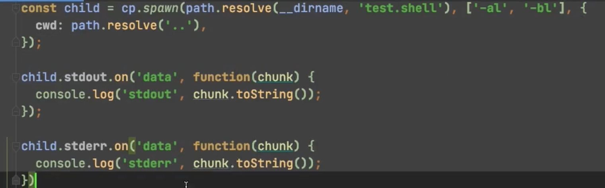

## 6、多进程

  

  

- `child_process.spawn()`：适用于返回大量数据，例如图像处理，二进制数据处理。
- `child_process.exec()`：适用于小量数据，maxBuffer 默认值为 200 \* 1024 超出这个默认值将会导致程序崩溃，数据量过大可采用 spawn。
- `child_process.execFile()`：类似 `child_process.exec()`，区别是不能通过 shell 来执行，不支持像 I/O 重定向和文件查找这样的行为
- `child_process.fork()`： 衍生新的进程，进程之间是相互独立的，每个进程都有自己的 V8 实例、内存，系统资源是有限的，不建议衍生太多的子进程出来，通长根据系统\*\* CPU 核心数\*\*设置。

  

exec和execFile，前者是执行shell脚本（也可以接收文件），execFile是执行文件，那么execFile可以执行shell脚本吗？有个取巧的办法，把shell脚本写到文件里面去，execFile执行文件的时候，文件执行了shell脚本。

同样其实exec其实是可以解析文件的，只是不支持想execFIle那样传递参数：

  

Tips： 其实exec和execFIle，底层是通过spawn实现的

  

我们在程序运行的时候为啥要通过\_\_dirname来定位当前路径，而不是./ ,因为./不准确，脚本在执行的时候，./是相对于shell执行的当前脚本的路径（但是这个脚本文件需要chomd改成可执行文件的权限），而不是写./的这个文件，所以一旦执行脚本的文件和当前写./的文件路径不同就会出问题。

  

spawn：

  

那它没有回调，我们怎么查看数据呢？通过on监听：

  

exec和execFile适合运行完后返回结果，因为spawn是流式的操作，所以它更适合于大量耗时的操作，通过可能需要不断输出日志，比如我们build项目，不断的需要提示进度，比如我们安装node\_modules的过程：

  

  

fork：他的底层其实也是调用的spwan实现

子进程断开方案：

父进程：

  

子进程：

  

这里要注意，如果消息嵌套可能会出现死循环

  

## 接下来在4项目的基础上添加多进程方案：

lerna create command，移动到models模块下面：

命令动态执行:

[lerna\_practice.zip (157 kB)](./cfac5628-e25b-4a31-a918-5c2140ca1f98.zip)   

  

child\_process原理分析：

normalizeExecAgrs对参数进行调整，让exec最终和execFile一致，进入execFile后，会对参数进一步normalize

  

  

这里在spawn中的new childProcess调用的 ChildProcess文件是c++文件，看看这个Process对象的调用方式：

```
const { Process } = internalBinding('progress_wrap') // progress_wrap.cc是C++文件
this._handle = new Process()

```

process创建进程的原理：

  

  

  

  

  

child\_process回调执行机制：

  

  

  

  

  

  

  

