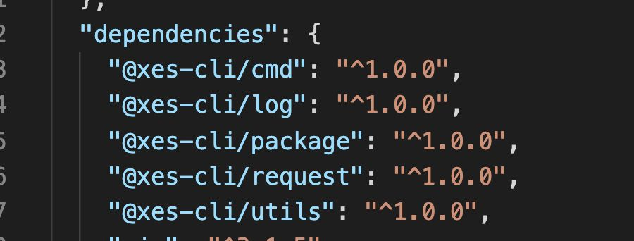

lerna的依赖bug处理

  

我们将文件关系都放在一个层级，当一个文件对于另外一个文件有依赖的时候，我们可以通过lerna a --scope=b，（b依赖a）进行安装，最后在package.json中的dependencies中都是版本的形式呈现：（执行lerna a --scope=b的时候自动生成）

  

但是这里会出现一个问题，当我们需要把入口文件作为sudo npm link，然后想通过全局命令比如vue init ...来执行脚本，但是发现，我们这个包对应的依赖因为都没有发布，但是都是用的版本号，比如上面的1.0.0，这个时候就会报找不到依赖，所以对于入口文件的依赖，我们需要手动将其依赖修改为：

郁闷，后面再使用：，居然直接生成 的是：

  

结果还报错了，

即使执行了lerna bootstrap也没用，

然后手动把依赖改成版本的方式引入又好了：

