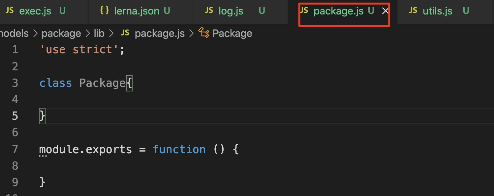
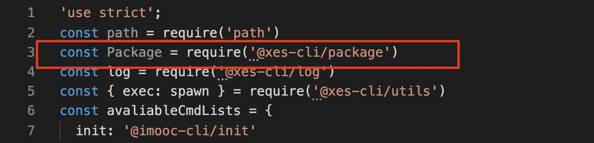
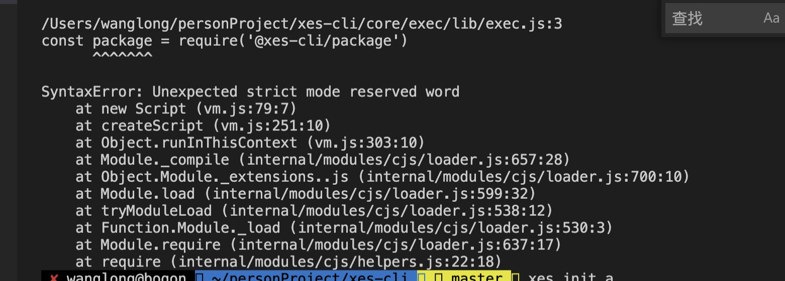

## 问题

1、const rootCheck = require('root-check');

rootCheck();

为什么要尝试给用户降级？

  

2、

async prepare() {

if (this.storeDir && !pathExists(this.storeDir)) { // 在Command准备阶段，为啥会存在这种判断？ 因为路径是我们拼接的，肯定有，但是对应这个路径的文件夹不一定存在

fse.mkdirpSync(this.storeDir);

}

if (this.packageVersion === 'latest') { // 为什么是===而不是！==

this.packageVersion = await getNpmLatestVersion(this.packageName);

}

}

  

3、理解源码实现：

semver

  

  

4、importLocal作用：

#! /usr/bin/env node

const importLocal = require('import-local');

if (importLocal(\_\_filename)) {

require('npmlog').info('cli', '正在使用 imooc-cli 本地版本'); // 如果在本地安装了这个imooc-cli的npm包，那么会执行这里

} else {

require('../lib')(process.argv.slice(2)); // 依赖本地的文件，本地调试开发使用

}

  

5、遇到一个很奇特的问题：

  

这里不管是导出一个Fn，还是一个类，另外一个地方引入：

  

这里一旦大写就ok，小写就会报错：

