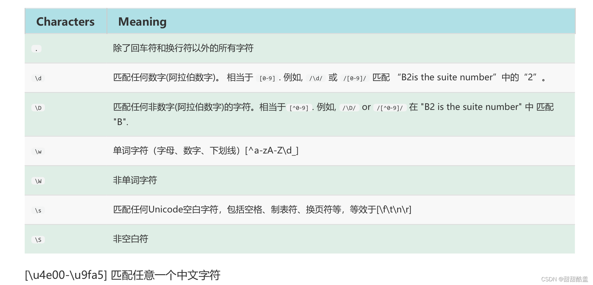
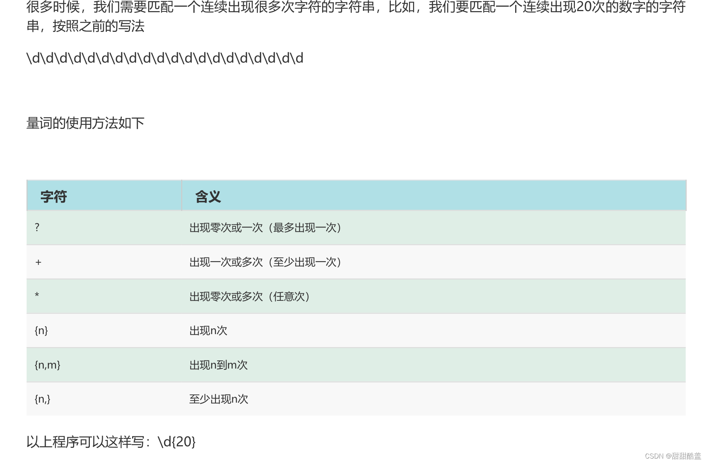

来源：

https://www.bilibili.com/video/BV12J41147fC/?p=14&vd_source=55dcc9b2dc5b93d913718cd6ba694fc2

# 浅尝：

比如我们要把下面这个字符串里面数字提取出来：

```js
const str = 'abc55uu66';
const num = [...str.split('').filter(item => (isNaN(Number(item)) ? undefined : item))].join('')
console.log(num) // 5566
// 正则：
const num2 = str.match(/\d/g).join('')
console.log(num2) // 5566

// 我们想把html节点中h*的标签给替换掉：
const body = document.body
const reg = /<(h[1-6])>[\s\S]*<\/\1>/gi // 注意这里一个\/,这个/是html标签结束的/，需要被转义
body.innerHTML = body.innerHTML.replace(reg, '')
```

字面量创建正则： 字面量才用/

```js
const str = 'aa.com';
const hasA = /a/.test(str)
console.log('hasA',hasA) // true
const t = 'a'
const hasAA = eval(`/${t}/`).test(str)
console.log('hasAA',hasAA) // true
```

对象创建：

```js
const str = 'aa.com';
const res = new RegExp('a', 'g')
const hasA = res.test(str)
console.log('hasA',hasA) // true
// 使用变量
const t = 'a'
const res1 = new RegExp(t, 'g')
const hasA1 = res.test(str)
console.log('hasA1',hasA1) // true
```

# 原子组和原子表：

```js
const tel = '020-99999';
// 匹配电话号码
console.log(/010\-\d{3,8}/.test(tel)) // ture
// 匹配两个地区 ,  但是会出现一个问题 const tel = 010也成功
console.log(/010|020\-\d{3,8}/.test(tel)) // true
// 改写，但是又出现重复部分
console.log(/010\-\d{3,8}|020\-\d{3,8}/.test(tel)) // true
// 原子组写法 
console.log(/(010|020)\-\d{3,8}/.test(tel)) // true
```

这里的括号就是一个整体，就是原子组，必须匹配到一个组的内容才算匹配，对应的就是原子表[]，其实就是单个匹配，这里只要匹配上中括号中任意一个就行

```js
const tel = '1';
console.log(/[01234]/.test(tel)) // ture

```

## 扩展：

### ( )配合\1 \2 \3 ... \n来使用

```js
// 中括号的匹配，我们扩展下：
const times = '2022-2-23';
const reg = /^\d{4}-\d{1,2}-\d{1,2}/
console.log(times.match(reg)) // ['2022-2-23', index: 0, input: '2022-2-23', groups: undefined]
// 但是日期可能是通过/来链接：
const times2 = '2022/2/23';
const reg2 = /^\d{4}[-/]\d{1,2}[-/]\d{1,2}/
console.log(times2.match(reg2)) // ['2022/2/23', index: 0, input: '2022/2/23', groups: undefined]
// 上面这种写法是有bug的，比如：
const times3 = '2022/2-23';
const reg3 = /^\d{4}[-/]\d{1,2}[-/]\d{1,2}/
console.log(times3.match(reg3)) // ['2022/2-23', index: 0, input: '2022/2-23', groups: undefined]
// 所以为了前后的规则保持一致，可以这么写：
const times4 = '2022/2-23';
const reg4 = /^\d{4}([-/])\d{1,2}\1\d{1,2}/ // 注意这里的\1
console.log(times4.match(reg4)) // null

```

### （）匹配邮箱：

```js
//简单一个邮箱：
const email = '34534-334@163.com';
const reg = /^[\w-]+@\w+\.(com|cn|net)$/i;
console.log(email.match(reg))
//改成这样的邮箱：
const email1 = '34534-334@163.haha.com';
const reg1 = /^[\w-]+@(\w+\.)+(com|cn|net)$/i;
console.log(email1.match(reg1))
//改成这样的邮箱：
const email2 = '34534-334@163-56.haha.com';
const reg2 = /^[\w-]+@([\w-]+\.)+(com|cn|net)$/i;
console.log(email2.match(reg2))
```


### [ ]作为区间来使用：

```js
// []作为区间来使用：
const num = '2022';
console.log(num.match(/[0-9]+/g)) // ['2022']
const str = 'whoare238790'
console.log(str.match(/[a-z]+\w{3,4}/g)) // ['whoare2387']
```


### [^ ]作为排除来使用：

```js
// []作为区间来使用：
const num = '2023';
console.log(num.match(/[^2]/g)) // ['0', '3']
// 找中文
const str = '我在 beijing 2 环'
console.log(str.match(/[^\s\w]/g)) // ['我', '在', '环']
console.log(str.match(/[^\s\w]+/g)) // ['我在', '环']
// 另外一种uncode写法：
console.log(str.match(/\p{sc=Han}+/gu)) //  ['我在', '环']

```

# 转义：

```js
const price = 23.34
console.log(/\d+.\d+/.test(price)) // true // 23@23也是true
// . 除开换行以外任意字符 转义后才代表点的含义
// 通过字面亮去表达又是另外一回事，先看下这个：
console.log('d' === 'd')  // true
console.log('\d' === 'd')  // true
// 如果用上面的判断条件，通过对象方式去写：
const reg = new RegExp("\d+\.\d+"); 
console.log(reg.test(price)) // false
// 本质原因就是new RegExp("\d+\.\d+")其实是匹配new RegExp("d+.d+")
// \d就是d，\.就是. 这种匹配dddd@ddd这种就是true，所以
// RegExp要求的是\d+\.\d+这种格式，但是\d+\.\d+这种写法在字符串里面表达的其实是d+.d+
// 所以需要对\d+\.\d+里面的反斜杠再次转移，\\d+\\.\\d+
const reg2 = new RegExp("\\d+\\.\\d+"); 
console.log(reg2.test(price)) // true
```


# 字符边界：^ $

# \d（数字） \D（非数字）

```js
let str = 'wanglong 2023';
console.log(str.match(/\d+/g)) // ['2023']
let str2 = `
    张三:010-9999999,李四:020-8888888
`
console.log(str2.match(/\d{3}/)) // ['010', index: 9, input: ' \n    张三:010-9999999,李四:020-888888\n', groups: undefined]
console.log(str2.match(/\d{3}/g)) // ['010', '999', '999', '020', '888', '888']
console.log(str2.match(/\d{3}-\d{7,8}/g)) // ['010-9999999', '020-8888888']

console.log(str.match(/\D+/)) // ['wanglong ', index: 0, input: 'wanglong 2023', groups: undefined]

// 结合原子表
console.log(str2.match(/[-\d:,]/g)) // [':', '0', '1', '0', '-', '9', '9', '9', '9', '9', '9', '9', ',', ':', '0', '2', '0', '-', '8', '8', '8', '8', '8', '8', '8']
// 原子表取反
console.log(str2.match(/[^-\d:,]/g)) // ['\n', ' ', ' ', ' ', ' ', '张', '三', '李', '四', '\n']
// 连续
console.log(str2.match(/[^-\d:,]+/g)) // ['\n    张三', '李四', '\n']

```


# \s 空白 \S 除了空白

```

```

哪些是空白呢？

```js
const res = /\s/.test(' a')
const res1 = /\s/.test('\na')
const res2 = /\s/.test('\ta')
console.log(res) //true
console.log(res1) //true
console.log(res2) //true
```

所以上面\d\D的案例，要排除\n，可以：

```js
let str2 = `
    张三:010-9999999,李四:020-8888888
`
console.log(str2.match(/[^-\d:,\s]+/g)) // ['张三', '李四']
```

注意空格和普通字符一样，也是字符

```js
// 空格： 和其他字符一样，也是一个字符
const tel ='010 - 99999999';
console.log(tel.match(/\d+ - \d+/)) // ['010 - 99999999', index: 0, input: '010 - 99999999', groups: undefined]
console.log(tel.match(/\d+\s-\s\d+/)) // ['010 - 99999999', index: 0, input: '010 - 99999999', groups: undefined]
```

# \w 字母数字下划线

\W 除了字母数字下划线

最简单的邮箱匹配：

```js
const str = 'wang567@164.com';
console.log(str.match(/^\w+@\w+\.\w+$/)) // ['wang567@164.com', index: 0, input: 'wang567@164.com', groups: undefined]
```


# . 除了换行符以外所有字符

范围 . > \w > \d

```js
const str = 'asd'
console.log(str.match(/.+/)) // ['asd', index: 0, input: 'asd', groups: undefined]
const str2 = `
gggg
hhh
`
console.log(str2.match(/.+/))  // ['gggg', index: 1, input: '\ngggg\n\n', groups: undefined]
// s : 代表单行匹配
console.log(str2.match(/.+/s))  // ['\ngggg\nhhh\n', index: 0, input: '\ngggg\nhhh\n', groups: undefined]

```


# 匹配任意字符：[\\d\\D] [\\s\\S] [\\w\\W]

 他比. 的范围更广

```js
str = `
<span>
wang  @@
 long
vvv
</span>
`
console.log(str.match(/<span>[\d\D]+<\/span>/)) // ['<span>\nwang  @@\n long\nvvv\n</span>', index: 1, input: '\n<span>\nwang  @@\n long\nvvv\n</span>\n', groups: undefined
console.log(str.match(/<span>[\s\S]+<\/span>/)) // ['<span>\nwang  @@\n long\nvvv\n</span>', index: 1, input: '\n<span>\nwang  @@\n long\nvvv\n</span>\n', groups: undefined
console.log(str.match(/<span>[\w\W]+<\/span>/)) // ['<span>\nwang  @@\n long\nvvv\n</span>', index: 1, input: '\n<span>\nwang  @@\n long\nvvv\n</span>\n', groups: undefined
```

关于这种换行的字符串，我们如果使用.去匹配，需要注意下：

```js 
str = `
<span>
wang  @@
 long
vvv
</span>
`
console.log(str.match(/.+/g)) // ['<span>', 'wang  @@', ' long', 'vvv', '</span>']
// 因为点除了换行符以外，所以如果你想把他当成一个整体来匹配：
console.log(str.match(/.+/gs)) // ['\n<span>\nwang  @@\n long\nvvv\n</span>\n']
```


# 模式修饰符：

## i:忽略大小写

## g:全部匹配

```js
const str = 'wang@WAng.com';
console.log(str.replace(/wang/gi, 'u')) // u@u.com
```





```js
const str = `
    #1 js,2001元 #
    #1 php,2200元 #
    #1 java # wanglong
    #1 node,2300元 #
`
// [{name: 'js', price: '200元'}] 匹配出带名字和价格的内容
const res = str.match(/\w+,\d+/g)
.map(v=> {
     // 这里只需要按照上面要求拼接格式就行了，不用再replace操作
    // v = v.replace(/\s*#\d+\s+/g, '').replace(/#/g, '')
    console.log(v, '---')
// js,2001 ---
// php,2200 ---
// node,2300 ---
})
```


# unicode属性：\p{...}

https://zh.javascript.info/regexp-unicode


# exec：

```js
// 上面一直在说test、match，这里在扩展一个exec
// exec和match比较像，比如我们使用match做匹配：
const str = 'abc';
console.log(str.match(/\w/)) // ['a', index: 0, input: 'abc', groups: undefined]
// 如上可以看到匹配出a的同时还保留了很多细节信息，但是我们要是匹配所有：
console.log(str.match(/\w/g)) // ['a', 'b', 'c'], 细节丢失，这个时候就可以使用exec
// exec类似generate函数，是一步一步的执行，直到他的lastindex执行完毕
const reg = /\w/g //exec这个g是需要带上的,不然lastIndex不往前走，下面dwhile就死循环了
while((res = reg.exec(str))) {
    console.log(res)
}
// 打印结果：
// ['a', index: 0, input: 'abc', groups: undefined]
// ['b', index: 1, input: 'abc', groups: undefined]
// ['c', index: 2, input: 'abc', groups: undefined]
console.log('---')
const str2 = 'abcb';
const reg2 = /b/g //exec这个g是需要带上的,不然lastIndex不往前走，下面dwhile就死循环了
while((res = reg2.exec(str2))) {
    console.log(res)
}
// ['b', index: 1, input: 'abcb', groups: undefined]
// ['b', index: 3, input: 'abcb', groups: undefined]
console.log('---')

// 如果只想连续匹配：这种方式可以节约性能
const str3 = 'abcb';
const reg3 = /b/y //exec这个g是需要带上的,不然lastIndex不往前走，下面dwhile就死循环了
reg3.lastIndex = 1
while((res = reg3.exec(str3))) {
    console.log(res) // ['b', index: 1, input: 'abcb', groups: undefined]
}
```


# replace:

```js
const str = `
<h1>woowowo</h1>
<div>ppp</div>
<h2>hohhoho</h2>
`
const reg = /<(h[1-6])>([\s\S]+)<\/\1>/gi;
console.log(str.replace(reg, `<p>$2</p>`))
// 结果：
{/* <p>woowowo</p>
<div>ppp</div>
<p>hohhoho</p> */}
// 注意：
/*
* (h[1-6]) 就是1 ([\s\S]+)就是2，在字面量中用\1 \2 ... 来表示
* 在replace中用$1 &2 ... 来表示
*/
console.log('---')
// replace另外一个用法：
const res = str.replace(reg, (p1,p2,p3) => {
    console.log(p1)
    console.log(p2)
    console.log(p3)
    return `<p>${p3}</p>`
})
console.log(res)
{/* <p>woowowo</p>
<div>ppp</div>
<p>hohhoho</p> */}

// p1 p2 p3:
{/* <h1>woowowo</h1>
h1
woowowo
<h2>hohhoho</h2>
h2
hohhoho */}
// 因为有两段匹配上，所以上面的replace第二个fn参数会执行两次
// 比如： p1 是<h1>woowowo</h1>，p2是h1，也就是$1, p3是woowowo，也就是$2

// res:
{/* <p>woowowo</p>
<div>ppp</div>
<p>hohhoho</p> */}
```


# match:

```js
const str = `
https://43.baidu.com
`;
const reg = /https?:\/\/(\w+\.\w+\.(com|org|cn))/;
console.log(str.match(reg)) // ['https://43.baidu.com', '43.baidu.com', 'com', index: 1, input: '\nhttps://43.baidu.com\n', groups: undefined]
// 这里其实牵扯到一个问题，()是怎么算的，其实$0就是字符串本身('https://43.baidu.com')，按照前括号出现顺序依次是$1('43.baidu.com') $2('com')
// 因为结尾(com|org|cn)是按照一个组去正则匹配的，但是在match结果中，我们要是用不到，其实可以这么写：
const reg2 = /https?:\/\/(\w+\.\w+\.(?:com|org|cn))/;
console.log(str.match(reg2)) // ['https://43.baidu.com', '43.baidu.com', index: 1, input: '\nhttps://43.baidu.com\n', groups: undefined]
// 所以在原子组中，想要忽略哪个组只需要加上?:就行
```


# 贪婪模式：

```js
const str = 'waaaa';
console.log(str.match(/wa+/))// 默认就是贪婪模式 // waaaa
// 禁止贪婪：
console.log(str.match(/wa+?/)) // wa
console.log(str.match(/wa{2,10}/)) // 贪婪 waaaa
console.log(str.match(/wa{2,10}?/)) // 禁止贪婪 waa
console.log(str.match(/wa{2,}/)) // 贪婪 waaaa
console.log(str.match(/wa{2,}?/)) // 禁止贪婪 waa
console.log(str.match(/wa?/)) // 贪婪 wa 这个问号代表0-1
console.log(str.match(/wa??/)) // 禁止贪婪 w

```

应用场景：比如之前的html替换：

原本：

```html
<span>1</span>
<span>2</span>
<span>3</span>
```

如果是贪婪模式：

```js
const body = document.querySelector('body');
console.log(body.innerHTML)
const reg = /<span>([\s\S]+)<\/span>/g
body.innerHTML = body.innerHTML.replace(reg, '<h2>$1</h2>')
console.log(body.innerHTML)

```

结果：

```html
<h2>1
<span>2</span>
<span>3</span></h2>
```

改成非贪婪模式：

```js
const reg = /<span>([\s\S]+?)<\/span>/g
```

结果：

```html
<h2>1</h2>
<h2>2</h2>
<h2>3</h2>
```


# matchAll:

对于match操作，如果我们不用全局去匹配数据，并且在有原子组的情况下，匹配出的数组是能够拿到每个原子组的数据：

```html
<h1>6666</h1>
    <span>777</span>
    <span>888</span>
```

匹配：可见是能够拿到6666这个结果的

```js
const body = document.querySelector('body').innerHTML;
const reg = /<h1>([\s\S]+?)<\/h1>/
console.log(body.match(reg))
// ['<h1>6666</h1>', '6666', index: 5, input: '\n    <h1>6666</h1>\n    <span>777</span>\n    <span>888</span>\n    \x3Cscript src="./a.js">\x3C/script>', groups: undefined]
```

但是如果是全局匹配：

```html
<span>6666</span>
    <span>777</span>
    <span>888</span>
```

匹配：可见拿不到原子组的内容

```js
const body = document.querySelector('body').innerHTML;
const reg = /<span>([\s\S]+?)<\/span>/g
console.log(body.match(reg))
// ['<span>6666</span>', '<span>777</span>', '<span>888</span>']
```

这个时候matchAll派上用场了，他是一个迭代器：

```js
const body = document.querySelector('body').innerHTML;
const reg = /<span>([\s\S]+?)<\/span>/g
const gens = body.matchAll(reg)
let contents = []
for (const i of gens) {
    contents.push(i[1])
}
console.log(contents) //  ['6666', '777', '888']
```


自己实现一个matchAll：

```js
String.prototype.matchAlls = function(reg) {
    const res = this.match(reg)
    if (res) {
        const str = this.replace(res[0], '^')
        const match = str.matchAlls(reg) || []
        return [res, ...match]
    }
    // res.forEach(r => {
    //     const k = r.match(reg)
    //     console.log(k)
    // })
    console.log(res)
}

const body = document.querySelector('body').innerHTML;
const reg = /<span>([\s\S]+?)<\/span>/i
const gens = body.matchAlls(reg)
let contents = []
for (const i of gens) {
    contents.push(i[1])
}
console.log(gens) 
// 结果：
// [Array(2), Array(2), Array(2)]
// ['<span>6666</span>', '6666', index: 5, input: '\n    <span>6666</span>\n    <span>777</span>\n    <span>888</span>\n    \x3Cscript src="./a.js">\x3C/script>', groups: undefined]
// ['<span>777</span>', '777', index: 11, input: '\n    ^\n    <span>777</span>\n    <span>888</span>\n    \x3Cscript src="./a.js">\x3C/script>', groups: undefined]
// ['<span>888</span>', '888', index: 17, input: '\n    ^\n    ^\n    <span>888</span>\n    \x3Cscript src="./a.js">\x3C/script>', groups: undefined]


```

# search：

这个方法有点鸡肋，寻找匹配的位置

```js
const body = document.querySelector('body').innerHTML;
const reg = /<span>([\s\S]+?)<\/span>/i
const gens = body.search(reg)
console.log(gens) // 5
// 表示是从第5个字符开始匹配到内容


```


看到第38个视频

https://www.bilibili.com/video/BV12J41147fC?p=38&spm_id_from=pageDriver&vd_source=55dcc9b2dc5b93d913718cd6ba694fc2

-

-

-
