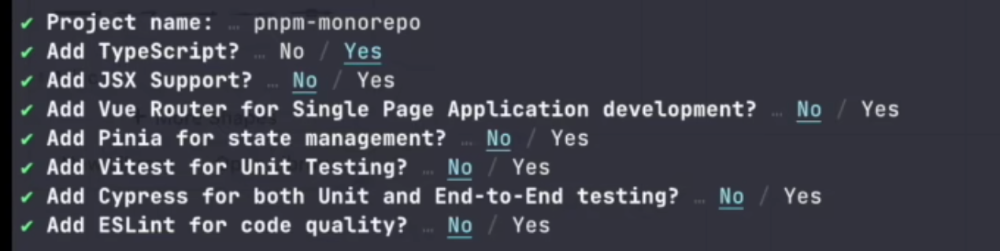
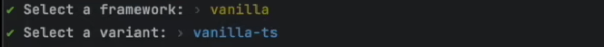
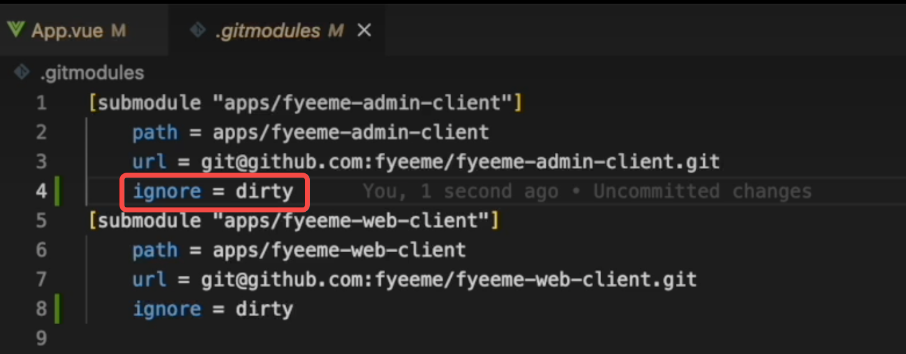
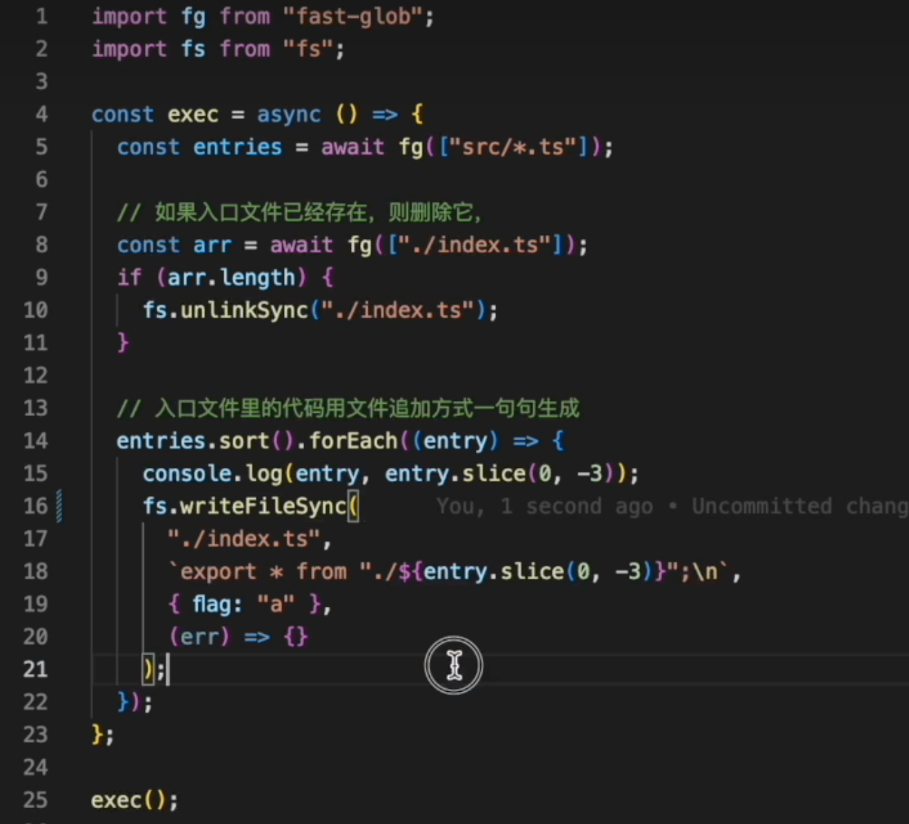

来源：https://www.bilibili.com/video/BV1R14y157Za/?sp

m_id_from=333.337.search-card.all.click&vd_source=55dcc9b2dc5b93d913718cd6ba694fc2

# 基本思路

其实就是包的重复利用方案

##### 写一个demo来描述monorepo怎么使用：

1、在跟目录：npm init，再创建pnpm-workspace.yaml文件，用途：里面会说明公共依赖有哪些，分别干啥的（有了该文件才能启动workspace的功能）

```yaml
// pnpm-workspace.yaml 下面的路径就是公共的
- "packages/*"
- "components/**"
- "api/**"
```

  比如我们做了api这个包（有package.json)，安装了axios，封装了userApi.ts，baseApi.ts等然后需要在index.ts集中导出，因为package.json的main字段定义了项目入口。

2、新建packages：里面存放各个项目

3、在跟目录可以创建/api或者/components等等公共文件夹目录，这些工具可以是简单的utils，然后集中到index.js中导出，也可以是通过脚手架创建，然后通过index.js导出（如果有自身的依赖一定要安装）。（这里最容易出问题的是components，比如我们编写了 一个vue组件，然后通过index.ts（写在根目录最好)导出，然后直接在packages中pnpm add后使用，开发环境没问题，因为我们提供了vue的运行环境，但是build的时候，如果这个compoents/*依赖的vue没有安装，会导致packages的build报错，因为他要去找packages下的vue组件，vue组件依赖vue但是找不到就报错，所以最好要把各个子应用的依赖都自行安装上)

4、比如有一个/utils，里面有一个子公共工具A，通过index.js导出后，在package.json中name："@utils/a"，private：true，代表是私有包，main："index.js/ts"，代表入口

5、来到packages任意一个项目中，执行pnpm add @utils/a，就可以将包装上，然后使用：import { normalizeXX } from '@utils/a'

6、开发完毕，正常执行npm run build就行。

什么时候使用npm 什么时候使用pnpm？

pnpm安装依赖用到软链，所以用了pnpm管理包，其他的命令也最好用pnpm，不要使用npm，不然会报错，或者找不到包


# 实战demo项目

来源：https://www.bilibili.com/video/BV1vf4y1Z753/?spm_id_from=333.999.0.0&vd_source=55dcc9b2dc5b93d913718cd6ba694fc2

## 第一步：

npm init vue@3

这个是初始化一个项目的根出来，拿来管理项目，所以他里面常规的包都不需要

## 第二步：

在根目录创建pnpm-workspace.yaml，只要公共的文件夹都可以写进来，xxx/*

## 第三步：

在项目中创建子公共依赖，比如api，这里用vite创建:

根目录执行：pnpm create vite:



比如新建的是api/*,创建过程中会让你输入project name，然后就会在项目根目录创建该api文件夹，创建好后，新建统一导出目录index.ts，删除不需要的css等文件。

## 第四步：

再创建packages空文件夹，再到项目中去生成一个一个的子项目

## 第五步：

在这个子项目中执行 pnpm add '@test/api'，把api加入依赖


# 升级

## 问题1：

monorepo如何在packages中依赖现有的工程?

git submodule来管理，具体 使用：https://juejin.cn/post/7210744398639808573

补充：



当我们对子项目进行更改，git会提示我们的子项目进行了更改 （只是提示子项目有更改，但是具体是谁更改不会详细罗列)，我们如果不想有任何提示，可以在gitmodule中添加第四行代码，虽然git不再提示，但是提交的时候还是会一并提交改动内容。

## 问题2:

如何统一给各个仓库安装依赖？

一般来说，我们使用monorepo的目的是为了复用比如compoents、utils等，对于依赖包的管理，一般自己打包自己的就行，但是有时候我们希望依赖的版本能够统一，这样能够避免幻影依赖，打包多个版本依赖的问题，所以一般monorepo又会有根项目来管理这些子项目，公共依赖，工具等，所以我们可以在根目录安装大家都需要的功能依赖，但是有两种场景其实这种根依赖是不好解的：

1、当我们packages里面的子项目是一个单独的仓库，比如他是通过git submodule建立的关系，那么他的依赖肯定是放在自己的项目里面，保证完整性是更重要的。

2、当我们的monorepo越来越大，很多时候是多人开发，别人开发的时候，更多是自己安装自己需要的依赖，很少会把依赖搞到全局，因为他不知道这个依赖别人是否用到。

删除子项目依赖：

```
pnpm rm xx
```

## 问题3：

建立**workspace**后，改动依赖的内容，可以直接生效吗

可以


## 问题4：

packages中的某个项目a依赖了某个公共文件夹，比如api，api导出了很多fn，那么项目a应该引用api的build的dist文件，还是通过index.ts导出的函数?

这里放在一个仓库中管理，就是为了方便依赖的引用，所以常规上来说，直接引用非build的源文件就可以，并且测试结果是可以被tree-shaking掉的


## 问题5：

当我们的每一个公共依赖都有很多文件需要通过index集中导出，有可能会漏掉某个文件，那么怎么解决这种繁琐+容易遗漏的问题呢?可以用如下脚本：



当我们每个公共依赖都放一个这样的脚本还是比较麻烦的，因为每个目录都要手动执行一遍，那么有没有自动的办法呢?

每一个依赖的package.json中都加上这个script： "build": "node 脚本.js" （注意：这里脚本是js文件，ts文件node不支持)，然后再在根目录执行：

```
pnpm --filter "./packages/**" build
```

或者:

```
pnpm --filter --parallel "./packages/**" build
```


```

```
