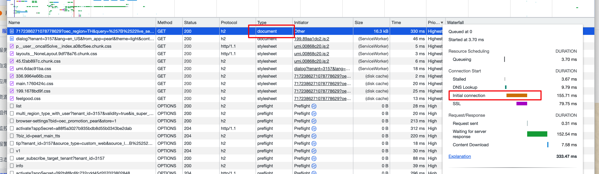
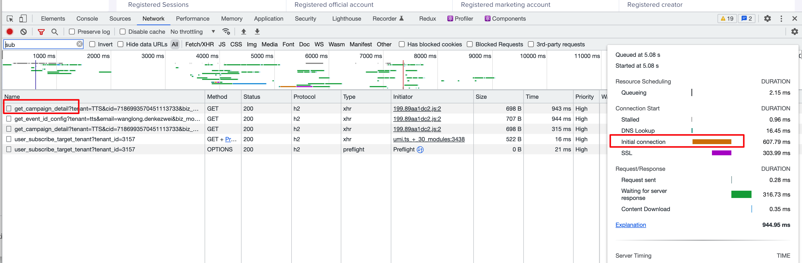
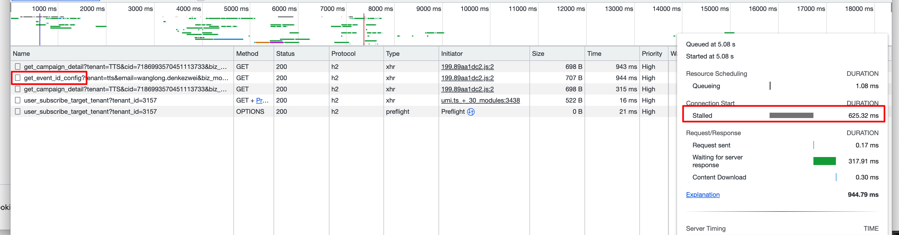

1、当我们在A域下发起A域的请求，第一个请求（不管什么资源），其实都存在首次链接的时间损耗，比如：同域下的html：

2、如果是A域下的B域接口发起请求，同样有链接耗时：

注意：这个时候如果比如在useEffect中同时在B域发起两个请求，两个请求的请求耗时如下：

第一个：

第二个：

可以看出第一个请求耗时在connect，第二个请求是被stalled，为啥第二个是stalled呢？

因为两个请求同域，第一个请求是在请求建立链接，建立链接这段时间，第二个请求也只能处于等待的状态了。所以第一个建立链接用了600ms，第二个就等了600ms。

当然，关于stalled，还有另外一个场景，比如一个ajax对同一个接口高频发起请求，会发现stalled时间会越来越长，原因：https://blog.csdn.net/fuhanghang/article/details/127704191
