# 基本概念：

### 前中后序遍历：

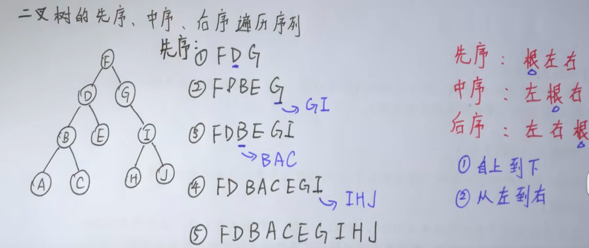

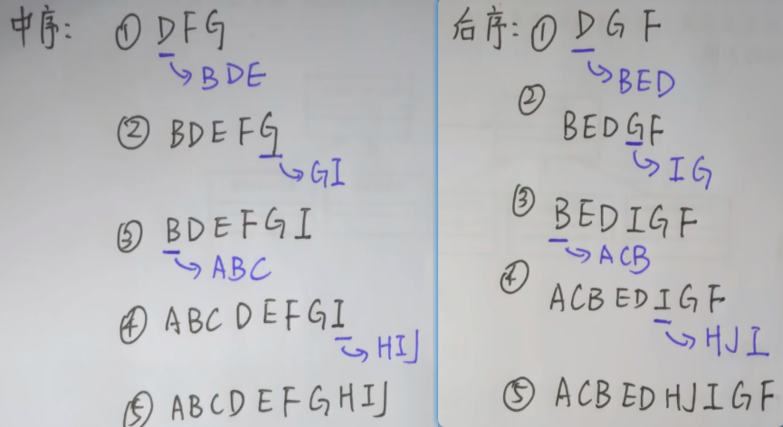

其实不管是哪种其实都是深度优先，并且要注意：先序是从上到下，后序是从下往上

来源：https://www.bilibili.com/video/BV1ay4y1q7UW/?p=13&spm_id_from=pageDriver&vd_source=55dcc9b2dc5b93d913718cd6ba694fc2

#### 前序：

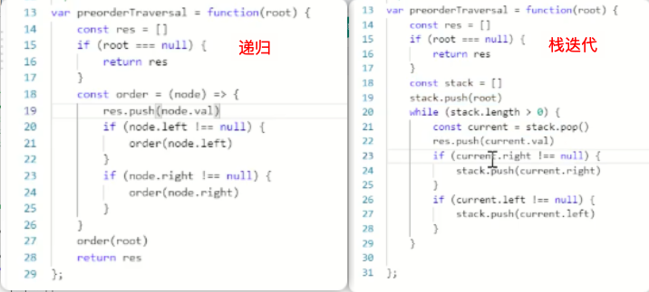d

迭代：递归是根左右，栈因为有压栈操作，所以在while中是根右左

arr

Push 后面加，返回长度

Pop 后面删，返回删除项

Shift 前面删，返回删除项

Unshift 前面加，返回长度

【以上都是改变原数组】

#### 中序：

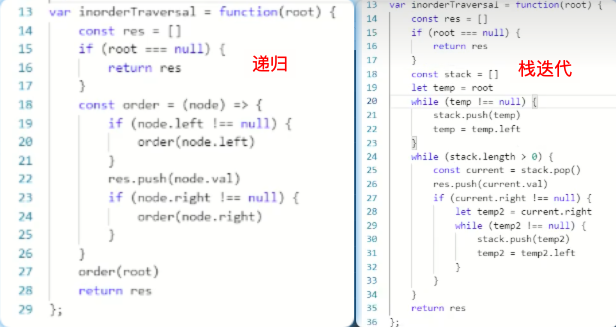

迭代：中序是左根右，栈迭代遵循的还是左根右，只是进栈出栈思路要理清

#### 后序：

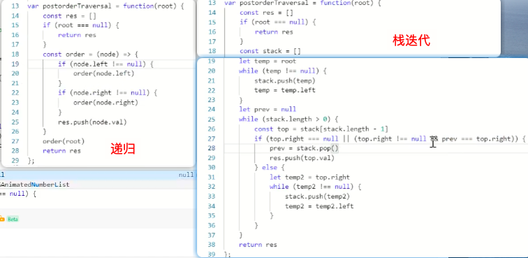

前中后遍历都是深度优先，而层序遍历就是广度优先，我们来看层级遍历，这个就不是深度优先了，层序又能搞出至上而下，至下而上

# 二叉树层序遍历：

给你二叉树的根节点 `root` ，返回其节点值的 **层序遍历** 。 （即逐层地，从左到右访问所有节点）。

**示例 1：**


<pre><strong>输入：</strong>root = [3,9,20,null,null,15,7]
<strong>输出：</strong>[[3],[9,20],[15,7]]
</pre>

**示例 2：**

<pre><strong>输入：</strong>root = [1]
<strong>输出：</strong>[[1]]
</pre>

**示例 3：**

<pre><strong>输入：</strong>root = []
<strong>输出：</strong>[]</pre>

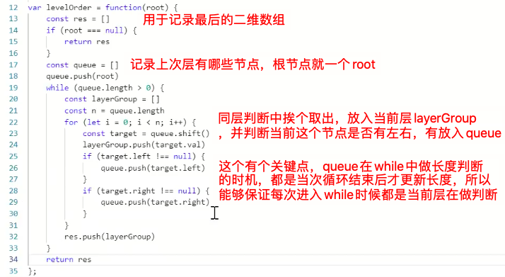

这里总结下思路，这里的层序遍历要转化成队列的思路，res是放最终的二维数组，queue就是充当队列，每一层的数被push进入队列，然后挨个的取出，每次的while都是取的当前行的数，queue在每次循环中都会push新的下一层元素到队尾，但是只有本次queue取完，也就是当前while结束，queue才更新，也就是进入下一层判断，发现queue又长度大于0，所以while又自动进入下一层判断。

# 二叉树层序遍历2：

给你二叉树的根节点 `root` ，返回其节点值 **自底向上的层序遍历** 。 （即按从叶子节点所在层到根节点所在的层，逐层从左向右遍历）

**示例 1：**


<pre><strong>输入：</strong>root = [3,9,20,null,null,15,7]
<strong>输出：</strong>[[15,7],[9,20],[3]]
</pre>

**示例 2：**

<pre><strong>输入：</strong>root = [1]
<strong>输出：</strong>[[1]]
</pre>

**示例 3：**

<pre><strong>输入：</strong>root = []
<strong>输出：</strong>[]</pre>

思路：可以按照至上而下的方式算出来后在反转一下数组，或者在如上push的时候，变成unshift操作

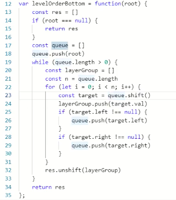

# 二叉树的最小/最大深度

其实就是层序遍历，最小条件：该节点没有左右叶子遍历就结束了，最大条件：只要有左或右任一节点存在就继续遍历，直到左右都没有遍历结束，遍历的深度就是一个变量，每层循环的时候+1就行。

# 二叉树右视图：

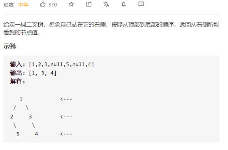

其实就是层序遍历的变体，只需要拿到层序遍历结果，然后取每项数组最后一个即可。

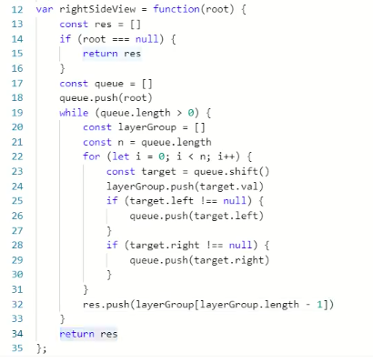

# 二叉树的锯齿形层序遍历

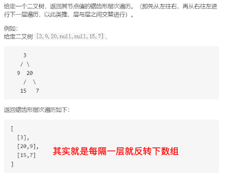

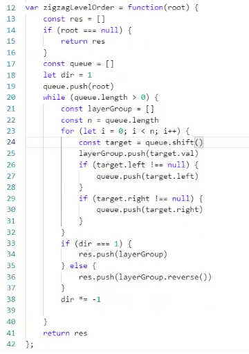

# 基本概念：

## 满二叉树：

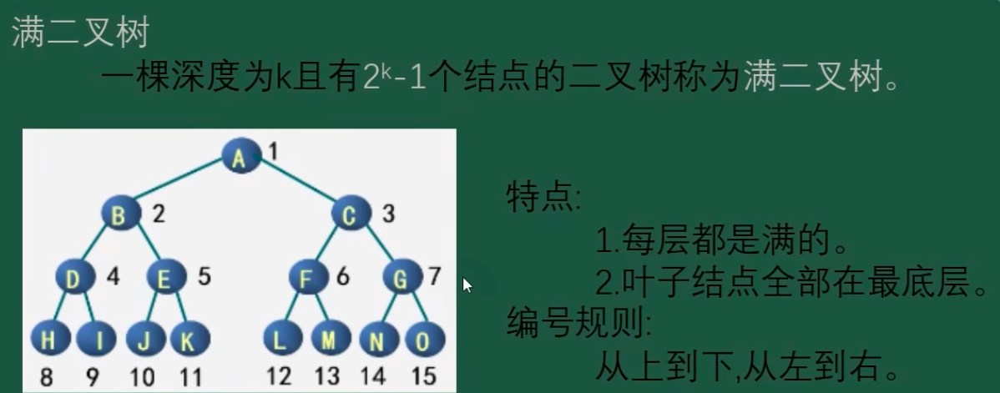

## 完全二叉树：

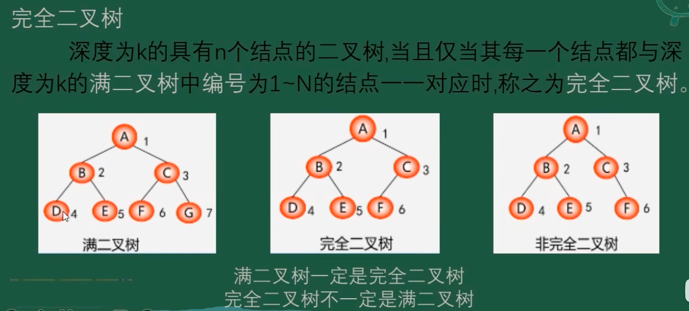

其实完全二叉树应该满足这几个点（自己理解）：

1、只有最后一层叶子节点有缺失

2、满足至上而下，从左到右的遍历，序号和节点对应上（如图中右两张截图6号节点），通俗点看就是最后一层要从左到右排满，最后一个有缺失才是完全二叉树。

## 完全二叉树的节点个数

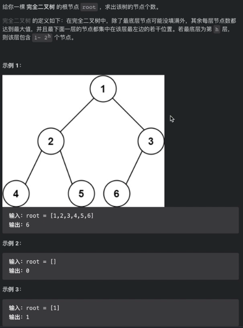

概念解释：

满二叉树：就是所有的节点都有左右子节点，满二叉树节点个数2^n - 1 (n是层级)

完全二叉树：除了最后一层，上面每一层都是满的，最后一层左或者右或多或少没有子节点

思路1：完全忽视题目给到的完全二叉树信息，直接对这个数进行遍历，获得个数

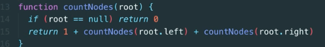

思路2：

先去判断是否是满二叉树，如果是满的，那么直接2^n - 1 返回节点总个数，如果不是满的，就按照常规的递归遍历就行：

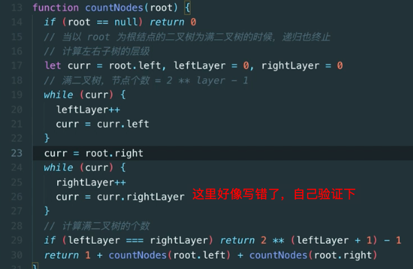

## 平衡二叉树：

核心点：其实就是任意一个节点的左右子树高度差不能超过1

概念解释：https://www.bilibili.com/video/BV1pY4y1f7KZ/?buvid=Y04B0A0A9FFCBFA840648C634EBB4952170D&from_spmid=search.search-result.0.0&is_story_h5=false&mid=AbNEDvm5HS8ZBWpLjhyaOw%3D%3D&p=1&plat_id=114&share_from=ugc&share_medium=iphone&share_plat=ios&share_session_id=67612D84-8934-4176-9AE9-8433AF9E07F6&share_source=COPY&share_tag=s_i&spmid=united.player-video-detail.0.0&timestamp=1712544449&unique_k=h8rlk8g&up_id=512614975

## 排序二叉树：（也叫二叉搜索树）

讲解：https://www.bilibili.com/video/BV1vp4y1d7Zg/?spm_id_from=333.337.search-card.all.click&vd_source=55dcc9b2dc5b93d913718cd6ba694fc2

核心点：

1、排序二叉树可以为空

2、只有有根左右节点，值大小就满足 左 < 根  < 右

3、对一颗树进行中序遍历就能得到一颗排序二叉树（就是说这个树里面的数据是满足排序二叉树的）

所以针对这类题目，一般会出的题：

（1）某树是否是排序二叉树？

只需要中旬遍历，拿到数组后，数字的每一项都是递增的，比如[1,2,3,4,5,7,9]，如果是[1,2,2,4]就不是排序二叉树

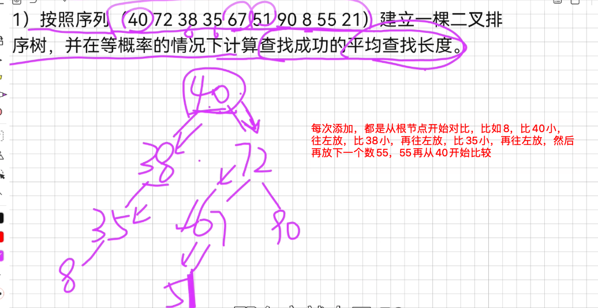

```js
function isValidBST(root) {
    // 中序遍历，判断是否递增
    function travel(node) {
        if (node) {
            travel(node.left)
            arr.push(node.val)
            travel(node.right)
        }
    }
    let arr = []
    travel(root)
    for (let i = 1; i < arr.length; i++) {
        if (arr[i] <= arr[i - 1]) {
            return false
        }
    }
    return true
}

```

# 判断是否是平衡二叉树

```js
function IsBalanced_Solution(pRoot){
	if(pRoot == null) return true // 默认空树也是平衡二叉树
	// 获取一个节点的树高
	function getNodeTreeHigh(node){
		if(node == null) return 0
		let leftHigh = getNodeTreeHigh(node.left)
		let rightHigh = getNodeTreeHigh(node.right)
		return Math.max(leftHigh,rightHigh) + 1
	}
	// 获取每个节点的左子树高度和右子树高度
	let left = getNodeTreeHigh(pRoot.left)
	let right = getNodeTreeHigh(pRoot.right)
	if(Math.abs(left - right) > 1) return false
	return IsBalanced_Solution(pRoot.left) && IsBalanced_Solution(pRoot.right)
}

```

# 判断是不是完全二叉树

```js
function isCompleteTree( root ) {
    let queue = []
    queue.push(root)
    // 标记是否遇到空节点
    let flag =false
    while(queue.length){
        const node = queue.shift()
        // 遇到空节点则标记成true
        if(node === null) {
            flag = true
        } else {
            // 当前节点不是空节点，但flag是true，则说明不是完全二叉树
            if(flag === true) {
                return false
            }
            queue.push(node.left)
            queue.push(node.right)
        }
    }
    return true
}

```

# 判断两颗二叉树是否相同

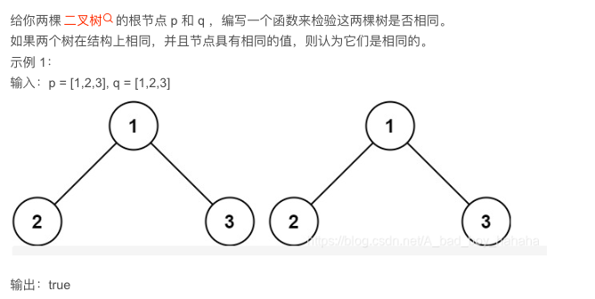

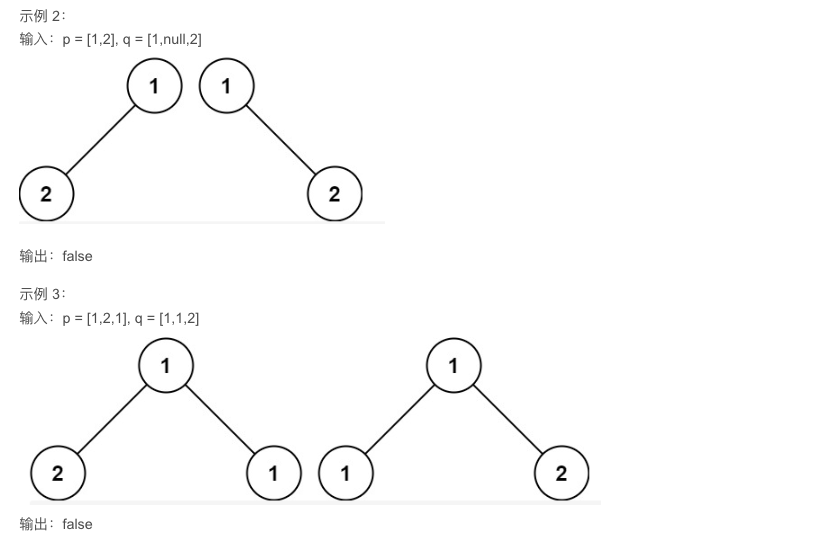

```js
/**
 * Definition for a binary tree node.
 * function TreeNode(val, left, right) {
 *     this.val = (val===undefined ? 0 : val)
 *     this.left = (left===undefined ? null : left)
 *     this.right = (right===undefined ? null : right)
 * }
 */
/**
 * @param {TreeNode} p
 * @param {TreeNode} q
 * @return {boolean}
 */


var isSameTree = function(p, q) {
	//p,q都为空返回true
    if(p == null && q == null) return true 
    //p,q有一个为空返回false
    if(p == null || q == null) return false
    //p,q都不为空，进行判断，一旦有值不相等就返回false，否则进行递归
    if(p.val !== q.val) return false
    return isSameTree(p.left,q.left)&&isSameTree(p.right,q.right)
};


```

# 二叉树的镜像

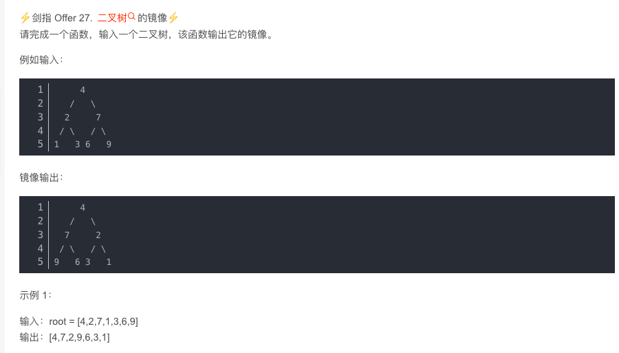

```js
/**
 * Definition for a binary tree node.
 * function TreeNode(val) {
 *     this.val = val;
 *     this.left = this.right = null;
 * }
 */
/**
 * @param {TreeNode} root
 * @return {TreeNode}
 */
var mirrorTree = function(root) {
    if(!root) return null;
    turn(root);
    return root;
};
function turn(node) {
    if(!node) return;
    let q = node.left;
    node.left = node.right;
    node.right = q;
    if(node.left)
        turn(node.left);
    if(node.right)
        turn(node.right);
}

```

# 对称二叉树：

```js
function isSimiliar(root){
	if(root == null) return true;
	return check(root.left,root.right)
}

function check(leftTree,rightTree){
	//两棵子树同时为空，则对称
	if(!leftTree && !rightTree) return true
	//两棵子树只有一个为空，则不对称
	//从上面的判断我们已经知道了两个子树不可能同时为空
	if(!leftTree || rightTree) return false
	//当两棵树根节点值相等时，进一步判断左子树的左节点是否与右子树的右节点相等，左子树的右节点是否与右子树的左节点相等，如此递归下去
	return (leftTree.val === rightTree.val && check(leftTree.left,rightTree.right) && check(leftTree.right,rightTree.left)
}

```

# 合并二叉树:

```js
function mergeTrees( t1 ,  t2 ) {
    if(t1 === null) return t2
    if(t2 === null) return t1
    t1.val = t1.val + t2.val
    t1.left = mergeTrees(t1.left, t2.left)
    t1.right = mergeTrees(t1.right, t2.right)
    return t1
}

```

# 有序数组转平衡二叉树：

解法：https://www.bilibili.com/video/BV1uR4y1X7qL/?spm_id_from=333.788&vd_source=55dcc9b2dc5b93d913718cd6ba694fc2

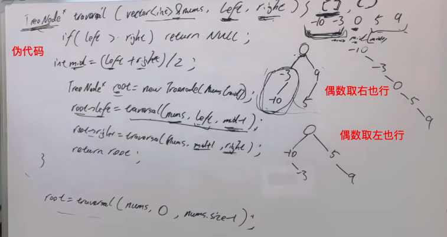

重点就是从中间开始取，偶数数组取左一位还是右一位其实都一样的

# 左叶子之和：

https://programmercarl.com/0404.%E5%B7%A6%E5%8F%B6%E5%AD%90%E4%B9%8B%E5%92%8C.html#%E5%85%B6%E4%BB%96%E8%AF%AD%E8%A8%80%E7%89%88%E6%9C%AC

思路：https://www.bilibili.com/video/BV1GY4y1K7z8/?spm_id_from=333.788&vd_source=55dcc9b2dc5b93d913718cd6ba694fc2

```js
var sumOfLeftLeaves = function(root) {
    //采用后序遍历 递归遍历
    // 1. 确定递归函数参数
    const nodesSum = function(node) {
        // 2. 确定终止条件
        if(node === null) {
            return 0;
        }
        let leftValue = nodesSum(node.left);
        let rightValue = nodesSum(node.right);
        // 3. 单层递归逻辑
        let midValue = 0;
        if(node.left && node.left.left === null && node.left.right === null) {
            midValue = node.left.val;
        }
        let sum = midValue + leftValue + rightValue;
        return sum;
    }
    return nodesSum(root);
};
```

# 构建二叉树

帮助理解：https://www.bilibili.com/video/BV1AS4y197Yc/?spm_id_from=333.337.search-card.all.click&vd_source=55dcc9b2dc5b93d913718cd6ba694fc2

### 从前序与中序遍历序列构造二叉树

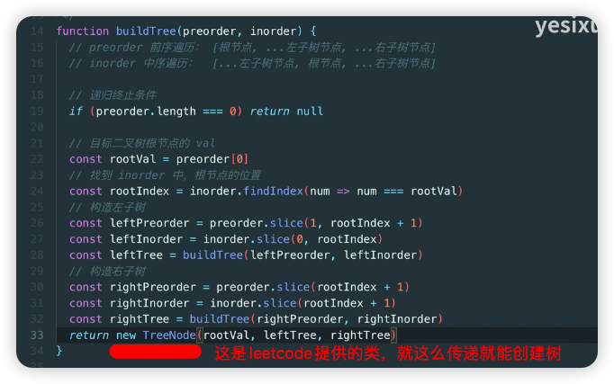

### 从中序与后序遍历序列构造二叉树

其实看懂上面，这个是一样的道理


# 二叉树中和为某一值的路径

https://blog.csdn.net/weixin_46942836/article/details/122522777

### 题目1：给定一个二叉树root和一个值 sum ，判断是否有从根节点到叶子节点的节点值之和等于 sum 的路径。（难度：简单）

```js
function hasPathSum(root, sum) {
    // write code here
    // 空树
    if (root === null) return false
    function dfs(node, sum) {
        if (node === null) return false
        // 已经遍历到叶子节点
        if (node.left === null && node.right === null && node.val === sum) {
            return true
        }
        return dfs(node.left, sum - node.val) || dfs(node.right, sum - node.val)
    }
    return dfs(root, sum)
}

```

### 题目2：输入一颗二叉树的根节点root和一个整数expectNumber，找出二叉树中结点值的和为expectNumber的所有路径。（难度：中等）

```js
/* function TreeNode(x) {
    this.val = x;
    this.left = null;
    this.right = null;
} */
function FindPath(root, expectNumber)
{
    // write code here
    let res = [];
    let path = [];
    // 先序遍历，回溯算法
    function recur(root,sum) {
        if(root == null) {
            return;
        }
        // path记录当前路径各结点的val
        path.push(root.val);
        sum -= root.val;
        // 如果符合要求，将当前path加入res数组
        if (sum == 0 && root.left == null && root.right == null) {
            res.push(path.slice(0));
            // 因为path数组是一个对象，需要深拷贝
        }
        recur(root.left, sum);
        recur(root.right, sum);
        path.pop();
    }
    recur(root, expectNumber);
    return res;
}
module.exports = {
    FindPath : FindPath
};

```

### 题目3：给定一个二叉树root和一个整数值 sum ，求该树有多少路径的的节点值之和等于 sum 。（难度：中等）

```js
// function TreeNode(x) {
//     this.val = x;
//    this.left = null;
//  this.right = null;
//  }

/**
 * 代码中的类名、方法名、参数名已经指定，请勿修改，直接返回方法规定的值即可
 *
 * 
 * @param root TreeNode类 
 * @param sum int整型 
 * @return int整型
 */
function FindPath( root ,  sum ) {
    // write code here
    let count = 0
    function dfs(root,sum){
        if(root === null){
            return 
        }
        sum -= root.val
        if(sum === 0){
            count++
        }
        dfs(root.left,sum)
        dfs(root.right,sum)
    }
    function find(root,sum){
        if(root === null){
            return 0
        }
        dfs(root,sum)
        find(root.left,sum)
        find(root.right,sum)
    }
    find(root,sum)
    return count
}
module.exports = {
    FindPath : FindPath
};

```

# 二叉搜索树（BST）

## 二叉搜索树的最近公共祖先

```js
var ancestor = function(root, p, q){
    while (root) {
        if(root.val > p.val && root.val > q.val){
            root = root.left
        }else if(root.val < q.val && root.val < p.val){
            root = root.right
        }else{
            return root
        }
    }
    return null
}

```

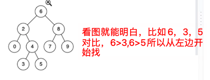

普通二叉树的公共祖先，遇到就算了吧，搞不定，下面解法仅做扩展

```js
function TreeNode(val) {
   this.val = val;
   this.left = this.right = null;
}

var lowestCommonAncestor1 = function(root, p, q){
    function travelTree(node, p, q){
        if(node === null || node === p || node === q){
            return node
        }
        let left = travelTree(node.left, p, q)
        let right = travelTree(node.right, p, q)
        if(left !== null && right !== null){
            return node
        }
        if(left === null){
            return right
        }
        return left
    }
    return travelTree(root, p, q)
}

```

## 二叉搜索树中第 K 小的元素

上面的章节讲到了如何判断一个二叉树是否是二叉搜索树，在拿到arr后，第k个不就是arr的第k项嘛

## 二叉搜索树转双向链表（？）

https://www.bilibili.com/video/BV1A7411F7Zj/?spm_id_from=333.337.search-card.all.click&vd_source=55dcc9b2dc5b93d913718cd6ba694fc2

## 把二叉搜索树转换为累加树

就是中序遍历的反向方式：

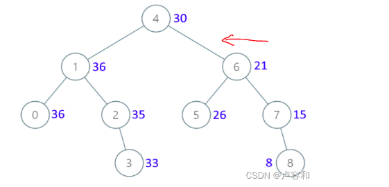

```js
var convertBST = function(root) {
    let sum = 0
    function build(root) {
        if(root == null) return
        build(root.right)
        sum += root.val
        root.val = sum
        build(root.left)
    }
    build(root)
    return root
};

```

## 二叉搜索树中的搜索 （简单）

给定二叉搜索树（[BST](https://so.csdn.net/so/search?q=BST&spm=1001.2101.3001.7020)）的根节点 root 和一个整数值 val。
你需要在 BST 中找到节点值等于 val 的节点。 返回以该节点为根的子树。 如果节点不存在，则返回 null 。

```js
var searchBST = function(root, val) {
    if(root == null) return null
    if(root.val == val) return root
    if(root.val < val){
        return searchBST(root.right, val)
    } else {
        return searchBST(root.left, val)
    }
};

```

## 二叉搜索树中的插入操作

关于插入和删除，可以看看这个思路（无关代码实现，只有思路）：https://www.bilibili.com/video/BV1fr4y1j7su/?spm_id_from=333.337.search-card.all.click&vd_source=55dcc9b2dc5b93d913718cd6ba694fc2

插入和删除demo来源：https://blog.csdn.net/qq_41329791/article/details/123133894?spm=1001.2014.3001.5502

插入思路：https://www.bilibili.com/video/BV1Et4y1c78Y/?vd_source=55dcc9b2dc5b93d913718cd6ba694fc2

```js
var insertIntoBST = function(root, val) {
    if(root == null) return new TreeNode(val)
    if(root.val < val){
        root.right = insertIntoBST(root.right, val)
    } else {
        root.left = insertIntoBST(root.left, val)
    }
    return root // 最后要求返回根节点
};

```

## 删除二叉搜索树中的节点：（？）

```js
function del(root) {
    if(root.left==null && root.right==null) return null
    if(root.left==null || root.right==null) return root.left? root.left : root.right
    let min = root.right
    while(min.left) min = min.left;
    // 先删除右子树最小的节点
    root.right = deleteNode(root.right, min.val)
    // 用右子树最小的节点替换 root 节点
    min.left = root.left
    min.right = root.right
    return min
}
var deleteNode = function(root, key) {
    if(root == null) return null
    if(root.val == key){
        root = del(root)
    } else if(root.val < key){
        root.right = deleteNode(root.right, key)
    } else{
        root.left = deleteNode(root.left, key)
    }
    return root
};

```

二叉树还可以补充如下一些面试题：

https://blog.csdn.net/qq_41329791/article/details/123141237?spm=1001.2014.3001.5502

二叉树的序列化与[反序列化](https://so.csdn.net/so/search?q=%E5%8F%8D%E5%BA%8F%E5%88%97%E5%8C%96&spm=1001.2101.3001.7020)

寻找重复的子树 （中等）（fail）

二叉树中和为某一值的路径

序列化二叉树

=

==

=
