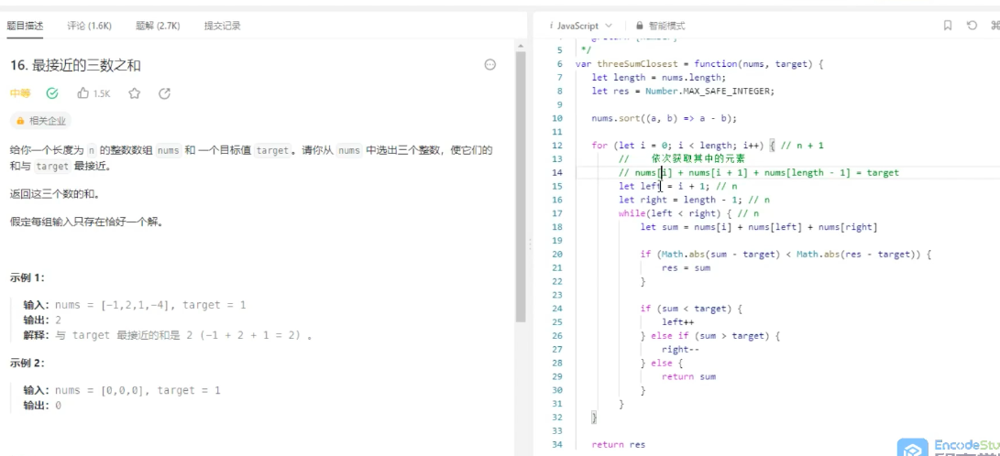
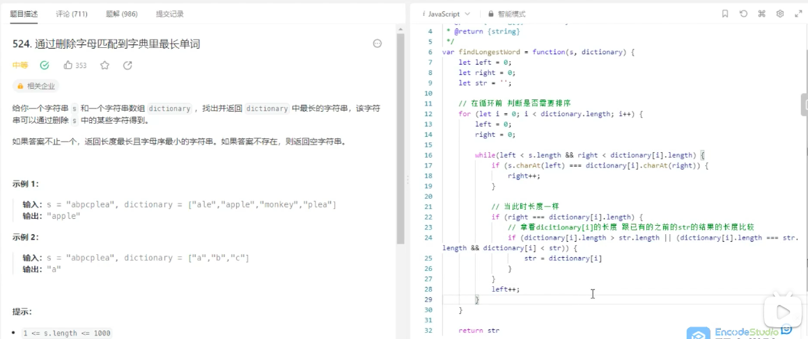
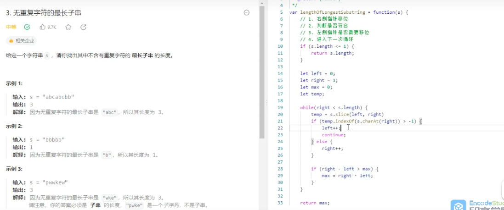
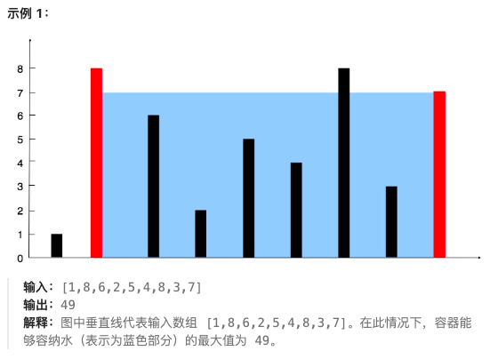
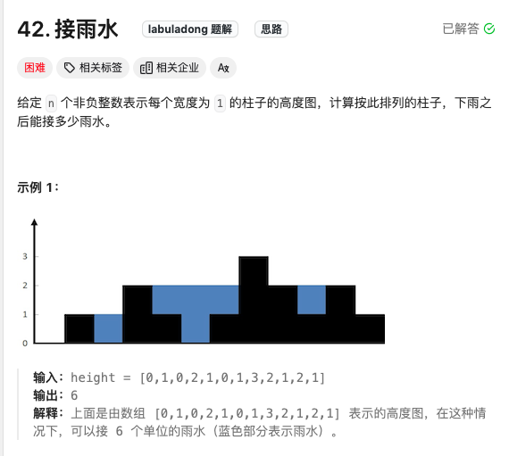

# 双指针种类

其实就两种

-> -> 快慢指针，比如链表中是否有环

<- ->  背向或者对向



上面这里的复杂度就是n^2



滑动窗口：



# 案例

## 盛最多的雨水



给定一个长度为 `n` 的整数数组 `height` 。有 `n` 条垂线，第 `i` 条线的两个端点是 `(i, 0)` 和 `(i, height[i])` 。

找出其中的两条线，使得它们与 `x` 轴共同构成的容器可以容纳最多的水。

返回容器可以储存的最大水量。

 **说明：** 你不能倾斜容器。

```js
var maxArea = function(height) {
    let left = 0
    let right = height.length -1
    let max = 0
    while(left < right){
        if(height[left] <= height[right]){
            max = Math.max(height[left] * (right - left) , max ) 
            left ++ 
  
        }else {
            max = Math.max(height[right] * (right - left) , max ) 
            right -- 
        }
    }
   return max
};
```

## 接雨水：



暴力解法：

```js
var trap = function(height) {
    var n = height.length;
    var res = 0;
    for (var i = 1; i < n - 1; i++) {
        var l_max = 0, r_max = 0;
        // 找右边最高的柱子
        for (var j = i; j < n; j++)
            r_max = Math.max(r_max, height[j]);
        // 找左边最高的柱子
        for (var j = i; j >= 0; j--)
            l_max = Math.max(l_max, height[j]);
        // 如果自己就是最高的话，
        // l_max == r_max == height[i]
        res += Math.min(l_max, r_max) - height[i];
    }
    return res;
};
```

上面这种会你n^2，可以提前把每个位置左右的最高找到，然后再循环找到每个位置的雨水位：

```js
// 注意：javascript 代码由 chatGPT🤖 根据我的 java 代码翻译，旨在帮助不同背景的读者理解算法逻辑。
// 本代码不保证正确性，仅供参考。如有疑惑，可以参照我写的 java 代码对比查看。

var trap = function(height) {
    if (height.length === 0) {
        return 0;
    }
    var n = height.length;
    var res = 0;
    // 数组充当备忘录
    var l_max = new Array(n).fill(0);
    var r_max = new Array(n).fill(0);
    // 初始化 base case
    l_max[0] = height[0];
    r_max[n - 1] = height[n - 1];
    // 从左向右计算 l_max
    for (var i = 1; i < n; i++) {
        l_max[i] = Math.max(height[i], l_max[i - 1]);
    }
    // 从右向左计算 r_max
    for (var i = n - 2; i >= 0; i--) {
        r_max[i] = Math.max(height[i], r_max[i + 1]);
    }
    // 计算答案
    for (var i = 1; i < n - 1; i++) {
        res += Math.min(l_max[i], r_max[i]) - height[i];
    }
    return res;
};

```

## 最接近的三数之和

给你一个长度为 `n` 的整数数组 `nums` 和 一个目标值 `target`。请你从 `nums` 中选出三个整数，使它们的和与 `target` 最接近。

返回这三个数的和。

假定每组输入只存在恰好一个解。

**示例 1：**

<pre><strong>输入：</strong>nums = [-1,2,1,-4], target = 1
<strong>输出：</strong>2
<strong>解释：</strong>与 target 最接近的和是 2 (-1 + 2 + 1 = 2) 。
</pre>

**示例 2：**

<pre><strong>输入：</strong>nums = [0,0,0], target = 1
<strong>输出：</strong>0</pre>

```js
// 注意：javascript 代码由 chatGPT🤖 根据我的 java 代码翻译，旨在帮助不同背景的读者理解算法逻辑。
// 本代码已经通过力扣的测试用例，应该可直接成功提交。

var threeSumClosest = function(nums, target) {
    if (nums.length < 3) {
        return 0;
    }
    // 别忘了要先排序数组
    nums.sort(function(a, b) {
        return a - b;
    });
    // 记录三数之和与目标值的偏差
    var delta = Number.MAX_SAFE_INTEGER;
    for (var i = 0; i < nums.length - 2; i++) {
        // 固定 nums[i] 为三数之和中的第一个数，
        // 然后对 nums[i+1..] 搜索接近 target - nums[i] 的两数之和
        var sum = nums[i] + twoSumClosest(nums, i + 1, target - nums[i]);
        if (Math.abs(delta) > Math.abs(target - sum)) {
            delta = target - sum;
        }
    }
    return target - delta;
};

// 在 nums[start..] 搜索最接近 target 的两数之和
var twoSumClosest = function(nums, start, target) {
    var lo = start, hi = nums.length - 1;
    // 记录两数之和与目标值的偏差
    var delta = Number.MAX_SAFE_INTEGER;
    while (lo < hi) {
        var sum = nums[lo] + nums[hi];
        if (Math.abs(delta) > Math.abs(target - sum)) {
            delta = target - sum;
        }
        if (sum < target) {
            lo++;
        } else {
            hi--;
        }
    }
    return target - delta;
};
```

## **删除有序数组中的重复项**：

给你一个 **升序排列** 的数组 `nums` ，请你**[ 原地](http://baike.baidu.com/item/%E5%8E%9F%E5%9C%B0%E7%AE%97%E6%B3%95)** 删除重复出现的元素，使每个元素 **只出现一次** ，返回删除后数组的新长度。元素的 **相对顺序** 应该保持 **一致** 。然后返回 `nums` 中唯一元素的个数。

示例 1：

<pre><strong>输入：</strong>nums = [1,1,2]
<strong>输出：</strong>2, nums = [1,2,]</pre>

**示例 2：**

<pre><strong>输入：</strong>nums = [0,0,1,1,1,2,2,3,3,4]
<strong>输出：</strong>5, nums = [0,1,2,3,4]</pre>

```js
// 注意：javascript 代码由 chatGPT🤖 根据我的 java 代码翻译，旨在帮助不同背景的读者理解算法逻辑。
// 本代码不保证正确性，仅供参考。如有疑惑，可以参照我写的 java 代码对比查看。

var removeDuplicates = function(nums) {
    if (nums.length == 0) {
        return 0;
    }
    var slow = 0, fast = 0;
    while (fast < nums.length) {
        if (nums[fast] != nums[slow]) {
            slow++;
            // 维护 nums[0..slow] 无重复
            nums[slow] = nums[fast];
        }
        fast++;
    }
    // 数组长度为索引 + 1
    return slow + 1;
};

```


## **删除有序链表中的重复项**：

```js
// 注意：javascript 代码由 chatGPT🤖 根据我的 java 代码翻译，旨在帮助不同背景的读者理解算法逻辑。
// 本代码不保证正确性，仅供参考。如有疑惑，可以参照我写的 java 代码对比查看。

var deleteDuplicates = function(head) {
    if (head === null) return null;
    let slow = head, fast = head;
    while (fast !== null) {
        if (fast.val !== slow.val) {
            // nums[slow] = nums[fast];
            slow.next = fast;
            // slow++;
            slow = slow.next;
        }
        // fast++
        fast = fast.next;
    }
    // 断开与后面重复元素的连接
    slow.next = null;
    return head;
};

```

## 移除元素:

给你一个数组 `nums` 和一个值 `val`，你需要 **[原地](https://baike.baidu.com/item/%E5%8E%9F%E5%9C%B0%E7%AE%97%E6%B3%95)** 移除所有数值等于 `val` 的元素，并返回移除后数组的新长度。

不要使用额外的数组空间，你必须仅使用 `O(1)` 额外空间并  **[原地 ](https://baike.baidu.com/item/%E5%8E%9F%E5%9C%B0%E7%AE%97%E6%B3%95)修改输入数组** 。

元素的顺序可以改变。你不需要考虑数组中超出新长度后面的元素。

```js
// 注意：javascript 代码由 chatGPT🤖 根据我的 java 代码翻译，旨在帮助不同背景的读者理解算法逻辑。
// 本代码不保证正确性，仅供参考。如有疑惑，可以参照我写的 java 代码对比查看。

var removeElement = function(nums, val) {
    var fast = 0, slow = 0;
    while (fast < nums.length) {
        if (nums[fast] != val) {
            nums[slow] = nums[fast];
            slow++;
        }
        fast++;
    }
    return slow;
}

```

## 零移动：

给你输入一个数组 `nums`，请你 **原地修改** ，将数组中的所有值为 0 的元素移到数组末尾

比如说给你输入 `nums = [0,1,4,0,2]`，你的算法没有返回值，但是会把 `nums` 数组原地修改成 `[1,4,2,0,0]`。

题目让我们将所有 0 移到最后，其实就相当于移除 `nums` 中的所有 0，然后再把后面的元素都赋值为 0 即可。

```js
// 注意：javascript 代码由 chatGPT🤖 根据我的 java 代码翻译，旨在帮助不同背景的读者理解算法逻辑。
// 本代码不保证正确性，仅供参考。如有疑惑，可以参照我写的 java 代码对比查看。

// 去除 nums 中的所有 0，返回不含 0 的数组长度
var removeElement = function(nums, val) {
    var i = 0;
    for (var j = 0; j < nums.length; j++) {
        if (nums[j] !== val) {
            nums[i] = nums[j];
            i++;
        }
    }
    return i;
};

var moveZeroes = function(nums) {
    // 去除 nums 中的所有 0，返回不含 0 的数组长度
    var p = removeElement(nums, 0);
    // 将 nums[p..] 的元素赋值为 0
    for (; p < nums.length; p++) {
        nums[p] = 0;
    }
};

```

## 回文数

判断一个整数是否是回文数。回文数是指正序（从左向右）和倒序（从右向左）读都是一样的整数。

示例 1:

输入: 121
输出: true
示例 2:

输入: -121
输出: false
解释: 从左向右读, 为 -121 。 从右向左读, 为 121- 。因此它不是一个回文数。
示例 3:

输入: 10
输出: false
解释: 从右向左读, 为 01 。因此它不是一个回文数。

暴力方法：

```js
/**
 * @param {number} x
 * @return {boolean}
 */
var isPalindrome = function(x) {
    return x.toString() == x.toString().split("").reverse().join("");
}

```

进阶:你能不将整数转为字符串来解决这个问题吗？

```js
/**
 * @param {number} x
 * @return {boolean}
 */
var isPalindrome = function(x) {
    if(x < 0) return false; // x 小于零时一定不是回文数
    else if(x < 10) return true; // x 小于 10 一定是回文数
    let str = x.toString(); // 转换字符串
    // 定义左右指针
    let left = 0; 
    let right = str.length - 1;
    while(left <= right) {
        if(str[left] !== str[right]) return false; // 不对称
        left++;
        right--;
    }
    return true;
};
```


# 快慢指针：

# 左右指针：

## 两数之和

```js
const twoSum = (arr, target) => {
    const res = []
    if (arr.length < 2) {
        return res
    }
    if (arr.length === 2){
        return arr[0] + arr[1] === target ? arr : res
    }
    arr.sort((a, b) => a - b)
    let left = 0;
    let right = arr.length - 1
    while(left < right) {
        const currentL = arr[left]
        const currentR = arr[right]
        const sum = currentL + currentR
        if (sum > target) {
            while(left < right && nums[right] === currentR) right--;
        } else if (sum < target) {
            while(left < right && nums[left] === currentL) left++;
        } else {
            res.push([arr[left], arr[right]])
            while(left < right && nums[left] === currentL) left++;
            while(left < right && nums[right] === currentR) right--;
        }
    }
    return res
}
nums = [2,7,11,15], target = 9
const res = twoSum(nums, target)
console.log(res)
```

## 三数之和：

其实就是在两数基础上，加一个第三个数的遍历，但是注意第二个数字是在第一个数字的基础上

```js
const twoSum = (nums, start, target) => {
    let lo = start, hi = nums.length - 1;
    let res = [];
    while (lo < hi) {
        const currentL = nums[lo]
        const currentR = nums[hi]
        const sum = currentL + currentR
        if (sum > target) {
            while (lo < hi && nums[hi] === currentR) hi--;
        } else if (sum < target) {
            while (lo < hi && nums[lo] === currentL) lo++;
        } else {
            res.push([nums[lo], nums[hi]])
            while (lo < hi && nums[lo] === currentL) lo++;
            while (lo < hi && nums[hi] === currentR) hi--;
        }
    }
    return res;
}
const threeSum = (nums, target) => {
    nums.sort((a, b) => a - b)
    let L = nums.length;
    for (let i = 0; i < L; i++) {
        const res = twoSum(nums, i + 1, target - nums[i])
        if (res.length > 0) {
            return res.map(item => [...item, nums[i]])
        }
 	while (i < L && nums[i] === nums[i + 1]) i++;
    }
}
console.log(threeSum([-1,0,1,2,-1,-4], 0))
```

## N数之和：

```js
var nSumTarget = function(nums, n, start, target) {
  let sz = nums.length;
  let res = [];
  // 至少是 2Sum，且数组大小不应该小于 n
  if (n < 2 || sz < n) return res;
  // 2Sum 是 base case
  if (n == 2) {
    // 双指针那一套操作
    let lo = start,
      hi = sz - 1;
    while (lo < hi) {
      let sum = nums[lo] + nums[hi];
      let left = nums[lo],
        right = nums[hi];
      if (sum < target) {
        while (lo < hi && nums[lo] == left) lo++;
      } else if (sum > target) {
        while (lo < hi && nums[hi] == right) hi--;
      } else {
        res.push([left, right]);
        while (lo < hi && nums[lo] == left) lo++;
        while (lo < hi && nums[hi] == right) hi--;
      }
    }
  } else {
    // n > 2 时，递归计算 (n-1)Sum 的结果
    for (let i = start; i < sz; i++) {
      let sub = nSumTarget(nums, n - 1, i + 1, target - nums[i]);
      for (let arr of sub) {
        // (n-1)Sum 加上 nums[i] 就是 nSum
        arr.push(nums[i]);
        res.push(arr);
      }
      while (i < sz - 1 && nums[i] == nums[i + 1]) i++;
    }
  }
  return res;
};
```

## 反转字符串：

```js
// 注意：javascript 代码由 chatGPT🤖 根据我的 java 代码翻译，旨在帮助不同背景的读者理解算法逻辑。
// 本代码不保证正确性，仅供参考。如有疑惑，可以参照我写的 java 代码对比查看。

var reverseString = function(s) {
    // 一左一右两个指针相向而行
    let left = 0,
        right = s.length - 1;
    while (left < right) {
        // 交换 s[left] 和 s[right]
        let temp = s[left];
        s[left] = s[right];
        s[right] = temp;
        left++;
        right--;
    }
};

```

题外话：

字符串也可以直接通过序号读取对应位置字符

a[n] 和a.charAt(n) 一样的效果

```js
const a = 'abcd';
const d = a[2] // c
console.log(d)
```

## 回文字符串判断：

```js
// 注意：javascript 代码由 chatGPT🤖 根据我的 java 代码翻译，旨在帮助不同背景的读者理解算法逻辑。
// 本代码不保证正确性，仅供参考。如有疑惑，可以参照我写的 java 代码对比查看。

var isPalindrome = function(s) {
    // 一左一右两个指针相向而行
    let left = 0, right = s.length-1;
    while (left < right) {
        if (s.charAt(left) !== s.charAt(right)) {
            return false;
        }
        left++;
        right--;
    }
    return true;
};

```

## 最长回文字符串：

找回文串的难点在于，回文串的的长度可能是奇数也可能是偶数，解决该问题的核心是 **从中心向两端扩散的双指针技巧** 。

如果回文串的长度为奇数，则它有一个中心字符；如果回文串的长度为偶数，则可以认为它有两个中心字符。

如果字符串的反序与原始字符串相同，则该字符串称为回文字符串。

**示例 1：**

<pre><strong>输入：</strong>s = "babad"
<strong>输出：</strong>"bab"
<strong>解释：</strong>"aba" 同样是符合题意的答案。
</pre>

**示例 2：**

<pre><strong>输入：</strong>s = "cbbd"
<strong>输出：</strong>"bb"
</pre>

**提示：**

* `1 <= s.length <= 1000`
* `s` 仅由数字和英文字母组成

解法1：暴力解法

```js
function longestPalindrome(str){
    let longstr="";//记录最长回文串
    let nowstr="";//记录当前回文串
    for(let i=0;i<str.length;i++){//i记录当前遍历字符串的开始位置，循环依次向后遍历
        nowstr="";//每次新的一轮开始时，将临时记录回文串的变量清空
        for(j=i;j<str.length;j++){//每次开始循环是以当前i所在的下标位置为开始遍历字符串的起始位置，直到遍历到结束位置
            nowstr+=str.charAt(j);//逐个增加字符串的长度
            if(isPalindrome(nowstr)&&nowstr.length>longstr.length){
            //将当前的字符串传入isPalindrome进行回文判断，如果是回文串，则判断当前回文串长度是否大于之前记录的最长回文串的长度，如果大于之前的回文串，则更新之前的记录即可
                longstr=nowstr;//更新回文串
            }
        }
    }
    return longstr;//返回最终的最长的回文串
}
function isPalindrome(s){//判断是否为回文串
    return s===s.split("").reverse().join("");
}

```

解法2：

```js
/**
 * @param {string} s
 * @return {string}
 */
const longestPalindrome = s => {
  const LEN = s.length
  if (LEN < 2) {
    return s
  }
  let maxStr = ''
  /**
   * @param left 
   * @param right 
   * @returns 
   */
  const findPalindrome = (left, right) => {
    while (left >= 0 && right < LEN && s[left] === s[right]) {
      left--
      right++
    }
    return s.substring(left + 1, right)
  }
  for (let i = 0; i < LEN; i++) {
    // 以i为中心判断是否是回文,如果回文是偶数则i和i+1为中心，负责i为中心。
    const strOdd = findPalindrome(i, i)
    const strEven = findPalindrome(i, i + 1)
    if (strEven.length > maxStr.length) {
      maxStr = strEven
    }
    if (strOdd.length > maxStr.length) {
      maxStr = strOdd
    }
  }
  return maxStr
}

```


=


=

=

=

=

=
