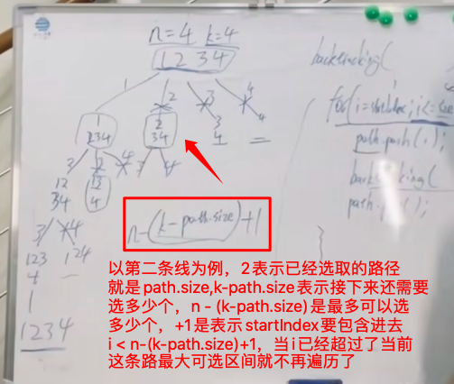
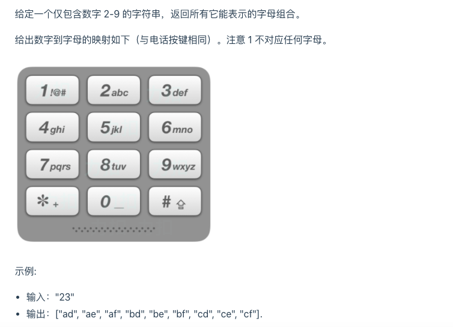
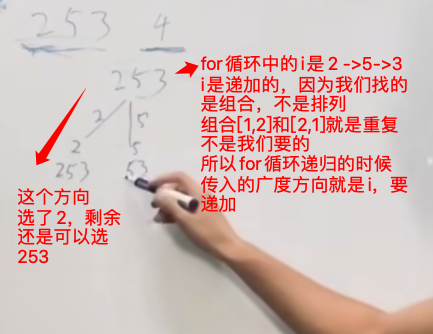

来源：https://programmercarl.com/0077.%E7%BB%84%E5%90%88.html#%E5%85%B6%E4%BB%96%E8%AF%AD%E8%A8%80%E7%89%88%E6%9C%AC

# 回溯：

其实就是递归，所以回溯也是一种暴力求解，但是里面有一步很精妙，就是arr.pop() 比如[1,2,3,4],俩俩组合，你用一个arr=[]来代表俩俩组合，[1,2]但是2已经占位了，所以要arr.pop()，变成[1]，然后再塞入3，变成[1,3]，这样才能一次得到[1,2] ,[1,3]...如果不回溯，就变成了[1,2,3]...

回溯三部曲：

1、想好递归入参

2、想好递归结束条件

3、想好当前层遍历条件

最后：可以考虑剪枝操作

# 排列组合

[1,2] 和[2,1]：在求不同组合的时候，这两个是一样的，算一个，因为组合没有顺序要求

如果是排列，那么就是两个，因为排列有顺序

## 组合

给定两个整数 n 和 k，返回 1 ... n 中所有可能的 k 个数的组合。

示例: 输入: n = 4, k = 2 输出: [ [2,4], [3,4], [2,3], [1,2], [1,3], [1,4], ]

```js
let result = []
let path = []
var combine = function(n, k) {
  result = []
 // 入参条件
  combineHelper(n, k, 1)
  return result
};
const combineHelper = (n, k, startIndex) => {
// 递归结束条件
  if (path.length === k) {
    result.push([...path])
    return
  }
// 当前层
// (k - path.length) 减枝， 不剪枝就是i <= n
  for (let i = startIndex; i <= n - (k - path.length) + 1; ++i) {
    path.push(i)
    combineHelper(n, k, i + 1)
    path.pop()
  }
}
```



从这组合可以看出，n控制宽度，k控制高度，典型的通过树的宽高来解决问题的题目。

## 组合总和三

https://www.bilibili.com/video/BV1wg411873x/?spm_id_from=333.788&vd_source=55dcc9b2dc5b93d913718cd6ba694fc2

找出所有相加之和为 n 的 k 个数的组合。组合中只允许含有 1 - 9 的正整数，并且每种组合中不存在重复的数字。

说明：

* 所有数字都是正整数。
* 解集不能包含重复的组合。

示例 1: 输入: k = 3, n = 7 输出: [[1,2,4]]

示例 2: 输入: k = 3, n = 9 输出: [[1,2,6], [1,3,5], [2,3,4]]

```js
/**
 * @param {number} k
 * @param {number} n
 * @return {number[][]}
 */
var combinationSum3 = function(k, n) {
    let res = [];
    let path = [];
    let sum = 0;
    const dfs = (path,index) => {
        // 剪枝操作
        if (sum > n){
            return
        }
        if (path.length == k) {
            if(sum == n){
                res.push([...path]);
                return
            }
        }
        for (let i = index; i <= 9 - (k-path.length) + 1;i++) {
            path.push(i);
            sum = sum + i;
            index += 1;
            dfs(path,index);
            sum -= i
            path.pop()
        }
    }
    dfs(path,1);
    return res
};
```

## 电话号码的字母组合



其实这里需要考虑的问题是，不断的输入数字，比如3245234，难道写7次循环？所以要通过递归来解决问题：

```js
var letterCombinations = function(digits) {
    const k = digits.length;
    const map = ["","","abc","def","ghi","jkl","mno","pqrs","tuv","wxyz"];
    if(!k) return [];
    if(k === 1) return map[digits].split("");

    const res = [], path = [];
    backtracking(digits, k, 0);
    return res;

    function backtracking(n, k, a) {
        if(path.length === k) {
            res.push(path.join(""));
            return;
        }
        for(const v of map[n[a]]) {
            path.push(v);
            backtracking(n, k, a + 1);
            path.pop();
        }
    }
};
```

## 组合求和

https://www.bilibili.com/video/BV1KT4y1M7HJ/?vd_source=55dcc9b2dc5b93d913718cd6ba694fc2

给定一个无重复元素的数组 candidates 和一个目标数 target ，找出 candidates 中所有可以使数字和为 target 的组合。

candidates 中的数字可以无限制重复被选取。

说明：

* 所有数字（包括 target）都是正整数。
* 解集不能包含重复的组合。

示例 1：

* 输入：candidates = [2,3,6,7], target = 7,
* 所求解集为： [ [7], [2,2,3] ]

示例 2：

* 输入：candidates = [2,3,5], target = 8,
* 所求解集为： [ [2,2,2,2], [2,3,3], [3,5] ]

```js
var combinationSum = function(candidates, target) {
    const res = [], path = [];
    candidates.sort((a,b)=>a-b); // 排序
    backtracking(0, 0);
    return res;
    function backtracking(j, sum) {
        if (sum === target) {
            res.push(Array.from(path));
            return;
        }
        for(let i = j; i < candidates.length; i++ ) {
            const n = candidates[i];
            if(n > target - sum) break;
            path.push(n);
            sum += n;
		// 虽然调用backtracking时往深度走，但是深度的控制条件和i没关系
		// i是因为在当前for循环中，广度遍历，传i是为了【组合】，避免重复答案
            backtracking(i, sum);
            path.pop();
            sum -= n;
        }
    }
};
```

几个注意点：

1、对数组要排序

2、res.push(Array.from(path))))是push的path副本，直接push的话是path引用，最后path清空，res里面都是空数组

3、这里用于统计sum的变量其实可以不使用，直接求当前path的和就行const currSum=path.reduce((a, b) =>a+b, 0)

4、递归中backtracking(i, sum); i是不断变大的，但是题目要求可以重复，这里不要搞混了




## 组合总和2

给定一个数组 candidates 和一个目标数 target ，找出 candidates 中所有可以使数字和为 target 的组合。

candidates 中的每个数字在每个组合中只能使用一次。

说明： 所有数字（包括目标数）都是正整数。解集不能包含重复的组合。

* 示例 1:
* 输入: candidates = [10,1,2,7,6,1,5], target = 8,
* 所求解集为:

```text
[
  [1, 7],
  [1, 2, 5],
  [2, 6],
  [1, 1, 6]
]
```

* 示例 2:
* 输入: candidates = [2,5,2,1,2], target = 5,
* 所求解集为:

```text
[
  [1,2,2],
  [5]
]
```

这个题相对于上一题，就是要求不重复，重点在18行和29行，29行，就是在深度方向不重复，这个好理解，但是18行，防止重复没太看懂

```js
/**
 * @param {number[]} candidates
 * @param {number} target
 * @return {number[][]}
 */
var combinationSum2 = function(candidates, target) {
    const res = []; path = [], len = candidates.length;
    candidates.sort((a,b)=>a-b);
    backtracking(0, 0);
    return res;
    function backtracking(sum, i) {
        if (sum === target) {
            res.push(Array.from(path));
            return;
        }
        for(let j = i; j < len; j++) {
            const n = candidates[j];
            if(j > i && candidates[j] === candidates[j-1]){
              //若当前元素和前一个元素相等
              //则本次循环结束，防止出现重复组合
              continue;
            }
            //如果当前元素值大于目标值-总和的值
            //由于数组已排序，那么该元素之后的元素必定不满足条件
            //直接终止当前层的递归
            if(n > target - sum) break;
            path.push(n);
            sum += n;
            backtracking(sum, j + 1);
            path.pop();
            sum -= n;
        }
    }
};
```


## 分割回文串

https://www.bilibili.com/video/BV1c54y1e7k6/?vd_source=55dcc9b2dc5b93d913718cd6ba694fc2

```js
/**
 * @param {string} s
 * @return {string[][]}
 */
const isPalindrome = (s, l, r) => {
    for (let i = l, j = r; i < j; i++, j--) {
        if(s[i] !== s[j]) return false;
    }
    return true;
}

var partition = function(s) {
    const res = [], path = [], len = s.length;
    backtracking(0);
    return res;
    function backtracking(startIndex) {
        if(startIndex >= len) {
            res.push(Array.from(path));
            return;
        }
        for(let i = startIndex; i < len; i++) {
            if(!isPalindrome(s, startIndex, i)) continue;
            path.push(s.slice(startIndex, i + 1));
            backtracking(i + 1);
            path.pop();
        }
    }
};
```

思考，如果用双指针能实现吗


从下面开始，不在直接copy里面的案例，有对案例另外的理解再做补充：

# 贪心算法：跳跃游戏2

下面这个思路不是老师的思路，是水友的思路，延续了老师【跳跃游戏1】的思路，可以按照这个思路去解更具有思路延续性（正确性未验证）

```js
class Solution {
public:
    int jump(vector<int>& nums) {
        int cover = 0, cnt = 0, next = 0;

        if(nums.size() == 1) return cnt;

       for(int i = 0; i <= cover; i++)  //在覆盖范围内判断
       {
           next = max(next, nums【i】 + i);   //next 记录的是覆盖范围内的最大下一跳
           if(i == cover)       //已经到达覆盖范围
           {
               if(cover < nums.size() - 1)  //但还未到达终点
               {
                   cnt++;   //跳数增加
                   cover = next;    //跳到最大下一跳
                   if(cover >= nums.size() - 1) break;  //到达终点结束
               }
               else break;
           }
       }

        return cnt;
    }
};
```


=

=

=

=
