来源：https://www.bilibili.com/video/BV1Qu4y1P7kg?p=14&spm_id_from=pageDriver&vd_source=55dcc9b2dc5b93d913718cd6ba694fc2

# 真题

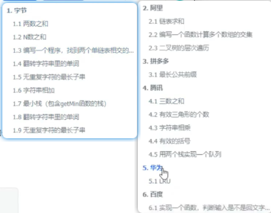

# 复杂度

更短的时间、更少的空间去解决问题

O表示法 O(n) n就是一个维度的概念

## 时间复杂度

不是代码的真正执行时间，随着数据规模增长所表达的趋势

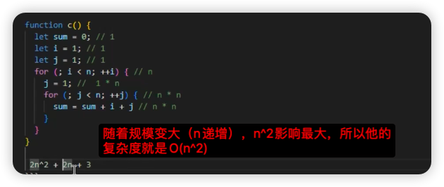

其实就是取量级最大的部分

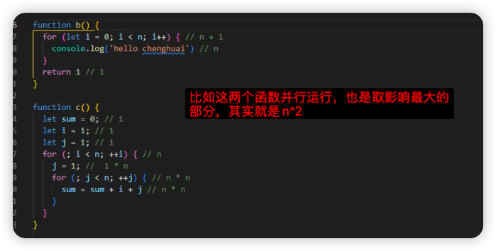

常见的时间复杂度：

O(1) O(logN) O(n) O(NlogN) O(n^2) O(n^3)

这种对数的场景一般出现在二分法里面：

```js
let i = 1
while(i < n) {
   i = i * 2
}
// log2^n 就是2为底，指数是n的对数，简称O(logN)
// 这个外面在套一个for循环，就是O(NlogN)
```

demo:

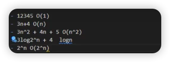

最后一个是2为底的n次方，是一个指数

## 空间复杂度

对于前端，对于代码占用多少内存，其实不是核心点，所以时间复杂度显得更加重要，我们希望的是代码更快的执行，所以前端角度谈复杂度，基本都是在说时间复杂度。

# 树

前端主要是二叉树 DOM，遍历最重要

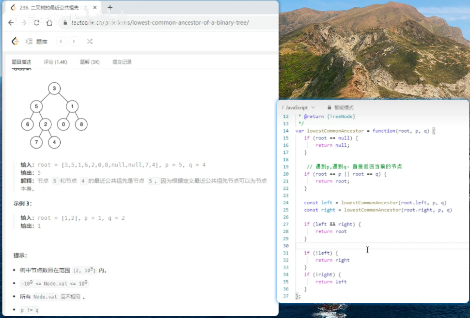

# 堆

top、最大、最小这种关键字，就是堆来实现的

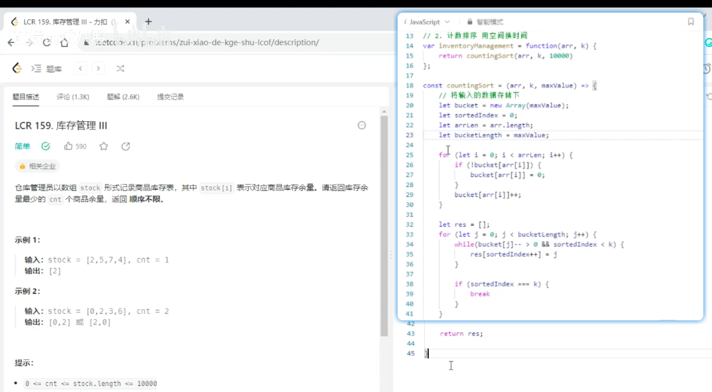

自己对这个题的理解，其实就是先把arr中每个商品，比如[2,3,2]，2，3就代表两种商品然后统计到一个bucket中，2出现两次，就是2，3出现一次就是1，所以bucket就是[2,1]（这里就是堆的模拟），没看懂为啥23行要用while，换成if也通过

```js
/**
 * @param {number[]} stock
 * @param {number} cnt
 * @return {number[]}
 */
var inventoryManagement = function(stock, cnt) { 
    return fn(stock, cnt, 10000)
};
const fn = (arr, k, maxValue) => {
    let bucket = new Array(maxValue);
    let sortedIndex = 0;
    let arrLen = arr.length;
    let bucketLength = maxValue;
    for(let i = 0; i< arrLen; i++) {
        if (!bucket[arr[i]]) {
            bucket[arr[i]] = 0;
        }
        bucket[arr[i]]++;
    }
    console.log(bucket)
    let res =[];
    for (let j = 0; j < bucketLength; j++) {
        if(bucket[j] > 0 && sortedIndex < k) {
            res[sortedIndex++] = j
        }
        if (sortedIndex === k) {
            break
        }
    }
    return res
}
const a = inventoryManagement([2,5,7,4], 1)
console.log(a)
```

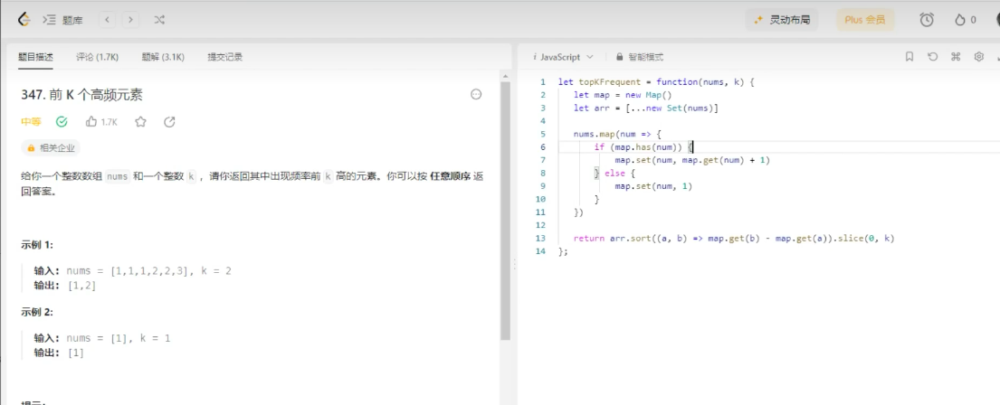

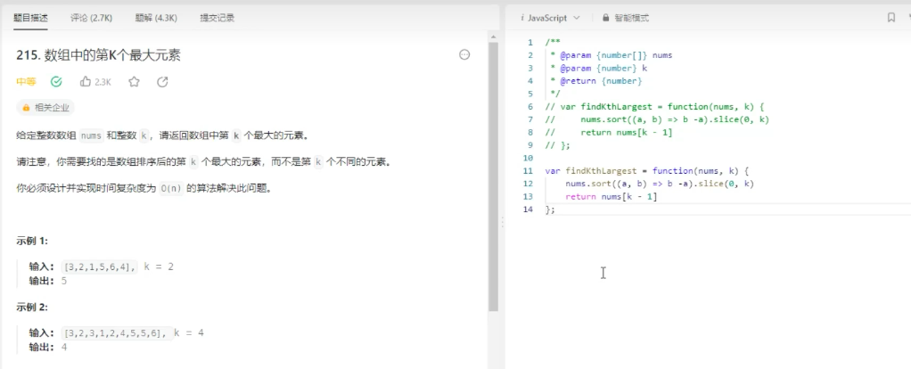

# 图：

前端遇到图都是简单的题

针对一道算法题【小镇法官】来解释一些概念：https://www.bilibili.com/video/BV1PN4y137EB/?spm_id_from=333.337.search-card.all.click&vd_source=55dcc9b2dc5b93d913718cd6ba694fc2

实际解法：

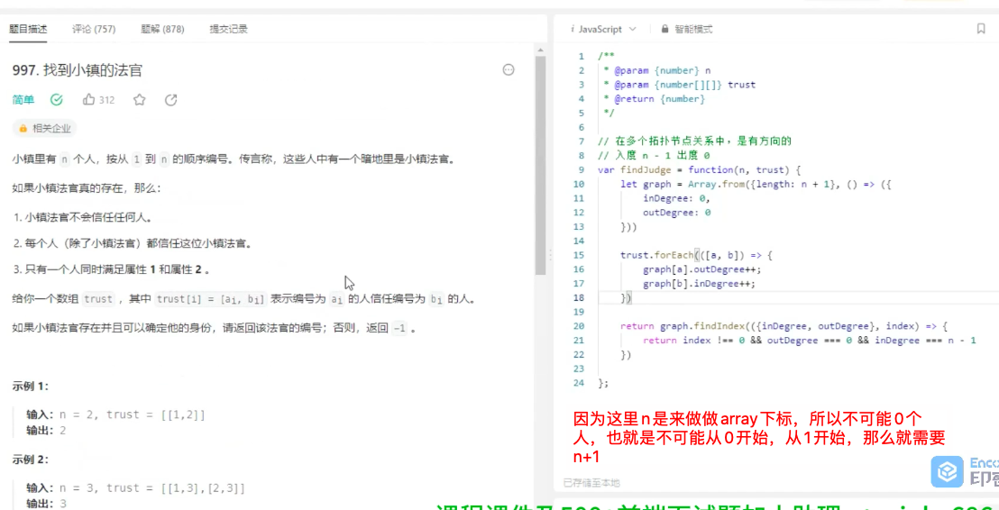

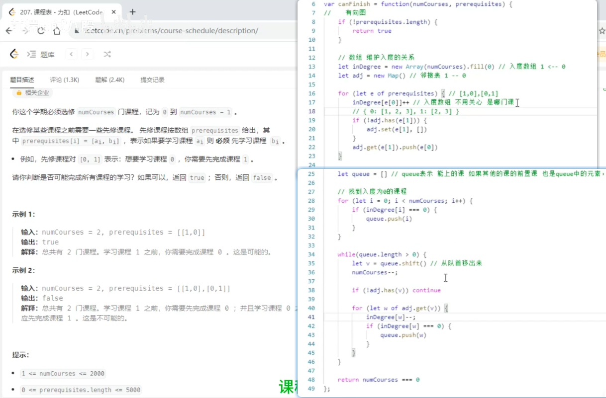

# 动态规划：

前端涉及的会比较简单

自己要掌握的题：

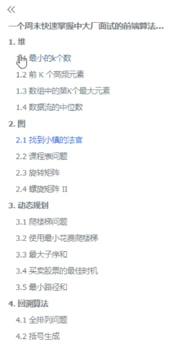
