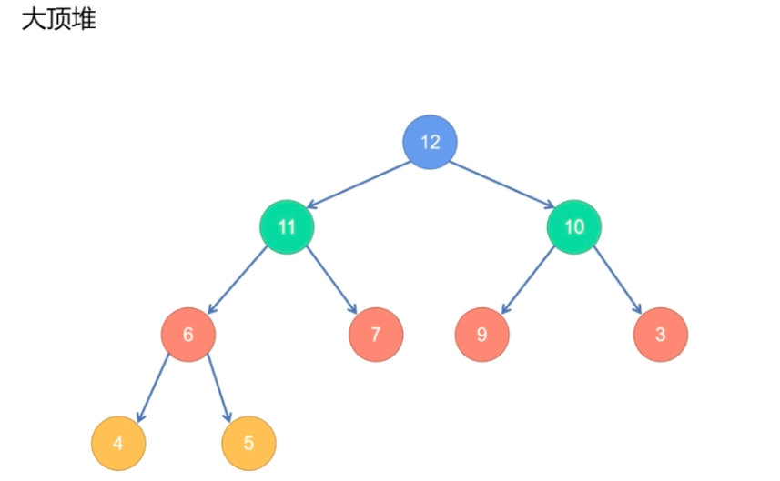
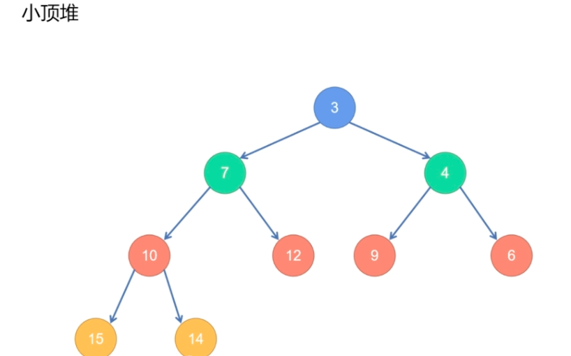

堆可以看成完全二叉树

讲解：https://www.bilibili.com/video/BV17b4y1v7Ee/?spm_id_from=333.337.search-card.all.click&vd_source=55dcc9b2dc5b93d913718cd6ba694fc2

配套文章：https://juejin.cn/post/7034047402029875237







```js
class Heap {
    constructor(arr=[], cmp = (a,b) => a<b) {
        this.arr = arr // 传入的arr
        this.cmp = cmp // 排序规则 最小堆 最大堆
        this.heapify() // 将传入的arr变成堆
    }
    heapify() {
        if(this.size() < 2) return;
        for (let i = 1; i < this.size(); i++) {
            this.bubbleup(i);
        }
    }

    size () {
        return this.arr.length
    }
    top() {
        if (this.size() === 0) {
            return null
        }
        return this.arr[0]
    }
    push(value) {
        this.arr.push(value)
        this.bubbleup(this.size() - 1)
    }
    pop() {
        if (!this.size()) return null;
        if (this.size() === 1) return this.arr.pop()
        const top = this.arr[0]
        //array push()和unshift() 尾部/头部 添加
        //array pop()和shift() 尾部/头部 删除
        this.arr[0] = this.arr.pop();
        this.bubbledown(0)
        return top
    }
    // 入队就是从队尾不断的调整
    // 【重点】当前插入的元素和父元素比较，满足cmp就交换位置，直到他能去到的最高位置
    bubbleup(index) {
        // index = 0 就是退出条件，如果默认是0，就是在堆头，不用调整
        while(index) {
            const parentIndex = Math.floor((index-1)/2) // 父元素在堆中的相对位置
            // 如果不满足就交换位置
            if(this.cmp(this.arr[index], this.arr[parentIndex])) {
                [this.arr[index], this.arr[parentIndex]] = [this.arr[parentIndex], this.arr[index]]
                index=parentIndex
            } else {
                // 满足说明当前位置不用调整，直接跳出
                break
            }
        }
    }
    // 出堆就是从堆头拿一个走，然后把arr最后一个放到第一个再排序
    // 【重点】堆头在进入这个函数之前已经被拿走，index其实就是0，然后在堆尾拿一个元素填充到堆头，但是新添加的这个元素
    // 需要从新排序，来刷新这个排序顺序
    bubbledown(index) {
        const lastIndex = this.size() - 1
        while(index < lastIndex) {
            let findIndex = index
            let leftIndex = index*2 + 1 // 左子节点位置
            let rightIndex = index*2 + 2 // 右子节点位置
            if (leftIndex <= lastIndex && this.cmp(this.arr[leftIndex], this.arr[findIndex])) {
                findIndex = leftIndex
            }
            if (rightIndex <= lastIndex && this.cmp(this.arr[rightIndex], this.arr[findIndex])) {
                findIndex = rightIndex
            }
            if (findIndex > index) {
                [this.arr[findIndex], this.arr[index]] = [this.arr[index],this.arr[findIndex]]
                index = findIndex // 直到找到堆尾 ===  this.size() - 1退出循环
            } else {
                break
            }
        }
    }
}

let arr = [8,11,17,5,6,12]
const heap = new Heap(arr).arr
heap.push(3)
console.log(heap)
heap.push(1)
console.log(heap)
```


-

-

-


-
