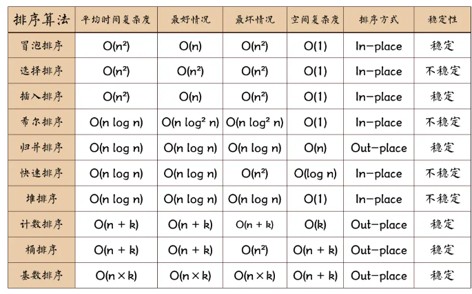

https://juejin.cn/post/6844903444365443080?searchId=20240405184423D916CDABA9871BCC547A



# 冒泡：

```js
const mySort = (arr) => {
    for (let i = 0; i < arr.length; i++) {
        for (let j = 0; j < arr.length - 1 - j; j++) {
            if (arr[j] > arr[j + 1]) {
                const temp = arr[j+1]
                arr[j+1] = arr[j]
                arr[j] = temp;
            }
        }
    }
    return arr;
}
```

其实就是不断的左右进行对比，比如1和2对比，对比完2大，就挪到2的位置，然后在2和3对比，以此类推，直到最后，既然最后一个已经最大了，那么下一轮最后一位就不参与比较了所以是arr.length - 1 - j


# 选择：

选择排序(Selection-sort)是一种简单直观的排序算法。它的工作原理：首先在未排序序列中找到最小（大）元素，存放到排序序列的起始位置，然后，再从剩余未排序元素中继续寻找最小（大）元素，然后放到已排序序列的末尾。以此类推，直到所有元素均排序完毕。

```js
function selectionSort(arr) {
    var len = arr.length;
    var minIndex, temp;
    console.time('选择排序耗时');
    for (var i = 0; i < len - 1; i++) {
        minIndex = i;
        for (var j = i + 1; j < len; j++) {
            if (arr[j] < arr[minIndex]) {     //寻找最小的数
                minIndex = j;                 //将最小数的索引保存
            }
        }
        temp = arr[i];
        arr[i] = arr[minIndex];
        arr[minIndex] = temp;
    }
    console.timeEnd('选择排序耗时');
    return arr;
}
var arr=[3,44,38,5,47,15,36,26,27,2,46,4,19,50,48];
console.log(selectionSort(arr));//[2, 3, 4, 5, 15, 19, 26, 27, 36, 38, 44, 46, 47, 48, 50]


```


# 归并排序：

```js
function mergeSort(arr) {  //采用自上而下的递归方法
    var len = arr.length;
    if(len < 2) {
        return arr;
    }
    var middle = Math.floor(len / 2),
        left = arr.slice(0, middle),
        right = arr.slice(middle);
    return merge(mergeSort(left), mergeSort(right));
}

function merge(left, right)
{
    var result = [];
    console.time('归并排序耗时');
    while (left.length && right.length) {
        if (left[0] <= right[0]) {
            result.push(left.shift());
        } else {
            result.push(right.shift());
        }
    }

    while (left.length)
        result.push(left.shift());

    while (right.length)
        result.push(right.shift());
    console.timeEnd('归并排序耗时');
    return result;
}
var arr=[3,44,38,5,47,15,36,26,27,2,46,4,19,50,48];
console.log(mergeSort(arr));


```


# 快速排序：

```js
Array.prototype.quickSort = function () { 
    const rec = (arr) => { 
       // 预防数组是空的或者只有一个元素, 当所有元素都大于等于基准值就会产生空的数组
       if(arr.length === 1 || arr.length === 0) { return arr; }
       const left = [];
       const right = [];
       //以第一个元素作为基准值   
       const mid = arr[0];
       //小于基准值的放左边，大于基准值的放右边
       for(let i = 1; i < arr.length; ++i) { 
           if(arr[i] < mid) { 
               left.push(arr[i]);
           } else { 
               right.push(arr[i]);
           }
       }
        //递归调用，最后放回数组  
       return [...rec(left),mid,...rec(right)];
    };
    const res = rec(this);
    res.forEach((n,i) => { this[i] = n; })
}

const arr = [2,3,4,5,3,1];
arr.quickSort();
console.log(arr);

```
