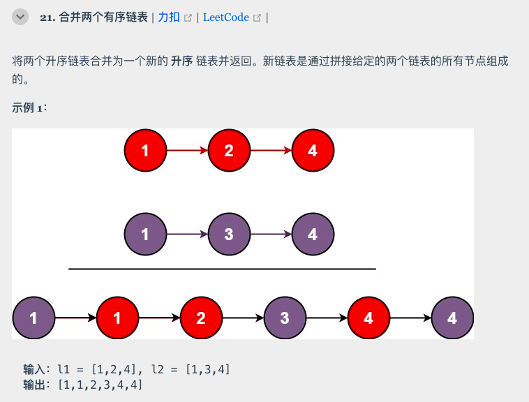
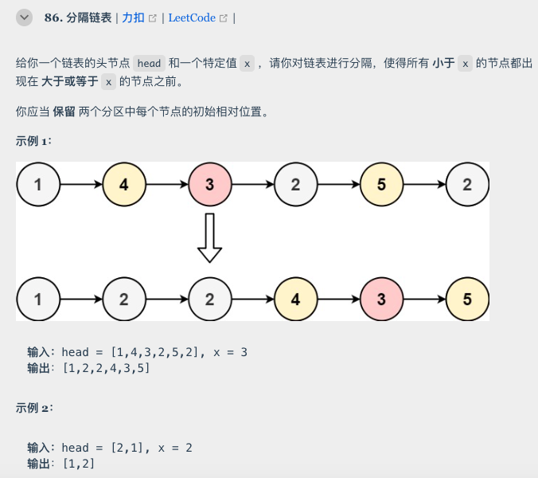
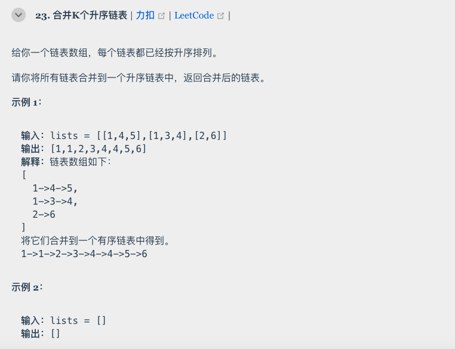
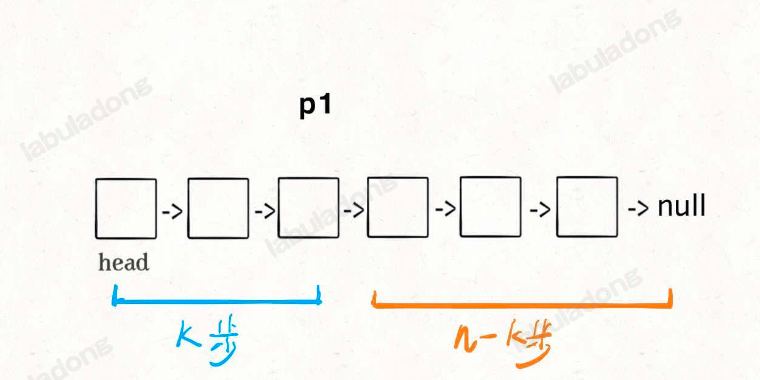
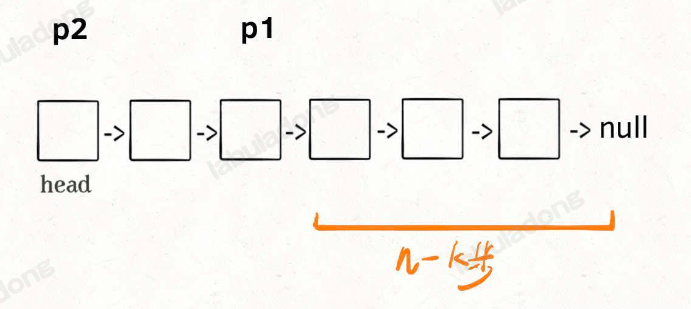
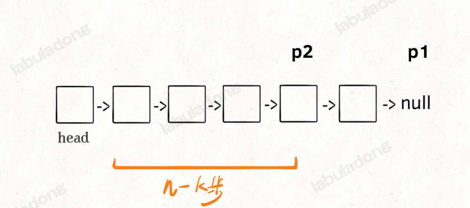
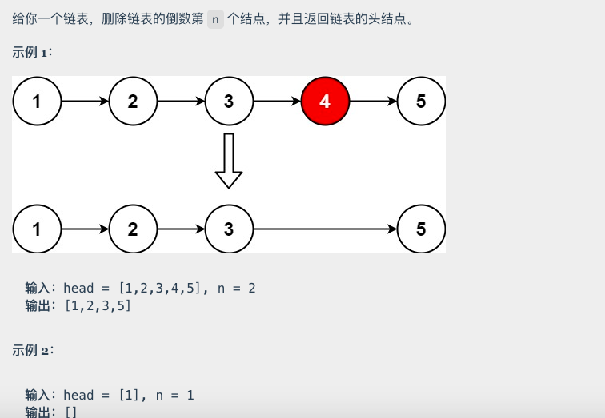
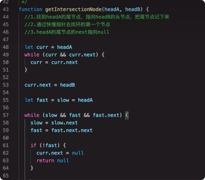
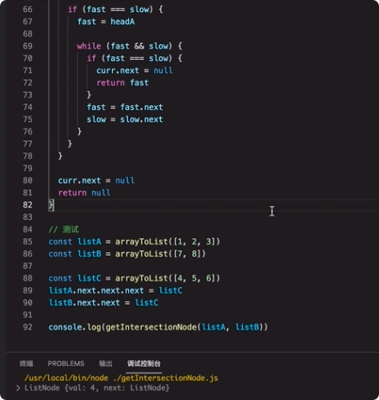

来源：https://labuladong.online/algo/essential-technique/linked-list-skills-summary/#%E5%8D%95%E9%93%BE%E8%A1%A8%E7%9A%84%E4%B8%AD%E7%82%B9


在链表中，告诉你一个头节点，其实就是告诉了你一条完整的链表，比如[1,2,3,4,5,6]，只是长度是不知道的（如果没有遍历）

让你获取第N个节点，比如第4个节点，其实返回的并不是一个节点，而是这个节点后面的链表，应该理解成[4,5,6]

链表基本操作：

```js
class Node {
    constructor(data) {
        this.data = data
        this.next = null;
    }
}

function createLinkList(arr) {
    let p = new Node(null);
    let L = p
    arr.forEach(element => {
        L.next = new Node(element)
        L = L.next
    });
    return L;
}

var arr = [1, 3, 5, 7, 9]; // 为了方便，将数组转化为链表
var L = createLinkList(arr);

// 遍历链表
function traverseLinkList(L) {
    let p = L.next
    while(p) {
        console.log(p.data)
        p = p.next
    }
}

// 获取链表长度
function getLinkListLength(L) {
    let p = L.next
    let n = 0
    while(p) {
        p = p.next
        n++
    }
    return n
}

// 获取第i个元素
function getIndexValue(L, index) {
    let p = L.next
    if (index < 0) return null;
    let n = 0
    while(p) {
        if(index === n) return p.data
        n++;
        p=p.next
    }
    return null;
}

// 倒数情况下增删改查：
// 获取/插入/删除，可以参考下面【单链表倒数第N个节点获取】到对应节点，再做增删改查
// 增删改：获取当前节点前一个节点（n+1），然后增删改
// 获取节点后：增：
function insertNode(L, posistion, value){
    var p = L.next;
    var i = 0;
    while(p){
        ++i;
        if(i === posistion) {
            var saveNextP = p.next;
            p.next = new Node(value);
            p.next.next = saveNextP;
            return true;
        }
        p = p.next;
    }
    return false;
}

// 获取节点后：删：
// 删除倒数第 n 个，要先找倒数第 n + 1 个节点
    var x = findFromEnd(dummy, n + 1);
    // 删掉倒数第 n 个节点
    x.next = x.next.next;
```


## 链表（用双指针搞定）：

### **合并两个有序链表**



```js
var mergetTwoLists = (l1, l2) => {
	var dump = new ListNode(-1); p = dump;
    var p1 = l1, p2 = l2;
    while(p1 !== null && p2 !== null) {
        if (p1.val > p2.val) {
            p.next = p2;
            p2 = p2.next;
        } else {
            p.next = p1;
            p1 = p1.next;
        }
        p = p.next;
    }
    // 把最后没有比较完的直接接到p的末尾
    if (p1 !== null) {
        p.next = p1;
    }
    if (p2 !== null) {
        p.next = p2;
    }
    return dump.next;
}

```

### 分解链表：



```js
var partition = function(head, x) {
    // 存放小于 x 的链表的虚拟头结点
    var dummy1 = new ListNode(-1);
    // 存放大于等于 x 的链表的虚拟头结点
    var dummy2 = new ListNode(-1);
    // p1, p2 指针负责生成结果链表
    var p1 = dummy1, p2 = dummy2;
    // p 负责遍历原链表，类似合并两个有序链表的逻辑
    // 这里是将一个链表分解成两个链表
    var p = head;
    while (p !== null) {
        if (p.val >= x) {
            p2.next = p;
            p2 = p2.next;
        } else {
            p1.next = p;
            p1 = p1.next;
        }
        // 不能直接让 p 指针前进，
        // p = p.next
        // 断开原链表中的每个节点的 next 指针
        var temp = p.next;
        p.next = null;
        p = temp;
    }
    // 连接两个链表
    p1.next = dummy2.next;
  
    return dummy1.next;
}
```

### 合并 k 个有序链表

其实就是两个合并的升级版，加个for循环



```js
var mergeKLists = function(lists) {
    let ans = null
    // 顺序去拿每个链表，两两合并，合完作为一个新数组，再跟下一个数组合并
    for(let i=0; i<lists.length; i++) {
        ans  = mergeTwoLists(ans, lists[i])
    }
    return ans
};

// 第21题合并两个数组的方法
var mergeTwoLists = function(a, b) {
    if(a == null || b == null) {
        return a != null ? a : b
    }
    const dummy = new ListNode(-1)
    let p = dummy, aPtr = a, bPtr = b
    while(aPtr != null && bPtr != null) {
        if(aPtr.val < bPtr.val) {
            p.next = aPtr
            aPtr = aPtr.next
        } else {
            p.next = bPtr
            bPtr = bPtr.next
        }
        p = p.next
    }
    p.next = aPtr!==null ? aPtr : bPtr
    return dummy.next
}

```

### 单链表倒数第N个节点：

额外动画展示：https://www.bilibili.com/video/BV1QR4y1n7W9/?spm_id_from=333.337.search-card.all.click&vd_source=55dcc9b2dc5b93d913718cd6ba694fc2

从前往后寻找单链表的第 `k` 个节点很简单，一个 for 循环遍历过去就找到了，但是如何寻找从后往前数的第 `k` 个节点呢？

那你可能说，假设链表有 `n` 个节点，倒数第 `k` 个节点就是正数第 `n - k + 1` 个节点，不也是一个 for 循环的事儿吗？

是的，但是算法题一般只给你一个 `ListNode` 头结点代表一条单链表，你不能直接得出这条链表的长度 `n`，而需要先遍历一遍链表算出 `n` 的值，然后再遍历链表计算第 `n - k + 1` 个节点。

也就是说，这个解法需要遍历两次链表才能得到出倒数第 `k` 个节点。

那么，我们能不能 **只遍历一次链表** ，就算出倒数第 `k` 个节点？可以做到的，如果是面试问到这道题，面试官肯定也是希望你给出只需遍历一次链表的解法。

这个解法就比较巧妙了，假设 `k = 2`，思路如下：

首先，我们先让一个指针 `p1` 指向链表的头节点 `head`，然后走 `k` 步：



现在的 `p1`，只要再走 `n - k` 步，就能走到链表末尾的空指针了对吧？

趁这个时候，再用一个指针 `p2` 指向链表头节点 `head`：



接下来就很显然了，让 `p1` 和 `p2` 同时向前走，`p1` 走到链表末尾的空指针时前进了 `n - k` 步，`p2` 也从 `head` 开始前进了 `n - k` 步，停留在第 `n - k + 1` 个节点上，即恰好停链表的倒数第 `k` 个节点上：



这样，只遍历了一次链表，就获得了倒数第 `k` 个节点 `p2`。

```js
// 注意：javascript 代码由 chatGPT🤖 根据我的 java 代码翻译，旨在帮助不同背景的读者理解算法逻辑。
// 本代码不保证正确性，仅供参考。如有疑惑，可以参照我写的 java 代码对比查看。

// 返回链表的倒数第 k 个节点
var findFromEnd = function(head, k) {
    var p1 = head;
    // p1 先走 k 步
    for (var i = 0; i < k; i++) {
        p1 = p1.next;
    }
    var p2 = head;
    // p1 和 p2 同时走 n - k 步
    while (p1 != null) {
        p2 = p2.next;
        p1 = p1.next;
    }
    // p2 现在指向第 n - k + 1 个节点，即倒数第 k 个节点
    return p2;
};

```

#### **删除链表的倒数第 N 个结点**:



```js
// 注意：javascript 代码由 chatGPT🤖 根据我的 java 代码翻译，旨在帮助不同背景的读者理解算法逻辑。
// 本代码不保证正确性，仅供参考。如有疑惑，可以参照我写的 java 代码对比查看。

var removeNthFromEnd = function (head, n) {
    // 虚拟头结点
    var dummy = new ListNode(-1);
    dummy.next = head;
    // 删除倒数第 n 个，要先找倒数第 n + 1 个节点
    var x = findFromEnd(dummy, n + 1);
    // 删掉倒数第 n 个节点
    x.next = x.next.next;
    return dummy.next;
}

var findFromEnd = function (head, k) {
    // 代码见上文
}

```


### 快慢指针：

#### 单链表的中点：

方法1： 先遍历获取长度n，再遍历一遍取n/2位置后面的节点

方法2：快慢指针，两个指针从头开始走，一个走一步，一个走两步，走完两步的同时，走一步的刚好走到中间：

```js
// 注意：javascript 代码由 chatGPT🤖 根据我的 java 代码翻译，旨在帮助不同背景的读者理解算法逻辑。
// 本代码不保证正确性，仅供参考。如有疑惑，可以参照我写的 java 代码对比查看。

/**
 * 快慢指针初始化指向 head
 * 快指针走到末尾时停止
 * 慢指针走一步，快指针走两步
 * 慢指针指向中点
 */
var middleNode = function(head) {
    var slow = head, fast = head;
    while (fast != null && fast.next != null) {
        slow = slow.next;
        fast = fast.next.next;
    }
    return slow;
}

```

#### 判断是否有环：

```js
// 注意：javascript 代码由 chatGPT🤖 根据我的 java 代码翻译，旨在帮助不同背景的读者理解算法逻辑。
// 本代码不保证正确性，仅供参考。如有疑惑，可以参照我写的 java 代码对比查看。

function hasCycle(head) {
    // 快慢指针初始化指向 head
    var slow = head, fast = head;
    // 快指针走到末尾时停止
    while (fast != null && fast.next != null) {
        // 慢指针走一步，快指针走两步
        slow = slow.next;
        fast = fast.next.next;
        // 快慢指针相遇，说明含有环
        if (slow == fast) {
            return true;
        }
    }
    // 不包含环
    return false;
}

```


#### 两个链表是否相交：？

思路：https://www.bilibili.com/video/BV1u341187v3/?spm_id_from=333.337.search-card.all.click&vd_source=55dcc9b2dc5b93d913718cd6ba694fc2

第67行看不懂






-

-

-

-

-
