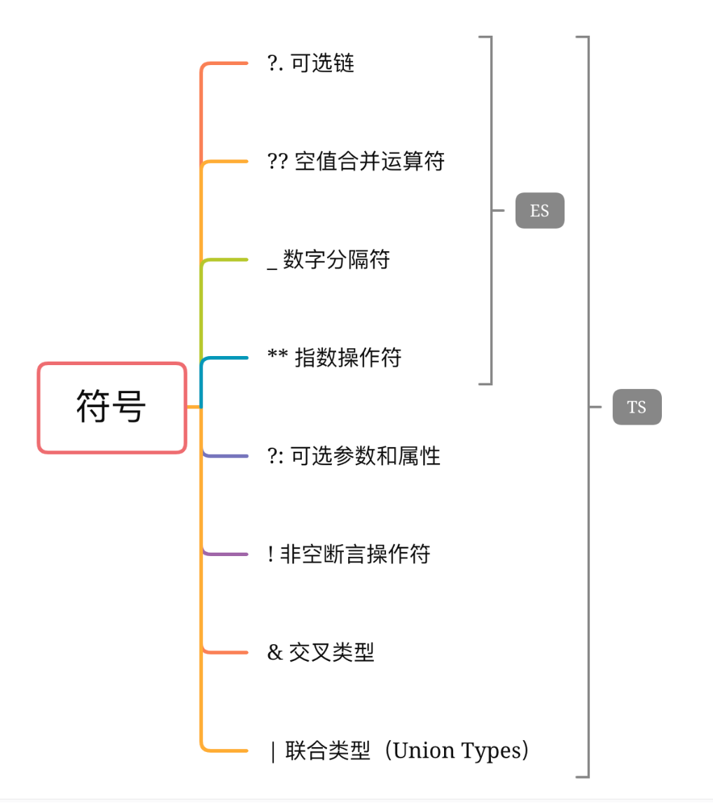

好文章：https://blog.csdn.net/xgangzai/article/details/121186999

## 1、TS和 JS 的优缺点

* `ts` 是 `js` 的超集，即你可以在 `ts` 中使用原生 `js` 语法。
* `ts` 需要静态编译，它提供了强类型与更多面向对象的内容。
* `ts` 最终仍要编译为弱类型，基于对象的原生的 `js`，再运行。

## 2、 TypeScript 中 const 和 readonly 的区别？

https://blog.csdn.net/weixin_46267040/article/details/125370157

## 2.1、接口和类型别名的区别？

https://juejin.cn/post/6844903749501059085

## 3、 TypeScript 中 any 和unknown区别

https://juejin.cn/post/7024686544086630436

any用途：

为编程阶段还不清楚类型的变量指定一个类型。 这些值可能来自于动态的内容，比如来自用户输入或第三方代码库。 这种情况下，我们不希望类型检查器对这些值进行检查而是直接让它们通过编译阶段的检查。

## 4、 TypeScript 中 any、never、unknown 和 void 有什么区别？

https://blog.csdn.net/KNIGH_YUN/article/details/115412962

`any`: 动态的变量类型（失去了类型检查的作用）。

`never`: 永不存在的值的类型。例如：never 类型是那些总是会抛出异常或根本就不会有返回值的函数表达式或箭头函数表达式的返回值类型。

`unknown`: 任何类型的值都可以赋给 unknown 类型，但是 unknown 类型的值只能赋给 unknown 本身和 any 类型。

`null & undefined`: 默认情况下 null 和 undefined 是所有类型的子类型。 就是说你可以把 null 和  undefined 赋值给 number 类型的变量。当你指定了 --strictNullChecks 标记，null 和 undefined 只能赋值给 void 和它们各自。

`void`: 没有任何类型。例如：一个函数如果没有返回值，那么返回值可以定义为void。

## 5、 TypeScript 中 interface 可以给 Function / Array / Class（Indexable）做声明吗？

https://github.com/Advanced-Frontend/Daily-Interview-Question/issues/528

```ts
可以，interface 能够描述 JavaScript 对象的任何形式，包括函数

// 函数类型
interface SearchFunc {
  (source: string, subString: string): boolean;
}
let mySearch: SearchFunc;
mySearch = function(source: string, subString: string) {
  let result = source.search(subString);
  return result > -1;
}
// Array
interface StringArray {
  [index: number]: string;
}

let myArray: StringArray;
myArray = ["Bob", "Fred"];
// Class, constructor存在于类的静态部分，所以不会检查
interface ClockInterface {
    currentTime: Date;
    setTime(d: Date);
}

class Clock implements ClockInterface {
    currentTime: Date;
    setTime(d: Date) {
        this.currentTime = d;
    }
    constructor(h: number, m: number) { }
}
```

## 6、 TypeScript 中可以使用 String、Number、Boolean、Symbol、Object 等给类型做声明吗？

```ts
/* 可以 */
let name: string = "bob";
let decLiteral: number = 6;
let isDone: boolean = false;
let sym: symbol = Symbol();
interface Person {
 name: string;
 age: number;
}
```

## 7、 TypeScript 中的 this 和 JavaScript 中的 this 有什么差异？(看不懂就先忽略)

https://juejin.cn/post/6859914549341093896

简单理解：

1. TypeScript：noImplicitThis: true 的情况下，必须去声明 this 的类型，才能在函数或者对象中使用this。
2. Typescript 中箭头函数的 this 和 ES6 中箭头函数中的 this 是一致的。

## 8、 TypeScript 中使用 Unions（联合类型） 时有哪些注意事项？

https://ts.xcatliu.com/basics/union-types.html

简单理解：

**属性或方法访问** : 当 TypeScript 不确定一个联合类型的变量到底是哪个类型的时候，我们只能访问此联合类型的所有类型里共有的属性或方法。

```ts
function getLength(something: string | number): number {
   return something.length;
}
// index.ts(2,22): error TS2339: Property 'length' does not exist on type >'string | number'.
//   Property 'length' does not exist on type 'number'.

function getString(something: string | number): string {
   return something.toString();
}
// 公共方法和属性可以访问
```

## 9、 TypeScript 如何设计 Class 的声明？

https://blog.csdn.net/ABAP_Brave/article/details/100771860

简单回答：

```js
class Greeter {
   greeting: string;
   constructor(message: string) {
       this.greeting = message;
   }
   greet(): string{
       return "Hello, " + this.greeting;
   }
}
let greeter = new Greeter("world");
// 在声明类的时候，一般类中都会包含，构造函数、对构造函数中的属性进行类型声明、类中的方法。
```

## 10、 TypeScript 中如何联合枚举类型的 Key?

```ts
使用 keyof typeof 组合

enum TypeEnums {
  TYPE1 = 'type1',
  TYPE2 = 'type2',
}

type ITypes = keyof typeof TypeEnums;

const type1: ITypes = 'TYPE1'; // right
const type2: ITypes = 'TYPE2'; // right
const type3: ITypes = 'TYPE3'; // error
```

## 11、 TypeScript 中 ?.、??、!.、_、** 等符号的含义？

https://github.com/Advanced-Frontend/Daily-Interview-Question/issues/529 (链接讲的比较细，有空再看，看下面截图就行)



`?. 可选链` 遇到 null 和 undefined 可以立即停止表达式的运行。

`?? 空值合并运算符` 当左侧操作数为 null 或 undefined 时，其返回右侧的操作数，否则返回左侧的操作数。

`! 非空断言运算符` x! 将从 x 值域中排除 null 和 undefined

`!. ` 在变量名后添加，可以断言排除undefined和null类型

`_ 数字分割符` 分隔符不会改变数值字面量的值，使人更容易读懂数字 .e.g 1_101_324。

`** `求幂

## 12、 TypeScript 中预定义的有条件类型有哪些？

```ts
预先定义的条件类型（Predefined conditional types）
TS提供了几种内置的预定义的条件类型：

Exclude<T, U> -- 从 T 中剔除可以复制给 U 的类型。
Extract<T, U> -- 提取 T 中可以赋值给 U 的类型。
NonNullable<T> -- 从 T 中剔除 null 和 undefined。
ReturnType<T> -- 获取函数返回值类型。
InstanceType<T> -- 获取构造函数类型的实例类型。
下面分别来举例：

1. Exclude
type T00 = Exclude<"a" | "b" | "c" | "d", "a" | "c" | "f">; // "b" | "d"
const str0: T00 = "d";
在这个例子中，因为用到了 Exclude 这个条件类型，会尝试寻找在 T 类型中有，但在 U 类型中没有的成员，最后将获取到的Union类型"b"|"d"赋给T100。

2. Extract
type T01 = Extract<"a" | "b" | "c" | "d", "a" | "c" | "f">; // "a" | "c"
const str01: T01 = "a"
Extract首先是提取出的意思，应用 Extract 条件类型，会尝试寻找T类型成员和U类型成员的交集，在该示例中，提取的是 "a"|"c"。

3. NonNullable
type T04 = NonNullable<string | number | undefined>; // string | number
const str04: T04 = 123
通过运行 NonNullable, 清除了 undefined 类型成员。

4. ReturnType
type T10 = ReturnType<() => string>; // string
type T11 = ReturnType<(s: string) => void>; // void
通过 ReturnType, 返回了泛型参数T的返回值类型。

5. InstanceType
class C {
  x = 0;
  y = 0;
}
type T20 = InstanceType<typeof C>; // C
Omit
目前的ts版本（3.2及以前）并没有内置Omit，那么Omit是什么呢？开始我对这个Omit也很好奇，在很多开源的实现里都能看到它的身影。Omit本身有省略和删除的意思，那在ts里这个Omit也很有可能有着相似的操作。查了一些资料之后，学习到，Omit确实是用来删除指定成员。ts虽然没有原生内置Omit，但却可以通过其他内置类型进行实现，比如：

type Omit<T, K extends keyof T> = Pick<T, Exclude<keyof T, K>>;
搭配Pick这个映射类型，就可以实现 Omit 的效果，我们一点点来拆分这个类型实现。

首先看等号的右侧，Pick是一个ts内置的映射类型，Pick的实现为：

type Pick<T, K extends keyof T> = {
  [P in K]: T[P]
}
首先这个 "K extends keyof T" 说明这个类型值必须为T类型属性的子集，也就是说假如有一个 interface 定义如下：

interface Student {
  name: string;
  age: number;
}
在传入这个Student到Pick中时

type PickStudent1 = Pick<Student, "name">; // 正确
type PickStudent2 = Pick<Student, "score">; // 错误
在上面的Omit实现中，我们用到了 Exclude 这个条件类型，根据上文的说明，Exclude的效果就是寻找在keyof T中有，但在K类型中没有的成员，这样就将剩余的类型过滤了出来，再去应用Pick,就获得了我们的Omit实现。

完整例子：

type Omit<T, K extends keyof T> = Pick<T, Exclude<keyof T, K>>;

interface Student {
  name: string;
  age: number;
}

type PickStudent1 = Pick<Student, "name">;
```

## 13、 简单介绍一下 TypeScript 模块的加载机制？

先看这篇文章 了解js的模块化：https://www.cnblogs.com/echoyya/p/14577243.html

再看这个了解ts的模块化：

https://juejin.cn/post/6844904063507628039

简单理解：

假设有一个导入语句 `import { a } from "moduleA"`;

1. 首先，编译器会尝试定位需要导入的模块文件，通过绝对或者相对的路径查找方式；
2. 如果上面的解析失败了，没有查找到对应的模块，编译器会尝试定位一个 `外部模块声明`（.d.ts）；
3. 最后，如果编译器还是不能解析这个模块，则会抛出一个错误 `error TS2307: Cannot find module 'moduleA'.`

## 14、 简单聊聊你对 TypeScript 类型兼容性的理解？抗变、双变、协变和逆变的简单理解？（这个问题先不看，以后ts学深入了再来看）

https://zhuanlan.zhihu.com/p/143054881

简单理解：

`ts 类型兼容：`
当一个类型 Y 可以赋值给另一个类型 X 时， 我们就可以说类型 X 兼容类型 Y。也就是说两者在结构上是一致的，而不一定非得通过 extends 的方式继承而来

`接口的兼容性：X = Y `只要目标类型 X 中声明的属性变量在源类型 Y 中都存在就是兼容的（ Y 中的类型可以比 X 中的多，但是不能少）

`函数的兼容性：X = Y ` Y 的每个参数必须能在 X 里找到对应类型的参数，参数的名字相同与否无所谓，只看它们的类型（参数可以少但是不能多。与接口的兼容性有区别）

`协变：X = Y `Y 类型可以赋值给 X 类型的情况就叫做协变，也可以说是 X 类型兼容 Y 类型

```typescript
interface X { name: string; age: number; } 
interface Y { name: string; age: number; hobbies: string[] }
let x: X = { name: 'xiaoming', age: 16 }
let y: Y = { name: 'xiaohong', age: 18, hobbies: ['eat'] }
x = y
复制代码
```

`逆变：printY = printX` 函数X 类型可以赋值给函数Y 类型，因为函数Y 在调用的时候参数是按照Y类型进行约束的，但是用到的是函数X的X的属性和方法，ts检查结果是类型安全的。这种特性就叫做逆变，函数的参数有逆变的性质。

```typescript
let printY: (y: Y) => void
printY = (y) => { console.log(y.hobbies) }
let printX: (x: X) => void
printX = (x) => { console.log(x.name) }
printY = printX
复制代码
```

`双变（双向协变）：X = Y；Y = X`父类型可以赋值给子类型，子类型可以赋值给父类型，既逆变又协变，叫做“双向协变”（ts2.x 之前支持这种赋值，之后 ts 加了一个编译选项 strictFunctionTypes，设置为 true 就只支持函数参数的逆变，设置为 false 则支持双向协变）

`抗变（不变）：`非父子类型之间不会发生型变，只要类型不一样就会报错

## 16、 TypeScript 中 interface、type、enum 声明有作用域的功能吗？

如果声明文件内不包含 `import、export`，那么这个文件声明的类型就会变成全局声明。反之，若是这个文件包含了 `import、export`，那么这个文件包含的类型声明则会是局

部声明，不会影响到全局声明。

## 17、 TypeScript 中同名的 interface 或者同名的 interface 和 class 可以合并吗？

同名的interface会自动合并，同名的interface和class会自动聚合。

## 18、 如何使 TypeScript 项目引入并识别编译为 JavaScript 的 npm 库包？

> 1. 选择安装 ts 版本，`npm install @types/包名 --save`；
> 2. 对于没有类型的 js 库，需要编写同名的.d.ts文件

## 19、 TypeScript 的 tsconfig.json 中有哪些配置项信息？

举例：

```json
{
  "files": [],
  "include": [],
  "exclude": [],
  "compileOnSave": false,
  "extends": "",
  "compilerOptions": { ... }
}
```

`files` 是一个数组列表，里面包含指定文件的相对或绝对路径，用来指定待编译文件，编译器在编译的时候只会编译包含在files中列出的文件。

`include & exclude` 指定编译某些文件，或者指定排除某些文件。

`compileOnSave：true` 让IDE在保存文件的时候根据tsconfig.json重新生成文件。

`extends` 可以通过指定一个其他的tsconfig.json文件路径，来继承这个配置文件里的配置。

`compilerOptions` 编译配置项，如何对具体的ts文件进行编译

## 20、 TypeScript 中如何设置模块导入的路径别名？

通过 tsconfig.json 中的 paths 项来配置:

```json
{ 
  "compilerOptions": 
    {
      "baseUrl": ".", 
      "paths": { 
         "@helper/*": ["src/helper/*"], 
         "@utils/*": ["src/utils/*"], 
         ... 
      } 
   } 
}
```

## **21、 declare，declare global是什么？**

> `declare` 是用来定义全局变量、全局函数、全局命名空间、js modules、class等
>
> `declare global` 为全局对象 `window` 增加新的属性
>
> ```ts
> declare global { 
>    interface Window { 
>         csrf: string; 
>    }
> }
> 复制代码
> ```

## **22、对 TypeScript 类中成员的 public、private、protected、readonly 修饰符的理解？**

> `public`: 成员都默认为 `public`，被此限定符修饰的成员是可以被外部访问；
>
> `private`: 被此限定符修饰的成员是只可以被类的内部访问；
>
> `protected`: 被此限定符修饰的成员是只可以被类的内部以及类的子类访问;
>
> `readonly`: 关键字将属性设置为只读的。 只读属性必须在声明时或构造函数里被初始化。

## **23、 keyof 和 typeof 关键字的作用？**

> `keyof 索引类型查询操作符` 获取索引类型的属性名，构成联合类型。
>
> `typeof` 获取一个变量或对象的类型。

## **24、 简述工具类型 `Exclude`、`Omit`、`Merge`、`Intersection`、`Overwrite`的作用。**

> `Exclude<T, U>` 从 `T` 中排除出可分配给 `U`的元素。
>
> `Omit<T, K>` 的作用是忽略 `T`中的某些属性。
>
> `Merge<O1, O2>` 是将两个对象的属性合并。
>
> `Compute<A & B>` 是将交叉类型合并
>
> `Intersection<T, U>`的作用是取 `T`的属性,此属性同样也存在与 `U`。
>
> `Overwrite<T, U>` 是用 `U`的属性覆盖 `T`的相同属性。

## **25、 数组定义的两种方式**

> ```ts
> type Foo= Array<string>;
> interface Bar { 
>      baz: Array<{ name: string, age: number}>
> }
>
> type Foo = string[];
> interface Bar { 
>      baz : { name: string, age: number }[] 
> }
> ```
