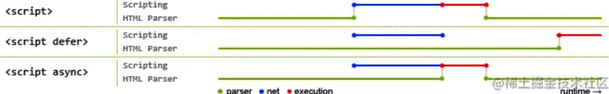

### 1. src和href的区别

src和href都是 **用来引用外部的资源** ，它们的区别如下：

* **src：** 表示对资源的引用，它指向的内容会嵌入到当前标签所在的位置。src会将其指向的资源下载并应⽤到⽂档内，如请求js脚本。当浏览器解析到该元素时，会暂停其他资源的下载和处理，直到将该资源加载、编译、执⾏完毕，所以⼀般js脚本会放在页面底部。
* **href：** 表示超文本引用，它指向一些网络资源，建立和当前元素或本文档的链接关系。当浏览器识别到它他指向的⽂件时，就会并⾏下载资源，不会停⽌对当前⽂档的处理。 常用在a、link等标签上。

### 2. 对HTML语义化的理解

 **语义化是指根据内容的结构化（内容语义化），选择合适的标签（代码语义化）** 。通俗来讲就是用正确的标签做正确的事情。

语义化的优点如下：

* 对机器友好，带有语义的文字表现力丰富，更适合搜索引擎的爬虫爬取有效信息，有利于SEO。除此之外，语义类还支持读屏软件，根据文章可以自动生成目录；
* 对开发者友好，使用语义类标签增强了可读性，结构更加清晰，开发者能清晰的看出网页的结构，便于团队的开发与维护。

常见的语义化标签：

```html
<header></header>  头部

<nav></nav>  导航栏

<section></section>  区块（有语义化的div）

<main></main>  主要区域

<article></article>  主要内容

<aside></aside>  侧边栏

<footer></footer>  底部
```

### 3. script标签中defer和async的区别 [TODO：补充文档]

如果没有defer或async属性，浏览器会立即加载并执行相应的脚本。它不会等待后续加载的文档元素，读取到就会开始加载和执行，这样就阻塞了后续文档的加载。

下图可以直观的看出三者之间的区别:



其中蓝色代表js脚本网络加载时间，红色代表js脚本执行时间，绿色代表html解析。

 **defer 和 async属性都是去异步加载外部的JS脚本文件，它们都不会阻塞页面的解析** ，其区别如下：

* **执行顺序：** 多个带async属性的标签，不能保证加载的顺序；多个带defer属性的标签，按照加载顺序执行；
* **脚本是否并行执行：**async属性，表示**后续文档的加载和执行与js脚本的加载和执行是并行进行的** ，即异步执行；defer属性，加载后续文档的过程和js脚本的加载(此时仅加载不执行)是并行进行的(异步)，js脚本需要等到文档所有元素解析完成之后才执行，DOMContentLoaded事件触发执行之前。

### 4. 常⽤的meta标签有哪些

`meta` 标签由 `name` 和 `content` 属性定义， **用来描述网页文档的属性** ，比如网页的作者，网页描述，关键词等，除了HTTP标准固定了一些 `name`作为大家使用的共识，开发者还可以自定义name。

常用的meta标签：
（1）`charset`，用来描述HTML文档的编码类型：

```html
<meta charset="UTF-8" >
复制代码
```

（2） `keywords`，页面关键词：

```html
<meta name="keywords" content="关键词" />
复制代码
```

（3）`description`，页面描述：

```html
<meta name="description" content="页面描述内容" />
复制代码
```

（4）`refresh`，页面重定向和刷新：

```html
<meta http-equiv="refresh" content="0;url=" />
复制代码
```

（5）`viewport`，适配移动端，可以控制视口的大小和比例：

```html
<meta name="viewport" content="width=device-width, initial-scale=1, maximum-scale=1">
复制代码
```

其中，`content` 参数有以下几种：

* `width viewport` ：宽度(数值/device-width)
* `height viewport` ：高度(数值/device-height)
* `initial-scale` ：初始缩放比例
* `maximum-scale` ：最大缩放比例
* `minimum-scale` ：最小缩放比例
* `user-scalable` ：是否允许用户缩放(yes/no）

### 5. img的srcset属性的作⽤？[仅作了解]

响应式页面中经常用到根据屏幕密度设置不同的图片。这时就用到了 img 标签的srcset属性。srcset属性用于设置不同屏幕密度下，img 会自动加载不同的图片。用法如下：

```html

复制代码
```

使用上面的代码，就能实现在屏幕密度为1x的情况下加载image-128.png, 屏幕密度为2x时加载image-256.png。

按照上面的实现，不同的屏幕密度都要设置图片地址，目前的屏幕密度有1x,2x,3x,4x四种，如果每一个图片都设置4张图片，加载就会很慢。所以就有了新的srcset标准。代码如下：

```html

复制代码
```

其中srcset指定图片的地址和对应的图片质量。sizes用来设置图片的尺寸零界点。对于 srcset 中的 w 单位，可以理解成图片质量。如果可视区域小于这个质量的值，就可以使用。浏览器会自动选择一个最小的可用图片。

sizes语法如下：

```html
sizes="[media query] [length], [media query] [length] ... "
复制代码
```

sizes就是指默认显示128px, 如果视区宽度大于360px, 则显示340px。

### 6.  行内元素有哪些？块级元素有哪些？ 空(void)元素有那些？

* 行内元素有：`a b span img input select strong`；
* 块级元素有：`div ul ol li dl dt dd h1 h2 h3 h4 h5 h6 p`；

空元素，即没有内容的HTML元素。空元素是在开始标签中关闭的，也就是空元素没有闭合标签：

* 常见的有：`<br>`、`<hr>`、``、`<input>`、`<link>`、`<meta>`；
* 鲜见的有：`<area>`、`<base>`、`<col>`、`<colgroup>`、`<command>`、`<embed>`、`<keygen>`、`<param>`、`<source>`、`<track>`、`<wbr>`。

### 7. **iframe 有那些优点和缺点？**

iframe 元素会创建包含另外一个文档的内联框架（即行内框架）。

**优点：**

* 用来加载速度较慢的内容（如广告）
* 可以使脚本可以并行下载
* 可以实现跨子域通信

**缺点：**

* iframe 会阻塞主页面的 onload 事件
* 无法被一些搜索引擎索识别
* 会产生很多页面，不容易管理

### 8. label 的作用是什么？如何使用？

label标签来定义表单控件的关系：当用户选择label标签时，浏览器会自动将焦点转到和label标签相关的表单控件上。

* 使用方法1：

```html
<label for="mobile">Number:</label>
<input type="text" id="mobile"/>
复制代码
```

* 使用方法2：

```html
<label>Date:<input type="text"/></label>
```

### 9. Canvas和SVG的区别

**（1）SVG：**
SVG可缩放矢量图形（Scalable Vector Graphics）是基于可扩展标记语言XML描述的2D图形的语言，SVG基于XML就意味着SVG DOM中的每个元素都是可用的，可以为某个元素附加Javascript事件处理器。在 SVG 中，每个被绘制的图形均被视为对象。如果 SVG 对象的属性发生变化，那么浏览器能够自动重现图形。

其特点如下：

* 不依赖分辨率
* 支持事件处理器
* 最适合带有大型渲染区域的应用程序（比如谷歌地图）
* 复杂度高会减慢渲染速度（任何过度使用 DOM 的应用都不快）
* 不适合游戏应用

**（2）Canvas：**
Canvas是画布，通过Javascript来绘制2D图形，是逐像素进行渲染的。其位置发生改变，就会重新进行绘制。

其特点如下：

* 依赖分辨率
* 不支持事件处理器
* 弱的文本渲染能力
* 能够以 .png 或 .jpg 格式保存结果图像
* 最适合图像密集型的游戏，其中的许多对象会被频繁重绘

注：矢量图，也称为面向对象的图像或绘图图像，在数学上定义为一系列由线连接的点。矢量文件中的图形元素称为对象。每个对象都是一个自成一体的实体，它具有颜色、形状、轮廓、大小和屏幕位置等属性。

### 10. 渐进增强和优雅降级之间的区别[仅作了解]

 **（1）渐进增强（progressive enhancement）** ：主要是针对低版本的浏览器进行页面重构，保证基本的功能情况下，再针对高级浏览器进行效果、交互等方面的改进和追加功能，以达到更好的用户体验。
 **（2）优雅降级 graceful degradation** ： 一开始就构建完整的功能，然后再针对低版本的浏览器进行兼容。

**两者区别：**

* 优雅降级是从复杂的现状开始的，并试图减少用户体验的供给；而渐进增强是从一个非常基础的，能够起作用的版本开始的，并在此基础上不断扩充，以适应未来环境的需要；
* 降级（功能衰竭）意味着往回看，而渐进增强则意味着往前看，同时保证其根基处于安全地带。

“优雅降级”观点认为应该针对那些最高级、最完善的浏览器来设计网站。而将那些被认为“过时”或有功能缺失的浏览器下的测试工作安排在开发周期的最后阶段，并把测试对象限定为主流浏览器（如 IE、Mozilla 等）的前一个版本。 在这种设计范例下，旧版的浏览器被认为仅能提供“简陋却无妨 (poor, but passable)” 的浏览体验。可以做一些小的调整来适应某个特定的浏览器。但由于它们并非我们所关注的焦点，因此除了修复较大的错误之外，其它的差异将被直接忽略。

“渐进增强”观点则认为应关注于内容本身。内容是建立网站的诱因，有的网站展示它，有的则收集它，有的寻求，有的操作，还有的网站甚至会包含以上的种种，但相同点是它们全都涉及到内容。这使得“渐进增强”成为一种更为合理的设计范例。这也是它立即被 Yahoo 所采纳并用以构建其“分级式浏览器支持 (Graded Browser Support)”策略的原因所在。

### 11. 说一下 HTML5 drag API [知道个大概就行]

* dragstart：事件主体是被拖放元素，在开始拖放被拖放元素时触发。
* darg：事件主体是被拖放元素，在正在拖放被拖放元素时触发。
* dragenter：事件主体是目标元素，在被拖放元素进入某元素时触发。
* dragover：事件主体是目标元素，在被拖放在某元素内移动时触发。
* dragleave：事件主体是目标元素，在被拖放元素移出目标元素是触发。
* drop：事件主体是目标元素，在目标元素完全接受被拖放元素时触发。
* dragend：事件主体是被拖放元素，在整个拖放操作结束时触发。

### 12. 常见的CSS布局单位

常用的布局单位包括像素（`px`），百分比（`%`），`em`，`rem`，`vw/vh`。

 **（1）像素** （`px`）是页面布局的基础，一个像素表示终端（电脑、手机、平板等）屏幕所能显示的最小的区域，像素分为两种类型：CSS像素和物理像素：

* **CSS像素** ：为web开发者提供，在CSS中使用的一个抽象单位；
* **物理像素** ：只与设备的硬件密度有关，任何设备的物理像素都是固定的。

 **（2）百分比** （`%`），当浏览器的宽度或者高度发生变化时，通过百分比单位可以使得浏览器中的组件的宽和高随着浏览器的变化而变化，从而实现响应式的效果。一般认为子元素的百分比相对于直接父元素。

**（3）em和rem**相对于px更具灵活性，它们都是相对长度单位，它们之间的区别：**em相对于父元素，rem相对于根元素。**

* **em：** 文本相对长度单位。相对于当前对象内文本的字体尺寸。如果当前行内文本的字体尺寸未被人为设置，则相对于浏览器的默认字体尺寸(默认16px)。(相对父元素的字体大小倍数)。
* **rem：** rem是CSS3新增的一个相对单位，相对于根元素（html元素）的font-size的倍数。 **作用** ：利用rem可以实现简单的响应式布局，可以利用html元素中字体的大小与屏幕间的比值来设置font-size的值，以此实现当屏幕分辨率变化时让元素也随之变化。

**（4）vw/vh**是与视图窗口有关的单位，vw表示相对于视图窗口的宽度，vh表示相对于视图窗口高度，除了vw和vh外，还有vmin和vmax两个相关的单位。

* vw：相对于视窗的宽度，视窗宽度是100vw；
* vh：相对于视窗的高度，视窗高度是100vh；
* vmin：vw和vh中的较小值；
* vmax：vw和vh中的较大值；

**vw/vh** 和百分比很类似，两者的区别：

* 百分比（`%`）：大部分相对于祖先元素，也有相对于自身的情况比如（border-radius、translate等)
* vw/vm：相对于视窗的尺寸

### 13. px、em、rem的区别及使用场景

**三者的区别：**

* px是固定的像素，一旦设置了就无法因为适应页面大小而改变。
* em和rem相对于px更具有灵活性，他们是相对长度单位，其长度不是固定的，更适用于响应式布局。
* em是相对于其父元素来设置字体大小，这样就会存在一个问题，进行任何元素设置，都有可能需要知道他父元素的大小。而rem是相对于根元素，这样就意味着，只需要在根元素确定一个参考值。

**使用场景：**

* 对于只需要适配少部分移动设备，且分辨率对页面影响不大的，使用px即可 。
* 对于需要适配各种移动设备，使用rem，例如需要适配iPhone和iPad等分辨率差别比较挺大的设备。

### 14. 两栏布局的实现

一般两栏布局指的是 **左边一栏宽度固定，右边一栏宽度自适应** ，两栏布局的具体实现：

* 利用浮动，将左边元素宽度设置为200px，并且设置向左浮动。将右边元素的margin-left设置为200px，宽度设置为auto（默认为auto，撑满整个父元素）。

```css
.outer {
  height: 100px;
}
.left {
  float: left;
  width: 200px;
  background: tomato;
}
.right {
  margin-left: 200px;
  width: auto;
  background: gold;
}
复制代码
```

* 利用浮动，左侧元素设置固定大小，并左浮动，右侧元素设置overflow: hidden; 这样右边就触发了BFC，BFC的区域不会与浮动元素发生重叠，所以两侧就不会发生重叠。

```css
.left{
     width: 100px;
     height: 200px;
     background: red;
     float: left;
 }
 .right{
     height: 300px;
     background: blue;
     overflow: hidden;
 }
复制代码
```

* 利用flex布局，将左边元素设置为固定宽度200px，将右边的元素设置为flex:1。

```css
.outer {
  display: flex;
  height: 100px;
}
.left {
  width: 200px;
  background: tomato;
}
.right {
  flex: 1;
  background: gold;
}
复制代码
```

* 利用绝对定位，将父级元素设置为相对定位。左边元素设置为absolute定位，并且宽度设置为200px。将右边元素的margin-left的值设置为200px。

```css
.outer {
  position: relative;
  height: 100px;
}
.left {
  position: absolute;
  width: 200px;
  height: 100px;
  background: tomato;
}
.right {
  margin-left: 200px;
  background: gold;
}
复制代码
```

* 利用绝对定位，将父级元素设置为相对定位。左边元素宽度设置为200px，右边元素设置为绝对定位，左边定位为200px，其余方向定位为0。

```css
.outer {
  position: relative;
  height: 100px;
}
.left {
  width: 200px;
  background: tomato;
}
.right {
  position: absolute;
  top: 0;
  right: 0;
  bottom: 0;
  left: 200px;
  background: gold;
}
复制代码
```

### 15. 三栏布局的实现

三栏布局一般指的是页面中一共有三栏， **左右两栏宽度固定，中间自适应的布局** ，三栏布局的具体实现：

* 利用 **绝对定位** ，左右两栏设置为绝对定位，中间设置对应方向大小的margin的值。

```css
.outer {
  position: relative;
  height: 100px;
}

.left {
  position: absolute;
  width: 100px;
  height: 100px;
  background: tomato;
}

.right {
  position: absolute;
  top: 0;
  right: 0;
  width: 200px;
  height: 100px;
  background: gold;
}

.center {
  margin-left: 100px;
  margin-right: 200px;
  height: 100px;
  background: lightgreen;
}
复制代码
```

* 利用flex布局，左右两栏设置固定大小，中间一栏设置为flex:1。

```css
.outer {
  display: flex;
  height: 100px;
}

.left {
  width: 100px;
  background: tomato;
}

.right {
  width: 100px;
  background: gold;
}

.center {
  flex: 1;
  background: lightgreen;
}
复制代码
```

* 利用浮动，左右两栏设置固定大小，并设置对应方向的浮动。中间一栏设置左右两个方向的margin值，注意这种方式**，中间一栏必须放到最后：**

```css
.outer {
  height: 100px;
}

.left {
  float: left;
  width: 100px;
  height: 100px;
  background: tomato;
}

.right {
  float: right;
  width: 200px;
  height: 100px;
  background: gold;
}

.center {
  height: 100px;
  margin-left: 100px;
  margin-right: 200px;
  background: lightgreen;
}
复制代码
```

* 圣杯布局，利用浮动和负边距来实现。父级元素设置左右的 padding，三列均设置向左浮动，中间一列放在最前面，宽度设置为父级元素的宽度，因此后面两列都被挤到了下一行，通过设置 margin 负值将其移动到上一行，再利用相对定位，定位到两边。

```css
.outer {
  height: 100px;
  padding-left: 100px;
  padding-right: 200px;
}

.left {
  position: relative;
  left: -100px;

  float: left;
  margin-left: -100%;

  width: 100px;
  height: 100px;
  background: tomato;
}

.right {
  position: relative;
  left: 200px;

  float: right;
  margin-left: -200px;

  width: 200px;
  height: 100px;
  background: gold;
}

.center {
  float: left;

  width: 100%;
  height: 100px;
  background: lightgreen;
}
复制代码
```

* 双飞翼布局，双飞翼布局相对于圣杯布局来说，左右位置的保留是通过中间列的 margin 值来实现的，而不是通过父元素的 padding 来实现的。本质上来说，也是通过浮动和外边距负值来实现的。

```css
.outer {
  height: 100px;
}

.left {
  float: left;
  margin-left: -100%;

  width: 100px;
  height: 100px;
  background: tomato;
}

.right {
  float: left;
  margin-left: -200px;

  width: 200px;
  height: 100px;
  background: gold;
}

.wrapper {
  float: left;

  width: 100%;
  height: 100px;
  background: lightgreen;
}

.center {
  margin-left: 100px;
  margin-right: 200px;
  height: 100px;
}
复制代码
```

### 16. 水平垂直居中的实现

* 利用绝对定位，先将元素的左上角通过top:50%和left:50%定位到页面的中心，然后再通过translate来调整元素的中心点到页面的中心。该方法需要**考虑浏览器兼容问题。**

```css
.parent {    position: relative;} .child {    position: absolute;    left: 50%;    top: 50%;    transform: translate(-50%,-50%);}
复制代码
```

* 利用绝对定位，设置四个方向的值都为0，并将margin设置为auto，由于宽高固定，因此对应方向实现平分，可以实现水平和垂直方向上的居中。该方法适用于**盒子有宽高**的情况：

```css
.parent {
    position: relative;
}
 
.child {
    position: absolute;
    top: 0;
    bottom: 0;
    left: 0;
    right: 0;
    margin: auto;
}
复制代码
```

* 利用绝对定位，先将元素的左上角通过top:50%和left:50%定位到页面的中心，然后再通过margin负值来调整元素的中心点到页面的中心。该方法适用于**盒子宽高已知**的情况

```css
.parent {
    position: relative;
}
 
.child {
    position: absolute;
    top: 50%;
    left: 50%;
    margin-top: -50px;     /* 自身 height 的一半 */
    margin-left: -50px;    /* 自身 width 的一半 */
}
复制代码
```

* 使用flex布局，通过align-items:center和justify-content:center设置容器的垂直和水平方向上为居中对齐，然后它的子元素也可以实现垂直和水平的居中。该方法要 **考虑兼容的问题** ，该方法在移动端用的较多：

```css
.parent {
    display: flex;
    justify-content:center;
    align-items:center;
}
复制代码
```

### 17. 对Flex布局的理解及其使用场景

Flex是FlexibleBox的缩写，意为"弹性布局"，用来为盒状模型提供最大的灵活性。任何一个容器都可以指定为Flex布局。行内元素也可以使用Flex布局。注意，设为Flex布局以后， **子元素的float、clear和vertical-align属性将失效** 。采用Flex布局的元素，称为Flex容器（flex container），简称"容器"。它的所有子元素自动成为容器成员，称为Flex项目（flex item），简称"项目"。容器默认存在两根轴：水平的主轴（main axis）和垂直的交叉轴（cross axis），项目默认沿水平主轴排列。

以下6个属性设置在 **容器上** ：

* flex-direction属性决定主轴的方向（即项目的排列方向）。
* flex-wrap属性定义，如果一条轴线排不下，如何换行。
* flex-flow属性是flex-direction属性和flex-wrap属性的简写形式，默认值为row nowrap。
* justify-content属性定义了项目在主轴上的对齐方式。
* align-items属性定义项目在交叉轴上如何对齐。
* align-content属性定义了多根轴线的对齐方式。如果项目只有一根轴线，该属性不起作用。

以下6个属性设置在 **项目上** ：

* order属性定义项目的排列顺序。数值越小，排列越靠前，默认为0。
* flex-grow属性定义项目的放大比例，默认为0，即如果存在剩余空间，也不放大。
* flex-shrink属性定义了项目的缩小比例，默认为1，即如果空间不足，该项目将缩小。
* flex-basis属性定义了在分配多余空间之前，项目占据的主轴空间。浏览器根据这个属性，计算主轴是否有多余空间。它的默认值为auto，即项目的本来大小。
* flex属性是flex-grow，flex-shrink和flex-basis的简写，默认值为0 1 auto。
* align-self属性允许单个项目有与其他项目不一样的对齐方式，可覆盖align-items属性。默认值为auto，表示继承父元素的align-items属性，如果没有父元素，则等同于stretch。

**简单来说：**
flex布局是CSS3新增的一种布局方式，可以通过将一个元素的display属性值设置为flex从而使它成为一个flex容器，它的所有子元素都会成为它的项目。一个容器默认有两条轴：一个是水平的主轴，一个是与主轴垂直的交叉轴。可以使用flex-direction来指定主轴的方向。可以使用justify-content来指定元素在主轴上的排列方式，使用align-items来指定元素在交叉轴上的排列方式。还可以使用flex-wrap来规定当一行排列不下时的换行方式。对于容器中的项目，可以使用order属性来指定项目的排列顺序，还可以使用flex-grow来指定当排列空间有剩余的时候，项目的放大比例，还可以使用flex-shrink来指定当排列空间不足时，项目的缩小比例。

### 18.说说浏览器的reflow和repaint

 浏览器解析过程

1. 解析html生成dom树
2. 解析css
3. 把css应用于dom树，生成render树(这里记录这每一个节点和它的样式和所在的位置)
4. 把render树渲染到页面

#### reflow(回流)

reflow翻译为回流，指的是页面再次构建render树。每个页面至少发生一次回流，就是第一次加载页面的时候

此外，当页面中有任何改变可能造成文档结构发生改变(即元素间的相对或绝对位置改变)，都会发生reflow，常见的有：

* 添加或删除元素(opacity:0除外，它不是删除)
* 改变某个元素的尺寸或位置
* 浏览器窗口改变(resize事件触发)

#### repaint(重绘)

repaint翻译为重绘，它可以类比为上面的第四步，根据render树绘制页面，它的性能损耗比回流要小。每次回流一定会发生重绘。此外，以下操作(不影响文档结构的操作，影响结构的会发生回流)也会发生重绘：

1. 元素的颜色、透明度改变
2. text-align等

### 浏览器优化

我们不太容易精确知道哪些操作具体会造成哪些元素回流，不同的浏览器都有不同的实现。但是确定是他们的的耗时是比较长的，因为涉及到大量的计算。

浏览器为了提升性能也对这个问题进行了优化。方案就是维护一个队列,把所有需要回流和重绘的操作都缓存起来，一段时间之后再统一执行。但是，有的时候我们需要获取一些位置属性，当我们一旦调用这些api的时候，浏览器不得不立即计算队列以保证提供的数据是准确的。例如以下操作：

* offsetTop, offsetLeft, offsetWidth, offsetHeight
* scrollTop/Left/Width/Height
* clientTop/Left/Width/Height
* width,height
* getComputedStyle或者IE的currentStyle

#### 注意问题

1. 批量处理

* 使用DocumentFragment进行缓存，这样只引发一次回流
* 把频繁操作的元素先display：null，只引发两次回流
* cloneNode和replaceChild，只引发两次回流

2. 不要频繁更改style，而是更改class
3. 避免频繁调用offsetTop等属性，在循环前把它缓存起来
4. 绝对定位具有复杂动画的元素，否则会引起父元素和后续大量元素的频繁回流
