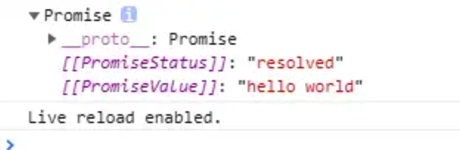

1、 call apply bind自己实现

https://blog.csdn.net/weixin_34257076/article/details/91389234

```js
// call:
Function.prototype.myCall = function (obj) {
  const object = obj || window;
  let args = [...arguments].slice(1)
  object.func = this;
  const res = object.func(...args)
  delete object.func
  return res
}
// apply:
Function.prototype.myApply = function (obj) {
  const object = obj || window;
  let args = []
  if (arguments.length > 1) {
    args = arguments[1]
  }
  object.func = this;
  const res = object.func(...args)
  delete object.func
  return res
}
// bind:
Function.prototype.myBind = function (obj) {
  const object = obj || window;
  let _this = this;
  let args = [...arguments].slice(1)
  return function () {
    let newArgs = [...arguments]
    return _this.apply(object, args.concat(newArgs))
  }
}

```

手写观察者模式：

https://juejin.cn/post/6844903566570684424


js里面的单例模式：

```js
function a(name) {
  this.name = name;
  this.instance = null;
}
a.get = function (name) {
  if (!this.instance) {
    this.instance = new a(name)
  }
  return this.instance
}
class b {
  constructor(name) {
    this.name = name;
    this.instance = null
  }
  static get(name) {
    if (!this.instance) {
      this.instance = new b(name)
    }
    return this.instance
  }
}

```


科里化：

```js
// 通⽤版科⾥化：
function curry(fn, args) {
  var length = fn.length;
  var args = args || [];
  return function () {
    newArgs = args.concat(Array.prototype.slice.call(arguments));
    if (newArgs.length < length) {
      return curry.call(this, fn, newArgs);
    } else {
      return fn.apply(this, newArgs);
    }
  }
}
function multiFn(a, b, c) {
  return a * b * c;
}
var multi = curry(multiFn);
multi(2)(3)(4);
multi(2, 3, 4);
multi(2)(3, 4);
multi(2, 3)(4);

```

实现一个睡眠1s钟功能：

```js
// 实现sleep(1000)：
function sleep(ms) {
  var time = Date.now()
  var ex = time + ms
  while (Date.now() < ex)
    console.log('execute')
  return
}
function sleep2(ms) {
  return new Promise(resolve => {
    setTimeout(resolve, ms)
  })
}
sleep2(500).then(res => {

})
async function test() {
  await sleep2(1000)
  console.log(1)
}
test()

```

手写ajax：

```js
//⼿写ajax；
//参数：method,url,header,data,success,faild
function ajax(obj) {
  let promise = new Promise(function (resolve, reject) {
    let request = new XMLHttpRequest()
    request.open(obj.method, obj.url)
    request.setRequestHeader('Content-Type', obj.header || "application/x-www￾form-urlencoded")
    request.onreadystatechage = () => {
      if (request.readystate === 4) {
        if (status === 200) {
          resolve(request.responseText)
        }
        else {
          reject(new Error(request.statusText))
        }
      }
    }
    request.send(obj.data || {})
  })
  promise.then(obj.success, obj.faild)
}
//  ⾃⼰写⼀个ajax：
var xhr = new XMLHttpRequest()
xhr.onreadystatechange = function () {
  if (xhr.readyState == 4) {
    if ((xhr.status >= 200 && xhr.status < 300 || xhr.status == 304)) {
      alert(xhr.responseText)
    } else {
      alert('unsuccessful:' + xhr.status)
    }
  }
}
xhr.open('get', 'example.txt', true)
xhr.send(null)

```

自己实现一个instanceOf：

```js
function f1(left, right) {
  let prototype = right.prototype;
  let proto = left.__proto__;
  while (true) {
    if (proto === prototype)
      return true;
    if (proto === null)
      return false;
    //若本次查找⽆结果，则沿着原型链向上查找
    proto = proto.__proto__;
  }
}
var a = [1, 2, 3];
console.log(f1(a, Array));
 //true

```

自己实现一个new：

```js
// ⾃⼰实现⼀个new：
function _new(fn, ...arg) {
  const obj = {}; //创建⼀个新的对象
  obj.__proto__ = fn.prototype; //把obj的__proto__指向fn的prototype,实现继承
  fn.apply(obj, arg) //改变this的指向
  return Object.prototype.toString.call(obj) == '[object Object]' ? obj : {} //返回新
  的对象obj
}
var dog = _new(Dog, 'aaa')
dog.say() //'name = aaa'

```

写一个懒汉：

https://www.cnblogs.com/EnSnail/p/9866130.html

### 1. 异步编程的实现方式？

JavaScript中的异步机制可以分为以下几种：

* **回调函数** 的方式，使用回调函数的方式有一个缺点是，多个回调函数嵌套的时候会造成回调函数地狱，上下两层的回调函数间的代码耦合度太高，不利于代码的可维护。
* **Promise** 的方式，使用 Promise 的方式可以将嵌套的回调函数作为链式调用。但是使用这种方法，有时会造成多个 then 的链式调用，可能会造成代码的语义不够明确。
* **generator** 的方式，它可以在函数的执行过程中，将函数的执行权转移出去，在函数外部还可以将执行权转移回来。当遇到异步函数执行的时候，将函数执行权转移出去，当异步函数执行完毕时再将执行权给转移回来。因此在 generator 内部对于异步操作的方式，可以以同步的顺序来书写。使用这种方式需要考虑的问题是何时将函数的控制权转移回来，因此需要有一个自动执行 generator 的机制，比如说 co 模块等方式来实现 generator 的自动执行。
* **async 函数** 的方式，async 函数是 generator 和 promise 实现的一个自动执行的语法糖，它内部自带执行器，当函数内部执行到一个 await 语句的时候，如果语句返回一个 promise 对象，那么函数将会等待 promise 对象的状态变为 resolve 后再继续向下执行。因此可以将异步逻辑，转化为同步的顺序来书写，并且这个函数可以自动执行。

### 2、promise

自己手写promise

```
const PENDING = "pending";
const RESOLVED = "resolved";
const REJECTED = "rejected";

function MyPromise(fn) {
  // 保存初始化状态
  var self = this;

  // 初始化状态
  this.state = PENDING;

  // 用于保存 resolve 或者 rejected 传入的值
  this.value = null;

  // 用于保存 resolve 的回调函数
  this.resolvedCallbacks = [];

  // 用于保存 reject 的回调函数
  this.rejectedCallbacks = [];

  // 状态转变为 resolved 方法
  function resolve(value) {
    // 判断传入元素是否为 Promise 值，如果是，则状态改变必须等待前一个状态改变后再进行改变
    if (value instanceof MyPromise) {
      return value.then(resolve, reject);
    }

    // 保证代码的执行顺序为本轮事件循环的末尾
    setTimeout(() => {
      // 只有状态为 pending 时才能转变，
      if (self.state === PENDING) {
        // 修改状态
        self.state = RESOLVED;

        // 设置传入的值
        self.value = value;

        // 执行回调函数
        self.resolvedCallbacks.forEach(callback => {
          callback(value);
        });
      }
    }, 0);
  }

  // 状态转变为 rejected 方法
  function reject(value) {
    // 保证代码的执行顺序为本轮事件循环的末尾
    setTimeout(() => {
      // 只有状态为 pending 时才能转变
      if (self.state === PENDING) {
        // 修改状态
        self.state = REJECTED;

        // 设置传入的值
        self.value = value;

        // 执行回调函数
        self.rejectedCallbacks.forEach(callback => {
          callback(value);
        });
      }
    }, 0);
  }

  // 将两个方法传入函数执行
  try {
    fn(resolve, reject);
  } catch (e) {
    // 遇到错误时，捕获错误，执行 reject 函数
    reject(e);
  }
}

MyPromise.prototype.then = function(onResolved, onRejected) {
  // 首先判断两个参数是否为函数类型，因为这两个参数是可选参数
  onResolved =
    typeof onResolved === "function"
      ? onResolved
      : function(value) {
          return value;
        };

  onRejected =
    typeof onRejected === "function"
      ? onRejected
      : function(error) {
          throw error;
        };

  // 如果是等待状态，则将函数加入对应列表中
  if (this.state === PENDING) {
    this.resolvedCallbacks.push(onResolved);
    this.rejectedCallbacks.push(onRejected);
  }

  // 如果状态已经凝固，则直接执行对应状态的函数

  if (this.state === RESOLVED) {
    onResolved(this.value);
  }

  if (this.state === REJECTED) {
    onRejected(this.value);
  }
};

```

对promise的理解[TODO: 补充文档]

#### 1. Promise解决了什么问题

在工作中经常会碰到这样一个需求，比如我使用ajax发一个A请求后，成功后拿到数据，需要把数据传给B请求；那么需要如下编写代码：

```javascript
let fs = require('fs')
fs.readFile('./a.txt','utf8',function(err,data){
  fs.readFile(data,'utf8',function(err,data){
    fs.readFile(data,'utf8',function(err,data){
      console.log(data)
    })
  })
})
复制代码
```

上面的代码有如下缺点：

* 后一个请求需要依赖于前一个请求成功后，将数据往下传递，会导致多个ajax请求嵌套的情况，代码不够直观。
* 如果前后两个请求不需要传递参数的情况下，那么后一个请求也需要前一个请求成功后再执行下一步操作，这种情况下，那么也需要如上编写代码，导致代码不够直观。

`Promise`出现之后，代码变成这样：

```javascript
let fs = require('fs')
function read(url){
  return new Promise((resolve,reject)=>{
    fs.readFile(url,'utf8',function(error,data){
      error && reject(error)
      resolve(data)
    })
  })
}
read('./a.txt').then(data=>{
  return read(data) 
}).then(data=>{
  return read(data)  
}).then(data=>{
  console.log(data)
})
复制代码
```

这样代码看起了就简洁了很多，解决了地狱回调的问题。

#### 2. Promise.all和Promise.race的区别的使用场景

**（1）Promise.all**
`Promise.all`可以将多个 `Promise`实例包装成一个新的Promise实例。同时，成功和失败的返回值是不同的，成功的时候返回的是 **一个结果数组** ，而失败的时候则返回 **最先被reject失败状态的值** 。

Promise.all中传入的是数组，返回的也是是数组，并且会将进行映射，传入的promise对象返回的值是按照顺序在数组中排列的，但是注意的是他们执行的顺序并不是按照顺序的，除非可迭代对象为空。

需要注意，Promise.all获得的成功结果的数组里面的数据顺序和Promise.all接收到的数组顺序是一致的，这样当遇到发送多个请求并根据请求顺序获取和使用数据的场景，就可以使用Promise.all来解决。

**（2）Promise.race**

顾名思义，Promse.race就是赛跑的意思，意思就是说，Promise.race([p1, p2, p3])里面哪个结果获得的快，就返回那个结果，不管结果本身是成功状态还是失败状态。当要做一件事，超过多长时间就不做了，可以用这个方法来解决：

```javascript
Promise.race([promise1,timeOutPromise(5000)]).then(res=>{})
复制代码
```

### 3.  对async/await 的理解

#### 1、概念

async/await其实是 `Generator` 的语法糖，它能实现的效果都能用then链来实现，它是为优化then链而开发出来的。从字面上来看，async是“异步”的简写，await则为等待，所以很好理解async 用于申明一个 function 是异步的，而 await 用于等待一个异步方法执行完成。当然语法上强制规定await只能出现在asnyc函数中，先来看看async函数返回了什么：

```javascript
async function testAsy(){
   return 'hello world';
}
let result = testAsy(); 
console.log(result)
复制代码
```



所以，async 函数返回的是一个 Promise 对象。async 函数（包含函数语句、函数表达式、Lambda表达式）会返回一个 Promise 对象，如果在函数中 `return` 一个直接量，async 会把这个直接量通过 `Promise.resolve()` 封装成 Promise 对象。

async 函数返回的是一个 Promise 对象，所以在最外层不能用 await 获取其返回值的情况下，当然应该用原来的方式：`then()` 链来处理这个 Promise 对象，就像这样：

```javascript
async function testAsy(){
   return 'hello world'
}
let result = testAsy() 
console.log(result)
result.then(v=>{
    console.log(v)   // hello world
})
复制代码
```

那如果 async 函数没有返回值，又该如何？很容易想到，它会返回 `Promise.resolve(undefined)`。

联想一下 Promise 的特点——无等待，所以在没有 `await` 的情况下执行 async 函数，它会立即执行，返回一个 Promise 对象，并且，绝不会阻塞后面的语句。这和普通返回 Promise 对象的函数并无二致。

 **注意：** `Promise.resolve(x)` 可以看作是 `new Promise(resolve => resolve(x))` 的简写，可以用于快速封装字面量对象或其他对象，将其封装成 Promise 实例。

#### 2. await 到底在等啥？

**await 在等待什么呢？** 一般来说，都认为 await 是在等待一个 async 函数完成。不过按语法说明，await 等待的是一个表达式，这个表达式的计算结果是 Promise 对象或者其它值（换句话说，就是没有特殊限定）。

因为 async 函数返回一个 Promise 对象，所以 await 可以用于等待一个 async 函数的返回值——这也可以说是 await 在等 async 函数，但要清楚，它等的实际是一个返回值。注意到 await 不仅仅用于等 Promise 对象，它可以等任意表达式的结果，所以，await 后面实际是可以接普通函数调用或者直接量的。所以下面这个示例完全可以正确运行：

```javascript
function getSomething() {
    return "something";
}
async function testAsync() {
    return Promise.resolve("hello async");
}
async function test() {
    const v1 = await getSomething();
    const v2 = await testAsync();
    console.log(v1, v2);
}
test();
复制代码
```

await 表达式的运算结果取决于它等的是什么。

* 如果它等到的不是一个 Promise 对象，那 await 表达式的运算结果就是它等到的东西。
* 如果它等到的是一个 Promise 对象，await 就忙起来了，它会阻塞后面的代码，等着 Promise 对象 resolve，然后得到 resolve 的值，作为 await 表达式的运算结果。

来看一个例子：

```javascript
function testAsy(x){
   return new Promise(resolve=>{setTimeout(() => {
       resolve(x);
     }, 3000)
    }
   )
}
async function testAwt(){  
  let result =  await testAsy('hello world');
  console.log(result);    // 3秒钟之后出现hello world
  console.log('cuger')   // 3秒钟之后出现cug
}
testAwt();
console.log('cug')  //立即输出cug
复制代码
```

这就是 await 必须用在 async 函数中的原因。async 函数调用不会造成阻塞，它内部所有的阻塞都被封装在一个 Promise 对象中异步执行。await暂停当前async的执行，所以'cug''最先输出，hello world'和‘cuger’是3秒钟后同时出现的。

#### 3.  async/await的优势

单一的 Promise 链并不能发现 async/await 的优势，但是，如果需要处理由多个 Promise 组成的 then 链的时候，优势就能体现出来了（很有意思，Promise 通过 then 链来解决多层回调的问题，现在又用 async/await 来进一步优化它）。

假设一个业务，分多个步骤完成，每个步骤都是异步的，而且依赖于上一个步骤的结果。仍然用 `setTimeout` 来模拟异步操作：

```javascript
/**
 * 传入参数 n，表示这个函数执行的时间（毫秒）
 * 执行的结果是 n + 200，这个值将用于下一步骤
 */
function takeLongTime(n) {
    return new Promise(resolve => {
        setTimeout(() => resolve(n + 200), n);
    });
}
function step1(n) {
    console.log(`step1 with ${n}`);
    return takeLongTime(n);
}
function step2(n) {
    console.log(`step2 with ${n}`);
    return takeLongTime(n);
}
function step3(n) {
    console.log(`step3 with ${n}`);
    return takeLongTime(n);
}
复制代码
```

现在用 Promise 方式来实现这三个步骤的处理：

```javascript
function doIt() {
    console.time("doIt");
    const time1 = 300;
    step1(time1)
        .then(time2 => step2(time2))
        .then(time3 => step3(time3))
        .then(result => {
            console.log(`result is ${result}`);
            console.timeEnd("doIt");
        });
}
doIt();
// c:\var\test>node --harmony_async_await .
// step1 with 300
// step2 with 500
// step3 with 700
// result is 900
// doIt: 1507.251ms
复制代码
```

输出结果 `result` 是 `step3()` 的参数 `700 + 200` = `900`。`doIt()` 顺序执行了三个步骤，一共用了 `300 + 500 + 700 = 1500` 毫秒，和 `console.time()/console.timeEnd()` 计算的结果一致。

如果用 async/await 来实现呢，会是这样：

```javascript
async function doIt() {
    console.time("doIt");
    const time1 = 300;
    const time2 = await step1(time1);
    const time3 = await step2(time2);
    const result = await step3(time3);
    console.log(`result is ${result}`);
    console.timeEnd("doIt");
}
doIt();
复制代码
```

结果和之前的 Promise 实现是一样的，但是这个代码看起来是不是清晰得多，几乎跟同步代码一样

#### 4. async/await对比Promise的优势

* 代码读起来更加同步，Promise虽然摆脱了回调地狱，但是then的链式调⽤也会带来额外的阅读负担
* Promise传递中间值⾮常麻烦，⽽async/await⼏乎是同步的写法，⾮常优雅
* 错误处理友好，async/await可以⽤成熟的try/catch，Promise的错误捕获⾮常冗余
* 调试友好，Promise的调试很差，由于没有代码块，你不能在⼀个返回表达式的箭头函数中设置断点，如果你在⼀个.then代码块中使⽤调试器的步进(step-over)功能，调试器并不会进⼊后续的.then代码块，因为调试器只能跟踪同步代码的每⼀步。

#### 5. async/await 如何捕获异常

```javascript
async function fn(){
    try{
        let a = await Promise.reject('error')
    }catch(error){
        console.log(error)
    }
}
复制代码


```

### 4.如何去除字符串首位空格？

```
//es6
' ab '.trim()      //"ab" 
//正则
' ab '.replace(/^\s*|\s*$/g,'')  //"ab"
```

5.如何获取url中的查询字符串

```
function queryUrlParameter(str) {
    let obj = {}
    let reg = /([^?=&#]+)=([^?=&#]+)/g;
    str.replace(reg, function () {
        obj[arguments[1]] = arguments[2]
    })
    //如果加上hash
    // reg = /#([^?&=#]+)/g
    // if (reg.test(str)) {
    //     str.replace(reg, function () {
    //         obj.hash = arguments[1]
    //     })
    // }
    return obj
}
console.log(queryUrlParameter('http://www.baidu.com?a=1&b=2#12222'))  //{ a: '1', b: '2'}
```

## 5.如何实现一个深拷贝、深比较

https://juejin.cn/post/6844904197595332622

或者：https://github.com/zcxiaobao/everyday-insist/blob/master/js/Object.assign%E6%98%AF%E6%B5%85%E6%8B%B7%E8%B4%9D%E8%BF%98%E6%98%AF%E6%B7%B1%E6%8B%B7%E8%B4%9D%EF%BC%9F%E5%AE%9E%E7%8E%B0%E6%B7%B1%E6%8B%B7%E8%B4%9D%E7%9A%84%E6%96%B9%E6%B3%95%E6%9C%89%E5%93%AA%E4%BA%9B%EF%BC%9F(2020.01.07).md

```
//浅拷贝 
1. Object.assign(target,source)
2. es6对象扩展运算符。
//深拷贝  
function deepClone(obj) {
      if (!obj || typeof obj !== "object") return;
      let newObj = Array.isArray(obj) ? [] : {};
      for (let key in obj) {
        if (obj.hasOwnProperty(key)) {
          newObj[key] = typeof obj[key] === "object" ? deepClone(obj[key]) : obj[key];
        }
      }
      return newObj;
}
```

## 6.如何实现函数节流和防抖

https://www.cnblogs.com/momo798/p/9177767.html

### 防抖

```javascript
//定义：触发事件后在n秒内函数只能执行一次，如果在n秒内又触发了事件，则会重新计算函数执行时间。
//搜索框搜索输入。只需用户最后一次输入完，再发送请求
//手机号、邮箱验证输入检测 onchange oninput事件
//窗口大小Resize。只需窗口调整完成后，计算窗口大小。防止重复渲染。
const debounce = (fn, wait, immediate) => {
      let timer = null;
      return function (...args) {
        if (timer) clearTimeout(timer);
        if (immediate && !timer) {
          fn.call(this, args);
        }
        timer = setTimeout(() => {
          fn.call(this, args);
        }, wait);
      };
    };
const betterFn = debounce(() => console.log("fn 防抖执行了"), 1000, true);
document.addEventListener("scroll", betterFn);
复制代码
```

### 节流

```javascript
//定义：当持续触发事件时，保证隔间时间触发一次事件。
//1. 懒加载、滚动加载、加载更多或监听滚动条位置；
//2. 百度搜索框，搜索联想功能；
//3. 防止高频点击提交，防止表单重复提交；
function throttle(fn,wait){
    let pre = 0;
    return function(...args){
        let now = Date.now();
        if( now - pre >= wait){
            fn.apply(this,args);
            pre = now;
        }
    }
}
function handle(){
    console.log(Math.random());
}
window.addEventListener("mousemove",throttle(handle,1000));
```

### 如何实现一个数组的展平

```bash
function (ary) {
    return ary.toString().split(',')
}
复制代码
```

这是一个投机取巧的方法(面试写个这个也凑合吧)，如果有兴趣可以搜索一下其他实现方法

## 8.如何添加、删除、移动、复制DOM节点

### 创建

* createTextNode() //创建文本节点
* createElement() //创建元素节点
* createDocumentFragment()  //创建文档碎片

### 操作

* appendChild()  //增加
* removeChild()  //删除
* replaceChild()  //替换
* insertBefore()  //插入

### 查找

* getElementById()
* getElementByTagName()
* getElementByName()

### 如何判断一个对象是否为数组

```
function isArray(arg) {
    if (typeof arg === 'object') {
        return Object.prototype.toString.call(arg) === '[object Array]';
    }
    return false;
}
```

### instanceof

这个手写一定要懂原型及原型链。

```javascript
function myInstanceof(target, origin) {
  if (typeof target !== "object" || target === null) return false;
  if (typeof origin !== "function")
    throw new TypeError("origin must be function");
  let proto = Object.getPrototypeOf(target); // 相当于 proto = target.__proto__;
  while (proto) {
    if (proto === origin.prototype) return true;
    proto = Object.getPrototypeOf(proto);
  }
  return false;
}
```

### 7、带并发的异步调度器 Scheduler

JS 实现一个带并发限制的异度调度器 Scheduler，保证同时运行的任务最多有两个。完善下面代码中的 Scheduler 类，使得以下程序能正确输出。

```javascript
class Scheduler {
  add(promiseMaker) {}
}

const timeout = (time) =>
  new Promise((resolve) => {
    setTimeout(resolve, time);
  });

const scheduler = new Scheduler();
const addTask = (time, order) => {
  scheduler.add(() => timeout(time).then(() => console.log(order)));
};

addTask(1000, "1");
addTask(500, "2");
addTask(300, "3");
addTask(400, "4");
// output：2 3 1 4
// 一开始，1，2两个任务进入队列。
// 500ms 时，2完成，输出2，任务3入队。
// 800ms 时，3完成，输出3，任务4入队。
// 1000ms 时，1完成，输出1。
复制代码
```

根据题目，我们只需要操作 `Scheduler` 类就行：

```javascript
class Scheduler {
  constructor() {
    this.waitTasks = []; // 待执行的任务队列
    this.excutingTasks = []; // 正在执行的任务队列
    this.maxExcutingNum = 2; // 允许同时运行的任务数量
  }

  add(promiseMaker) {
    if (this.excutingTasks.length < this.maxExcutingNum) {
      this.run(promiseMaker);
    } else {
      this.waitTasks.push(promiseMaker);
    }
  }

  run(promiseMaker) {
    const len = this.excutingTasks.push(promiseMaker);
    const index = len - 1;
    promiseMaker().then(() => {
      this.excutingTasks.splice(index, 1);
      if (this.waitTasks.length > 0) {
        this.run(this.waitTasks.shift());
      }
    });
  }
}
复制代码
```

### 8、去重

* 利用 ES6 `set` 关键字：

```javascript
function unique(arr) {
  return [...new Set(arr)];
}
复制代码
```

* 利用 ES5 `filter` 方法：

```javascript
function unique(arr) {
  return arr.filter((item, index, array) => {
    return array.indexOf(item) === index;
  });
}
```

### 9.数组去重,数组对象去重

```javascript
//数组
const arr = [2,7,5,7,2,8,9];
console.log([...new Set(arr)]); // [2,7,5,8,9];
//对象
const list = [{age:18,name:'张三'},{age:18,name:'李四'},{age:18,name:'王五'}]
let hash = {};
const newArr = arr.reduce((item, next) => {
    hash[next.age] ? '' : hash[next.age] = true && item.push(next);
    return item;
}, []);
console.log(list);
复制代码
```

### 数组扁平化

```javascript
function flatten(arr) {
      return arr.reduce((result, item) => {
        return result.concat(Array.isArray(item) ? flatten(item) : item);
      }, []);
```

setTimeout实现setInterval：

```js
function m(fn, time) {
 function a() {
 setTimeout(a, time)
 fn()
 }
 setTimeout(a, time) }
```
