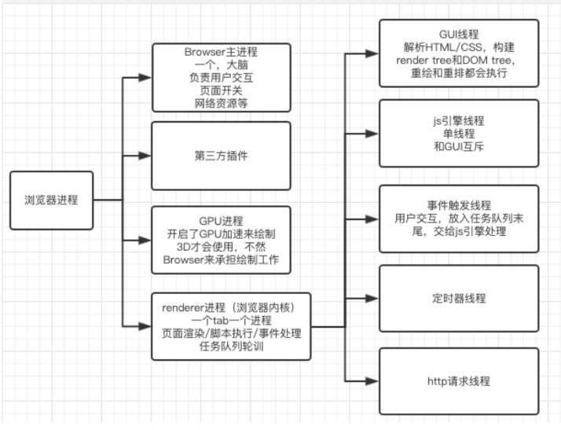
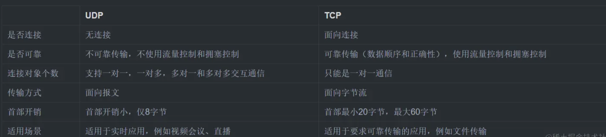
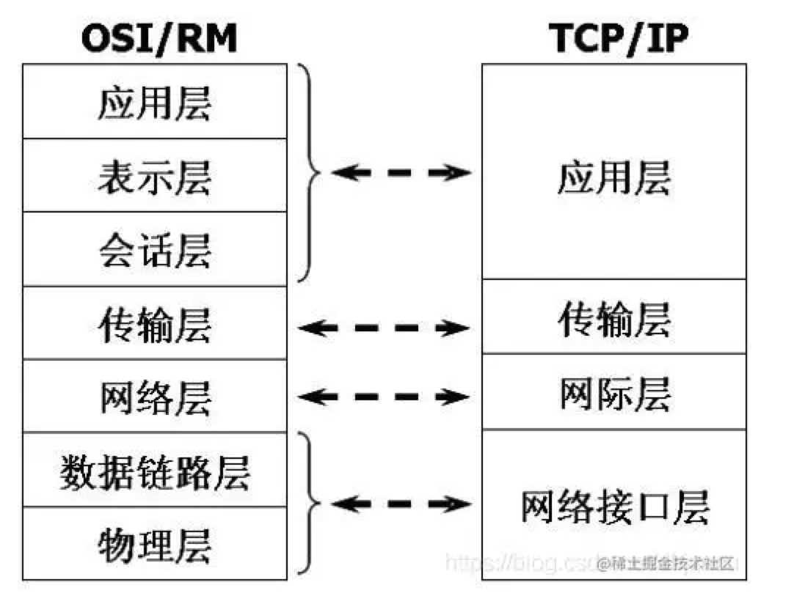

### Javascript之BOM与DOM讲解

https://blog.csdn.net/qq877507054/article/details/51395830

### 进程和线程

进程是分配内存的最⼩单位，线程是CPU调度的最⼩单位，进程可以包含多个线

https://blog.csdn.net/dreamingbaobei3/article/details/89513338

扩展（面试不用看）：https://blog.csdn.net/wangyoucaoxiaoxiao/article/details/86300201



## hash和history区别

https://juejin.cn/post/6993840419041706014

早期的前端路由的实现就是基于 `location.hash` 来实现的。其实现原理很简单，`location.hash` 的值就是 `URL` 中 `#` 后面的内容。比如下面这个网站，它的 `location.hash` 的值为 `#search`：

```js
https://www.word.com#search
复制代码
```

`hash` 路由模式的实现主要是基于下面几个特性：

* `URL` 中 `hash` 值只是客户端的一种状态，也就是说当向服务器端发出请求时，`hash` 部分不会被发送；
* `hash` 值的改变，都会在浏览器的访问历史中增加一个记录。因此我们能通过浏览器的回退、前进按钮控制 `hash` 的切换；
* 可以通过 `a` 标签，并设置 `href` 属性，当用户点击这个标签后，`URL` 的 `hash` 值会发生改变；或者使用 `JavaScript` 来对 `loaction.hash` 进行赋值，改变 `URL` 的 `hash` 值；
* 我们可以使用 `hashchange` 事件来监听 `hash` 值的变化，从而对页面进行跳转（渲染）。

**（2）history 模式的实现原理**

`HTML5` 提供了 `History API` 来实现 `URL` 的变化。其中做最主要的 `API` 有以下两个：`history.pushState()` 和 `history.repalceState()`。这两个 `API` 可以在不进行刷新的情况下，操作浏览器的历史纪录。唯一不同的是，前者是新增一个历史记录，后者是直接替换当前的历史记录，如下所示：

```js
window.history.pushState(null, null, path);
window.history.replaceState(null, null, path);
复制代码
```

`history` 路由模式的实现主要基于存在下面几个特性：

* `pushState` 和 `repalceState` 两个 `API` 来操作实现 `URL` 的变化 ；
* 我们可以使用 `popstate` 事件来监听 `url` 的变化，从而对页面进行跳转（渲染）；
* `history.pushState()` 或 `history.replaceState()` 不会触发 `popstate` 事件，这时我们需要手动触发页面跳转（渲染）。

## 如何优雅的谈论HTTP／1.0／1.1／2.0

https://www.jianshu.com/p/52d86558ca57

## 2.EventLop

https://juejin.cn/post/6844903512845860872

https://juejin.cn/post/6844903657264136200

● macro-task(宏任务)：包括整体代码script，setTimeout，setInterval

● micro-task(微任务)：Promise，process.nextTick

XSS和CSRF区别

3. 简单说下加密

对称加密，非对称加密 （包含https原理）

常见的浏览器内核有哪些？

Trident内核：IE,MaxThon,TT,The World,360,搜狗浏览器等。[又称MSHTML]
Gecko内核：Netscape6及以上版本，FF,MozillaSuite/SeaMonkey等
Presto内核：Opera7及以上。      [Opera内核原为：Presto，现为：Blink;]
Webkit内核：Safari,Chrome,Edge等。   [ Chrome的：Blink（WebKit的分支）]

#### 4.跨域8种解决方案[TODO：补充跨域是怎么出现的]

* iframe + document.domain   location.hash window.name等三种
* postMessage
* proxyTable
* nodejs 中间件
* cors
* websocket
* jsonp
* nginx反向代理

详细：

* `jsonp`(利用 `script`标签没有跨域限制的漏洞实现。缺点：只支持 `GET`请求)
* `CORS`(设置 `Access-Control-Allow-Origin`：指定可访问资源的域名)
* `postMessage`(`message, targetOrigin, [transfer]`)(`HTML5`新增API 用于多窗口消息、页面内嵌iframe消息传递),通过 `onmessage`监听   传递过来的数据
* `Websocket`是HTML5的一个持久化的协议，它实现了浏览器与服务器的全双工通信，同时也是跨域的一种解决方案。
* `Node`中间件代理
* `Nginx`反向代理
* 各种嵌套 `iframe`的方式，不常用。
* 日常工作中用的最对的跨域方案是CORS和Nginx反向代理
* 跨域问题是这是浏览器为了安全实施的同源策略导致的，同源策略限制了来自不同源的 `document`、`脚本`，同源的意思就是**两个URL的域名、协议、端口要完全相同。**
* script标签jsonp跨域、nginx反向代理、node.js中间件代理跨域、后端在头部信息设置安全域名、后端在服务器上设置cors。

## 说说Http状态码

```
    <!-- 状态码：由3位数字组成，第一个数字定义了响应的类别 -->
    <!-- 1xx：指示消息,表示请求已接收，继续处理 -->
    <!-- 2xx：成功,表示请求已被成功接收，处理 -->
    <!-- 200 OK：客户端请求成功
         204 No Content：无内容。服务器成功处理，但未返回内容。一般用在只是客户端向服务器发送信息，而服务器不用向客户端返回什么信息的情况。不会刷新页面。
         206 Partial Content：服务器已经完成了部分GET请求（客户端进行了范围请求）。响应报文中包含Content-Range指定范围的实体内容
 -->
    <!-- 3xx 重定向 -->
    <!-- 301 Moved Permanently：永久重定向，表示请求的资源已经永久的搬到了其他位置。
         302 Found：临时重定向，表示请求的资源临时搬到了其他位置
         303 See Other：临时重定向，应使用GET定向获取请求资源。303功能与302一样，区别只是303明确客户端应该使用GET访问
         307 Temporary Redirect：临时重定向，和302有着相同含义。POST不会变成GET
         304 Not Modified：表示客户端发送附带条件的请求（GET方法请求报文中的IF…）时，条件不满足。返回304时，不包含任何响应主体。虽然304被划分在3XX，但和重定向一毛钱关系都没有
 -->
    <!-- 4xx：客户端错误 -->
    <!-- 400 Bad Request：客户端请求有语法错误，服务器无法理解。
         401 Unauthorized：请求未经授权，这个状态代码必须和WWW-Authenticate报头域一起使用。
         403 Forbidden：服务器收到请求，但是拒绝提供服务
         404 Not Found：请求资源不存在。比如，输入了错误的url
         415 Unsupported media type：不支持的媒体类型
 -->
    <!-- 5xx：服务器端错误，服务器未能实现合法的请求。 -->
    <!-- 500 Internal Server Error：服务器发生不可预期的错误。
         503 Server Unavailable：服务器当前不能处理客户端的请求，一段时间后可能恢复正常，
 -->
```

## 说说ajax状态码，ajax一定是异步的吗？

ajax不一定是异步的，可以通过open方法的第三个参数来配置(默认为true，异步)

状态码：

> 0 - (未初始化)还没有调用send()方法
>
> 1 - (载入)已调用send()方法，正在发送请求
>
> 2 - (载入完成)send()方法执行完成
>
> 3 - (交互)正在解析响应内容
>
> 4 - (完成)响应内容解析完成，可以在客户端调用了

## 说说ajax是什么？优势？劣势？应该注意的问题？

ajax是一种和后台通信的标准。全称是Asynchronous Javascript And XML(异步javascript和XML)。

优势：

* 无需刷新页面请求数据，可以使产品更快、更小、更友好
* 可以把以前服务端的任务转嫁到客户端来处理，减轻服务器负担，节省带宽
* 浏览器支持好，无需插件

劣势：

* 不支持浏览器的回退按钮
* 安全性存在问题，能够在用户不知情的情况下发送请求
* 暴露了http交互细节
* 对搜索引擎(网络爬虫)的支持比较弱
* 程序不容易调试

注意的问题：

* 浏览器兼容性问题，这个问题jQuery等库已经帮我们封装好了
* 跨域问题，不同域之间不允许通过ajax进行访问，可以参考阮一峰老师的[跨域资源共享 CORS 详解](https://link.juejin.cn?target=http%3A%2F%2Fwww.ruanyifeng.com%2Fblog%2F2016%2F04%2Fcors.html "http://www.ruanyifeng.com/blog/2016/04/cors.html")
* 为了更快的速度和对搜索引擎友好，首页尽量不要用ajax而是服务端渲染(当然这看分场景)
* ajax适合增删改查操作

## 浏览器的垃圾回收机制

#### （1）垃圾回收的概念

 **垃圾回收** ：JavaScript代码运行时，需要分配内存空间来储存变量和值。当变量不在参与运行时，就需要系统收回被占用的内存空间，这就是垃圾回收。

 **回收机制** ：

* Javascript 具有自动垃圾回收机制，会定期对那些不再使用的变量、对象所占用的内存进行释放，原理就是找到不再使用的变量，然后释放掉其占用的内存。
* JavaScript中存在两种变量：局部变量和全局变量。全局变量的生命周期会持续要页面卸载；而局部变量声明在函数中，它的生命周期从函数执行开始，直到函数执行结束，在这个过程中，局部变量会在堆或栈中存储它们的值，当函数执行结束后，这些局部变量不再被使用，它们所占有的空间就会被释放。
* 不过，当局部变量被外部函数使用时，其中一种情况就是闭包，在函数执行结束后，函数外部的变量依然指向函数内部的局部变量，此时局部变量依然在被使用，所以不会回收。

#### （2）垃圾回收的方式

浏览器通常使用的垃圾回收方法有两种：标记清除，引用计数。
**1）标记清除**

* 标记清除是浏览器常见的垃圾回收方式，当变量进入执行环境时，就标记这个变量“进入环境”，被标记为“进入环境”的变量是不能被回收的，因为他们正在被使用。当变量离开环境时，就会被标记为“离开环境”，被标记为“离开环境”的变量会被内存释放。
* 垃圾收集器在运行的时候会给存储在内存中的所有变量都加上标记。然后，它会去掉环境中的变量以及被环境中的变量引用的标记。而在此之后再被加上标记的变量将被视为准备删除的变量，原因是环境中的变量已经无法访问到这些变量了。最后。垃圾收集器完成内存清除工作，销毁那些带标记的值，并回收他们所占用的内存空间。

**2）引用计数**

* 另外一种垃圾回收机制就是引用计数，这个用的相对较少。引用计数就是跟踪记录每个值被引用的次数。当声明了一个变量并将一个引用类型赋值给该变量时，则这个值的引用次数就是1。相反，如果包含对这个值引用的变量又取得了另外一个值，则这个值的引用次数就减1。当这个引用次数变为0时，说明这个变量已经没有价值，因此，在在机回收期下次再运行时，这个变量所占有的内存空间就会被释放出来。
* 这种方法会引起**循环引用**的问题：例如：` obj1`和 `obj2`通过属性进行相互引用，两个对象的引用次数都是2。当使用循环计数时，由于函数执行完后，两个对象都离开作用域，函数执行结束，`obj1`和 `obj2`还将会继续存在，因此它们的引用次数永远不会是0，就会引起循环引用。

```javascript
function fun() {
    let obj1 = {};
    let obj2 = {};
    obj1.a = obj2; // obj1 引用 obj2
    obj2.a = obj1; // obj2 引用 obj1
}
复制代码
```

这种情况下，就要手动释放变量占用的内存：

```javascript
obj1.a =  null
 obj2.a =  null
复制代码
```

#### （3）减少垃圾回收

虽然浏览器可以进行垃圾自动回收，但是当代码比较复杂时，垃圾回收所带来的代价比较大，所以应该尽量减少垃圾回收。

* **对数组进行优化：** 在清空一个数组时，最简单的方法就是给其赋值为[ ]，但是与此同时会创建一个新的空对象，可以将数组的长度设置为0，以此来达到清空数组的目的。
* **对** `object`**进行优化：** 对象尽量复用，对于不再使用的对象，就将其设置为null，尽快被回收。
* **对函数进行优化：** 在循环中的函数表达式，如果可以复用，尽量放在函数的外面。

### 2. 哪些情况会导致内存泄漏

以下四种情况会造成内存的泄漏：

* **意外的全局变量：** 由于使用未声明的变量，而意外的创建了一个全局变量，而使这个变量一直留在内存中无法被回收。
* **被遗忘的计时器或回调函数：** 设置了 setInterval 定时器，而忘记取消它，如果循环函数有对外部变量的引用的话，那么这个变量会被一直留在内存中，而无法被回收。
* **脱离 DOM 的引用：** 获取一个 DOM 元素的引用，而后面这个元素被删除，由于一直保留了对这个元素的引用，所以它也无法被回收。
* **闭包：** 不合理的使用闭包，从而导致某些变量一直被留在内存当中。

#### 13、localStorage  sessionStorage  cookies 有什么区别?

localStorage:以键值对的方式存储 储存时间没有限制 永久生效 除非自己删除记录
sessionStorage：当页面关闭后被清理与其他相比不能同源窗口共享 是会话级别的存储方式
cookies 数据不能超过4k 同时因为每次http请求都会携带cookie 所有cookie只适合保存很小的数据 如会话标识

浏览器的本地存储主要分为 `Cookie、WebStorage和IndexDB`, 其中 `WebStorage`又可以分为 `localStorage和sessionStorage`。

**共同点:** 都是保存在浏览器端、且同源的

**不同点：**

1. `cookie`数据始终在同源的 `http`请求中携带（即使不需要），即 `cookie`在浏览器和服务器间来回传递。`cookie`数据还有路径（`path`）的概念，可以限制 `cookie`只属于某个路径下 `sessionStorage`和 `localStorage`不会自动把数据发送给服务器，仅在本地保存。
2. 存储大小限制也不同，

* `cookie`数据不能超过4K，`sessionStorage和localStorage`可以达到5M
* `sessionStorage`：仅在当前浏览器窗口关闭之前有效；
* `localStorage`：始终有效，窗口或浏览器关闭也一直保存，本地存储，因此用作持久数据；
* `cookie`：只在设置的 `cookie`过期时间之前有效，即使窗口关闭或浏览器关闭

3. 作用域不同

* `sessionStorage`：不在不同的浏览器窗口中共享，即使是同一个页面；
* `localstorage`：在所有同源窗口中都是共享的；也就是说只要浏览器不关闭，数据仍然存在
* `cookie`: 也是在所有同源窗口中都是共享的.也就是说只要浏览器不关闭，数据仍然存在

## 输入url发生了什么【TODO】

1、解析URL：首先会对 URL 进行解析，分析所需要使用的传输协议和请求的资源的路径。如果输入的 URL 中的协议或者主机名不合法，将会把地址栏中输入的内容传递给搜索引擎。如果没有问题，浏览器会检查 URL 中是否出现了非法字符，如果存在非法字符，则对非法字符进行转义后再进行下一过程。
2、缓存判断：浏览器会判断所请求的资源是否在缓存里，如果请求的资源在缓存里并且没有失效，那么就直接使用，否则向服务器发起新的请求。
3、DNS解析： 下一步首先需要获取的是输入的 URL 中的域名的 IP 地址，首先会判断本地是否有该域名的 IP 地址的缓存，如果有则使用，如果没有则向本地 DNS 服务器发起请求。本地 DNS 服务器也会先检查是否存在缓存，如果没有就会先向根域名服务器发起请求，获得负责的顶级域名服务器的地址后，再向顶级域名服务器请求，然后获得负责的权威域名服务器的地址后，再向权威域名服务器发起请求，最终获得域名的 IP 地址后，本地 DNS 服务器再将这个 IP 地址返回给请求的用户。用户向本地 DNS 服务器发起请求属于递归请求，本地 DNS 服务器向各级域名服务器发起请求属于迭代请求。
4、获取MAC地址： 当浏览器得到 IP 地址后，数据传输还需要知道目的主机 MAC 地址，因为应用层下发数据给传输层，TCP 协议会指定源端口号和目的端口号，然后下发给网络层。网络层会将本机地址作为源地址，获取的 IP 地址作为目的地址。然后将下发给数据链路层，数据链路层的发送需要加入通信双方的 MAC 地址，本机的 MAC 地址作为源 MAC 地址，目的 MAC 地址需要分情况处理。通过将 IP 地址与本机的子网掩码相与，可以判断是否与请求主机在同一个子网里，如果在同一个子网里，可以使用 APR 协议获取到目的主机的 MAC 地址，如果不在一个子网里，那么请求应该转发给网关，由它代为转发，此时同样可以通过 ARP 协议来获取网关的 MAC 地址，此时目的主机的 MAC 地址应该为网关的地址。
5、TCP三次握手： 下面是 TCP 建立连接的三次握手的过程，首先客户端向服务器发送一个 SYN 连接请求报文段和一个随机序号，服务端接收到请求后向客户端发送一个 SYN ACK报文段，确认连接请求，并且也向客户端发送一个随机序号。客户端接收服务器的确认应答后，进入连接建立的状态，同时向服务器也发送一个ACK 确认报文段，服务器端接收到确认后，也进入连接建立状态，此时双方的连接就建立起来了。
6、HTTPS握手： 如果使用的是 HTTPS 协议，在通信前还存在 TLS 的一个四次握手的过程。首先由客户端向服务器端发送使用的协议的版本号、一个随机数和可以使用的加密方法。服务器端收到后，确认加密的方法，也向客户端发送一个随机数和自己的数字证书。客户端收到后，首先检查数字证书是否有效，如果有效，则再生成一个随机数，并使用证书中的公钥对随机数加密，然后发送给服务器端，并且还会提供一个前面所有内容的 hash 值供服务器端检验。服务器端接收后，使用自己的私钥对数据解密，同时向客户端发送一个前面所有内容的 hash 值供客户端检验。这个时候双方都有了三个随机数，按照之前所约定的加密方法，使用这三个随机数生成一把秘钥，以后双方通信前，就使用这个秘钥对数据进行加密后再传输。
7、返回数据： 当页面请求发送到服务器端后，服务器端会返回一个 html 文件作为响应，浏览器接收到响应后，开始对 html 文件进行解析，开始页面的渲染过程。
8、页面渲染： 浏览器首先会根据 html 文件构建 DOM 树，根据解析到的 css 文件构建 CSSOM 树，如果遇到 script 标签，则判端是否含有 defer 或者 async 属性，要不然 script 的加载和执行会造成页面的渲染的阻塞。当 DOM 树和 CSSOM 树建立好后，根据它们来构建渲染树。渲染树构建好后，会根据渲染树来进行布局。布局完成后，最后使用浏览器的 UI 接口对页面进行绘制。这个时候整个页面就显示出来了。
9、TCP四次挥手： 最后一步是 TCP 断开连接的四次挥手过程。若客户端认为数据发送完成，则它需要向服务端发送连接释放请求。服务端收到连接释放请求后，会告诉应用层要释放 TCP 链接。然后会发送 ACK 包，并进入 CLOSE_WAIT 状态，此时表明客户端到服务端的连接已经释放，不再接收客户端发的数据了。但是因为 TCP 连接是双向的，所以服务端仍旧可以发送数据给客户端。服务端如果此时还有没发完的数据会继续发送，完毕后会向客户端发送连接释放请求，然后服务端便进入 LAST-ACK 状态。客户端收到释放请求后，向服务端发送确认应答，此时客户端进入 TIME-WAIT 状态。该状态会持续 2MSL（最大段生存期，指报文段在网络中生存的时间，超时会被抛弃） 时间，若该时间段内没有服务端的重发请求的话，就进入 CLOSED 状态。当服务端收到确认应答后，也便进入 CLOSED 状态。

#### UDP和TCP有什么区别



#### 怎么解决白屏问题

loading，骨架屏，懒加载，分包加载，就说性能优化的内容

#### 说一下前端登录的流程?

初次登录的时候，前端调后调的登录接口，发送用户名和密码，后端收到请求，验证用户名和密码，验证成功，就给前端返回一个**token**，和一个用户信息的值，前端拿到**token**，将**token**储存到**Vuex**中，然后从**Vuex**中把**token**的值存入浏览器**Cookies**中。把用户信息存到**Vuex**然后再存储到**LocalStroage**中**,**然后跳转到下一个页面，根据后端接口的要求，只要不登录就不能访问的页面需要在前端每次跳转页面师判断**Cookies**中是否有**token**，没有就跳转到登录页，有就跳转到相应的页面，我们应该再每次发送**post/get**请求的时候应该加入**token**，常用方法再项目**utils/service.js**中添加全局拦截器，将**token**的值放入请求头中后端判断请求头中有无**token**，有**token**，就拿到**token**并验证**token**是否过期，在这里过期会返回无效的**token**然后有个跳回登录页面重新登录并且清除本地用户的信息

#### 说一下HTTP和HTTPS协议的区别?

1、HTTPS协议需要CA证书,费用较高;而HTTP协议不需要
2、HTTP协议是超文本传输协议,信息是明文传输的,HTTPS则是具有安全性的SSL加密传输协议;
3、使用不同的连接方式,端口也不同,HTTP协议端口是80,HTTPS协议端口是443;
4、HTTP协议连接很简单,是无状态的;HTTPS协议是具有SSL和HTTP协议构建的可进行加密传输、身份认证的网络协议,比HTTP更加安全

SEO优化：

* 合理的 `title`、`description`、`keywords`：搜索对着三项的权重逐个减小，title值强调重点即可，重要关键词出现不要超过2次，而且要靠前，不同页面 `title`要有所不同；`description`把页面内容高度概括，长度合适，不可过分堆砌关键词，不同页面 `description`有所不同；`keywords`列举出重要关键词即可
  * 语义化的 `HTML`代码，符合W3C规范：语义化代码让搜索引擎容易理解网页
  * 重要内容 `HTML`代码放在最前：搜索引擎抓取 `HTML`顺序是从上到下，有的搜索引擎对抓取长度有限制，保证重要内容一定会被抓取
  * 重要内容不要用 `js`输出：爬虫不会执行js获取内容
  * 少用 `iframe`：搜索引擎不会抓取 `iframe`中的内容
  * 非装饰性图片必须加 `alt`
  * 提高网站速度：网站速度是搜索引擎排序的一个重要指标

### TCP UDP 区别

```javascript
1.`TCP`向上层提供面向连接的可靠服务 ，`UDP`向上层提供无连接不可靠服务。
2.虽然 `UDP` 并没有 `TCP` 传输来的准确，但是也能在很多实时性要求高的地方有所作为
3.对数据准确性要求高，速度可以相对较慢的，可以选用`TCP`
复制代码
```

| 区别         | UDP                                        | TCP                                    |
| ------------ | ------------------------------------------ | -------------------------------------- |
| 是否连接     | 无连接                                     | 面向连接                               |
| 是否可靠     | 不可靠传输，不使用流量控制和拥塞控制       | 可靠传输，使用流量控制和拥塞控制       |
| 连接对象个数 | 支持一对一，一对多，多对一和多对多交互通信 | 只能是一对一通信                       |
| 传输方式     | 面向报文                                   | 面向字节流                             |
| 首部开销     | 首部开销小，仅8字节                        | 首部最小20字节，最大60字节             |
| 适用场景     | 适用于实时应用（IP电话、视频会议、直播等） | 适用于要求可靠传输的应用，例如文件传输 |

【TCP】：Transmission Control Protocol， 传输控制协议，是一种面向连接的、可靠的、基于字节流的传输层通信协议。

【socket】：协议落地就需要socket（套接字，嵌套字），socket包含了通信本方和对方的ip和端口以及连接使用的协议（TCP/UDP），通常情况下socket连接就是TCP连接（三次握手）

【HTTP】：协议是应用层协议，基于TCP协议，用于包装数据，它基于tcp协议的短连接

 **【** DNS **】** :Domain Name Server，域名服务器

【URL】：HTTP连接的一种具体的载体

### Http和Https区别（高频）

```javascript
1.`HTTP` 的URL 以http:// 开头，而HTTPS 的URL 以https:// 开头
2.`HTTP` 是不安全的，而 HTTPS 是安全的
3.`HTTP` 标准端口是80 ，而 HTTPS 的标准端口是443
4.`在OSI` 网络模型中，HTTP工作于应用层，而HTTPS 的安全传输机制工作在传输层
5.`HTTP` 无法加密，而HTTPS 对传输的数据进行加密
6.`HTTP`无需证书，而HTTPS 需要CA机构wosign的颁发的SSL证书
复制代码
```

### GET和POST区别（高频）

```javascript
1.GET在浏览器回退不会再次请求，POST会再次提交请求
2.GET请求会被浏览器主动缓存，POST不会，要手动设置
3.GET请求参数会被完整保留在浏览器历史记录里，POST中的参数不会
4.GET请求在URL中传送的参数是有长度限制的，而POST没有限制
5.GET参数通过URL传递，POST放在Request body中
6.GET参数暴露在地址栏不安全，POST放在报文内部更安全
7.GET一般用于查询信息，POST一般用于提交某种信息进行某些修改操作
8.GET产生一个TCP数据包；POST产生两个TCP数据包
复制代码
```

### 理解xss，csrf，ddos攻击原理以及避免方式

`XSS`(`Cross-Site Scripting`， **跨站脚本攻击** )是一种代码注入攻击。攻击者在目标网站上注入恶意代码，当被攻击者登陆网站时就会执行这些恶意代码，这些脚本可以读取 `cookie，session tokens`，或者其它敏感的网站信息，对用户进行钓鱼欺诈，甚至发起蠕虫攻击等。

`CSRF`（`Cross-site request forgery`） **跨站请求伪造** ：攻击者诱导受害者进入第三方网站，在第三方网站中，向被攻击网站发送跨站请求。利用受害者在被攻击网站已经获取的注册凭证，绕过后台的用户验证，达到冒充用户对被攻击的网站执行某项操作的目的。

**XSS避免方式：**

1. `url`参数使用 `encodeURIComponent`方法转义
2. 尽量不是有 `InnerHtml`插入 `HTML`内容
3. 使用特殊符号、标签转义符。
   `CSRF`避免方式：
4. 添加验证码
5. 使用token
   * 服务端给用户生成一个token，加密后传递给用户
   * 用户在提交请求时，需要携带这个token
   * 服务端验证token是否正确
     `DDoS`又叫分布式拒绝服务，全称 `Distributed Denial of Service`，其原理就是利用大量的请求造成资源过载，导致服务不可用。

**`DDos`避免方式：**

1. 限制单IP请求频率。
2. 防火墙等防护设置禁止 `ICMP`包等
3. 检查特权端口的开放

### http特性以及状态码

```javascript
比如：
    200响应成功
    301永久重定向
    302临时重定向
    304资源缓存
    403服务器禁止访问
    404服务器资源未找到
    500 502服务器内部错误
    504 服务器繁忙
    1xx	Informational（信息状态码）	  接受请求正在处理
    2xx	Success（成功状态码）            请求正常处理完毕
    3xx	Redirection（重定向状态码）		 需要附加操作已完成请求
    4xx	Client Error（客户端错误状态码）	服务器无法处理请求
    5xx	Server Error（服务器错误状态码）	服务器处理请求出错
复制代码
```

### http三次握手

* 第一步：客户端发送SYN报文到服务端发起握手，发送完之后客户端处于SYN_Send状态
* 第二步：服务端收到SYN报文之后回复SYN和ACK报文给客户端
* 第三步：客户端收到SYN和ACK，向服务端发送一个ACK报文,客户端转为established状态，此时服务端收到ACK报文后也处于established状态，此时双方已建立了连接


### http四次挥手

刚开始双方都处于 ` establised` 状态，假如是客户端先发起关闭请求，则：

1. 第一次挥手：客户端发送一个 FIN 报文，报文中会指定一个序列号。此时客户端处于FIN_WAIT1状态。
2. 第二次挥手：服务端收到 FIN 之后，会发送 ACK 报文，且把客户端的序列号值 + 1 作为 ACK 报文的序列号值，表明已经收到客户端的报文了，此时服务端处于 CLOSE_WAIT状态。
3. 第三次挥手：如果服务端也想断开连接了，和客户端的第一次挥手一样，发给 FIN 报文，且指定一个序列号。此时服务端处于 LAST_ACK 的状态。
4. 第四次挥手：客户端收到 FIN 之后，一样发送一个 ACK 报文作为应答，且把服务端的序列号值 + 1 作为自己 ACK 报文的序列号值，此时客户端处于 TIME_WAIT 状态。需要过一阵子以确保服务端收到自己的 ACK 报文之后才会进入 CLOSED 状态
5. 服务端收到 ACK 报文之后，就处于关闭连接了，处于 CLOSED 状态。

### http1.0、http1.1、http2.0的区别

1. 1和1.0相比，1.1可以一次传输多个文件
2. http1.x解析基于文本，http2.0采用二进制格式，新增特性 多路复用、header压缩、服务端推送(静态html资源)

### http如何实现缓存

1. **强缓存** ==>Expires(过期时间)/Cache-Control(no-cache)(优先级高) 协商缓存 ==>Last-Modified/Etag(优先级高)Etag适用于经常改变的小文件  Last-Modefied适用于不怎么经常改变的大文件
2. **强缓存策略和协商缓存策略**在缓存命中时都会直接使用本地的缓存副本，区别只在于协商缓存会向服务器发送一次请求。它们缓存不命中时，都会向服务器发送请求来获取资源。在实际的缓存机制中，强缓存策略和协商缓存策略是一起合作使用的。浏览器首先会根据请求的信息判断，强缓存是否命中，如果命中则直接使用资源。如果不命中则根据头信息向服务器发起请求，使用协商缓存，如果协商缓存命中的话，则服务器不返回资源，浏览器直接使用本地资源的副本，如果协商缓存不命中，则浏览器返回最新的资源给浏览器。

### 输入url后http请求的完整过程

**建立TCP连接->发送请求行->发送请求头->（到达服务器）发送状态行->发送响应头->发送响应数据->断TCP连接**

## osi7层模型，tcp5层模型

osi7层模型：`物理层-数据链路层-网络层-传输层-应用层-会话层-表示层`

tcp5层模型：`物理层-数据链路层-网络层-传输层-应用层`



### 1、OSI的七层模型是什么？

ISO于1978年开发的一套标准架构ISO模型，被引用来说明数据通信协议的结构和功能。

OSI在功能上可以划分为两组：

网络群组：物理层、数据链路层、网络层

使用者群组：传输层、会话层、表示层、应用层

| ` OSI`七层网络模型 | `TCP/IP`四层概念模型 | 对应网络协议                                                                                                                                                         |
| -------------------- | ---------------------- | -------------------------------------------------------------------------------------------------------------------------------------------------------------------- |
| 7：应用层            | 应用层                 | `HTTP`、`RTSP` `TFTP（简单文本传输协议）、`FTP `、`NFS `（数域筛法，数据加密）、`WAIS`（广域信息查询系统）                                                 |
| 6：表示层            | 应用层                 | `Telnet`（internet远程登陆服务的标准协议）、`Rlogin`、`SNMP`（网络管理协议）、Gopher                                                                           |
| 5：会话层            | 应用层                 | `SMTP`（简单邮件传输协议）、`DNS`（域名系统）                                                                                                                    |
| 4：传输层            | 传输层                 | `TCP`（传输控制协议）、`UDP`（用户数据报协议））                                                                                                                 |
| 3：网络层            | 网际层                 | `ARP`（地域解析协议）、`RARP`、`AKP`、`UUCP`（Unix to Unix copy）                                                                                            |
| 2：数据链路层        | 数据链路层             | ` FDDI`（光纤分布式数据接口）、`Ethernet、Arpanet、PDN`（公用数据网）、`SLIP`（串行线路网际协议）`PPP`（点对点协议，通过拨号或专线方建立点对点连接发送数据） |
| 1：物理层            | 物理层                 | `SMTP`（简单邮件传输协议）、`DNS`（域名系统）                                                                                                                    |

其中高层（7、6、5、4层）定义了应用程序的功能，下面三层（3、2、1层）主要面向通过网络的端到端的数据流

### 2、`tcp/udp`属于哪一层？

传输层

### 3、`tcp/udp`有哪些优缺点？

(1)`tcp`是面向连接的，`udp`是面向无连接的

`tcp`在通信之前必须通过三次握手机制与对方建立连接，而udp通信不必与对方建立连接，不管对方的状态就直接把数据发送给对方

(2)`tcp`连接过程耗时，`udp`不耗时

(3)`tcp`连接过程中出现的延时增加了被攻击的可能，安全性不高，而 `udp`不需要连接，安全性较高

(4)`tcp`是可靠的，保证数据传输的正确性，不易丢包，`udp`是不可靠的，易丢包

`tcp`可靠的四大手段：

顺序编号：`tcp`在传输文件的时候，会将文件拆分为多个tcp数据包，每个装满的数据包大小大约在1k左右，`tcp`协议为保证可靠传输，会将这些数据包顺序编号

确认机制：当数据包成功的被发送方发送给接收方，接收方会根据 `tcp`协议反馈给发送方一个成功接收的 `ACK`信号，信号中包含了当前包的序号

超时重传：当发送方发送数据包给接收方时，会为每一个数据包设置一个定时器，当在设定的时间内，发送方仍没有收到接收方的 `ACK`信号，会再次发送该数据包，直到收到接收方的ACK信号或者连接已断开

校验信息：`tcp`首部校验信息较多，`udp`首部校验信息较少

(5)`tcp`传输速率较慢，实时性差，`udp`传输速率较快

`tcp`建立连接需要耗时，并且 `tcp`首部信息太多，每次传输的有用信息较少，实时性差

(6)`tcp`是流模式，`udp`是数据包模式

`tcp`只要不超过缓冲区的大小就可以连续发送数据到缓冲区上，接收端只要缓冲区上有数据就可以读取，可以一次读取多个数据包，而 `udp`一次只能读取一个数据包，数据包之间独立

### 4、`tcp/udp`的使用场合？

(1)对数据可靠性的要求。`tcp`适用于可靠性高的场合，udp适用于可靠性低的场合

(2)应用的实时性。`tcp`有延时较大，`udp`延时较小

(3)网络的可靠性。网络不好的情况下使用 `tcp`，网络条件好的情况下，使用 `udp`

### 5、`PPP`协议属于哪一层协议？

数据链路层

## axios怎么去做请求拦截

```js
// 请求拦截器
instance.interceptors.request.use(req=>{}, err=>{});
// 响应拦截器
instance.interceptors.reponse.use(req=>{}, err=>{});
复制代码
```

1. 请求拦截器

```js
// use(两个参数)
axios.interceptors.request.use(req => {
    // 在发送请求前要做的事儿
    ...
    return req
}, err => {
    // 在请求错误时要做的事儿
    ...
    // 该返回的数据则是axios.catch(err)中接收的数据
    return Promise.reject(err)
})
复制代码
```

2. 响应拦截器

```js
// use(两个参数)
axios.interceptors.reponse.use(res => {
    // 请求成功对响应数据做处理
    ...
    // 该返回的数据则是axios.then(res)中接收的数据
    return res
}, err => {
    // 在请求错误时要做的事儿
    ...
    // 该返回的数据则是axios.catch(err)中接收的数据
    return Promise.reject(err)
})
```

## 从浏览器地址栏输入url到显示页面的步骤

### 详细版本

1. 在浏览器地址栏输入URL
2. 浏览器查看缓存，如果请求资源在缓存中并且新鲜，跳转到转码步骤
   1. 如果资源未缓存，发起新请求
   2. 如果已缓存，检验是否足够新鲜，足够新鲜直接提供给客户端，否则与服务器进行验证。
   3. 检验新鲜通常有两个HTTP头进行控制 `Expires`和 `Cache-Control`：
      * HTTP1.0提供Expires，值为一个绝对时间表示缓存新鲜日期
      * HTTP1.1增加了Cache-Control: max-age=,值为以秒为单位的最大新鲜时间
3. 浏览器解析URL获取协议，主机，端口，path
4. 浏览器组装一个HTTP（GET）请求报文
5. 浏览器获取主机ip地址，过程如下：
   1. 浏览器缓存
   2. 本机缓存
   3. hosts文件
   4. 路由器缓存
   5. ISP DNS缓存
   6. DNS递归查询（可能存在负载均衡导致每次IP不一样）
6. 打开一个socket与目标IP地址，端口建立TCP链接，三次握手如下：
   1. 客户端发送一个TCP的SYN=1，Seq=X的包到服务器端口
   2. 服务器发回SYN=1， ACK=X+1， Seq=Y的响应包
   3. 客户端发送ACK=Y+1， Seq=Z
7. TCP链接建立后发送HTTP请求
8. 服务器接受请求并解析，将请求转发到服务程序，如虚拟主机使用HTTP Host头部判断请求的服务程序
9. 服务器检查HTTP请求头是否包含缓存验证信息如果验证缓存新鲜，返回304等对应状态码
10. 处理程序读取完整请求并准备HTTP响应，可能需要查询数据库等操作
11. 服务器将响应报文通过TCP连接发送回浏览器
12. 浏览器接收HTTP响应，然后根据情况选择关闭TCP连接或者保留重用，关闭TCP连接的四次握手如下：

```ini
1.  主动方发送Fin=1， Ack=Z， Seq= X报文
复制代码
```

```ini
1.  被动方发送ACK=X+1， Seq=Z报文
1.  被动方发送Fin=1， ACK=X， Seq=Y报文
1.  主动方发送ACK=Y， Seq=X报文
复制代码
```

12. 浏览器检查响应状态吗：是否为1XX，3XX， 4XX， 5XX，这些情况处理与2XX不同
13. 如果资源可缓存，进行缓存
14. 对响应进行解码（例如gzip压缩）
15. 根据资源类型决定如何处理（假设资源为HTML文档）
16. 解析HTML文档，构件DOM树，下载资源，构造CSSOM树，执行js脚本，这些操作没有严格的先后顺序，以下分别解释
17. 构建DOM树：

```css
1.  Tokenizing：根据HTML规范将字符流解析为标记
复制代码
```

```markdown
1.  Lexing：词法分析将标记转换为对象并定义属性和规则
1.  DOM construction：根据HTML标记关系将对象组成DOM树
复制代码
```

18. 解析过程中遇到图片、样式表、js文件，启动下载
19. 构建CSSOM树：

```markdown
1.  Tokenizing：字符流转换为标记流
复制代码
```

```markdown
1.  Node：根据标记创建节点
1.  CSSOM：节点创建CSSOM树
复制代码
```

20. 根据 `DOM`树和 `CSSOM`树构建渲染树:

```markdown
1.  从DOM树的根节点遍历所有可见节点，不可见节点包括：1）`script`,`meta`这样本身不可见的标签。2)被css隐藏的节点，如`display: none`
1.  对每一个可见节点，找到恰当的CSSOM规则并应用
1.  发布可视节点的内容和计算样式
复制代码
```

21. js解析如下：

```markdown
1.  浏览器创建`Document`对象并解析HTML，将解析到的元素和文本节点添加到文档中，此时`document.readystate`为`loading`
1.  HTML解析器遇到没有`async`和`defer`的`script`时，将他们添加到文档中，然后执行行内或外部脚本。这些脚本会同步执行，并且在脚本下载和执行时解析器会暂停。这样就可以用`document.write()`把文本插入到输入流中。同步脚本经常简单定义函数和注册事件处理程序，他们可以遍历和操作`script`和他们之前的文档内容
1.  当解析器遇到设置了`async`属性的`script`时，开始下载脚本并继续解析文档。脚本会在它下载完成后尽快执行，但是解析器不会停下来等它下载。异步脚本禁止使用`document.write()`，它们可以访问自己`script`和之前的文档元素
1.  当文档完成解析，`document.readState`变成`interactive`
1.  所有`defer`脚本会按照在文档出现的顺序执行，延迟脚本能访问完整文档树，禁止使用`document.write()`
1.  浏览器在`Document`对象上触发`DOMContentLoaded`事件
1.  此时文档完全解析完成，浏览器可能还在等待如图片等内容加载，等这些内容完成载入并且所有异步脚本完成载入和执行，`document.readState`变为`complete`,`window`触发`load`事件
复制代码
```

22. 显示页面（HTML解析过程中会逐步显示页面）

## 19.数据类型存储以及堆栈内存是什么？

 **基本数据类型** ：直接存储在栈内存中，占据空间小，大小固定，属于被频繁使用的数据。指的是保存在栈内存中的简单数据段；`number` `string` `Boolean`

 **引用数据类型** ：同时存储在栈内存与堆内存中，占据空间大，大小不固定。

 **引用数据** ：类型将指针存在栈中，将值存在堆中。 当我们把对象值赋值给另外一个变量时，复制的是对象的指针，指向同一块内存地址，意思是，变量中保存的实际上只是一个指针，这个指针指向内存堆中实际的值，数组 对象

## 20.堆( **heap** )和栈( **stack** )有什么区别存储机制？

 **栈** ： 是一种连续储存的数据结构，具有先进后出后进先出的性质。

通常的操作有入栈（压栈），出栈和栈顶元素。想要读取栈中的某个元素，就是将其之间的所有元素出栈才能完成。

 **堆** ：  是一种非连续的树形储存数据结构，具有队列优先,先进先出； 每个节点有一个值，整棵树是经过排序的。特点是根结点的值最小（或最大），且根结点的两个子树也是一个堆。常用来实现优先队列，存取随意。

### 简述src和href的区别

https://blog.csdn.net/michael8512/article/details/77844821

## 图⽚预加载和懒加载

https://blog.csdn.net/chendeyou5/article/details/79448406

（简单记住）懒加载： offsetTop-scroolTop<clientHeight，则图⽚进⼊了可视区内，则被请求

懒加载原理：https://zhuanlan.zhihu.com/p/55311726

clientWidth = width+左右padding

offsetWidth = width + 左右padding + 左右boder

### 两个页面怎么通信？

⽅案1:postmessage （和webworker不是⼀个东⻄）（同源或者不同源都可以）

https://www.jianshu.com/p/eac3dcfcb2ce

⽅案2:

还有⼀个⽅法：localStorage，只能是同源

● localstorage是浏览器多个标签共⽤的存储空间，所以可以⽤来实现多标签之间

的通信(ps：session是会话级的存储空间，每个标签⻚都是单独的）。

● 直接在window对象上添加监听即可：

window.onstorage = (e) => {console.log(e)}

// 或者这样

window.addEventListener('storage', (e) => console.log(e))

onstorage以及storage事件，针对都是⾮当前⻚⾯对localStorage进⾏修改时才会

触发，当前⻚⾯修改localStorage不会触发监听函数。然后就是在对原有的数据的值

进⾏修改时才会触发，⽐如原本已经有⼀个key会a值为b的localStorage，你再执

⾏：localStorage.setItem('a', 'b')代码，同样是不会触发监听函数的。

localStorage跨域存储⽅案：（也就解决了内容超量的问题）

https://www.jianshu.com/p/e86d92aeae69

### Window.onLoad 和 DOMContentLoaded事件的先后顺序

https://www.cnblogs.com/double405/p/5125059.html

## nginx简单使用：

https://juejin.cn/post/6844903619465068551

# ⻓链接/短链接/⻓轮询/短轮询：

https://blog.csdn.net/luzhensmart/article/details/87186401

1.以前的误解

很久之前就听说过长连接的说法，而且还知道HTTP1.0协议不支持长连接，从HTTP1.1协议以后，连接默认都是长连接。但终究觉得对于长连接一直懵懵懂懂的，有种抓不到关键点的感觉。

今天通过一番研究，终于明白了这其中的奥秘。而之前，也看过长连接相关的内容，但一直都是云里雾里的。这次之所以能在这么短的时间里搞清楚，和自己技术的沉淀密不可分。因此，这里借着这个机会，再次强调一下，千万不要试图去研究你研究了很久都整不明白的东西，或许是你的层次不到，也或许是你从未在实际的应用场景接触过，这种情况下你去研究，只会事倍功半，徒劳一番罢了。

回到正题，既然说是误解，那么的误解到底是什么？

那就是一直认为，HTTP连接分为长连接和短连接，而我们现在常用的都是HTTP1.1，因此我们用的都是长连接。

这句话其实只对了一半，我们现如今的HTTP协议，大部分都是1.1的，因此我们平时用的基本上都是长连接。但是前半句是不对的，HTTP协议根本没有长短连接这一说，也正因为误解了这个，导致对于长连接一直不明不白，始终不得其要领，具体下面一段会说到。

网络上很多文章都是误人子弟，根本没有说明白这个概念。这里要强调一下，HTTP协议是基于请求/响应模式的，因此只要服务端给了响应，本次HTTP连接就结束了，或者更准确的说，是本次HTTP请求就结束了，根本没有长连接这一说。那么自然也就没有短连接这一说了。

之所以网络上说HTTP分为长连接和短连接，其实本质上是说的TCP连接。TCP连接是一个双向的通道，它是可以保持一段时间不关闭的，因此TCP连接才有真正的长连接和短连接这一说。

其实知道了以后，会觉得这很好理解。HTTP协议说到底是应用层的协议，而TCP才是真正的传输层协议，只有负责传输的这一层才需要建立连接。

一个形象的例子就是，拿你在网上购物来说，HTTP协议是指的那个快递单，你寄件的时候填的单子就像是发了一个HTTP请求，等货物运到地方了，快递员会根据你发的请求把货物送给相应的收货人。而TCP协议就是中间运货的那个大货车，也可能是火车或者飞机，但不管是什么，它是负责运输的，因此必须要有路，不管是地上还是天上。那么这个路就是所谓的TCP连接，也就是一个双向的数据通道。

因此，LZ现在甚至觉得，“HTTP连接”这个词就不应该出现，它只是一个应用层的协议，根本就没有所谓的连接这一说，就像FTP也是应用层的协议，但是你有听说过FTP连接吗？（恩，好像是听过，-_-，但你现在知道了，其实所谓的FTP连接，严格来说，依旧是TCP连接）

实际上，说HTTP请求和HTTP响应会更准确一些，而HTTP请求和HTTP响应，都是通过TCP连接这个通道来回传输的。

```undefined
不管怎么说，一定要务必记住，长连接是指的TCP连接，而不是HTTP连接。
```

一个疑问

之前LZ一直对一件事有些模糊不清，首先是怎么样就算是把HTTP变成长连接了，是不是只要设置Connection为keep-alive就算是了？

如果是的话，那都说HTTP1.1默认是长连接，而观察我们平时开发的Web应用的HTTP头部，Connection也确实是keep-alive，那就是说我们大部分都是用的长连接，但是长连接不是一般用于交互比较频繁的应用吗？像我们这种普通的Web应用，比如博客园这种，或者我的个人博客这种，长连接有什么用？

如果有用那用处到底是什么，我们又不是客户端与服务器交互频繁的那种应用（毕竟你打开网页肯定要半天才打开另外一个吧），如果没用的话，那到底应不应该把Connection为keep-alive这个header值给改掉，从而改成短连接？

这个疑问，在LZ明白了长连接其实是指的TCP连接之后，基本上就明白了。而这个疑问，也正是LZ在“以前的误解”那一段所提到的，那个因为误解导致LZ一直搞不明白的问题。

为什么解决了上面那个误解之后，前面所说的这些疑问LZ都明白了？

因为长连接意味着连接会被复用，毕竟一直保持着连接不就是为了重复使用嘛。但如果长连接是指的HTTP的话，那就是说HTTP连接可以被重复利用，这个话听起来就感觉很别扭。之所以觉得别扭，其实就是LZ的一种直觉，没什么理论依据。而这种别扭的根源就在于，之前一直没有融会贯通的感觉，所以总感觉缺少点什么。不过这点疑惑，并没有影响LZ的工作，因此也就没深究过。

但现在好了，明白了长连接实际上是指的TCP连接，LZ瞬间自己就想明白了上面的那些问题。

### 第一个问题是，是不是只要设置Connection为keep-alive就算是长连接了？

当然是的，但要服务器和客户端都设置。

### 第二个问题是，我们平时用的是不是长连接？

这个也毫无疑问，当然是的。（现在用的基本上都是HTTP1.1协议，你观察一下就会发现，基本上Connection都是keep-alive。而且HTTP协议文档上也提到了，HTTP1.1默认是长连接，也就是默认Connection的值就是keep-alive）

### 第三个问题，也是LZ之前最想不明白的问题，那就是我们这种普通的Web应用（比如博客园，我的个人博客这种）用长连接有啥好处？需不需要关掉长连接而使用短连接？

这个问题LZ现在终于明白了，问题的答案是好处还是有的。

好处是什么？

首先，刚才已经说了，长连接是为了复用，这个在之前LZ就明白。那既然长连接是指的TCP连接，也就是说复用的是TCP连接。那这就很好解释了，也就是说，长连接情况下，多个HTTP请求可以复用同一个TCP连接，这就节省了很多TCP连接建立和断开的消耗。

比如你请求了博客园的一个网页，这个网页里肯定还包含了CSS、JS等等一系列资源，如果你是短连接（也就是每次都要重新建立TCP连接）的话，那你每打开一个网页，基本要建立几个甚至几十个TCP连接，这浪费了多少资源就不用LZ去说了吧。

但如果是长连接的话，那么这么多次HTTP请求（这些请求包括请求网页内容，CSS文件，JS文件，图片等等），其实使用的都是一个TCP连接，很显然是可以节省很多消耗的。

这样一解释，就很明白了，不知道大家看了这些解释感觉如何，反正LZ在自己想明白以后，有种豁然开朗的感觉。

另外，最后关于长连接还要多提一句，那就是，长连接并不是永久连接的。如果一段时间内（具体的时间长短，是可以在header当中进行设置的，也就是所谓的超时时间），这个连接没有HTTP请求发出的话，那么这个长连接就会被断掉。

这一点其实很容易理解，否则的话，TCP连接将会越来越多，直到把服务器的TCP连接数量撑爆到上限为止。现在想想，对于服务器来说，服务器里的这些个长连接其实很有数据库连接池的味道，大家都是为了节省连接重复利用嘛，对不对？

### 长轮询和短轮询

前面基本上LZ已经把长短连接说的差不多了，接下来说说长短轮询，今天也正是为了研究长短轮询，LZ才顺便研究了下长短连接这回事。

> 短轮询相信大家都不难理解，比如你现在要做一个电商中商品详情的页面，这个详情界面中有一个字段是库存量（相信这个大家都不陌生，随便打开淘宝或者京东都能找到这种页面）。而这个库存量需要实时的变化，保持和服务器里实际的库存一致。这个时候，你会怎么做？

最简单的一种方式，就是你用JS写个死循环，不停的去请求服务器中的库存量是多少，然后刷新到这个页面当中，这其实就是所谓的短轮询。

这种方式有明显的坏处，那就是你很浪费服务器和客户端的资源。客户端还好点，现在PC机配置高了，你不停的请求还不至于把用户的电脑整死，但是服务器就很蛋疼了。如果有1000个人停留在某个商品详情页面，那就是说会有1000个客户端不停的去请求服务器获取库存量，这显然是不合理的。

> 那怎么办呢？

长轮询这个时候就出现了，其实长轮询和短轮询最大的区别是，短轮询去服务端查询的时候，不管库存量有没有变化，服务器就立即返回结果了。而长轮询则不是，在长轮询中，服务器如果检测到库存量没有变化的话，将会把当前请求挂起一段时间（这个时间也叫作超时时间，一般是几十秒）。在这个时间里，服务器会去检测库存量有没有变化，检测到变化就立即返回，否则就一直等到超时为止。

而对于客户端来说，不管是长轮询还是短轮询，客户端的动作都是一样的，就是不停的去请求，不同的是服务端，短轮询情况下服务端每次请求不管有没有变化都会立即返回结果，而长轮询情况下，如果有变化才会立即返回结果，而没有变化的话，则不会再立即给客户端返回结果，直到超时为止。

这样一来，客户端的请求次数将会大量减少（这也就意味着节省了网络流量，毕竟每次发请求，都会占用客户端的上传流量和服务端的下载流量），而且也解决了服务端一直疲于接受请求的窘境。

但是长轮询也是有坏处的，因为把请求挂起同样会导致资源的浪费，假设还是1000个人停留在某个商品详情页面，那就很有可能服务器这边挂着1000个线程，在不停检测库存量，这依然是有问题的。

 **因此，从这里可以看出，不管是长轮询还是短轮询，都不太适用于客户端数量太多的情况，因为每个服务器所能承载的TCP连接数是有上限的，这种轮询很容易把连接数顶满。** 之所以举这个例子，只是因为大家肯定都会网购，所以这个例子比较通俗一点。

哪怕轮询解决不了获取库存这个问题，但只要大家明白了长短轮询的区别，这就足够了。实际上，据LZ自己平日里购物的观察，那个库存量应该是不会变的，这个例子纯属LZ个人的意淫，-_-。

### 长短轮询和长短连接的区别

这里简单说一下它们的区别，LZ这里只说最根本的区别。

1. 第一个区别是决定的方式，一个TCP连接是否为长连接，是通过设置HTTP的Connection Header来决定的，而且是需要**两边都设置才有效**。而一种轮询方式是否为长轮询，是根据服务端的处理方式来决定的，与客户端没有关系。
2. 第二个区别就是实现的方式，连接的长短是通过协议来规定和实现的。而轮询的长短，是服务器通过编程的方式手动挂起请求来实现的。

### **什么时候用长连接，短连接？**

1. 长连接多用于操作频繁，点对点的通讯，而且连接数不能太多情况，。每个TCP连接都需要三步握手，这需要时间，如果每个操作都是先连接，再操作的话那么处理速度会降低很多，所以每个操作完后都不断开，次处理时直接发送数据包就OK了，不用建立TCP连接。例如：数据库的连接用长连接， 如果用短连接频繁的通信会造成socket错误，而且频繁的socket 创建也是对资源的浪费。
2. 而像WEB网站的http服务一般都用短链接，因为长连接对于服务端来说会耗费一定的资源，而像WEB网站这么频繁的[成千上万](https://www.baidu.com/s?wd=%E6%88%90%E5%8D%83%E4%B8%8A%E4%B8%87&tn=24004469_oem_dg&rsv_dl=gh_pl_sl_csd)甚至上亿客户端的连接用短连接会更省一些资源，如果用长连接，而且同时有成千上万的用户，如果每个用户都占用一个连接的话，那[可想而知](https://www.baidu.com/s?wd=%E5%8F%AF%E6%83%B3%E8%80%8C%E7%9F%A5&tn=24004469_oem_dg&rsv_dl=gh_pl_sl_csd)吧。所以并发量大，但每个用户无需频繁操作情况下需用短连好。

### 长连接与短连接区别:

 **长连接:** 连接→数据传输→保持连接(心跳)→数据传输→保持连接(心跳)→……→关闭连接（一个TCP连接通道多个读写通信）；

 **短连接:** 连接→数据传输→关闭连接；

# post提交数据的四种编码方式

https://www.jianshu.com/p/3c3157669b64

懒加载和预加载：

https://blog.csdn.net/chendeyou5/article/details/79448406

preload和prefetch：

https://www.jianshu.com/p/8920dc078689

preload: 允许前端开发者来优化指定资源的加载

Prefetch 是一个低优先级的资源提示，允许**浏览器在后台（空闲时）**获取将来可能用得到的资源，并且将他们**存储在浏览器的缓存中**

跨页面通信：

https://juejin.cn/post/6844903811232825357

同源可以使用 BoardCast Channel、localStorage等

非同源其实也是上面的方式，加上iframe（允许origin）作为中间的桥梁

cors：

https://juejin.cn/post/6983852288091619342

浏览器登录方案：

https://juejin.cn/post/6844904034181070861

XSS和CSRF：

https://juejin.cn/post/6844903502968258574

vue防御xss：

[https://segmentfault.com/a/1190000039713551](https://segmentfault.com/a/1190000039713551)

react防御xss：

[https://www.jianshu.com/p/1b75ff83598a](https://www.jianshu.com/p/1b75ff83598a)

# 如何优雅的谈论HTTP／1.0／1.1／2.0

https://www.jianshu.com/p/52d86558ca57

https://blog.csdn.net/qq_41257129/article/details/103442269

get和post区别：

https://www.cnblogs.com/nankezhishi/archive/2012/06/09/getandpost.html

md5加密的坑

https://baijiahao.baidu.com/s?id=1636639637319404318&wfr=spider&for=pc

md5和base64：

https://blog.csdn.net/KLS_CSDN/article/details/100115790

md5散列是根据密码学验证消息完整性，其实并不是加密

base64其实是一种编码方式，其实也不是加密

纯前端下载文件的方案：

https://juejin.cn/post/6844904069958467592
