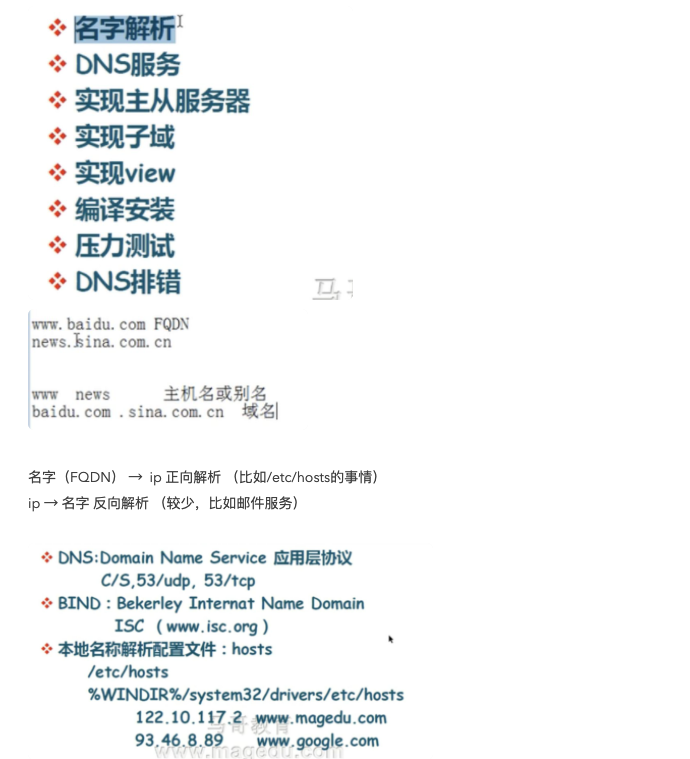
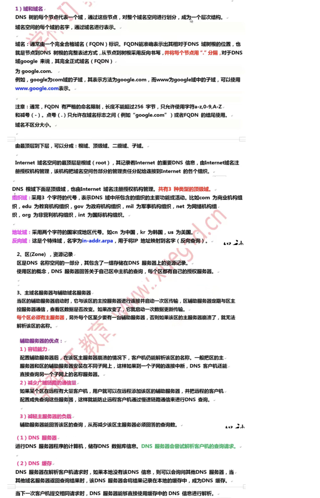
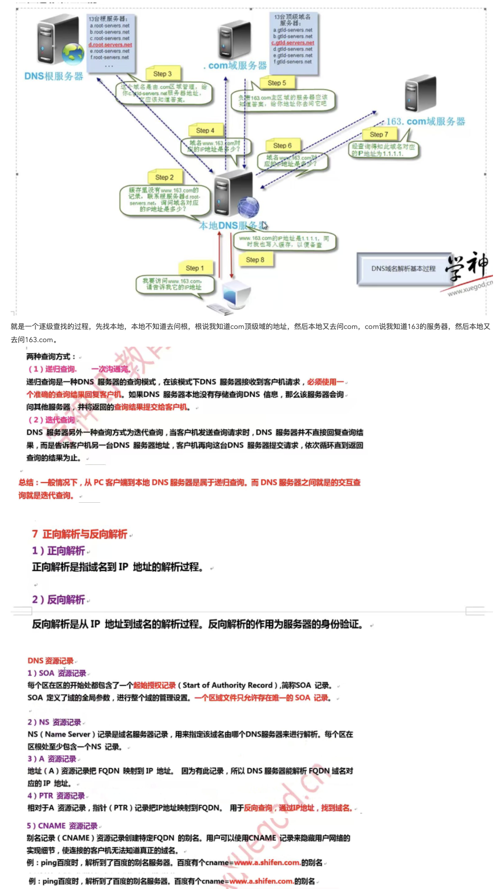
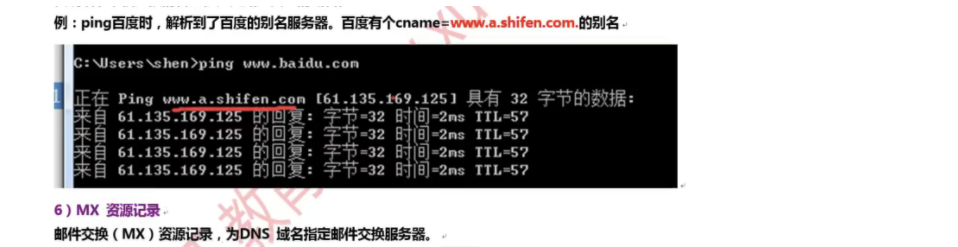

面试看这个：[https://juejin.cn/post/6854573212425814030](https://juejin.cn/post/6854573212425814030)

后面截图作为了解

其实我们书写百度的地址的时候，最后一位其实也有点，那是根域的表示，一般被省略 www.baidu.com.

根域全球有13个服务器，美国10台，英国、瑞士、日本各1台

SOA确定这个区域老大是谁，NS是区域管理真正的执行者（不是所有的事情都找老大）A记录就是门牌号，记录了域名和IP，A拿来做正向解析的，PTR做反向解析的，CNAME：别名

对应的视频：（只看了第一个）

[https://www.bilibili.com/video/BV1GW411j7Ts?p=2&amp;spm_id_from=pageDriver](https://www.bilibili.com/video/BV1GW411j7Ts?p=2&spm_id_from=pageDriver)

## 为什么需要查询根域的NS记录？

递归名称服务器中的根名称服务器信息是需要管理员提前配置的，需要一个的包含根名称服务器的域名和IP地址的根提示文件。

根名称服务器的域名和IP地址有可能会改变，导致根提示文件中的信息过时，因此递归名称服务器需要一种不需要依赖管理员更新自己根提示文件信息的机制，这就是我们需要查询根域的NS记录的原因。我们称这种查询为“启动查询”，在RFC 8109中有对启动查询的更多描述。直至今天，根名称服务器的使用的IP地址仍然会改变，不过域名在1997年已经稳定。

递归名称服务器刚启动时在根提示文件中随机选择一个根名称服务器发送启动查询，如果查询失败则随机选择下一个。根域的NS记录与其他资源记录相同，都是有TTL的，TTL过期后递归名称服务器就需要重新发送启动查询。

现在的启动查询要求使用EDNS0，需要至少能够处理1024字节。不过我们不能用现在的技术去套用在曾经的历史上，决定根名称服务器只有13台的时候，EDNS0还没有出现，还存在512字节的限制。

根域名服务器只有13台？（没看完）全球一共有个13根服务器（这些服务器上的信息都是完全一样的，取负载和灾备作用），根服务器上只存储了域名的最后一节，也就是.com/.cn/.net这些信息，没有储存你的域名信息。

[https://zhuanlan.zhihu.com/p/107492241](https://zhuanlan.zhihu.com/p/107492241)

DNS根服务器里存了世界上所有的域名吗？

[https://www.zhihu.com/question/372902597](https://www.zhihu.com/question/372902597)

DNS解析流程：

chrome -》 hosts -》 LDNS -》 根服务器 -》 说不清了，看下面的文章

浏览器有缓存才走chrome

LDNS：本地DNS一般是指你电脑上网时IPv4（互联网通信协议第四版）或者IPv6设置中填写的那个DNS，如果你的电脑是直连运营商网络，一般默认设置情况下DNS为DHCP分配到的运营商的服务器地址。

DHCP： 是一个局域网的网络协议。指的是由服务器控制一段IP地址范围，客户机登录服务器时就可以自动获得服务器分配的IP地址和子网掩码。

LDNS -》 根服务器 ，其实一般是走不到根服务器，你在阿里云买消耗的就是阿里云的权威服务器的资源


