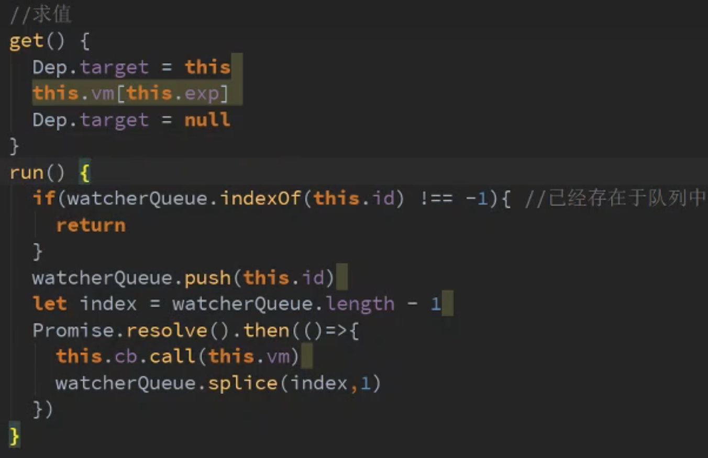

源码里面的一些概念辅助理解的文章：

# 双向绑定的相关理解：

## 1、辅助文章和视频

https://juejin.cn/post/6844903858850758670

https://space.bilibili.com/92682683/channel/collectiondetail?sid=233645

## 2、Dep和data的key之间是如何形成一比一关系的？

defineReactive里面都new了 一个Dep，Dep被Object.defineProperty的get和set引用导致defineReactive执行完毕，get/set和Dep就形成了闭包的关闭，这样就维护了唯一一份key和Dep之间的关系

## 3、Dep、watcher之间的观察者关系如何形成的？

data的一个key（包括复杂对象的key)一个Dep，在initState中，已经把所有的data进行了响应式处理，核心就是defineReactive方法，重写get和set，比如自己在vue中写了个watch监听data中msg变化，watch里面的watcher实例化的时候，重点干了这三个事：

- 把自己这个实例出来的watcher放到Dep.target这个静态方法（类似可以理解成放到window上，临时使用) ，也就是Dep.target = this
- 就会主动的调用一下this.vm[this.data.key],其实就是主动触发这个msg的get方法，get中的Dep就会读取自己身上现在的Dep.target（正在使用的watcher)把这个watcher加入这个dep的依赖数组
- 然后再把Dep.target = null，让上下文重置干净

## 4、双向绑定的同步任务怎么变成异步任务的？

核心就是watcher的run方法

同理，我们页面上data里面一个msg，然后自己写的watch监听了msg变化，然后比如页面上进行了连续操作：this.msg = 1 ； this.msg = 2 ；this.msg = 3 ；三次赋值操作都会触发Dep.notify操作，通知他收集的watcher，进行watcher.run()方法，正常来说三次赋值操作，肯定触发三次run，执行顺序变成：

this.msg = 1 ；

run();

this.msg = 2 ；

run();

this.msg = 3 ；

run();

但是三次赋值操作是在宏任务执行，cb的执行被放进了Promise，也就是微任务里面执行，这个时候执行顺序变成了：

this.msg = 1 ；

this.msg = 2 ；

this.msg = 3 ；

run();

run();

run();

在配合全局定义了一个watcherQuene + 每个实例化的watcher都有一个id，对于自定义出来的watch，它内部实例出来的watcher都是一个id，这个时候如果watcherQuene里面已经有这个id，就不重复执行后面调用cb的逻辑了，如果没有这个id进入排队，那么就加入队列，然后执行，再把这个id从watcherQuene中删除，那么久可以实现宏任务都执行完了，也就是this.msg最终等于3，然后最后run的时候，这个cb就是自定义watch回调能够拿到最终值并且只执行一遍。

接下来再理解理解Dep和watcher双向依赖的目的

没有看过：

vue防止重复点击：https://juejin.cn/post/7189231050806001719?
