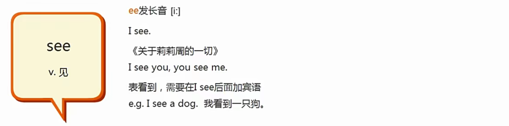
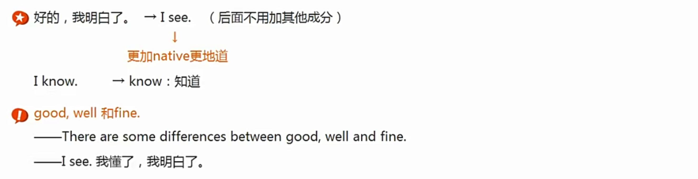
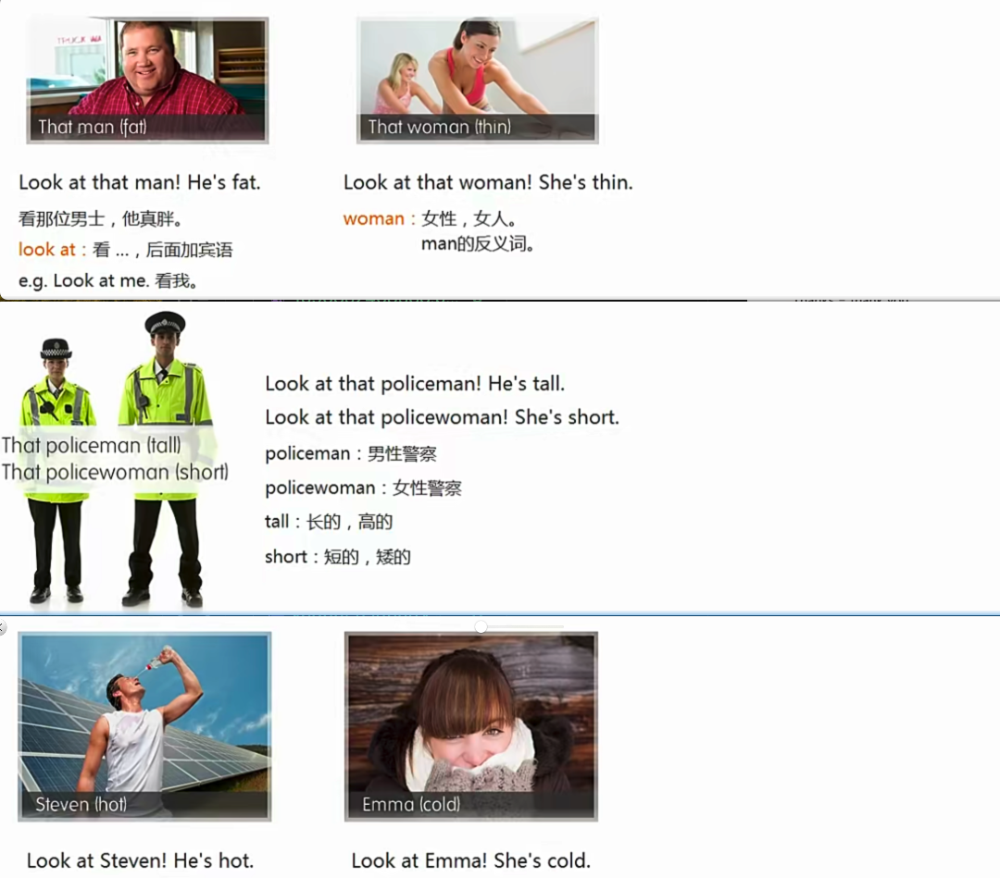

Excuse me和sorry区别：

# lesson1

## Excuse me:

## Sorry:

## HandBag：

注意这个单词的发音：【汗半个】，d因为连词+爆破音(d)，这个发音被省略了

例子：glad的d不用发音

## Pardon：

注意他的词性：感叹词

## 主谓宾：

## this：

## Thank you：

## 文化分享：

# lesson2:

## umbrella:

## ticket:

## cloakroom:

## Here is:

Here is 强调的是位置 here

this is强调的是东西

## 女性称呼：

# lesson3:

## Mr, Mrs, Miss, Ms

后面直接接family name

## Student：

## School：

## 早中晚打招呼：

## 主系表：

注意【表】可以是名词，形容词（是否还可以是其他词性，再说)

## 很高兴遇见你

## too：

## 打招呼：

hello

hi(非正式)

what's up? (非正式)

# lesson4：

## name:

## nationality：

## 主系表补充：

等同于表达：what’s you nationality

## a和an：

# lesson5：

How are you today?

I'm fine, thank you.  /  I'm very well, thank you.

How's Emma?

She is very well, too.

## Today:

注意副词的灵活性

注意 I 这个单词，不管在哪个位置都是大写

## well：

## see:

## 做表语的形容词：

## look at:

## goodbye:

## 数字11-15：

## 习俗：

cultural tidbits 文化花边

