# lesson6:

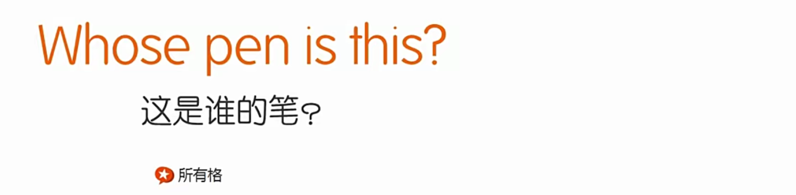

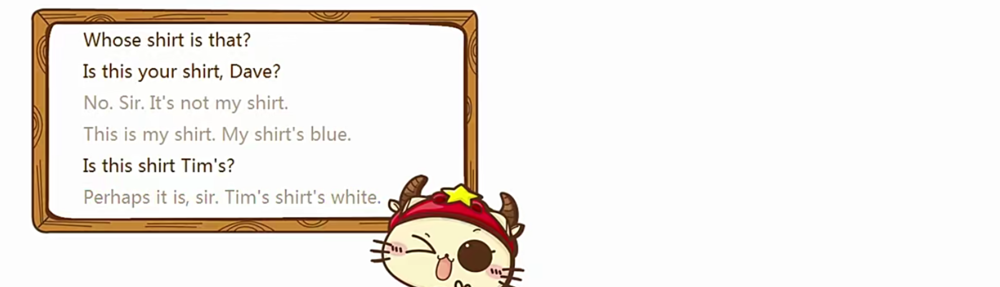

## blouse:

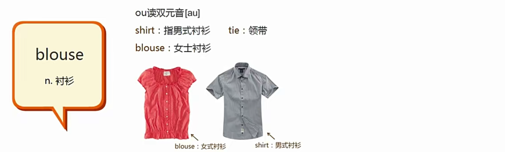

## Family:

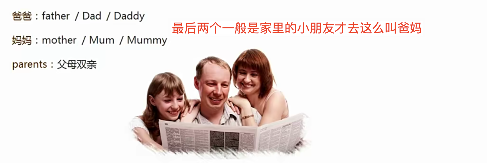

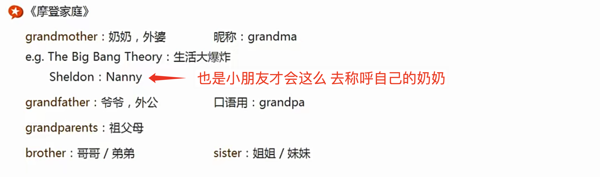

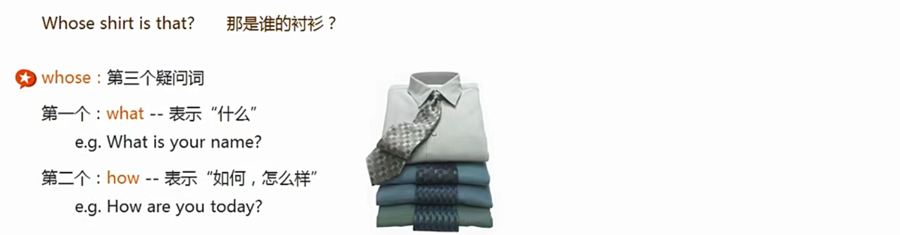

## whose：

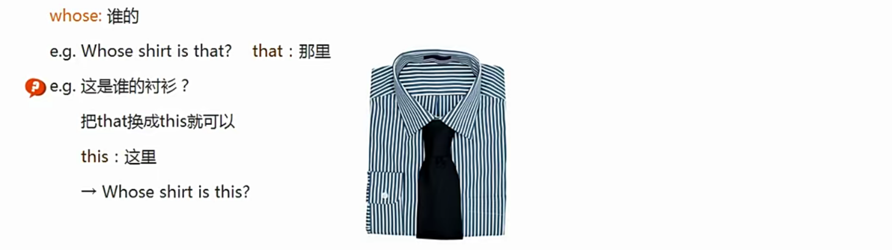

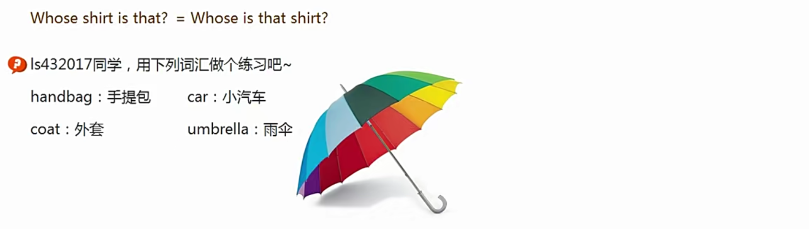

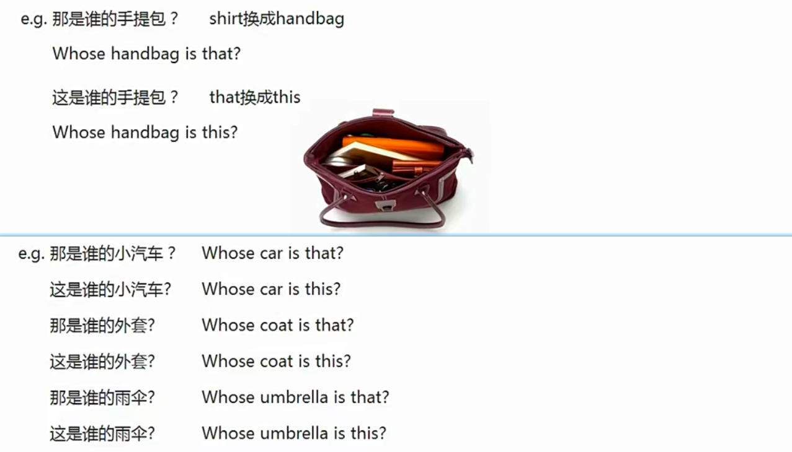

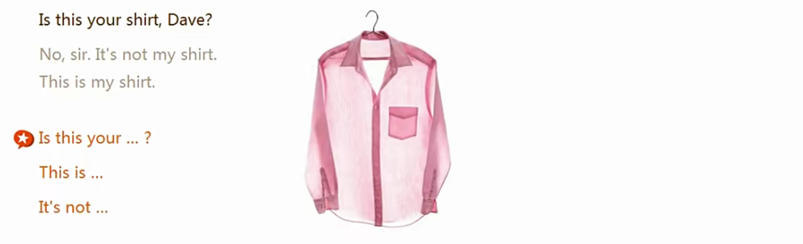

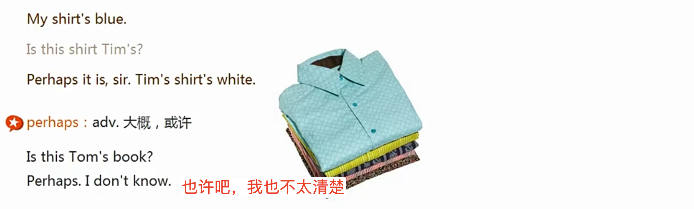

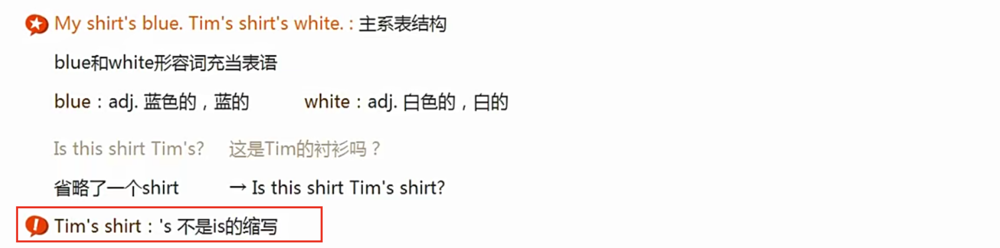

## 所有格：

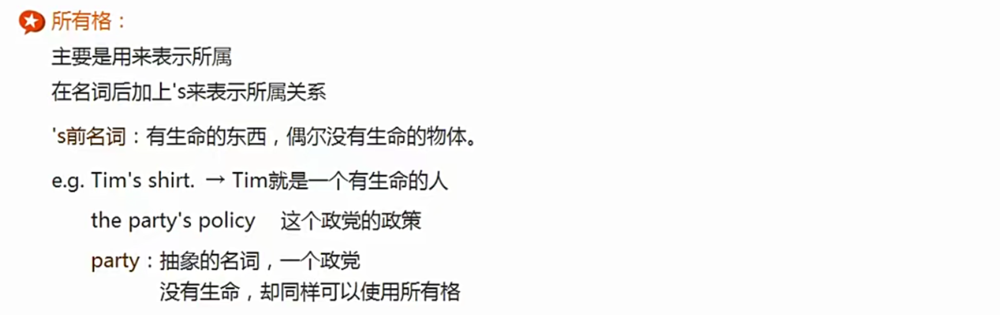

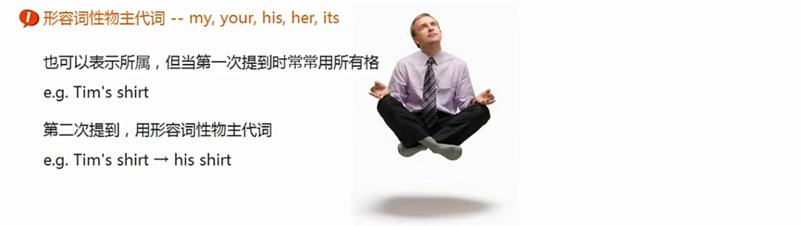

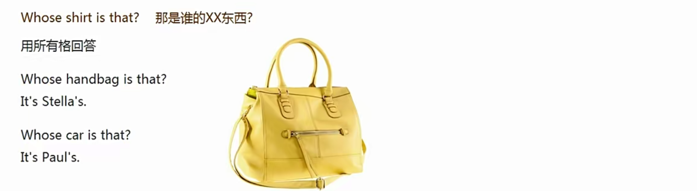

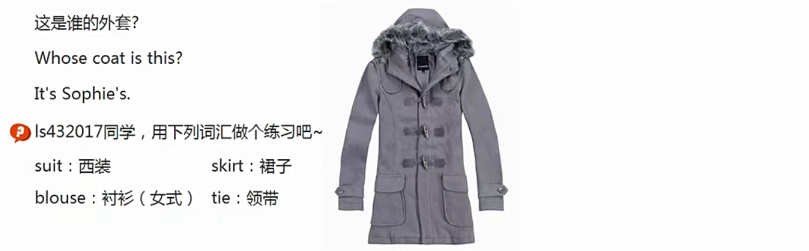

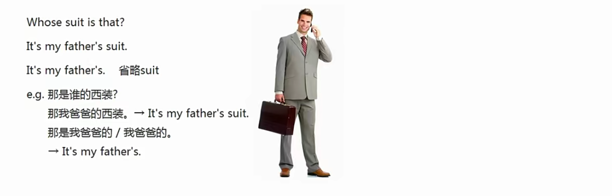

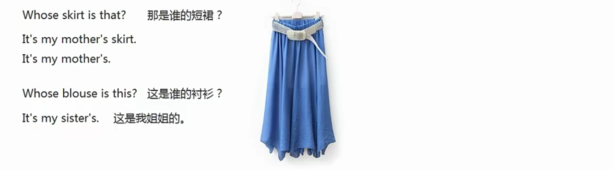

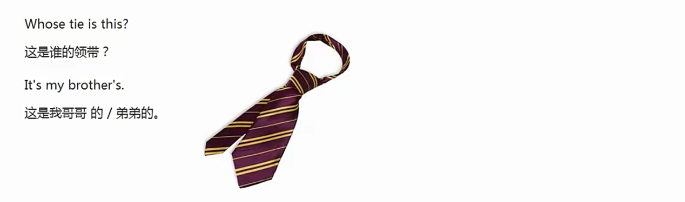

这里的yes sir 可以连读成yessir

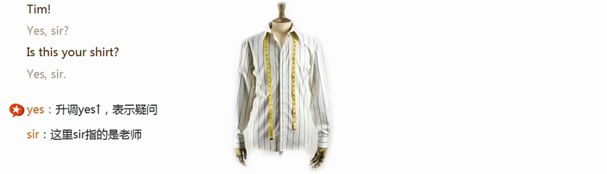

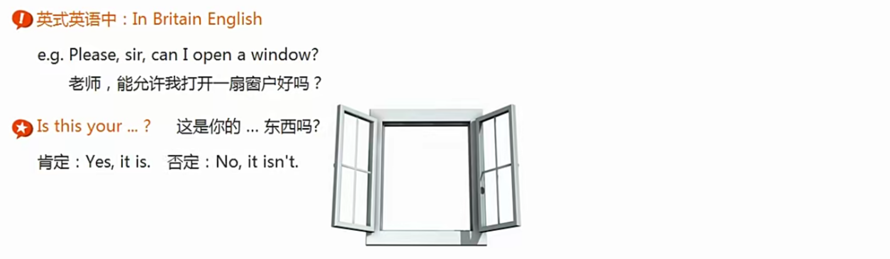

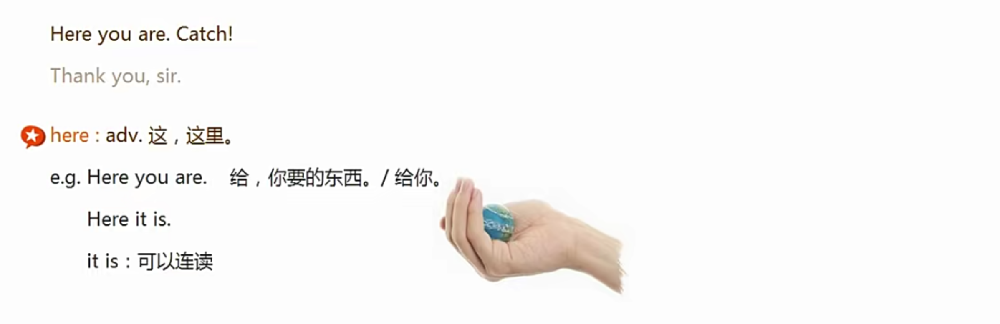

## 祈使句：

动词开头

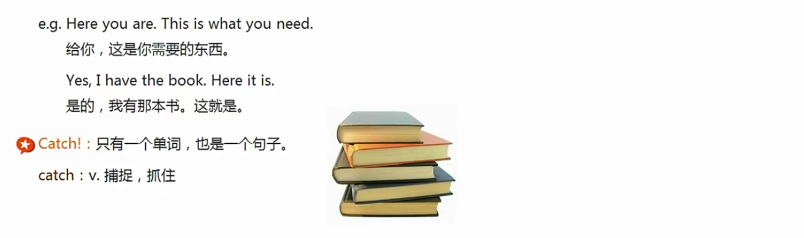

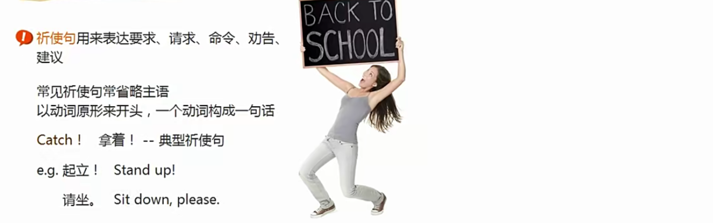

是一种肯定的语气，如果是 See this? 这种问句，就不是祈使句了

## cultural tidbits：

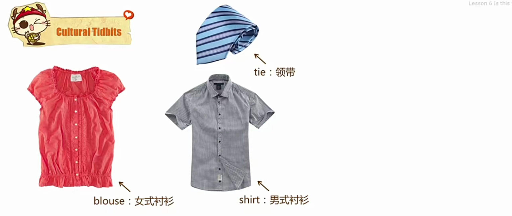

# lesson7：
