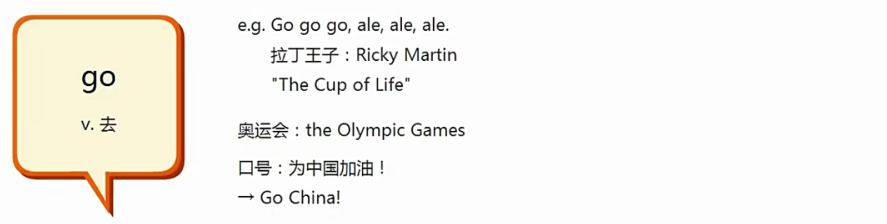

# lesson6:

## blouse:

## Family:

## whose：

## 所有格：

这里的yes sir 可以连读成yessir

## 祈使句：

动词开头

是一种肯定的语气，如果是 See this? 这种问句，就不是祈使句了

## cultural tidbits：

# lesson7：

## come:

## go:

句型：

祈使句：

两种互换的句型：

## same  a/an:

# lesson8:

## 单词：

## 人称代词的单复数：

# lesson9：

# lesson10：

## 新单词：

## 新句型：

## 数字：

# lesson11：

## 新句型：

which book?

Give me a book please,Jane.

Which book?

This one?

No,not that one,The red  one.

This one?

Yes,please.

Here you are.

Thank you.

## 清辅音浊化：

注意sky和street的发音并不是按照音标去发音，同样的单词比如：

spoon [spu:n] 其实读作：s不n

## 名词变复数：

## 不定代词 one:

## 数字复习，餐桌礼仪：

