教程来源：

https://www.bilibili.com/video/BV14L4y157Bv?p=2&vd_source=55dcc9b2dc5b93d913718cd6ba694fc2

一个讲的比较好的网站：http://c.biancheng.net/view/706.html

# 初识：

shell：

我们在cmd中输入的linux命令，也是shell脚本，只是没有通过逻辑进行组织的简单脚本

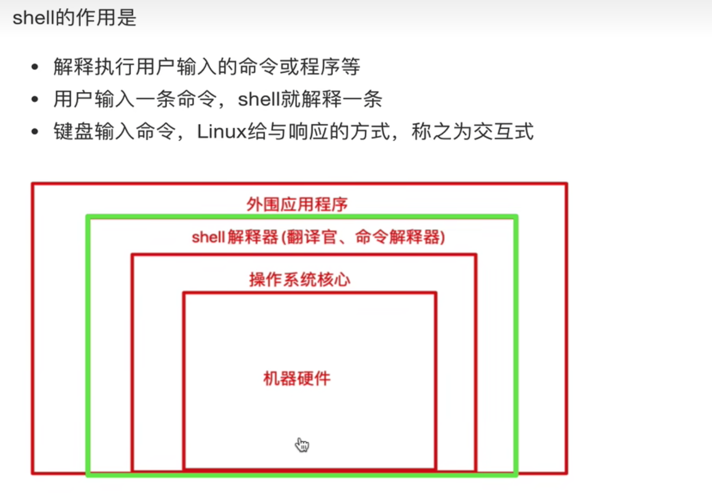

比如 cd  mkdir等命令，都是交给shell解释器来解析的

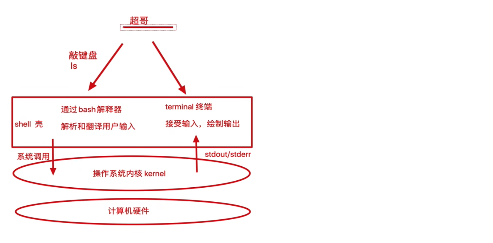

但是要注意：shell只是一个统称，它具体的解释器又有：Unix/Linux上常见的Shell脚本解释器有**bash、sh、csh、ksh、zsh**等，习惯上把它们称作一种Shell

一般centos的解释器是bash，mac默认是zsh，我们能看到我们的mac内置的解释器还挺全：

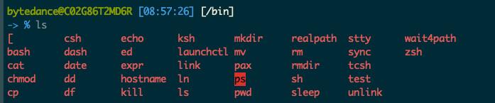

当这种cmd中通过交互式的方式进行输入的命令+一定的逻辑编排，就变成了shell脚本，window中是*.bat文件，linux中是*.sh文件

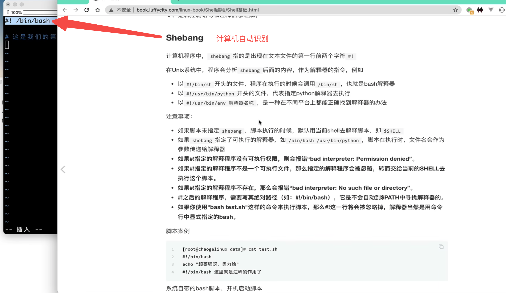

```shell
bytedance@C02G86T2MD6R [08:57:26] [/bin]
-> % echo $SHELL
/bin/zsh
```

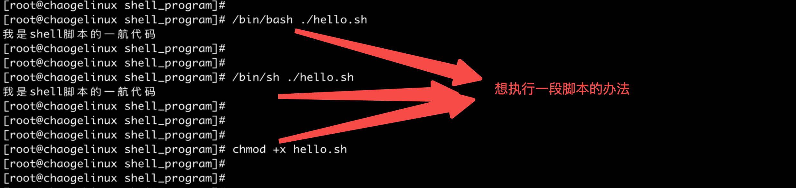

如果文件没有权限，可以像上面这样，直接指定解释器去读它

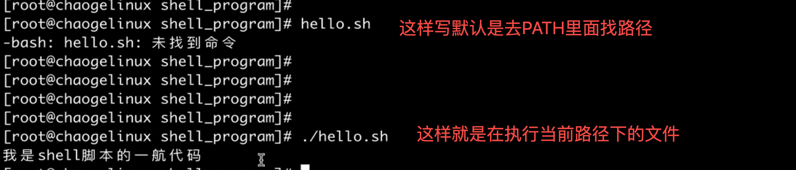

当然还有一些别的执行脚本的方式：

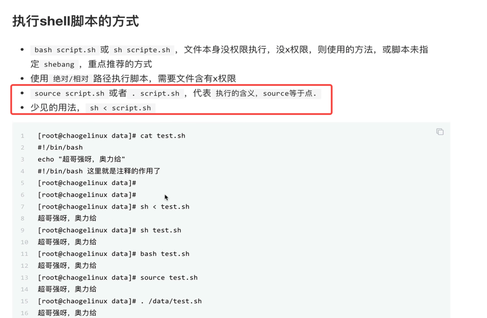

通过bash、zsh执行脚本和source、点的形式执行的区别：

先用bash测试：

```shell
bytedance@C02G86T2MD6R [12:08:58] [~/personal/test]
-> % touch b.sh

bytedance@C02G86T2MD6R [12:09:09] [~/personal/test]
-> % vim b.sh

bytedance@C02G86T2MD6R [12:09:30] [~/personal/test]
-> % cat b.sh
wang1=555;

bytedance@C02G86T2MD6R [12:09:40] [~/personal/test]
-> % wang1=666;

bytedance@C02G86T2MD6R [12:09:47] [~/personal/test]
-> % /bin/bash ./b.sh;

bytedance@C02G86T2MD6R [12:10:04] [~/personal/test]
-> % echo $wang1;
666
```

结论：bash、zsh这种形式执行的脚本，是开启了一个子进程在全局变量中定义了wang1，所以不会覆盖父进程的变量wang1；

source测试：

```shell
bytedance@C02G86T2MD6R [12:12:34] [~/personal/test]
-> % cat ./b.sh;
wang1=555;

bytedance@C02G86T2MD6R [12:12:40] [~/personal/test]
-> % wang1=777;

bytedance@C02G86T2MD6R [12:12:47] [~/personal/test]
-> % source ./b.sh;

bytedance@C02G86T2MD6R [12:13:00] [~/personal/test]
-> % echo $wang1;
555

bytedance@C02G86T2MD6R [12:13:07] [~/personal/test]
-> % . ./b.sh;

bytedance@C02G86T2MD6R [12:13:45] [~/personal/test]
-> % echo $wang1;
555
```

结论：在mac中bash、zsh等和source、点执行的结果是一样的（注意点:这个可能和linux中执行不一样，待测试，正常来说，source执行的结果是在当前shell进程，会覆盖wang1才对)


同样因为bash、sh等操作会产生子shell，结合反引号的使用，也能看出source操作是在当前进程执行：

```shell
bytedance@C02G86T2MD6R [12:39:14] [~/personal/test]
-> % cat c.sh
user1=`whoami`

bytedance@C02G86T2MD6R [12:39:18] [~/personal/test]
-> % sh c.sh

bytedance@C02G86T2MD6R [12:39:26] [~/personal/test]
user3=`whoami`
-> % echo $user1 #空，因为是sh进行的解释，产生了子shell


bytedance@C02G86T2MD6R [12:40:04] [~/personal/test]
-> % . ./c.sh;

bytedance@C02G86T2MD6R [12:40:12] [~/personal/test]
-> % echo $user1 #当前进程执行
bytedance


bytedance@C02G86T2MD6R [12:42:08] [~/personal/test]
-> % cat e.sh
user3=`whoami`

bytedance@C02G86T2MD6R [12:41:59] [~/personal/test]
-> % source ./e.sh;

bytedance@C02G86T2MD6R [12:42:03] [~/personal/test]
-> % echo $user3;
bytedance
```


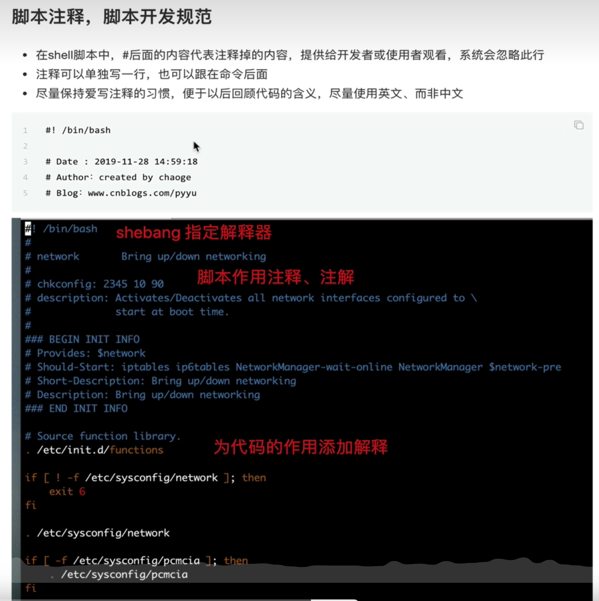

shell是一个弱类型脚本语言

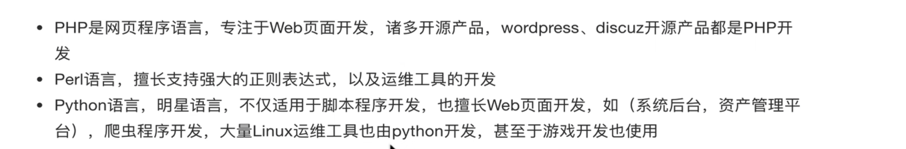

perl目前国内基本没人用了


# 变量：

```shell
bytedance@C02G86T2MD6R [09:42:06] [/bin]
-> % name='123' # 注意点：中间不能有空格 

bytedance@C02G86T2MD6R [11:20:57] [/bin]
-> % echo $name;
123

bytedance@C02G86T2MD6R [11:24:10] [/bin]
-> % echo ${name};
123
```

一下三种方式定义效果一样：

```shell
bytedance@C02G86T2MD6R [11:52:54] [~/personal/test]
-> % wang=123

bytedance@C02G86T2MD6R [12:00:35] [~/personal/test]
-> % wang='123'

bytedance@C02G86T2MD6R [12:00:38] [~/personal/test]
-> % wang="123" #双引号可以识别特殊语法
```

变量命名规则：

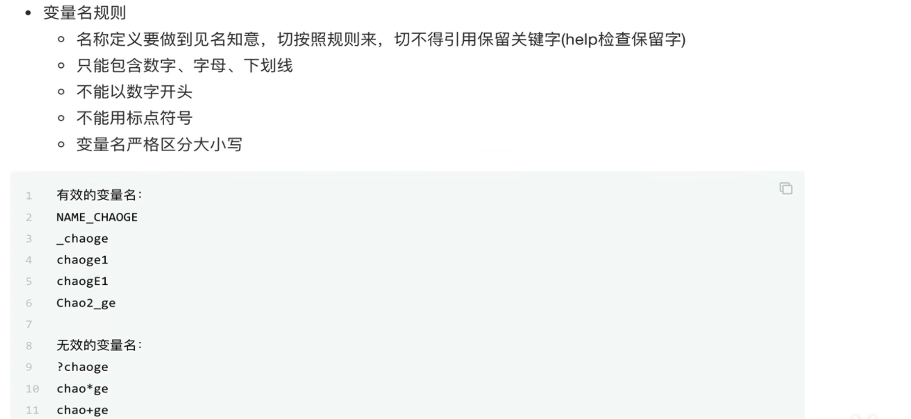

mac安装pstree： brew install pstree

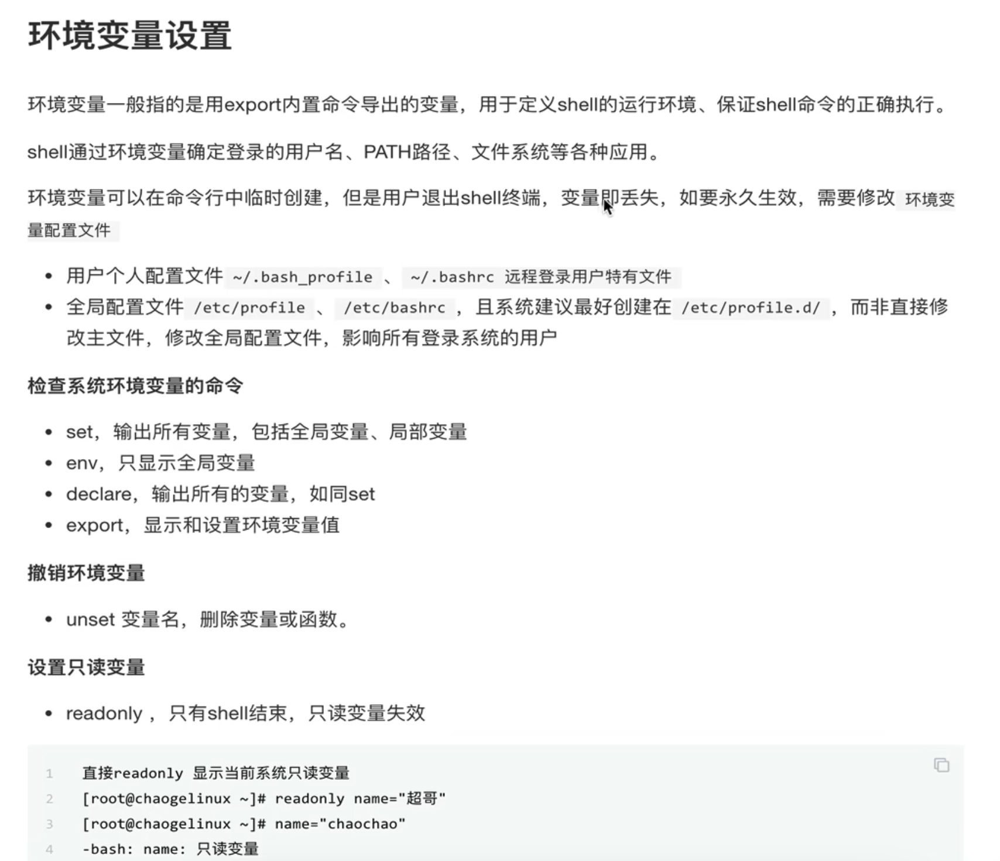

上面截图~/.bash_profile ~/.bashrc，每个用户登录都有自己独一份，/etc/profile /etc/bashrc存的是所有用户都生效的变量

set找到的只能是当前shell的变量，函数等等，它如果存在父子shell进程，set是打印不出来别的环境的变量，函数等

```shell
bytedance@C02G86T2MD6R [16:25:57] [~/bytedance/yingxiao-c/i18n_ecom_client_marketing] [feat/living_to_client]
-> % set
'!'=3973
'#'=0
'$'=3953
ARGC=0
COLORTERM=truecolor
COLUMNS=110
COMMAND_MODE=unix2003
COMPOSER_CACHE_DIR=/Applications/MxSrvs/cache/composer
# 后面还有巨多的变量

bytedance@C02G86T2MD6R [16:44:27] [~/bytedance/yingxiao-c/i18n_ecom_client_marketing] [feat/living_to_client]
-> % set | grep ^name  # 以name开头的环境变量
nameddirs
```

# 本地变量

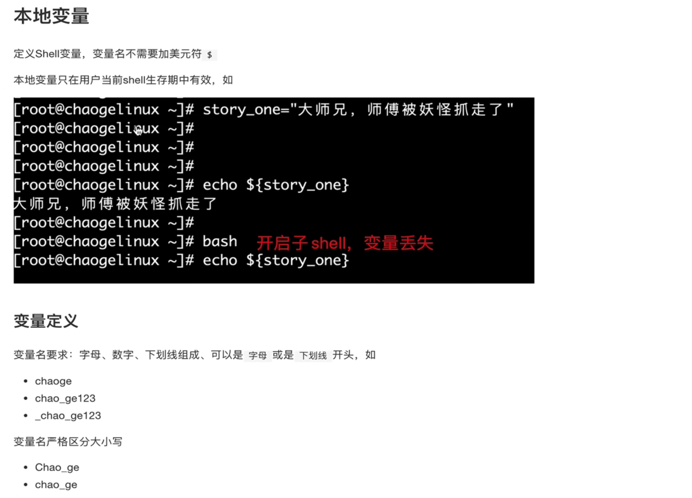

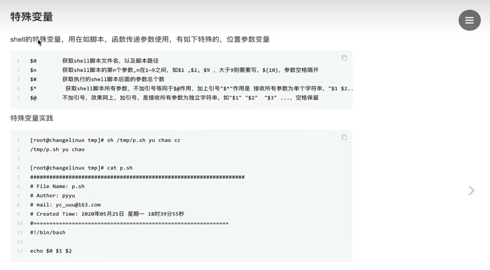

脚本和结果：

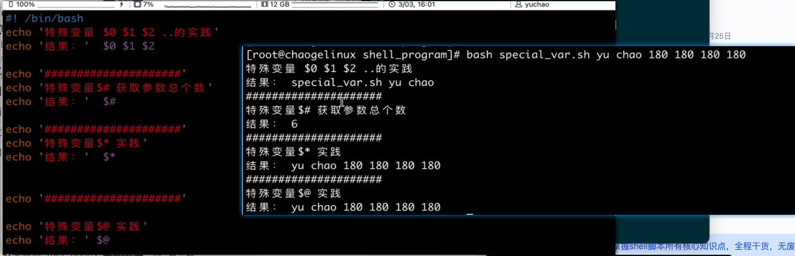

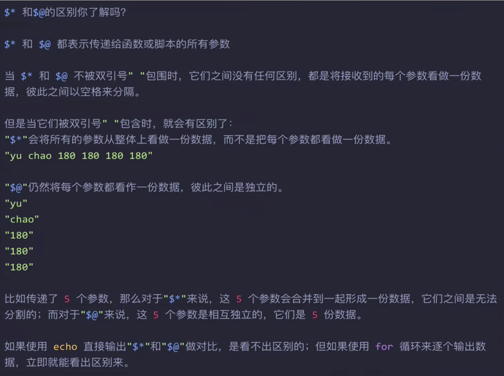测试：

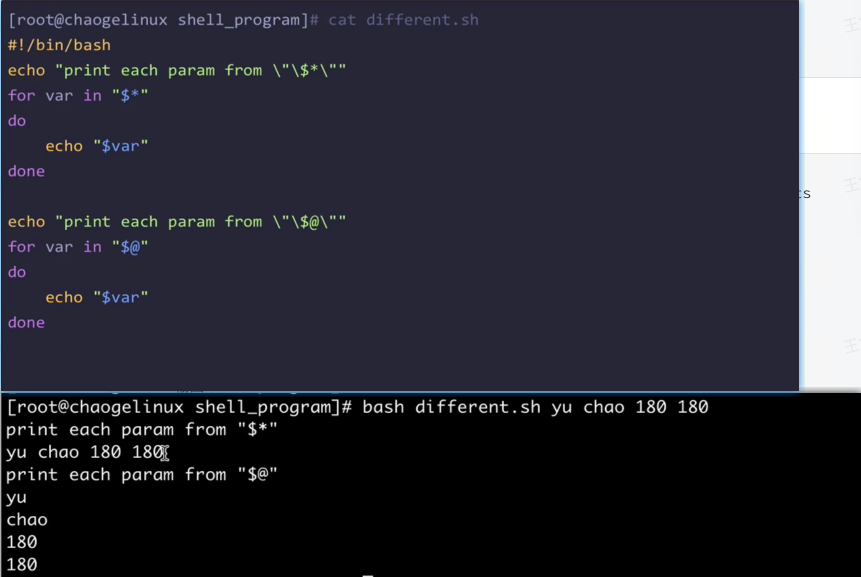

# 作用域：

相关文档：http://c.biancheng.net/view/773.html

通过这个链接可以掌握的概念：

局部变量，全局变量，环境变量，开启子shell方式，函数中变量的作用域，父子shell(pstree看当前进程再哪个shell)，临时导出，初始化配置文档等


11 开始

https://www.bilibili.com/video/BV14L4y157Bv/?p=11&spm_id_from=pageDriver&vd_source=55dcc9b2dc5b93d913718cd6ba694fc2
