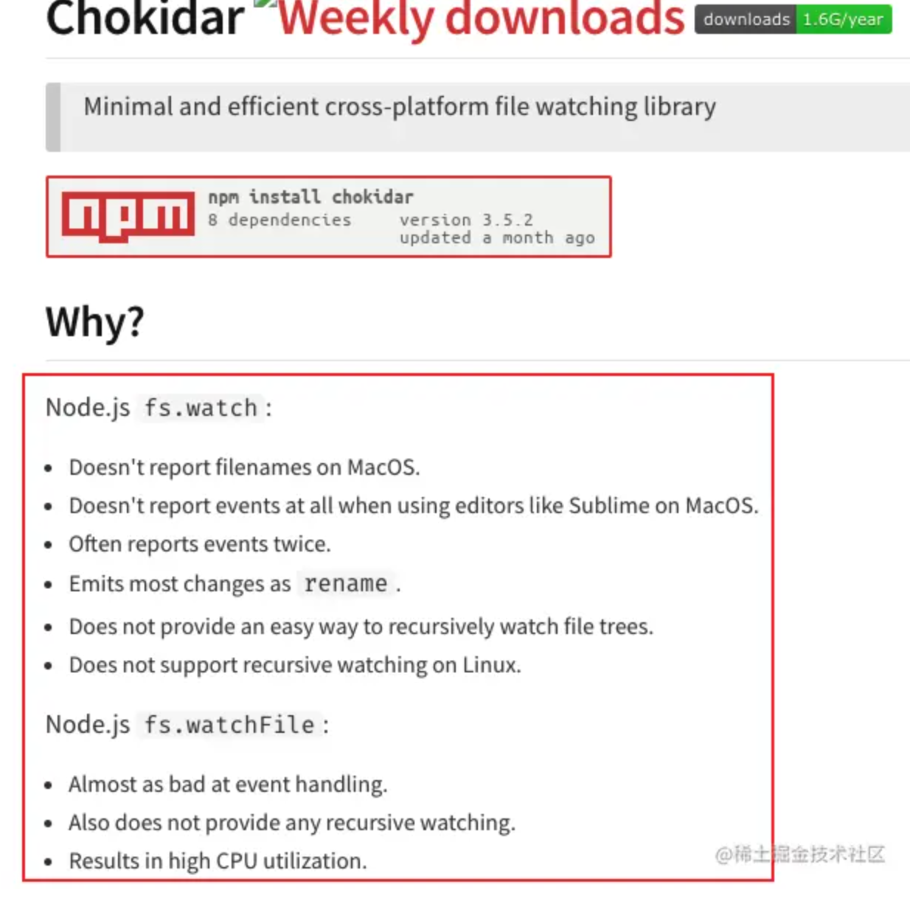

本文b站链接：https://www.bilibili.com/video/BV1Rf4y157ad/?vd_source=55dcc9b2dc5b93d913718cd6ba694fc2

## 引子

相信大家都知道 nodemon 吧 ，就是那个可以帮助我们在修改了代码之后重启服务的 cli 工具，但是它的实现原理是什么样子的呢？接下来我们就来造个小轮子来探索探索

> 通过造轮子的方式来学习，可以更深层次的理解原理

## 原理

想一想，如果不用 ndoemon 的话，我们自己手动是如何更新的？

```JavaScript
// main.js
const Koa = require("koa");
const app = new Koa();
app.use((ctx) => {
  ctx.body = "hi my name is cuixiaorui";
});
app.listen(3000);
复制代码
```

手动更新步骤：

1. 修改 main.js 文件内的 `ctx.body` 的值
2. 关闭当前的服务，然后重新执行 `node main.js`

而ndoemon 就是帮助我们自动化了上面的两个步骤，让我们只关注于修改文件即可，像重新启动服务这件事其实是个重复的劳动。而程序最适合解决这种重复性的问题

那也就是说，只有我们把上面两个步骤用代码来实现就可以了，而这个就是 nodemon 的原理所在。

那怎么把上面的两个步骤翻译成具体的代码呢？

仔细分析的话，你会发现修改 main.js 文件其实可以翻译成观察文件的改变，修改了代码的话，那么文件肯定是发生改变了

而关闭当前的服务这个就更具体了， 就是关闭进程然后再执行 node main.js 这个命令即可

## 观察文件的变化

那在 nodejs 中如何观察文件的变化呢？

如果你熟悉 nodejs 的 api 的话，你会发现 fs 模块下面有一个 watch 的方法，它的功能就是观察文件的变更，但是这个 api 不是太友好，在 Mac 平台下有很多的问题

而社区里面有一个更好用的工具 [chokidar](https://link.juejin.cn?target=https%3A%2F%2Fwww.npmjs.com%2Fpackage%2Fchokidar "https://www.npmjs.com/package/chokidar"), 可以看看他的 README，



专门解决了 fs.watch 的一系列问题

ok，工具我们选择好了，那么接下来看看如何去使用呢？

```JavaScript
const chokidar = require("chokidar");
chokidar.watch(["main.js"]).on("all", (event, path) => {
  console.log(event, path);
});

复制代码
```

通过 `chokidar.watch` 来观察具体的文件，我们这里是 `main.js` 然后通过监听 `all` 事件。这样当文件变更的时候我们就可以收到消息啦

好 ，这个问题就算搞定了。我们接着往下看

## 执行 node main.js 命令

那下一步就需要探索如何才可以执行 `node main.js` 命令了，在nodejs 中有两种方式可以执行命令

1. exec
2. spawn

这两个函数都是在 `child_process ` 模块下。用起一个子进程的方式来帮助你执行命令

而对于子进程这个概念可以理解为：我们当前执行的主进程是爸爸，爸爸正在干活，但是他现在想喝水（执行 node main.js）如果他自己去的话，那么就会影响到他手头上的活，那怎么能不影响手头的活还可以喝到水呢？叫儿子去不就好了。 而子进程就相当于是儿子。

那 exec 和spawn 的区别是什么呢？

我们来实验一下，同时执行 `test.js` 脚本

```JavaScript
//test.js
console.log("test.js");

setTimeout(() => {
  console.log("set timeout");
}, 500);


复制代码
```

exec 是同步执行，他会等待脚本都执行完成之后在进行回调

```JavaScript
exec("node test.js", (err,stdout)=>{
  console.log(stdout);
 }); 
复制代码
```

而 spawn 是基于流的形式，执行完就通过流的方式把数据发过来

```JavaScript
spawn("node", ["test.js"], {
stdio:[process.stdin,process.stdout,process.stderr]
}) 
复制代码
```

> 具体的区别差异可以看视频

接着我们就可以把观察文件的代码和执行命令的代码合并到一起咯

```JavaScript
chokidar.watch(["main.js"]).on("all", (event, path) => {
  spawn("node", ["main.js"], {
  stdio:[process.stdin,process.stdout,process.stderr]
  }) 
});
复制代码
```

但是，这样的话，当我们改变了 main.js 代码后，会给我们报错


告诉我们，端口被占用啦！为什么会被占用呢？

其实就是因为我们没有把之前打开的服务给关掉嘛，所以在打开一个的话，肯定就会出现这个问题啦

那问题又来了，如何关闭之前的进程呢？

## 关闭进程

如果我们仔细的看 `spawn` api 的话，你会发现它会返回 `chidlProcess` 对象。而这个对象里面有个方法是 `kill`

我们就可以通过这个方法来关闭进程

```JavaScript
  childProcess && childProcess.kill();

  childProcess = spawn("node", ["main.js"], {
    stdio: [process.stdin, process.stdout, process.stderr],
  });
复制代码
```

用childProcess 变量来存储，然后再执行的时候检测一下，如果存在的话，那么就执行 `kill ` 来关闭之前的进程

到这里的时候，其实我们就已经实现完了 nodemon 的最核心的部分，但是还是有太多可以优化的点了。

## 使用防抖来优化

如果我们在 main.js 里面一直保存的话，你会发现它会一直触发 `all` 事件，而这样的话，就会频繁的执行 `spawn ` 了，而其实我们只需要在最后一次调用 `all ` 事件的时候执行一次 `spawn ` 就可以了。而这个场景就是使用防抖的最佳场景

```JavaScript
function debounce(fn, delay) {
  let id;
  return () => {
    clearTimeout(id);

    id = setTimeout(() => {
      fn();
    }, delay);
  };
}
复制代码
```

接着我们把执行 `spawn ` 的逻辑封装成一个函数

```JavaScript
function restart() {
  console.log("restart");
  childProcess && childProcess.kill();

  childProcess = spawn("node", ["main.js"], {
    stdio: [process.stdin, process.stdout, process.stderr],
  });
}

let debounceRestart = debounce(restart, 500)

复制代码
```

最后在 watch 里面执行 `debounceRestart`

```JavaScript
chokidar.watch(["main.js"]).on("all", (event, path) => {
  console.log(event, path);

  debounceRestart();
});
复制代码
```

这样你在怎么改动 `main.js` 你会发现它都只会调用一次了

## 总结

看看我们通过这个小小的轮子都学到了什么吧！

* 观察文件的改变
  * fs.watch
  * chokidar
* 在 nodejs 中使用 exec 和 spawn 执行命令
* 防抖

如果你仔细阅读的话，你会发现我们整个都是从问题出发，把实际的问题转换成具体的代码，从而慢慢的完成了简版的 nodemon 的实现。

其实写任何程序都是这样的，发现问题，解决问题。迭代式的完善程序。

而对于问题的拆分这个技能就是 Tasking 任务拆分了。

掌握了 Tasking 至少可以提高你写程序的百分之 50 的能力

而 Tasking 就需要一直不断的刻意练习

而最好的练习方式就是自己造轮子，这个我也称之为造轮子学习法。

关注我，后面分享更多的轮子
