## express

express缺点1:  
1、死亡回调，当我们要渲染一个页面，但是页面上有很多数据需要通过不同的接口查询数据库返回的时候，需要层层嵌套，最后拿到所以数据再render。

### ejs - demo

```
const express = require('express')
const app = express()
const a = 1;
app.set('view engine', 'ejs') 
app.get('/', function (req, res) {
    res.render('index', {
        'all': [
            {
                a: '1'
            },
            {
                a: '11'
            }
        ]
    })
})

app.listen('3000')

```

```
index.ejs
<div>
    <% for(var k = 0; k < all.length; k++) {%>
        <%= all[k].a %>
    <%}%>
</div>

```

⚠️：  
1、上面的这个index.ejs文件的目录结构views/index.ejs  
2、 上面的js虽然没有引ejs包，但是还是需要安装ejs，这里render的index就是views目录里面的index.ejs模版  
3、 注意这里用的是render而不是send，render就会直接去读取文件  
4、 上面的变量a， 这里的代码只会执行一次  
5、 默认情况下，是去读取views中的静态文件，如果想改变文件目录，可以通过：app.set(‘views’, ‘XX’)来制定目录

### 路由匹配规则的问题

```
const express = require('express')
const app = express()
app.get('/', function (req, res, next) {
    console.log('1')
    next()
})
app.get('/', function (req, res) {
    console.log('2')
})
app.listen('3000')

```

当匹配上第一个路由，后面的路由就不在继续匹配，除非执行next()函数。

### app.use使用特点

const express = require(‘express’)  
const app = express()  
app.use(’/admin’, function (req, res, next) {  
console.log(req.originalUrl);  
console.log(req.baseUrl);  
console.log(req.path);  
})  
app.listen(‘3000’)

使用http://127.0.0.1:3000/admin/a/b访问，结果：  
/admin/a/b  
/admin  
/a/b

⚠️：  
1、 app.use里面的第一个参数路径写什么路径都会执行，其实第一个参数可以省略，第二个参数就相当于一个中间件。  
2、app.use和app.get/post的一个区别就是第二个参数app.use可以是router，这样方便模块化管理，app.get/post只能是函数。  
3、 通过上面的分析，我们最常用的办法是用它来截取静态资源app.use(express.static(‘./public’)), 这个一般写在路由的最上面，静态资源优先匹配。 关于路径问题，可以查看当前目录下的 node - 02 - app.use静态资源路径问题 这篇文章

### app.use 路径问题，访问静态资源 demo

当我们添加了一个虚拟的路径来访问静态资源的时候，如下：

const express = require(‘express’)  
const app = express()  
app.use(’/aa’, express.static(’./public’))  
app.listen(‘3000’)

那么我们需要在静态资源中按照这样的形式写路径：  

文件相对关系如下：  

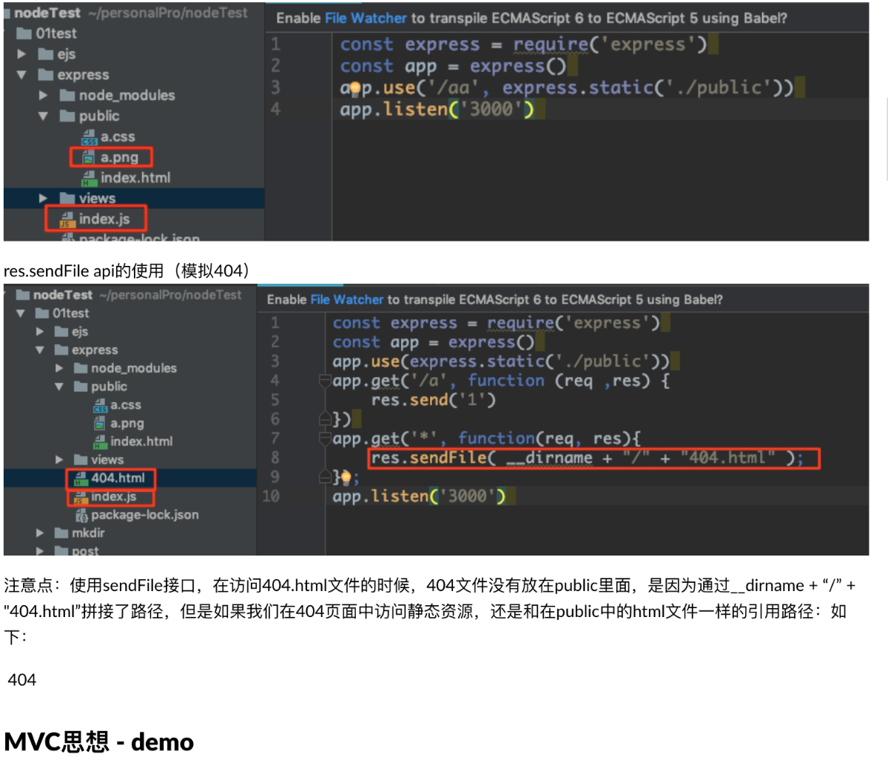  

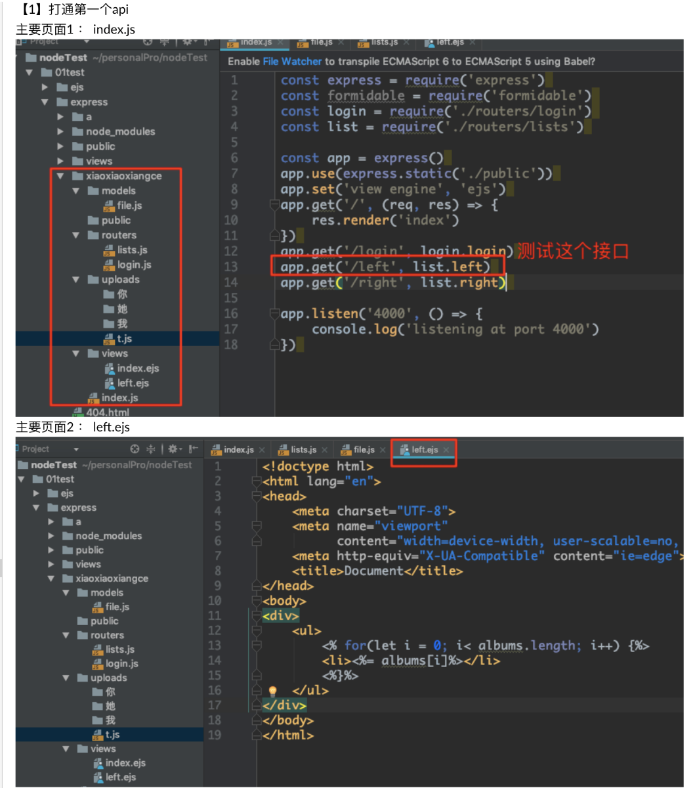  

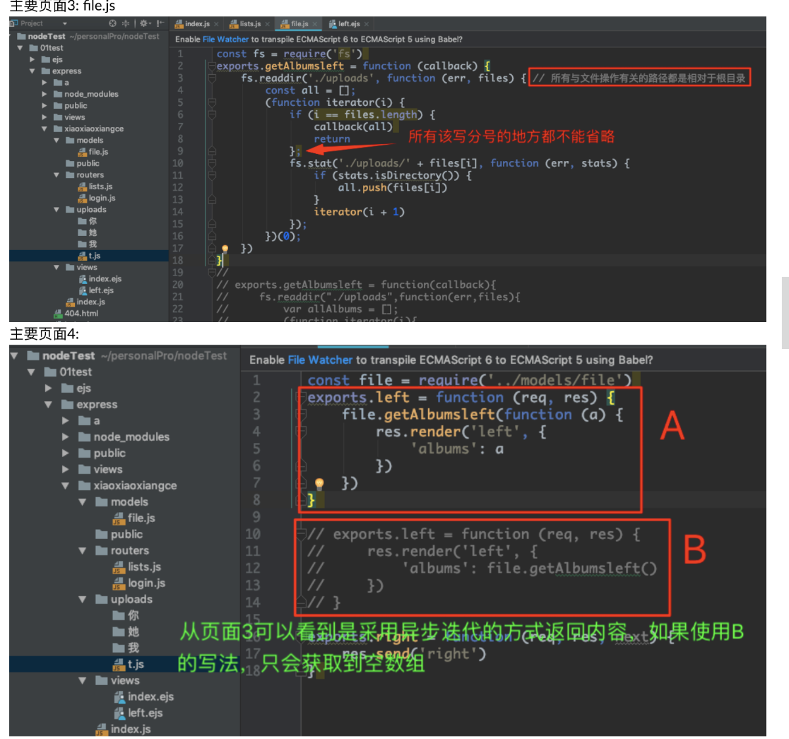  

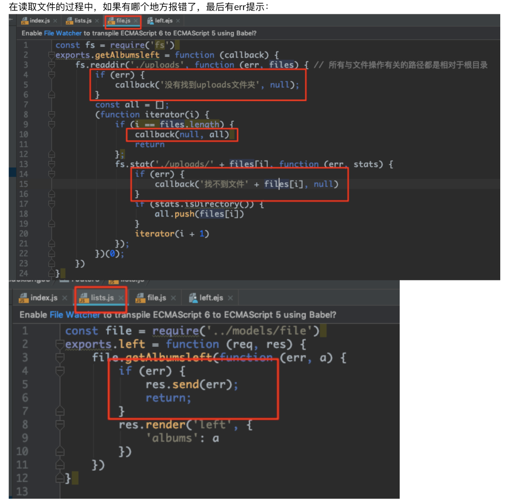  

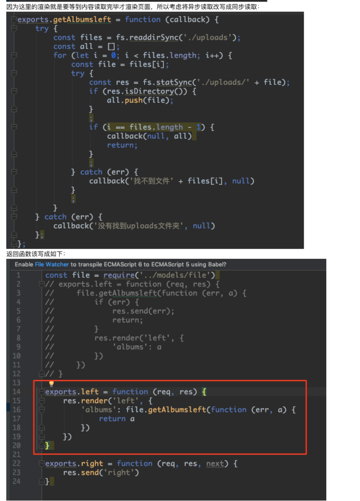  

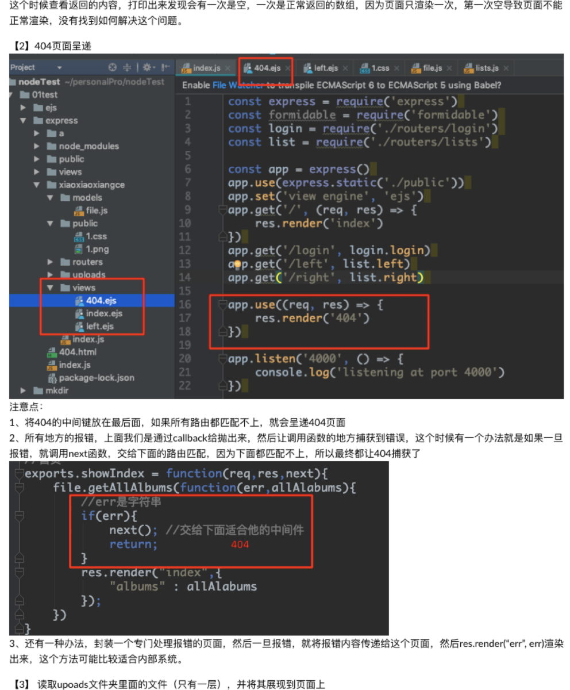  

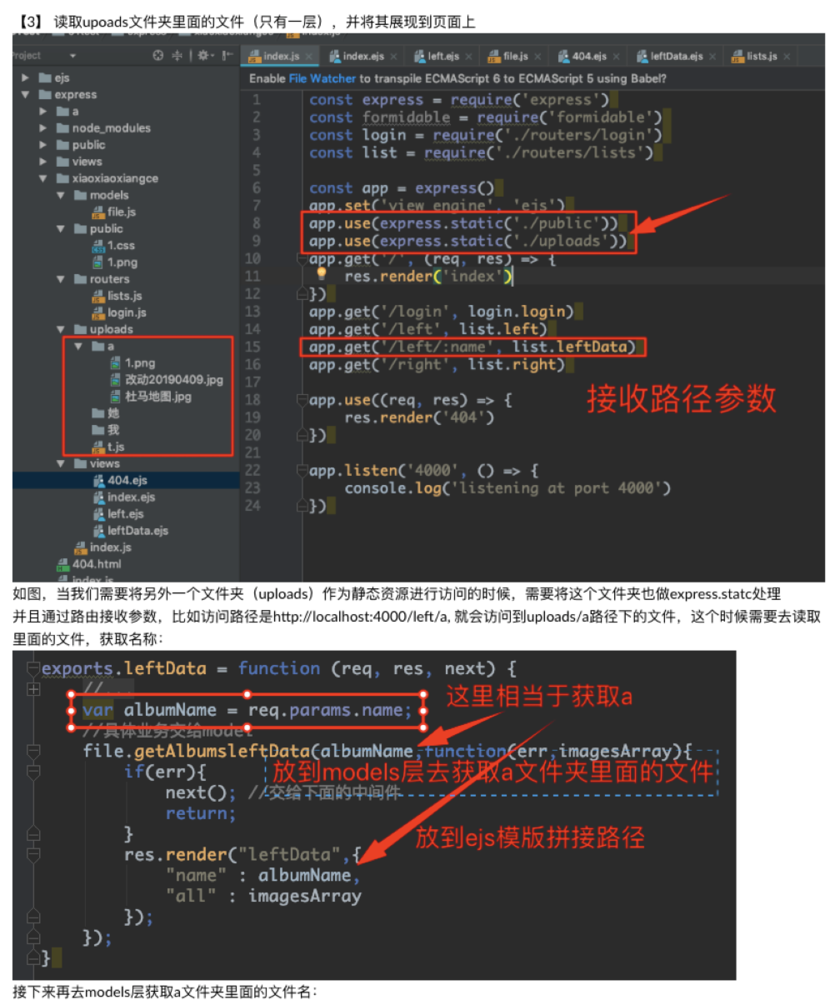  

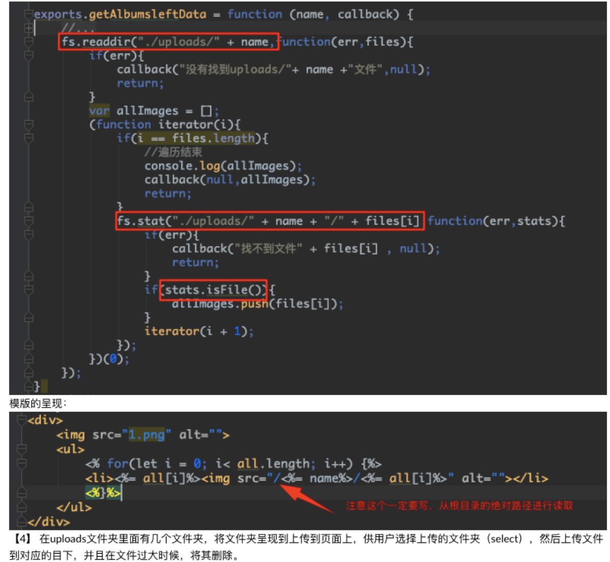  

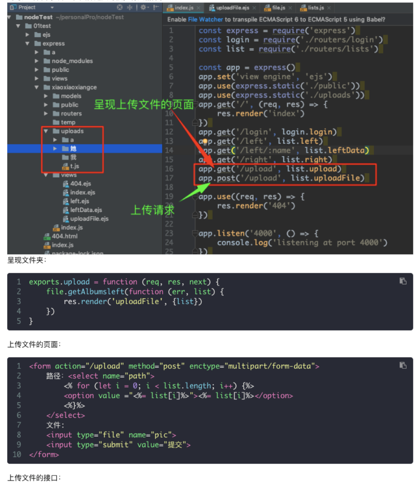  

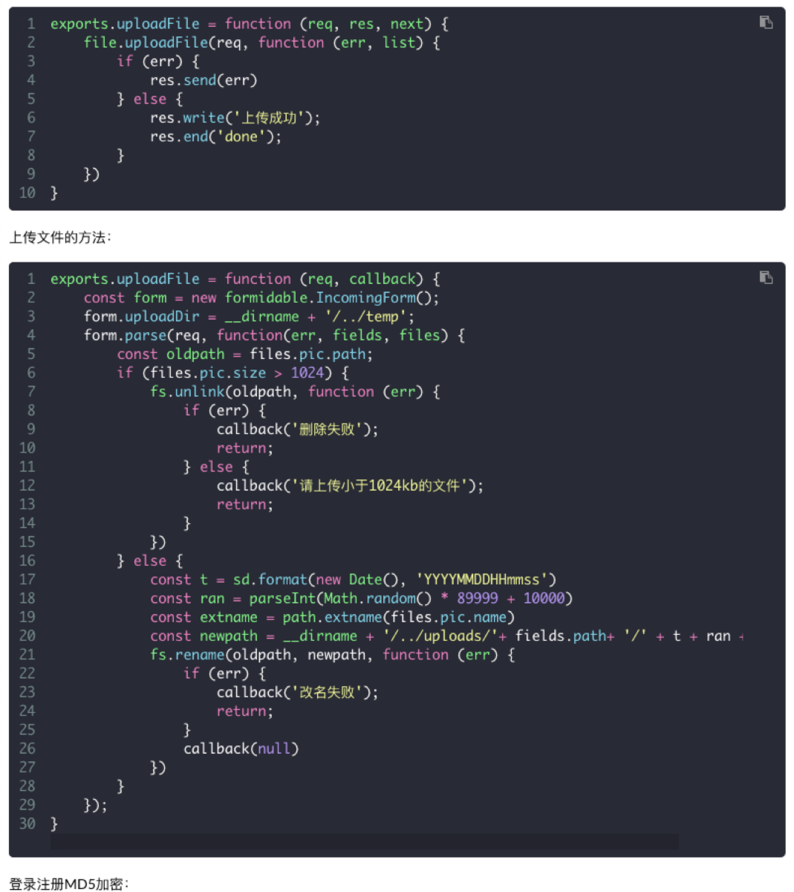  

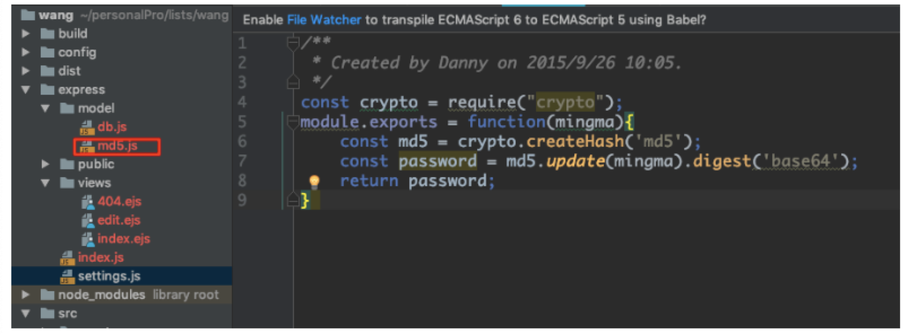  

```
//执行注册
app.get("/doregist",function(req,res,next){
    const dengluming = req.query.dengluming;
    const mima = req.query.mima;
    //加密
    mima = md5(md5(mima).substr(4,7) + md5(mima));

    //把用户名和密码存入数据库
    db.insertOne("users",{
        "dengluming" : dengluming,
        "mima" : mima
    },function(err,result){
        if(err){
            res.send("-1");
            return;
        }
        res.send("1");
    })
});

app.post("/dologin",function(req,res,next){
    const form = new formidable.IncomingForm();

    form.parse(req, function(err, fields, files) {
        const dengluming = fields.dengluming;
        const mima = fields.mima;
        mima = md5(md5(mima).substr(4,7) + md5(mima));

        //检索数据库，按登录名检索数据库，查看密码是否匹配
        db.find("users",{"dengluming":dengluming},function(err,result){
            if(result.length == 0){
                res.send("-2");  //-2没有这个人
                return;
            }
            const shujukuzhongdemima = result[0].mima;
            //要对用户这次输入的密码，进行相同的加密操作。然后与
            //数据库中的密码进行比对
            if(mima == shujukuzhongdemima){
                res.send("1");  //成功
            }else{
                res.send("-1"); //密码不匹配
            }
        });
    });
    return;
});

```