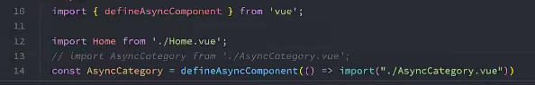

大致顺序：


MVC在IOS和前端中比较多的体现，在传统的js操作中，也可以理解成MVC：

一下截图的model可以是简单的counter，也可以是服务端返回大量数据


vue强调的是MVVM模型，其实VM就是vue，vue在view和model中起到了中转的作用，controller的作用。


## template属性：


关于第二种方式，其实是在html中写了template标签，难道浏览器就不渲染template中的内容吗？不会


## data属性：


## methods属性：


this是和运行时绑定的，谁调用这个函数，this就指向谁（隐式绑定），但是是箭头函数，不存在绑定的情况，所以肩头函数中的this会忘外层作用域找，如果往外一层就是window了，那这箭头函数中的this就是window了。

如果是function定义的函数，是可以通过bind显示绑定，箭头函数肯定是绑不了的

Vue3源码绑定methods的过程：


其他：


vue3源码调试方式：

其实和上面vue2的源码调试一样

1、下载对应版本tag

2、install

3、可能需要本地git init，然后在commit一下

4、dev脚本中添加--sourcemap

5、yarn dev

6、在vue/examples中新建demo，引入vue（packages/vue/dist/vue.golbal.js）

# 额外：


# 根元素改动：


# 指令：

## v-once：


## v-text：

```js
 <template id="my-app">
    <h2 v-text="message"></h2>
    <h2>{{message}}</h2>
  </template>
```

第二行和第三行等价，第三行更灵活方便

## v-html：

```js
//msg: '<span style="color:red; background: blue;">哈哈哈</span>'
<template id="my-app">
    <div>{{msg}}</div>
    <div v-html="msg"></div>
  </template>
```

第三行和第四行等价，第三行更灵活方便

## v-pre:


## v-cloak:

```html
<style>
    [v-cloak] {
      display: none;
    }
  </style>
...

<template id="my-app">
    <h2 v-cloak>{{message}}</h2>
  </template>
```

防止屏闪

## v-bind：（高频）

面试/6、vue/vue3-codewhy/课堂/code/01_Learn_Vue3/03_v-bind和v-on

## v-on：


# 课程概览：

课程视频大概内容节奏：

### 1-6 

集虽然用的vue3创建App实例，但是都是在回归一些vue2的语法

### 7-9 

主要是从0到1讲webpack5配置出来一个vue dev/prod环境

### 10 

vuecli vite [讲了vuecli的原理]， 不依赖构建工具， 让浏览器直接跑es module是可以的，但是这里举例引入lodash-es，会引发几百个网络请求，所以vite也就解决这些问题的

vite配置很少，比如用了less，只要安装less就行，不用配置，用post-css，只需要配置postcss.config.js就能启动这个这插件，可见vite配置极其简单（内部是esbuild）


vite是通过本地connect库（不是koa）搭建了一个服务器，当我们代码中写了ts，less语法代码，发起请求还是这个类型的代码，然后在服务器上把ts和less文件的内容转换成了es module类型的内容，然后返回给浏览器，浏览器支持es module，那肯定就正常展示了


最后 npx vite build打包产出dist，然后通过npx vite preview就能预览dist产物

demo： 面试/6、vue/vue3-codewhy/课堂/code/02_Learn_Webpack/10_vite的基本使用

讲了下esbuild相对于babel的优势


### 11 

讲组建通信

特殊值通过props传递注意点：


当然这种继承是可以控制的：


demo: 面试/6、vue/vue3-codewhy/课堂/code/03_learn_component/src/03_父组件传递子组件


vue3 在做emit的时候， 加了一个emits提前注册的操作，并且可以对参数进行验证：

```js
<script>
  export default {
    // emits: ["add", "sub", "addN"],
    // 对象写法的目的是为了进行参数的验证
    emits: {
      add: null,
      sub: null,
      addN: (num, name, age) => {
        console.log(num, name, age);
        if (num > 10) {
          return true
        }
        return false;
      }
    },
    data() {
      return {
        num: 0
      }
    },
    methods: {
      increment() {
        console.log("+1");
        this.$emit("add");
      },
      decrement() {
        console.log("-1");
        this.$emit("sub");
      },
      incrementN() {
        this.$emit('addN', this.num, "why", 18);
      }
    }
  }
</script>
```


### 12

非父子组件通信

1、Provide/Inject （官方给他取了一个别名 lang range props，就是多层传递）

demo： 面试/6、vue/vue3-codewhy/课堂/code/03_learn_component/src/06_Provide和Inject使用

```js
// a.vue 
provide() { // 这里可以是对象，也可以是函数，最好写成函数
      return {
        name: "why",
        age: 18,
        length: computed(() => this.names.length) // ref对象 .value
      }
    },
    data() {
      return {
        names: ["abc", "cba", "nba"]
      }
    },
// b.vue
<template>
  <div>
    HomeContent: {{name}} - {{age}} - {{length.value}}
  </div>
</template>

<script>
  export default {
    inject: ["name", "age", "length"],
  }
</script>
```

2、Mitt全局事件总线（vue2版本的new Vue()方式在Vue3中不能用了)）


3、vuex最后讲


讲了插槽、具名插槽

插槽作用域：


作用域插槽：

有点绕，demo：面试/6、vue/vue3-codewhy/课堂/code/03_learn_component/src/10_作用域插槽使用

其实就是父通过props传给子，再通过子的slot的props传给使用插槽的地方，使用的地方要加一层template，并通过随便命名一个变量在v-slot中就能拿到变量

demo：

```js
 <show-names :names="names">
      <template v-slot="coderwhy">
        <button>{{coderwhy.item}}-{{coderwhy.index}}</button>
      </template>
    </show-names>
```


## 13 

动态组件使用：


keepalive使用


异步组建：



suspense全局组件：


ref：


=

=
