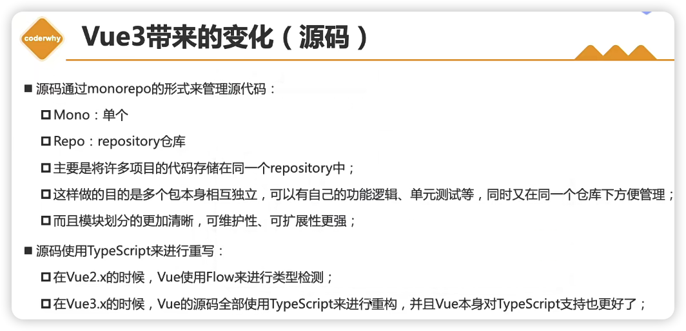

大致顺序：


MVC在IOS和前端中比较多的体现，在传统的js操作中，也可以理解成MVC：

一下截图的model可以是简单的counter，也可以是服务端返回大量数据


vue强调的是MVVM模型，其实VM就是vue，vue在view和model中起到了中转的作用，controller的作用。


## template属性：


关于第二种方式，其实是在html中写了template标签，难道浏览器就不渲染template中的内容吗？不会


## data属性：


## methods属性：


this是和运行时绑定的，谁调用这个函数，this就指向谁（隐式绑定），但是是箭头函数，不存在绑定的情况，所以肩头函数中的this会忘外层作用域找，如果往外一层就是window了，那这箭头函数中的this就是window了。

如果是function定义的函数，是可以通过bind显示绑定，箭头函数肯定是绑不了的

Vue3源码绑定methods的过程：


其他：


vue3源码调试方式：

其实和上面vue2的源码调试一样

1、下载对应版本tag

2、install

3、可能需要本地git init，然后在commit一下

4、dev脚本中添加--sourcemap

5、yarn dev

6、在vue/examples中新建demo，引入vue（packages/vue/dist/vue.golbal.js）

# 额外：


# 根元素改动：


# 指令：

## v-once：


## v-text：

```js
 <template id="my-app">
    <h2 v-text="message"></h2>
    <h2>{{message}}</h2>
  </template>
```

第二行和第三行等价，第三行更灵活方便

## v-html：

```js
//msg: '<span style="color:red; background: blue;">哈哈哈</span>'
<template id="my-app">
    <div>{{msg}}</div>
    <div v-html="msg"></div>
  </template>
```

第三行和第四行等价，第三行更灵活方便

## v-pre:


## v-cloak:

```html
<style>
    [v-cloak] {
      display: none;
    }
  </style>
...

<template id="my-app">
    <h2 v-cloak>{{message}}</h2>
  </template>
```

防止屏闪

## v-bind：（高频）

面试/6、vue/vue3-codewhy/课堂/code/01_Learn_Vue3/03_v-bind和v-on

## v-on：


# 课程概览：

课程视频大概内容节奏：

### 1-6

集虽然用的vue3创建App实例，但是都是在回归一些vue2的语法

### 7-9

主要是从0到1讲webpack5配置出来一个vue dev/prod环境

### 10

vuecli vite [讲了vuecli的原理]， 不依赖构建工具， 让浏览器直接跑es module是可以的，但是这里举例引入lodash-es，会引发几百个网络请求，所以vite也就解决这些问题的

vite配置很少，比如用了less，只要安装less就行，不用配置，用post-css，只需要配置postcss.config.js就能启动这个这插件，可见vite配置极其简单（内部是esbuild）

vite是通过本地connect库（不是koa）搭建了一个服务器，当我们代码中写了ts，less语法代码，发起请求还是这个类型的代码，然后在服务器上把ts和less文件的内容转换成了es module类型的内容，然后返回给浏览器，浏览器支持es module，那肯定就正常展示了


最后 npx vite build打包产出dist，然后通过npx vite preview就能预览dist产物

demo： 面试/6、vue/vue3-codewhy/课堂/code/02_Learn_Webpack/10_vite的基本使用

讲了下esbuild相对于babel的优势


### 11

讲组建通信

特殊值通过props传递注意点：


当然这种继承是可以控制的：


demo: 面试/6、vue/vue3-codewhy/课堂/code/03_learn_component/src/03_父组件传递子组件

vue3 在做emit的时候， 加了一个emits提前注册的操作，并且可以对参数进行验证：

```js
<script>
  export default {
    // emits: ["add", "sub", "addN"],
    // 对象写法的目的是为了进行参数的验证
    emits: {
      add: null,
      sub: null,
      addN: (num, name, age) => {
        console.log(num, name, age);
        if (num > 10) {
          return true
        }
        return false;
      }
    },
    data() {
      return {
        num: 0
      }
    },
    methods: {
      increment() {
        console.log("+1");
        this.$emit("add");
      },
      decrement() {
        console.log("-1");
        this.$emit("sub");
      },
      incrementN() {
        this.$emit('addN', this.num, "why", 18);
      }
    }
  }
</script>
```

### 12

非父子组件通信

1、Provide/Inject （官方给他取了一个别名 lang range props，就是多层传递）

demo： 面试/6、vue/vue3-codewhy/课堂/code/03_learn_component/src/06_Provide和Inject使用

```js
// a.vue 
provide() { // 这里可以是对象，也可以是函数，最好写成函数
      return {
        name: "why",
        age: 18,
        length: computed(() => this.names.length) // ref对象 .value
      }
    },
    data() {
      return {
        names: ["abc", "cba", "nba"]
      }
    },
// b.vue
<template>
  <div>
    HomeContent: {{name}} - {{age}} - {{length.value}}
  </div>
</template>

<script>
  export default {
    inject: ["name", "age", "length"],
  }
</script>
```

2、Mitt全局事件总线（vue2版本的new Vue()方式在Vue3中不能用了)）


3、vuex最后讲

讲了插槽、具名插槽

插槽作用域：


作用域插槽：

有点绕，demo：面试/6、vue/vue3-codewhy/课堂/code/03_learn_component/src/10_作用域插槽使用

其实就是父通过props传给子，再通过子的slot的props传给使用插槽的地方，使用的地方要加一层template，并通过随便命名一个变量在v-slot中就能拿到变量

demo：

```js
 <show-names :names="names">
      <template v-slot="coderwhy">
        <button>{{coderwhy.item}}-{{coderwhy.index}}</button>
      </template>
    </show-names>
```


## 13

动态组件component， 比如一个tab组件，就可以用v-if去判断用哪个组件，也可以通过动态组件：

```js
<keep-alive include="home,about">
      <component :is="currentTab"
                 name="coderwhy"
                 :age="18"
                 @pageClick="pageClick">
      </component>
    </keep-alive>
<script>
  import Home from './pages/Home.vue';
  import About from './pages/About.vue';
  import Category from './pages/Category.vue';

  export default {
    components: { // 这里注册了动态组件可以用的组件
      Home,
      About,
      Category
    },
    data() {
      return {
        tabs: ["home", "about", "category"],
        currentTab: "home"
      }
    },
    methods: {
      itemClick(item) {
        this.currentTab = item;
      },
      pageClick() {
        console.log("page内部发生了点击");
      }
    }
  }
</script>
  
```

keep alive：

```js
 <!-- 2.动态组件 -->
    <keep-alive include="home,about">
      <component :is="currentTab"
                 name="coderwhy"
                 :age="18"
                 @pageClick="pageClick">
      </component>
    </keep-alive>
```


异步组件：

```js
// 通过import函数导入的模块, 后续webpack对其进行打包的时候就会进行分包的操作
// import("./12_异步组件的使用/utils/math").then((res) => {
//   console.log(res.sum(20, 30))
// })

// vue中defineAsyncComponent基于webpack import的实现
  import { defineAsyncComponent } from 'vue';

  import Home from './Home.vue';
  import Loading from './Loading.vue';

  // import AsyncCategory from './AsyncCategory.vue';
  const AsyncCategory = defineAsyncComponent(() => import("./AsyncCategory.vue"))


//详细配置
 const AsyncCategory = defineAsyncComponent({
    loader: () => import("./AsyncCategory.vue"),
    loadingComponent: Loading,
    // errorComponent,
    // 在显示loadingComponent组件之前, 等待多长时间
    delay: 2000,
    /**
     * err: 错误信息,
     * retry: 函数, 调用retry尝试重新加载
     * attempts: 记录尝试的次数
     */
    onError: function(err, retry, attempts) {

    }
  })
```

defineAsyncComponent的组件会在webpack打包时候被单独打包，他就是基于webpack的import实现的

一般分包都是通过路由去按照页面维度去分，如果需要按照组件维度去分才这么做，很少这么做。

Suspense

借鉴了react的思想


```js
 <suspense>
      <template #default>
        <async-category></async-category>
      </template>
      <template #fallback>
        <loading></loading>
      </template>
    </suspense>
```

suspense  代替了loadingComponent

refs:获取实例

```js
<nav-bar ref="navBar"></nav-bar>
//...
methods: {
      btnClick() {
        console.log(this.$refs.title);

        console.log(this.$refs.navBar.message);
        this.$refs.navBar.sayHello();

        // $el
        console.log(this.$refs.navBar.$el);
      }
    }
```

获取组件的另外一种方式：


生命周期


v-model：组件上使用v-model：这种写法只是更加优雅：

app.vue:

```js
<template>
  <div>
    <!-- <input v-model="message">
    <input :value="message" @input="message = $event.target.value"> -->

    <!-- 组件上使用v-model -->
    <!-- <hy-input v-model="message"></hy-input> -->
    <!-- <hy-input :modelValue="message" @update:model-value="message = $event"></hy-input> -->

    <!-- 绑定两个v-model -->
    <hy-input v-model="message" v-model:title="title"></hy-input>

    <h2>{{message}}</h2>
    <h2>{{title}}</h2>
  </div>
</template>

<script>
  import HyInput from './HyInput.vue';

  export default {
    components: {
      HyInput
    },
    data() {
      return {
        message: "Hello World",
        title: "哈哈哈"
      }
    }
  }
</script>

<style scoped>

</style>
```

HyInput2.vue:

```vue
<template>
  <div>
    <!-- 1.默认绑定和事件处理 -->
    <!-- <button @click="btnClick">hyinput按钮</button>
    <h2>HyInput的message: {{modelValue}}</h2> -->

    <!-- 2.通过input -->
    <!-- <input :value="modelValue" @input="btnClick"> -->

    <!-- 3.绑定到props中是不对的 和props同名了，肯定不行，可以结合下面的computed属性来实现-->
    <!-- <input v-model="modelValue"> -->

    <!-- 4. -->
    <input v-model="value">

  </div>
</template>

<script>
  export default {
    props: {
      modelValue: String
    },
    emits: ["update:modelValue"],
    computed: {
      value: {
        set(value) {
          this.$emit("update:modelValue", value);
        },
        get() {
          return this.modelValue;
        }
      }
    },
    methods: {
      btnClick(event) {
        this.$emit("update:modelValue", event.target.value);
      }
    }
  }
</script>

<style scoped>

</style>
```

HyInput.vue:

```js
<template>
  <div>
    <input v-model="value">
    <input v-model="why">
  </div>
</template>

<script>
  export default {
    props: {
      modelValue: String,
      title: String 
    },
    emits: ["update:modelValue", "update:title"],
    computed: {
      value: {
        set(value) {
          this.$emit("update:modelValue", value);
        },
        get() {
          return this.modelValue;
        }
      },
      why: {
        set(why) {
          this.$emit("update:title", why);
        },
        get() {
          return this.title;
        }
      }
    }
  }
</script>

<style scoped>

</style>
```

## 14

动画

```js
<transition name="why">
      <h2 v-if="isShow">Hello World</h2>
    </transition>
<style scoped>
  .why-enter-from,
  .why-leave-to {
    opacity: 0;
  }

  .why-enter-to, 
  .why-leave-from {
    opacity: 1;
  }

  .why-enter-active,
  .why-leave-active {
    transition: opacity 2s ease;
  }
</style>
```

## 15

compostion api （VCA)就是拿来替代minxin的


比如两边都定义了methods，都会执行,全局的mixin，主要挂载到App就行，比minxin更早的是extends，一样的用法，只是更早的api，在早期的vue2中extends用的多

在vue2中写的data、mixin、methos等等，统一叫做options api，而这些选项都会写到setup中去，类型react的useEffect

setup中不能使用this


```js
<template>
  <div>
    <h2>{{title}}</h2>
  </div>
</template>
<script>
  export default {
    // setup(props, context) {
    setup(props, {attrs, slots, emit}) {
      console.log(props.message);
      console.log(attrs.id, attrs.class);
      console.log(slots);
      console.log(emit);

      return {
        title: "Hello Home",
        counter: 100
      }
    }
  }
</script>
```

简单说下setup执行过程，其实是在【实例产生后】（网上说没实例化，所以setup没this)，调用setup并把props和context作为参数传递给setup（等于没说-_-)

setup返回的数据可以在template中使用，但是如果我们更新了比如title，UI是不更新的，因为titile就是一个普通变量，不具有响应式

reactive：让数据在页面上具有响应式：

```js
<template>
  <div>
    Home Page
    <h2>{{message}}</h2>
    <h2>当前计数: {{state.counter}}</h2>
    <button @click="increment">+1</button>
  </div>
</template>

<script>
  import { reactive } from 'vue';

  export default {
    props: {
      message: {
        type: String,
        required: true
      }
    },
    setup() {
// 不能给reactive直接传string、boolean等简单数据类型
      const state = reactive({
        counter: 100
      })

      // 局部函数
      const increment = () => {
        state.counter++;
        console.log(state.counter);
      }

      return {
        state,
        increment
      }
    }
  }
</script>

<style scoped>

</style>
```

上面因为只有一个变量，搞一个state就比较麻烦，所以当只有一个变量 的时候，可以使用ref：

```js
<template>
  <div>
    Home Page
    <h2>{{message}}</h2>
    <!-- 当我们在template模板中使用ref对象, 它会自动进行解包 -->
    <h2>当前计数: {{counter}}</h2>
    <button @click="increment">+1</button>

    <show-message :message="counter"></show-message>
  </div>
</template>

<script>
  import { ref } from 'vue';

  export default {
    props: {
      message: {
        type: String,
        required: true
      }
    },
    setup() {
      // counter编程一个ref的可响应式的引用
      // counter = 100;
      let counter = ref(100);

      // 局部函数
      const increment = () => {
        counter.value++; // setup中必须通过xx.value进行复制，template中不用谢value（自动解包)
        console.log(counter.value);
      }

      return {
        counter,
        increment
      }
    }
  }
</script>

<style scoped>

</style>
```


ref只能是浅层解包，比如const r = ref(100) , UI上直接写r就能拿到100，但是如果是如下，返回info，页面上就只能通过info.counter.value去拿值，不能被自动解包，reactive就可以自动解包

```js
 let counter = ref(100);

      const info = {
        counter
      }
return {
	info
}
```

readonly原理：


```js
setup() {
      // 1.普通对象
      const info1 = {name: "why"};
      const readonlyInfo1 = readonly(info1);

      // 2.响应式的对象reactive
      const info2 = reactive({
        name: "why"
      })
      const readonlyInfo2 = readonly(info2);

      // 3.响应式的对象ref
      const info3 = ref("why");
      const readonlyInfo3 = readonly(info3);

      const updateState = () => {
        // readonlyInfo3.value = "coderwhy"
        info3.value = "coderwhy";
      }

      return {
        updateState,
      }
    }
```

## 16

继续讲解ref相关、computed、watch

以下这些api是辅助api，导入方式都是从vue中导入，shallow都是浅层次的实现，比如嵌套对象，只会对第一层实现


toRefs传入的肯定是reactive，然后是将整个reactive转成解构后的ref


toRef是将reactive中某个key转成ref，目的是为了性能：

```js
export default {
    setup() {
      const info = reactive({name: "why", age: 18});
      // 1.toRefs: 将reactive对象中的所有属性都转成ref, 建立链接
      // let { name, age } = toRefs(info);
      // 2.toRef: 对其中一个属性进行转换ref, 建立链接
      let { name } = info;
      let age = toRef(info, "age");

      const changeAge = () => {
        age.value++;
      }

      return {
        name,
        age,
        changeAge
      }
    }
  }
```


customRef: 这个ref是自定义ref特性，一般写源码才用得着，这里不做笔记了。

computed：

他在setup中，其实就和原来vue2使用思路一样，组合出一个新的属性然后导出给UI使用，如果不使用computed，而是直接给setup return 一个const  fullname = firstName + lastName，这个fullname是不具有响应式的，所以要用computed

```js
export default {
    setup() {
      const firstName = ref("Kobe");
      const lastName = ref("Bryant");

      // 1.用法一: 传入一个getter函数
      // computed的返回值是一个ref对象
      const fullName = computed(() => firstName.value + " " + lastName.value);

      // 2.用法二: 传入一个对象, 对象包含getter/setter
      const fullName = computed({
        get: () => firstName.value + " " + lastName.value,
        set(newValue) {
          const names = newValue.split(" ");
          firstName.value = names[0];
          lastName.value = names[1];
        }
      });

      const changeName = () => {
        // firstName.value = "James"
        fullName.value = "coder why";
      }

      return {
        fullName,
        changeName
      }
    }
  }
```

watchEffect：用法思路和vue2一样，只是写到了setup中：以下这个demo演示了watchEffect和停止watchEffect，以及清除副作用（比如发起网络请求，中途依赖的name，age再次发生变化，就可以取消上一次的请求)

```js
export default {
    setup() {
      // watchEffect: 自动收集响应式的依赖
      const name = ref("why");
      const age = ref(18);

      const stop = watchEffect((onInvalidate) => {
        const timer = setTimeout(() => {
          console.log("网络请求成功~");
        }, 2000)

        // 根据name和age两个变量发送网络请求
        onInvalidate(() => {
          // 在这个函数中清除额外的副作用
          // request.cancel()
          clearTimeout(timer);
          console.log("onInvalidate");
        })
        console.log("name:", name.value, "age:", age.value);
      });

      const changeName = () => name.value = "kobe"
      const changeAge = () => {
        age.value++;
        if (age.value > 25) {
          stop();
        }
      }

      return {
        name,
        age,
        changeName,
        changeAge
      }
    }
  }
```

ref使用：和react中ref，vue2中的ref一个道理：

```js
<template>
  <div>
    <h2 ref="title">哈哈哈</h2>
  </div>
</template>

<script>
  import { ref, watchEffect } from 'vue';

  export default {
    setup() {
      const title = ref(null);

      watchEffect(() => {
        console.log(title.value);
      }, {
        flush: "post"
      })

      return {
        title
      }
    }
  }
</script>

<style scoped>

</style>
```

这里有一个flash的配置项，默认watchEffect是立即执行：


watch：和vue2watch一个道理

他能够侦听ref、reactive、get函数，还有返回值，侦听ref返回的是value，而reactive返回的还是reactive，如果想返回value，可以像26、27行一样把reactive解构后再组装成getter作为第一个参数。

```js
<template>
  <div>
    <h2 ref="title">{{info.name}}</h2>
    <button @click="changeData">修改数据</button>
  </div>
</template>

<script>
  import { ref, reactive, watch } from 'vue';

  export default {
    setup() {
      const info = reactive({name: "why", age: 18});

      // 1.侦听watch时,传入一个getter函数
      watch(() => info.name, (newValue, oldValue) => {
        console.log("newValue:", newValue, "oldValue:", oldValue);
      })

      // 2.传入一个可响应式对象: reactive对象/ref对象
      // 情况一: reactive对象获取到的newValue和oldValue本身都是reactive对象
      // watch(info, (newValue, oldValue) => {
      //   console.log("newValue:", newValue, "oldValue:", oldValue);
      // })
      // 如果希望newValue和oldValue是一个普通的对象
      watch(() => {
        return {...info}
      }, (newValue, oldValue) => {
        console.log("newValue:", newValue, "oldValue:", oldValue);
      })
      // 情况二: ref对象获取newValue和oldValue是value值的本身
      // const name = ref("why");
      // watch(name, (newValue, oldValue) => {
      //   console.log("newValue:", newValue, "oldValue:", oldValue);
      // })

      const changeData = () => {
        info.name = "kobe";
      }

      return {
        changeData,
        info
      }
    }
  }
</script>

<style scoped>

</style>
```

watch监听多个：

```js
  // 1.定义可响应式的对象
      const info = reactive({name: "why", age: 18});
      const name = ref("why");

      // 2.侦听器watch
      watch([() => ({...info}), name], ([newInfo, newName], [oldInfo, oldName]) => {
        console.log(newInfo, newName, oldInfo, oldName);
      })
```

深度监听:

响应式数据默认就是深度监听

原始数据默认不是深度

```js
// 1.定义可响应式的对象
      const info = reactive({
        name: "why", 
        age: 18,
        friend: {
          name: "kobe"
        }
      });

      // 2.侦听器watch
      watch(() => ({...info}), (newInfo, oldInfo) => {
        console.log(newInfo, oldInfo);
      }, {
        deep: true,
        immediate: true
      })
```

## 17

生命周期、provide/inject

```js
<script>
  import { onMounted, onUpdated, onUnmounted, ref } from 'vue';

  export default {
    setup() {
      const counter = ref(0);
      const increment = () => counter.value++

      onMounted(() => {
        console.log("App Mounted1");
      })
      onMounted(() => {
        console.log("App Mounted2");
      })
      onUpdated(() => {
        console.log("App onUpdated");
      })
      onUnmounted(() => {
        console.log("App onUnmounted");
      })

      return {
        counter,
        increment
      }
    }
  }
</script>
```

生命周期可以重复调用


除了beforeCreate和created，其他钩子都是一一对应的，其中beforeCreate和created其实就是在setup中写就代替了，并且setup的执行其实比beforeCreate和created更早。

provide和iniject：

父：

```js
import { provide, ref, readonly } from 'vue';
setup() {
      const name = ref("coderwhy");
      let counter = ref(100);

      provide("name", readonly(name));
      provide("counter", readonly(counter));

      const increment = () => counter.value++;

      return {
        increment,
        counter
      }
    }
```

子：

```js
  import { inject } from 'vue';
setup() {
      const name = inject("name");
      const counter = inject("counter");

      const homeIncrement = () => counter.value++

      return {
        name,
        counter,
        homeIncrement
      }
    }
```

一般提供的数据是不让子组件改动的，所以上面的父通过readonly进行了包裹

setup顶层编写：

这个视频是2022年左右录制，不知道现在2024年这个实验性特性是否变成正式特性，并且写法是否是如下，实际开发的时候再看看

```js
<template>
  <div>
    <h2>当前计数: {{counter}}</h2>
    <button @click="increment">+1</button>

    <hello-world message="呵呵呵" @increment="getCounter"></hello-world>
  </div>
</template>

<script setup>
  import { ref } from 'vue';
  import HelloWorld from './HelloWorld.vue';

  const counter = ref(0);
  const increment = () => counter.value++;

  const getCounter = (payload) => {
    console.log(payload);
  }
</script>

<style scoped>

</style>
```

2024年4月再看，这个setup顶层使用，已经是正式功能：

https://cn.vuejs.org/api/sfc-script-setup.html#script-setup

以上就是composition api的全部内容

在vue中写UI，一般有三种方式：

1、template中写，最好写这种

2、写到render函数中，类似react的写法，但是写法上有游区别，建议也少些

3、直接写h函数，类似react的createElement，这个写起来很累，读起来更累

## 18

自定义指令、teleport、插件

自定义指令：

局部：

```js
<template>
  <div>
    <input type="text" v-focus>
  </div>
</template>

<script>
  export default {
    // 局部指令
    directives: {
      focus: {
        mounted(el, bindings, vnode, preVnode) {
          console.log("focus mounted");
          el.focus();
        }
      }
    }
  }
</script>

<style scoped>

</style>
```

全局：

```js
const app = createApp(App);
app.directive("focus", {
  mounted(el, bindings, vnode, preVnode) {
    console.log("focus mounted");
    el.focus();
  }
})
```

指令生命周期：


```js
<template>
  <div>
    <button v-if="counter < 2" v-why.aaaa.bbbb="'coderwhy'" @click="increment">当前计数: {{counter}}</button>
  </div>
</template>

<script>
  import { ref } from "vue";

  export default {
    // 局部指令
    directives: {
      why: {
        created(el, bindings, vnode, preVnode) {
          console.log("why created", el, bindings, vnode, preVnode);
          console.log(bindings.value); // coderwhy
          console.log(bindings.modifiers); // {aaaa: true, bbbb: true}
        },
        beforeMount() {
          console.log("why beforeMount");
        },
        mounted() {
          console.log("why mounted");
        },
        beforeUpdate() {
          console.log("why beforeUpdate");
        },
        updated() {
          console.log("why updated");
        },
        beforeUnmount() {
          console.log("why beforeUnmount");
        },
        unmounted() {
          console.log("why unmounted");
        }
      }
    },
    setup() {
      const counter = ref(0);
      const increment = () => counter.value++;

      return {
        counter,
        increment
      }
    }
  }
</script>

<style scoped>

</style>
```

通过自定义指令搞一个时间格式化指令：

format-time.js：

```js
import dayjs from 'dayjs';

export default function(app) {
  app.directive("format-time", {
    created(el, bindings) {
      bindings.formatString = "YYYY-MM-DD HH:mm:ss";
      if (bindings.value) {
        bindings.formatString = bindings.value;
      }
    },
    mounted(el, bindings) {
      const textContent = el.textContent;
      let timestamp = parseInt(textContent);
      if (textContent.length === 10) {
        timestamp = timestamp * 1000
      }
      el.textContent = dayjs(timestamp).format(bindings.formatString);
    }
  })
}
```

全局注册：

```js
const app = createApp(App);

registerDirectives(app);
```

使用：

```js
<template>
  <h2 v-format-time="'YYYY/MM/DD'">{{timestamp}}</h2>
  <h2 v-format-time>{{timestamp}}</h2>
</template>

<script>
  export default {
    setup() {
      const timestamp = 1624452193;
      return {
        timestamp
      }
    }
  }
</script>
```

teleport：


根节点有一个id="why"的元素：

```js
<template>
  <div class="app">
    <teleport to="#why">
      <h2>当前计数</h2>
      <button>+1</button>
      <hello-world></hello-world>
    </teleport>

    <teleport to="#why">
      <span>呵呵呵呵</span>
    </teleport>
  </div>
</template>
```

多个就是append

插件：


plugins_object.js：

```js
export default {
  install(app) {
    app.config.globalProperties.$name = "coderwhy"
  }
}
```

注册：

```js
const app = createApp(App);
app.use(pluginObject);
// vue2中任一data、methods中都可以通过this.$name拿到
// vue3 setup中去拿比较麻烦：
 setup() {
      const instance = getCurrentInstance();
      console.log(instance.appContext.config.globalProperties.$name);
    },
```


源码讲解:


从下面可以看出这个三大模块，其中渲染系统、响应式更能够算是vue的核心，编译器（compiler)其实不算vue核心，因为vue也是交给@vue/compiler-sfc来编译的，编译这部分也是打包中的操作，并不是跑在浏览器上，而渲染系统和响应式会运行在浏览器上，所以一般提到vue的核心，其实主要就是渲染模块和响应式。


渲染又主要包含h函数、mount、patch（diff vnode)

vue的模版语法编译完成后，就变成了h函数，自己写vue源码，就是从h函数开始


## 19 

这个视频对响应式原理的深入理解有帮助

继续写一个vue3的demo源码实现


有一个小点提示下：

```js

function reactive(raw) {
  return new Proxy(raw, {
    get(target, key) {
      const dep = getDep(target, key);
      dep.depend();
      return target[key];
    },
    set(target, key, newValue) {
      const dep = getDep(target, key);
      target[key] = newValue;
      dep.notify();
    }
  })
}
```

第7行在源码中使用Reflect.get(...)这个主要是拿来绑定this用的，和Proxy是独立的作用。


20

=

=
